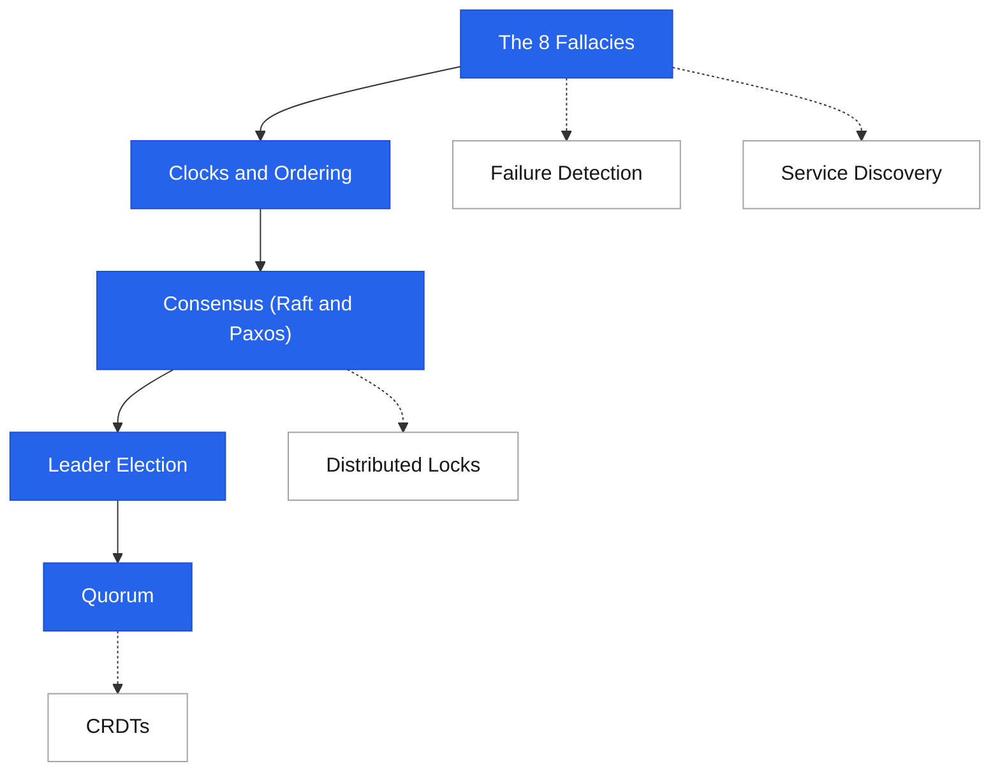

# Distributed Systems

<div class="sec-hero" markdown>
<span class="ey">Foundations · distributed theory</span>
The theory and mechanics behind systems that run across multiple nodes. This is where reliability, consistency, and fault tolerance are won or lost.
</div>

!!! info "Where this fits"
    This section covers distributed-systems **mechanisms** (consensus, leader election, locks, clocks, CRDTs). For the **properties** they provide — CAP, consistency models, ACID vs BASE, isolation — see [Reliability & Consistency Theory](../fundamentals/index.md#reliability-consistency-theory).

## Roadmap

Follow the spine top-to-bottom your first time. Dashed branches hang off the topic they support — grab them when you need them.

<div class="sd-mermaid-links" data-links='{
  "The 8 Fallacies": "fallacies/",
  "Clocks and Ordering": "clocks/",
  "Consensus (Raft and Paxos)": "consensus/",
  "Leader Election": "leader-election/",
  "Quorum": "quorum/",
  "Distributed Locks": "distributed-locks/",
  "Failure Detection": "failure-detection/",
  "Service Discovery": "service-discovery/",
  "CRDTs": "crdts/"
}'></div>



## Suggested reading order

New to this topic? Read these in order — each builds on the previous:

1. [The 8 Fallacies](fallacies.md) — the false assumptions behind every distributed failure; everything else follows from these
2. [Clocks & Ordering](clocks.md) — why "what happened first" is hard, and the logical clocks that answer it
3. [Consensus (Raft & Paxos)](consensus.md) — how nodes agree on anything despite failures
4. [Leader Election](leader-election.md) — the most common application of consensus: picking one coordinator
5. [Quorum](quorum.md) — the R+W>N knob that trades consistency against availability

**Then, as needed (reference):** [Distributed Locks](distributed-locks.md), [Failure Detection](failure-detection.md), [Service Discovery](service-discovery.md), [Distributed Primitives](distributed-primitives.md)

**Advanced — come back later:** [CRDTs](crdts.md), [Gossip Protocol](gossip.md), [Split Brain & Fencing](split-brain.md), [Exactly-Once Semantics](exactly-once.md), [Two-Phase Commit](two-phase-commit.md), [Distributed Transactions](distributed-transactions.md)

## Start here: why distributed systems are hard

Before anything else, read [The 8 Fallacies](fallacies.md) — the false assumptions that cause every class of distributed system failure. Every topic in this section exists because one of those fallacies is violated in the real world.

## Coordination and agreement

How nodes reach agreement despite failures and network unreliability.

<div class="pcards">
<a class="pcard" href="consensus/"><span class="t">Consensus (Raft & Paxos)</span><span class="d">How nodes agree on a single value despite failures</span></a>
<a class="pcard" href="leader-election/"><span class="t">Leader Election</span><span class="d">Picking one coordinator and handling its failure</span></a>
<a class="pcard" href="split-brain/"><span class="t">Split Brain & Fencing</span><span class="d">Two leaders both accepting writes — and fencing tokens to stop it</span></a>
<a class="pcard" href="distributed-locks/"><span class="t">Distributed Locks</span><span class="d">Mutual exclusion across processes on different machines</span></a>
<a class="pcard" href="quorum/"><span class="t">Quorum</span><span class="d">R+W>N — configuring consistency vs availability trade-off</span></a>
<a class="pcard" href="two-phase-commit/"><span class="t">Two-Phase Commit</span><span class="d">Atomic commit across multiple participants (use sparingly)</span></a>
</div>

## Consistency and time

Why distributed systems make time and ordering hard, and how to deal with it.

<div class="pcards">
<a class="pcard" href="clocks/"><span class="t">Clocks & Ordering</span><span class="d">Lamport clocks, vector clocks, why wall clocks lie</span></a>
<a class="pcard" href="distributed-transactions/"><span class="t">Distributed Transactions</span><span class="d">ACID across multiple services — the full picture</span></a>
<a class="pcard" href="exactly-once/"><span class="t">Exactly-Once Semantics</span><span class="d">At-most-once / at-least-once / exactly-once trade-offs</span></a>
<a class="pcard" href="crdts/"><span class="t">CRDTs</span><span class="d">Data structures that merge automatically without conflicts</span></a>
</div>

## Membership and discovery

How nodes find each other and detect failures.

<div class="pcards">
<a class="pcard" href="service-discovery/"><span class="t">Service Discovery</span><span class="d">How services find each other in dynamic environments</span></a>
<a class="pcard" href="gossip/"><span class="t">Gossip Protocol</span><span class="d">Epidemic information dissemination at scale</span></a>
<a class="pcard" href="failure-detection/"><span class="t">Failure Detection</span><span class="d">Heartbeats, phi accrual, cost of false positives</span></a>
</div>

## Algorithms and data structures

Space-efficient probabilistic structures that power real distributed systems.

<div class="pcards">
<a class="pcard" href="distributed-primitives/"><span class="t">Distributed Primitives</span><span class="d">Bloom filter, Merkle tree, HyperLogLog, Count-Min Sketch</span></a>
</div>

## Concept map

```
The 8 Fallacies
  ├── Network fails              → Failure Detection, Circuit Breaker
  ├── Latency is non-zero        → Quorum trade-offs, async replication
  ├── Topology changes           → Service Discovery, Gossip
  └── Clocks drift               → Lamport Clocks, Vector Clocks, CRDTs

CAP Theorem (consistency vs availability)
  ├── CP path  → Consensus (Raft/Paxos) → Leader Election → Distributed Locks
  └── AP path  → Quorum (R+W>N tunable) → CRDTs → Eventual Consistency

Distributed Transactions
  ├── Strong path → Two-Phase Commit (blocking, avoid in microservices)
  └── Weak path   → Saga Pattern (see Patterns section) + Idempotency

Data synchronization
  └── Merkle Trees → Gossip Protocol → Cassandra anti-entropy repair
```
