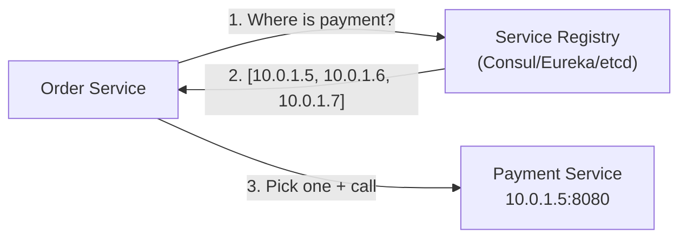
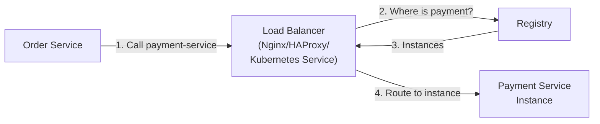

# Service Discovery

## What it is

Service discovery is the mechanism by which services find the network locations (IP + port) of other services they need to call. In dynamic environments (containers, auto-scaling), IPs change constantly — you can't hardcode them.

```
Old world (static):
  service_b.conf: host=192.168.1.10, port=8080
  
Problem: Container restarts → new IP. Auto-scaling → new instances. 
  → Config files are always stale.

Service discovery:
  Order Service asks: "Where is payment-service?"
  Discovery: "payment-service is at 10.0.1.5:8080, 10.0.1.6:8080, 10.0.1.7:8080"
  Order Service: load-balance across these
```

## Client-side vs Server-side discovery

### Client-side discovery

Client queries the service registry directly and does its own load balancing:



**Pros:** Client knows all instances — can implement smart load balancing (latency-aware, circuit breaker per instance)  
**Cons:** Every client needs service discovery logic in every language

**Examples:** Netflix Eureka (client-side with Ribbon load balancer), Consul SDK

### Server-side discovery

Client makes request to load balancer; load balancer queries registry:



**Pros:** Clients don't need discovery logic — just call a stable endpoint  
**Cons:** Load balancer is an additional hop, potential bottleneck/SPOF

**Examples:** AWS ALB + ECS, Kubernetes Services

## Kubernetes DNS-based discovery

Kubernetes creates a DNS entry for every Service object. Services are discovered via DNS name.

```yaml
# Service definition
apiVersion: v1
kind: Service
metadata:
  name: payment-service
  namespace: production
spec:
  selector:
    app: payment
  ports:
    - port: 8080
```

```python
# Service A calls service B using DNS name
import requests
response = requests.get("http://payment-service.production.svc.cluster.local:8080/charge")

# Within same namespace: just the service name works
response = requests.get("http://payment-service:8080/charge")
# kube-dns resolves payment-service → ClusterIP → pods
```

**Kubernetes Service types:**

| Type | Use case |
|---|---|
| ClusterIP | Internal service discovery (default) |
| NodePort | Expose on each node's IP |
| LoadBalancer | Provision cloud LB (ALB on AWS) |
| ExternalName | DNS alias to external service |

**How it works:**
```
payment-service ClusterIP: 10.96.5.100
kube-proxy: maintains iptables rules routing ClusterIP → pod IPs
Any pod calling 10.96.5.100 → iptables → random pod
```

## Consul

HashiCorp's service mesh and service discovery platform. More feature-rich than Kubernetes DNS.

### Architecture

```
Each service host runs Consul agent (sidecar)
  Agent → registers service + health checks
  Agent ← gossip with other agents (membership)
  
Consul servers (3 or 5) → Raft consensus for consistent state
```

### Registration and health checks

```json
{
  "service": {
    "name": "payment-service",
    "id": "payment-1",
    "address": "10.0.1.5",
    "port": 8080,
    "tags": ["v2", "us-east-1"],
    "checks": [
      {
        "http": "http://localhost:8080/health",
        "interval": "10s",
        "timeout": "2s"
      }
    ]
  }
}
```

### Querying

```python
import consul

c = consul.Consul()

# Get healthy instances of a service
index, services = c.health.service('payment-service', passing=True)
instances = [(s['Service']['Address'], s['Service']['Port']) for s in services]
# → [('10.0.1.5', 8080), ('10.0.1.6', 8080)]

# Watch for changes (blocking query)
index, services = c.health.service('payment-service', index=index, wait='5m')
```

### DNS interface

```
# Consul provides DNS resolution
dig @127.0.0.1 -p 8600 payment-service.service.consul
→ 10.0.1.5, 10.0.1.6, 10.0.1.7
```

## AWS service discovery options

### ECS Service Discovery (Cloud Map)

```
Register ECS service with AWS Cloud Map
→ DNS entry: payment-service.production.local → task IPs
→ Update automatically when tasks start/stop
```

```python
# Register namespace
cloud_map.create_private_dns_namespace(
    Name='production.local',
    Vpc='vpc-abc123'
)

# Register service
cloud_map.create_service(
    Name='payment-service',
    NamespaceId='ns-abc123',
    DnsConfig={
        'DnsRecords': [{'Type': 'A', 'TTL': 30}]
    },
    HealthCheckCustomConfig={'FailureThreshold': 1}
)
```

### Application Load Balancer

For most ECS/EKS workloads: services call the ALB's DNS name. ALB routes to healthy targets. No client-side discovery needed.

```
Order Service → http://payment-alb.us-east-1.elb.amazonaws.com:8080
ALB: routes to healthy payment-service containers
```

### VPC private DNS

Custom private Route 53 hosted zone:
```
payment.internal → ALB DNS or IP (manually managed or via automation)
```

## Health checks

Service discovery without health checks is useless — dead instances stay in the registry until manually removed.

```python
# Kubernetes liveness probe
livenessProbe:
  httpGet:
    path: /health/live
    port: 8080
  initialDelaySeconds: 10
  periodSeconds: 10
  failureThreshold: 3

# Readiness probe (controls routing)
readinessProbe:
  httpGet:
    path: /health/ready
    port: 8080
  periodSeconds: 5
```

**Liveness vs Readiness:**
- **Liveness:** Is the process alive? Restart if fails.
- **Readiness:** Is the service ready to accept traffic? Remove from load balancer if fails.

## Interview angle

!!! tip "What interviewers are testing"
    They want to see you handle the dynamic infrastructure reality — IPs change, services scale.

**Strong answer pattern:**
1. Don't hardcode IPs — use service names
2. In Kubernetes: use Services (DNS-based, built-in)
3. In ECS: use Cloud Map or ALB DNS
4. Always implement health checks — discovery without health = routing to dead instances
5. For external services: use ACL with stable interface, hide the discovery mechanism

## Related topics

- [Load Balancing](../networking/load-balancing.md) — service discovery + LB = routing
- [Gossip Protocol](gossip.md) — Consul uses gossip for cluster membership
- [DNS](../networking/dns.md) — Kubernetes and Consul use DNS for discovery
- [Service Mesh](../infrastructure/service-mesh.md) — Istio/Envoy automate discovery + routing
