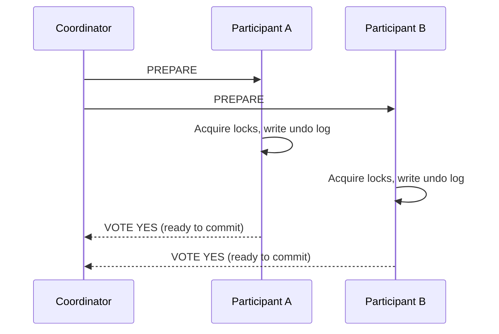
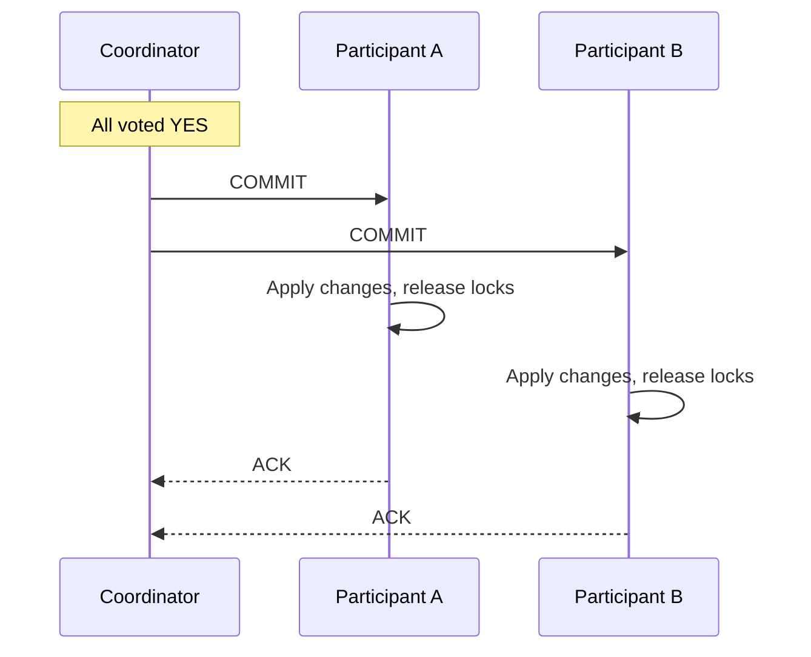
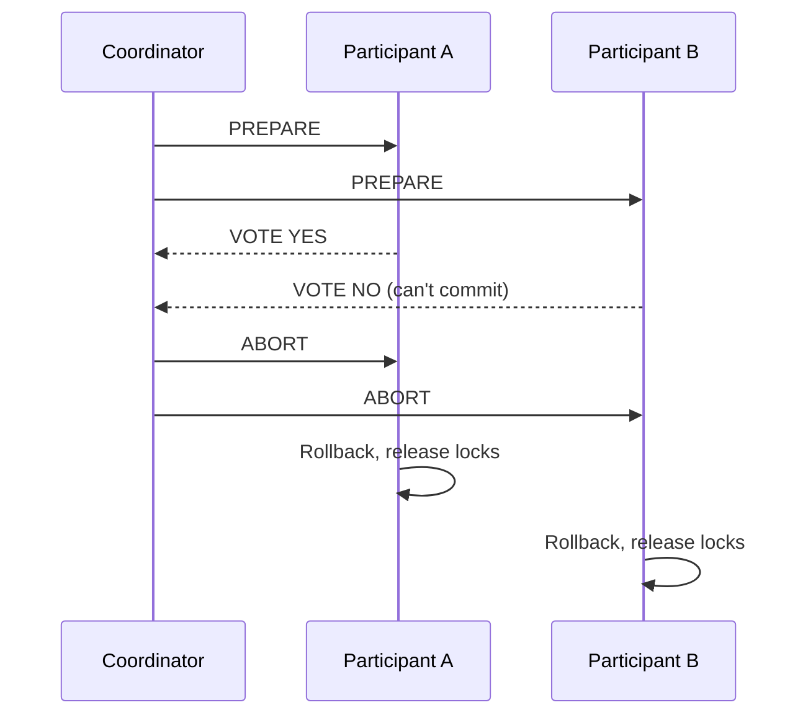

# Two-Phase Commit (2PC)

## What it is

Two-Phase Commit is a distributed transaction protocol that coordinates all participants to either commit or abort. It provides atomicity across multiple databases or services.

See [Distributed Transactions](distributed-transactions.md) for the broader context and when to use 2PC vs Saga.

## Protocol

### Phase 1: Prepare



### Phase 2: Commit



### Abort scenario



## Recovery scenarios

### Coordinator crashes in Phase 1

```
Coordinator sends PREPARE to A and B
Coordinator crashes before receiving votes

A: received PREPARE, waiting
B: received PREPARE, waiting

Recovery:
  Participants timeout → assume ABORT (safe assumption: coordinator hadn't decided)
  Participants rollback
```

### Coordinator crashes in Phase 2

**Most dangerous scenario:**

```
Coordinator sends COMMIT to A
Coordinator crashes before sending to B

A: committed (applied changes)
B: uncertain (never got COMMIT)

Recovery options:
  1. Coordinator restarts, reads its log:
     "I decided COMMIT" → re-send COMMIT to B → consistent
  
  2. Coordinator log lost:
     B asks A: "did you commit?"
     A: "yes, I committed"
     B: "I should commit too" (termination protocol)
     
     But: A might have gotten ABORT (race condition)
     → Still uncertain without the coordinator's log!
```

This is the fundamental 2PC problem: **if the coordinator is down and participants are in PREPARED state, they're blocked.**

### Participant crashes

```
Participant A crashes while in PREPARED state
A recovers, reads its log: "I voted YES for tx-123"
A contacts coordinator: "What happened to tx-123?"
Coordinator: "It committed" or "It aborted"
A acts accordingly
```

Participants must write their vote to durable storage before responding to coordinator.

## XA Transactions (Java implementation)

The standard way to use 2PC in Java/JEE applications:

```java
// XA transaction spanning two databases
XADataSource xaDs1 = createXADataSource("postgres");
XADataSource xaDs2 = createXADataSource("mysql");

UserTransaction ut = (UserTransaction) ctx.lookup("java:comp/UserTransaction");

try {
    ut.begin();
    
    Connection conn1 = xaDs1.getXAConnection().getConnection();
    Connection conn2 = xaDs2.getXAConnection().getConnection();
    
    conn1.prepareStatement("UPDATE orders SET status='shipped' WHERE id=?").executeUpdate();
    conn2.prepareStatement("INSERT INTO shipments VALUES(?)").executeUpdate();
    
    ut.commit();  // 2PC across both databases
    
} catch (Exception e) {
    ut.rollback();  // Both databases rollback
}
```

**Transaction Managers:** Atomikos, Bitronix, Narayana — coordinate 2PC across XA resources.

## When 2PC is appropriate

```
Use 2PC when:
  □ Multiple databases in the same data center
  □ Both DBs support XA (PostgreSQL, MySQL, Oracle)
  □ Strong consistency required (financial, critical data)
  □ Blocking risk acceptable (coordinator HA configured)
  □ Transaction volume manageable (2PC is slow)

Avoid 2PC when:
  □ Microservices with different teams/databases
  □ Need for high availability (2PC blocks on failure)
  □ High transaction volume
  □ External services (can't participate in XA)
```

## 2PC performance

2PC is slow due to synchronous coordination:

```
Single-DB transaction:
  1 round trip: client → DB → commit
  
2PC:
  Round 1: Coordinator → all participants (PREPARE)
  Round 2: Participants → Coordinator (VOTE)
  Round 3: Coordinator → all participants (COMMIT)
  Round 4: Participants → Coordinator (ACK)
  4 round trips minimum + network × number of participants
```

For cross-region: add network latency × 2 per round trip.

## Optimizations

### Single-phase optimization (1PC)

If there's only one resource participant, skip phase 1 — just commit directly.

### Presumed abort / presumed commit

If coordinator log is lost → assume ABORT (presumed abort) or COMMIT (presumed commit). Reduces recovery messages. PostgreSQL uses presumed abort.

### Read-only optimization

If a participant is read-only (no writes), it votes YES in phase 1 and exits — no phase 2 needed for it.

## Interview angle

!!! tip "When 2PC comes up"
    Typically when you need to justify why you're using Saga instead, or in enterprise/legacy integration questions.

**Strong answer pattern:**
1. Explain 2PC works but has the coordinator SPOF and blocking problem
2. For microservices: use Saga instead (async, no blocking)
3. For same-team, same-DC multi-database: 2PC via XA may be appropriate
4. For global ACID: CockroachDB/Spanner (they solve the blocking problem via Raft/MVCC)

## Related topics

- [Distributed Transactions](distributed-transactions.md) — full comparison of approaches
- [Saga Pattern](../patterns/saga-pattern.md) — the microservices alternative
- [Consensus (Raft & Paxos)](consensus.md) — how NewSQL implements distributed commits without 2PC's blocking
