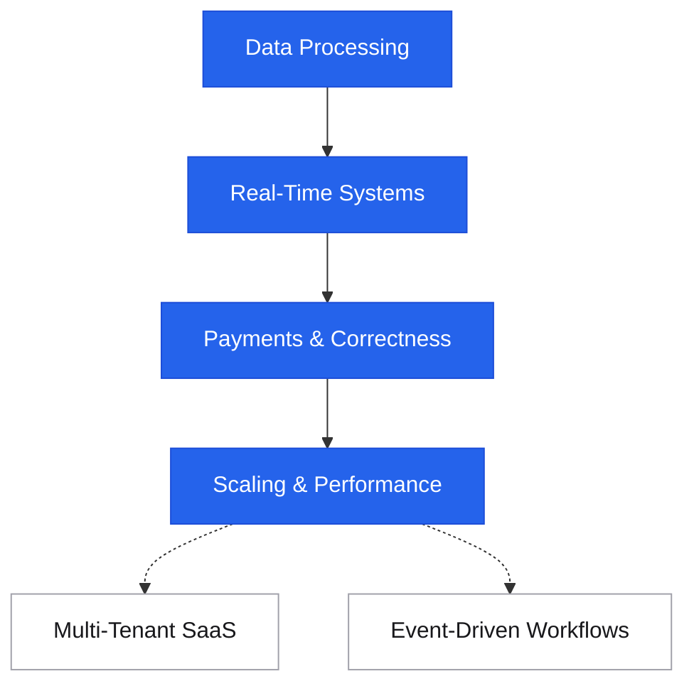

---
tags:
  - applied
---

# Practical Examples

<div class="sec-hero" markdown>
<span class="ey">Reference · applied scenarios</span>
Real-world scenarios with the concepts that fit. Each example weaves together 2–4 patterns from across the repo to solve a concrete problem — the applicative side of the encyclopedia: not "what is concept X?" but "we have problem Y at work — what fits, why, and what to watch out for?"
</div>

These are *short, concept-weaving scenarios*. For full end-to-end system designs (requirements → estimation → architecture → deep dive), see [Case Studies](../case-studies/index.md).

## Roadmap

There is no fixed order — jump to the category matching the problem in front of you. A rough difficulty progression:

<div class="sd-mermaid-links" data-links='{
  "Data Processing": "data-processing/",
  "Real-Time Systems": "real-time-systems/",
  "Payments & Correctness": "payments-and-correctness/",
  "Scaling & Performance": "scaling-and-performance/",
  "Multi-Tenant SaaS": "multi-tenant-saas/",
  "Event-Driven Workflows": "event-driven-workflows/"
}'></div>



---

## How to use this section

Each scenario follows the same shape:

```
Scenario          ←  the concrete real-world problem
Reasoning         ←  what to think about; the bottleneck; the constraint
Applicable concepts  ←  2-4 concepts with one-line "why this fits"
Sketch            ←  small architecture diagram
Trade-offs        ←  what you give up; what you gain
Anti-patterns     ←  what NOT to do for this scenario
```

Read the scenario → form your own answer → compare with the reasoning. That's the applied-learning loop.

---

## Categories

<div class="pcards">
<a class="pcard" href="data-processing/"><span class="t">Data Processing</span><span class="d">Large file ingest, ETL pipelines, streaming aggregation, search indexing</span></a>
<a class="pcard" href="real-time-systems/"><span class="t">Real-Time Systems</span><span class="d">Chat, live notifications, presence/online status, collaborative editing</span></a>
<a class="pcard" href="payments-and-correctness/"><span class="t">Payments & Correctness</span><span class="d">Idempotent payment, multi-step checkout, refund flow, audit trail</span></a>
<a class="pcard" href="scaling-and-performance/"><span class="t">Scaling & Performance</span><span class="d">Hot keys, write-heavy workloads, social timeline, search at scale</span></a>
<a class="pcard" href="multi-tenant-saas/"><span class="t">Multi-Tenant SaaS</span><span class="d">Tenant isolation, noisy neighbour, per-region tenants, billing</span></a>
<a class="pcard" href="event-driven-workflows/"><span class="t">Event-Driven Workflows</span><span class="d">CQRS in context, event sourcing for audit, saga for order workflow</span></a>
</div>

---

## When to consult this section

- You're designing a feature and want to see "how would others approach this?"
- You're in a system design interview practising adaptation
- You read a concept page and want to see it applied
- You're staring at a problem and wondering which 2-3 concepts combine
- You want to learn the *combination* skill — concepts rarely apply alone in real systems

---

## When NOT to consult this section

- You want the *theory* of a concept → use the concept's own page
- You want a full system design → use [Case Studies](../case-studies/index.md)
- You have a specific symptom → use [Symptom → Concept Lookup](../reference/symptom-lookup.md)

---

## Format conventions

- **Concrete numbers** wherever possible (10K req/s, 50TB, 100K events/sec). Numbers anchor the trade-offs.
- **Named technologies** (Postgres, Kafka, Redis) — abstract pseudocode wastes space when the answer is a real tool.
- **Multiple valid answers** sometimes; the page lists "Alternative" sections where they exist.
- **Anti-patterns called out** — recognising what NOT to do is half the battle.

---

## Related

- [Case Studies](../case-studies/index.md) — full system designs (URL shortener, news feed, etc.)
- [Symptom → Concept Lookup](../reference/symptom-lookup.md) — diagnostic-first reference
- [Architecture Anti-Patterns](../architecture/anti-patterns.md) — common mistakes to avoid
