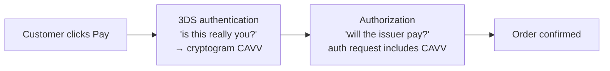
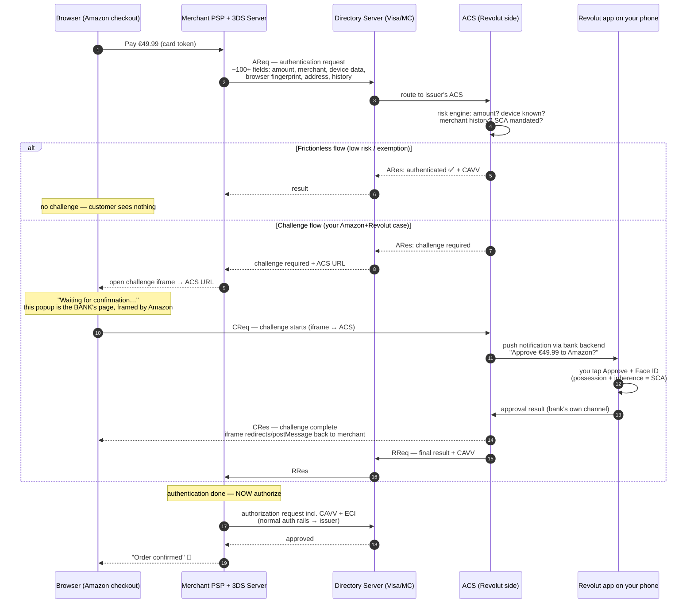
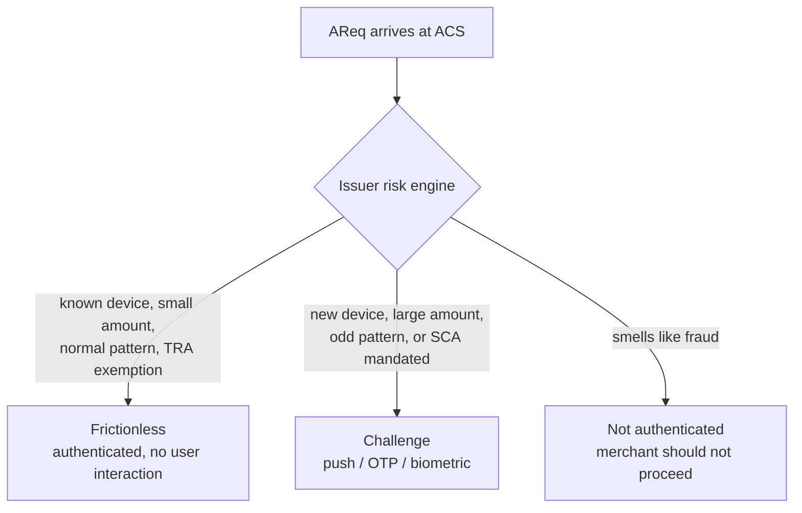

---
tags:
  - applied
  - interview-critical
---

# 3D Secure (3DS): The "Approve in Your Banking App" Flow

## You'll see this when...

- You pay on Amazon (or any merchant), a popup says *"waiting for confirmation"* — and at the same moment your Revolut/N26/bank app pings: *"Approve payment of €49.99 to Amazon?"*
- You tap **Approve** (maybe with Face ID), and the merchant page instantly proceeds to "Order confirmed"
- Sometimes the same card pays with **no challenge at all** — and you wonder why
- A merchant integration fails with `authentication_required` declines in the EU
- Someone says "liability shift" in a payments meeting

This page decodes exactly that flow: who the popup belongs to, how the merchant page "knows" you tapped Approve in a different app, and why it sometimes doesn't happen at all.

## First: authentication vs authorization

3DS is **authentication** — proving the person paying is the cardholder. It is a separate, earlier step from **authorization** — the issuer approving the actual charge ([previous page](card-payments-fundamentals.md)). The merchant needs both:

## The cast

Three new actors join the [four-party model](card-payments-fundamentals.md):

| Actor | Run by | Role |
|---|---|---|
| **3DS Server** | Merchant side (usually the PSP — Stripe/Adyen) | Initiates authentication, talks to the Directory Server |
| **Directory Server (DS)** | The card network (Visa, Mastercard) | The switchboard: routes authentication messages to the right issuer |
| **ACS — Access Control Server** | The **issuer** (Revolut) or its vendor | Decides whether to challenge, runs the challenge, issues the proof |

The crucial realization: **the "waiting" popup on the merchant page is an iframe hosted by your bank's ACS** — Amazon is just framing it. The push notification comes from the same issuer's backend. Both ends of the challenge belong to your bank; the merchant is locked outside, waiting.

## The full flow (3DS2, challenge via banking app)

### How does the merchant page "know" you tapped Approve?

The two channels meet at the ACS:

1. The challenge **iframe** in your browser holds an open session with the ACS (polling or long-lived connection)
2. Your **app approval** travels through Revolut's own backend to that same ACS
3. The ACS marks the challenge complete → the iframe gets the `CRes`, fires a redirect/`postMessage` to the merchant's notification URL → the PSP confirms the final result server-side (`RReq`/`RRes`) and proceeds to authorization

The merchant never sees *how* you were challenged (push, SMS OTP, biometric) — only the outcome plus the cryptographic proof.

### What the proof is

- **CAVV/AAV** — a cryptogram generated by the ACS, included in the subsequent authorization; the issuer verifies it ("yes, my ACS authenticated this exact transaction")
- **ECI** — e-commerce indicator: authenticated / attempted / not authenticated, which determines…

### The liability shift

The commercial engine of 3DS: for an authenticated transaction, **fraud chargeback liability moves from the merchant to the issuer**. "It wasn't me" disputes stop being the merchant's problem. This is why merchants tolerate checkout friction — and why issuers, who now eat the fraud, are motivated to challenge risky transactions properly.

## Frictionless vs challenge — why you're not always asked

3DS2's design goal was killing the horrible 3DS1 experience (full-page redirect to a 2005-era bank page asking for a static password). The AReq carries 100+ data points precisely so the issuer's risk engine can wave low-risk transactions through silently:

In Europe, the majority of 3DS2 authentications complete frictionlessly. The same card challenges you on a new laptop and not on your usual one — that's the device fingerprint doing its job.

## SCA and PSD2 — why Europe always pings your phone

The EU's **PSD2** directive mandates **Strong Customer Authentication** for most customer-initiated electronic payments: **two of three factors**:

| Factor | Examples in the Revolut flow |
|---|---|
| **Knowledge** (something you know) | PIN, password |
| **Possession** (something you have) | The enrolled phone with the Revolut app |
| **Inherence** (something you are) | Face ID / fingerprint on approval |

App approval + biometric = possession + inherence = compliant. This is why the app-push challenge (not SMS OTP) became the European default — SMS is weaker on both security and UX.

**Exemptions** (issuer or acquirer can request; issuer decides):

| Exemption | Limit / condition |
|---|---|
| Low value | < €30 (with cumulative counters — every ~5 transactions you get challenged anyway) |
| TRA (transaction risk analysis) | Up to €100-500 depending on the acquirer's fraud rate |
| Trusted beneficiaries | Customer whitelisted the merchant at their bank |
| Recurring / MIT | Merchant-initiated transactions are out of SCA scope — *if* the [mandate was set up correctly](card-payments-fundamentals.md) |
| Corporate cards | Secure corporate processes |

An exempted transaction skips the challenge **but forfeits the liability shift** — the fraud risk stays with whoever requested the exemption. That trade-off (conversion vs liability) is a real product decision merchants tune per segment.

Outside the EU/UK: 3DS is optional risk tooling, used selectively on risky transactions (US adoption is much lower), which is why US checkouts rarely ping your bank app.

## 3DS1 vs 3DS2

| | 3DS1 (Verified by Visa era) | 3DS2 |
|---|---|---|
| Challenge UX | Full-page redirect, static password | In-context iframe; app push, biometric, OTP |
| Data sent to issuer | ~15 fields | ~100+ (device, browser, address, history) |
| Frictionless option | No — challenge everyone | Yes — majority of EU traffic |
| Mobile support | Browser redirect hacks | Native SDKs in merchant apps |
| Status | Decommissioned by networks (2022) | Current (2.2+ — adds decoupled auth, better exemption signaling) |

3DS2 also supports **decoupled authentication** — the challenge can complete entirely in the banking app without any merchant-side iframe (used for merchant-initiated or offline scenarios).

## Engineering notes for the merchant side

- **Don't build raw 3DS** — PSPs expose it as a state machine (e.g., Stripe's PaymentIntent: `requires_action` → present challenge → webhook → `succeeded`). Your job is handling the *asynchronous* nature: checkout is no longer one request-response
- **Webhooks + idempotency**: the final result may arrive via webhook after the customer closed the tab. The order state machine must converge regardless of which signal (redirect, webhook) lands first — see [Idempotency](../patterns/idempotency.md)
- **Timeouts**: customers abandon mid-challenge (phone in another room). Auths in `requires_action` need expiry + cleanup
- **Retry semantics**: an `authentication_required` decline on an MIT means your mandate chain is broken — fix the setup flow, don't blind-retry
- **Conversion monitoring**: track frictionless rate, challenge success rate, and abandonment per issuer — a misbehaving issuer ACS shows up as a localized conversion crater
- **Test cards**: every PSP ships test PANs that force frictionless/challenge/failure paths — wire them into CI

## Anti-patterns

| Anti-pattern | Why it hurts | Better |
|---|---|---|
| Treating checkout as synchronous request-response | 3DS inserts a user-interactive async step; orders get stuck | Order state machine + webhooks + redirect handling |
| Proceeding to authorization on "attempted" or failed authentication | No liability shift; fraud risk yours | Gate authorization on the authentication result your risk appetite allows |
| Requesting exemptions everywhere to kill friction | You keep fraud liability; issuers may still soft-decline | TRA exemptions only where fraud data supports it |
| Ignoring `authentication_required` on renewals | EU revenue quietly bleeds | Proper CIT mandate + MIT framework |
| Rolling your own challenge iframe handling | Redirect/postMessage edge cases across browsers | PSP SDKs (Stripe.js, Adyen Drop-in) |
| Assuming the customer saw the result page | Tab closed mid-challenge | Webhook-driven order confirmation + email |

## Quick reference

| Need | Reach for |
|---|---|
| Understand the popup | ACS-hosted challenge iframe (the bank's page inside merchant's page) |
| Why no challenge sometimes | Frictionless flow — issuer risk engine + exemptions |
| Fraud liability off the merchant | Full 3DS authentication → liability shift (ECI 05) |
| EU compliance for checkout | SCA via 3DS2; two of knowledge/possession/inherence |
| Subscriptions without challenges | Authenticated setup CIT + MIT mandate chain |
| Implementation | PSP abstractions (PaymentIntent-style state machine), never raw protocol |
| Conversion vs friction tuning | Exemption strategy (TRA, low-value) per segment |

## Interview angle

!!! tip "What interviewers are testing"
    Whether you can untangle authentication from authorization, name who hosts the challenge, and reason about the async state machine it forces on checkout. Fintech interviews push on liability shift and SCA exemptions.

**Strong answer pattern:**

1. Two phases: 3DS authentication (proves the cardholder) then authorization (approves the charge) — the cryptogram (CAVV) links them
2. Name the actors: 3DS Server (merchant/PSP) → Directory Server (network) → ACS (issuer) — the challenge UI and the app push both belong to the issuer
3. Frictionless vs challenge: the AReq's 100+ data points feed the issuer's risk engine; most EU traffic passes silently
4. Liability shift as the commercial driver; SCA/PSD2 as the regulatory driver; exemptions as the tuning knob
5. Engineering consequence: checkout becomes an async, webhook-driven state machine with idempotent convergence

**Common follow-ups:**

- "How does the merchant page know you approved in the app?" — both the challenge iframe and the app approval terminate at the issuer's ACS; the ACS completes the challenge session, the iframe returns CRes to the merchant, and the PSP confirms server-side via RReq/RRes
- "Why does the same card sometimes skip the challenge?" — frictionless flow: known device fingerprint, low amount, normal pattern, or an exemption (low-value, TRA)
- "What's the liability shift worth?" — fraud chargebacks on authenticated transactions move to the issuer; for fraud-heavy verticals it's the difference between viable and not
- "Why did SMS OTP fall out of favor in the EU?" — weak possession proof (SIM swap), terrible conversion; app push + biometric gives two strong factors in one tap
- "Customer closed the tab after approving in the app — what happens to the order?" — the RReq/RRes still completes; your webhook confirms payment; the order state machine must finalize without the browser, then email the confirmation

## Test yourself

Answers are hidden — commit to an answer before expanding.

??? question "In the Amazon + Revolut scenario, who actually hosts the 'waiting for confirmation' popup?"

    The issuer's ACS (Access Control Server) — Revolut's side of the 3DS infrastructure. The merchant page only embeds it in an iframe. That's why the merchant never learns how you were challenged, and why the popup and the app push can coordinate: both terminate at the same issuer backend.

??? question "Walk the message path from clicking Pay to the challenge appearing."

    PSP's 3DS Server sends an AReq (with ~100+ device/transaction fields) to the card network's Directory Server, which routes it to the issuer's ACS. The ACS risk engine decides to challenge and returns that in the ARes with an ACS URL; the merchant opens that URL in an iframe (CReq), and the ACS pushes the approval notification to the enrolled banking app.

??? question "Why does tapping Approve with Face ID satisfy PSD2's SCA requirement?"

    SCA needs two of three factors. The enrolled phone running the bank's app is **possession**; the Face ID / fingerprint is **inherence**. Two factors in one tap — which is exactly why app-push became the European default over SMS OTP (whose possession proof is weakened by SIM-swap attacks).

??? question "A merchant requests a TRA exemption and the transaction later turns out fraudulent. Who pays?"

    The merchant (via its acquirer). Skipping the challenge through an exemption means forfeiting the liability shift — fraud liability stays with the party that requested the exemption. The conversion gain from frictionless checkout is traded directly against retained fraud risk.

??? question "An interviewer asks: 'Why can't checkout be a simple synchronous API call once 3DS is involved?'"

    Because a human-interactive step of unbounded duration sits in the middle: the challenge can take seconds (push + biometric) or never complete (phone in another room, tab closed). The result can arrive via browser redirect or server webhook, in either order. Checkout must be an idempotent state machine — `pending_authentication` → `authenticated` → `authorized` — that converges on whichever signal arrives, with expiry for abandoned challenges.

## Related

- [Card Payments Fundamentals](card-payments-fundamentals.md) — the four-party model and authorization rails underneath
- [Fintech Glossary](glossary.md) — every term on this page, defined
- [Payment System case study](../case-studies/payment-system.md) — ledger + exactly-once design
- [Idempotency](../patterns/idempotency.md) — converging the async checkout state machine
- [Billing & Metering Engineering](../architecture/billing-metering.md) — MIT/mandates in subscription engines
- [Webhooks](../api/webhooks.md) — delivering the final result reliably
