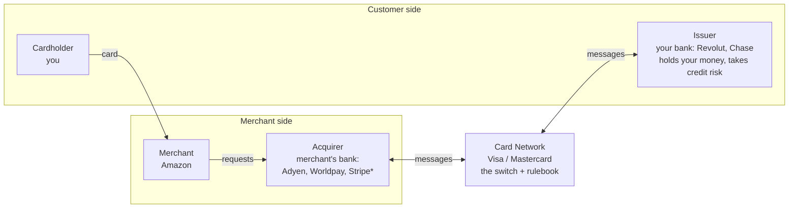
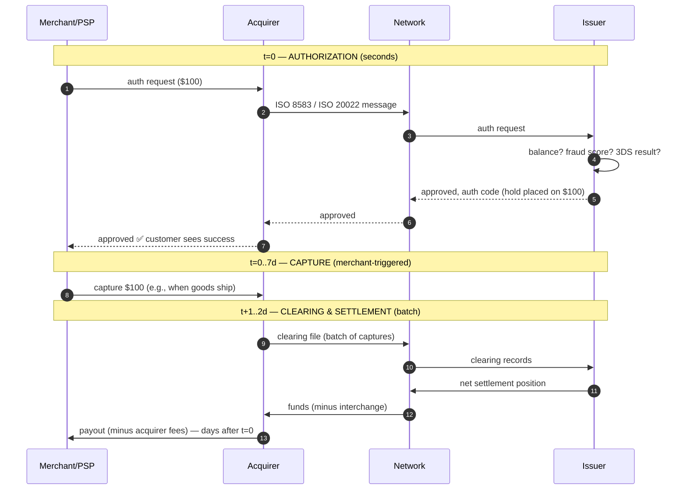
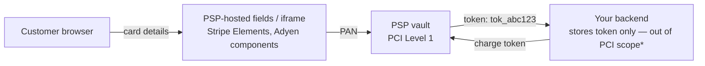
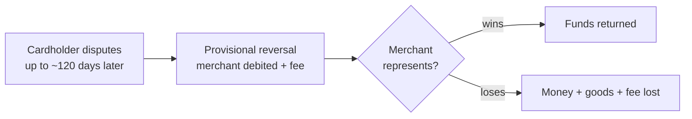

---
tags:
  - applied
  - interview-critical
---

# Card Payments Fundamentals

## You'll see this when...

- You work anywhere near checkout, payments, or banking and the words *acquirer*, *interchange*, or *capture* fly around meetings
- A payment shows as "successful" to the customer but money arrives in the merchant account three days later — and someone asks why
- Finance asks why the payout was 97.1% of the gross — where did 2.9% go?
- A customer was charged but the order failed — or the reverse
- A chargeback lands 60 days after a transaction everyone forgot

## The four-party model

Every card payment involves the same cast, regardless of card network:



- **Issuer** — issued the card, holds the cardholder's account, decides whether to approve each transaction
- **Acquirer** — banks the merchant, accepts card transactions on their behalf, takes on the merchant's risk
- **Network (scheme)** — Visa/Mastercard run the message switch and the rulebook (and set interchange); they never hold the money
- **PSP / gateway** (Stripe, Adyen, Checkout.com) — the modern developer-facing layer that bundles gateway + acquiring + fraud tooling into one API. Stripe is technically a payment facilitator/acquirer combo — the four-party model still operates underneath

American Express is a **three-party** scheme: it is both issuer and acquirer, which is why its fees and data flows differ.

## Authorization ≠ capture ≠ settlement

The single most useful mental model in card payments: **"the payment" is at least three separate events spread over days.**



| Step | What it is | When | Reversible? |
|---|---|---|---|
| **Authorization** | Issuer places a *hold* on funds; nothing moves | Real-time, seconds | Yes — **void** (release the hold) |
| **Capture** | Merchant says "I'm claiming this auth" (full or partial) | Merchant-controlled, up to ~7 days after auth | Yes — **refund** (a new money movement back) |
| **Clearing** | Networks exchange batched transaction records | Nightly batches | — |
| **Settlement** | Actual interbank money movement, net positions | T+1 to T+3 | Only via refund/chargeback |

Practical consequences:

- **Auth-then-capture** is why hotels can hold $200 and charge $170, why Amazon charges when shipping (not at order), and why "pending" transactions disappear from your banking app (auth expired, never captured)
- A **void** cancels an uncaptured auth — free and instant. A **refund** after capture is a new transaction — costs fees, takes days
- The merchant's "payment successful" page only proves *authorization*. The money is days away

## Where the money goes (fees)

For a $100 online transaction in a typical card-not-present scenario:

```
Customer pays:                    $100.00
Issuer keeps (interchange):        ~$1.80   ← set by network, paid acquirer→issuer
Network keeps (scheme fees):       ~$0.15
Acquirer/PSP keeps (markup):       ~$0.95   ← e.g. Stripe's "2.9% + 30¢" bundles all three
Merchant receives:                ~$97.10
```

**Interchange** is the big one and it varies wildly: card-present vs not-present, debit vs credit vs corporate, EU (regulated, capped at 0.2%/0.3%) vs US (often 1.5-2.5%+). This is why merchants care about routing, why "interchange-plus" pricing exists, and why some businesses push you toward bank transfers.

## Card-not-present, PCI, and tokenization

Online (card-not-present, CNP) payments carry more fraud risk — hence 3DS — and put any system touching the **PAN** (the 16-digit card number) in **PCI-DSS scope**.

The standard scope-reduction architecture:



- **PSP tokenization**: your servers never see the PAN; you store a vault token. Drops you from PCI SAQ-D (hundreds of controls) to SAQ-A (~20)
- **Network tokens** (Visa/Mastercard): the PAN is replaced at the network level; Apple Pay / Google Pay use device-bound network tokens with per-transaction cryptograms — which is why wallet payments often skip 3DS challenges
- Card details that auto-update when a card is reissued (network token lifecycle) measurably improve subscription retention

See [Compliance & Regulatory Engineering](../security/compliance-regulatory-engineering.md) for the PCI scoping discussion.

## CIT vs MIT — who initiated this charge?

A distinction that PSD2 made load-bearing:

| | CIT (Customer-Initiated) | MIT (Merchant-Initiated) |
|---|---|---|
| Example | Checkout, adding a card | Subscription renewal, usage billing, hotel no-show fee |
| Customer present? | Yes | No |
| SCA / 3DS required (EU)? | Yes (unless exempt) | No — but the *initial* setup CIT must be authenticated |
| Setup | — | Needs a CIT "mandate" transaction that flags future MITs and stores the network transaction ID |

Get this wrong and EU renewals start failing with "SCA required" soft declines. Subscription engines must store the **initial transaction's network reference** and submit it with every MIT.

## When it goes wrong

### Declines

- **Hard declines** (stolen card, closed account): do not retry
- **Soft declines** (insufficient funds, do-not-honor, SCA-required): retry with strategy — different time of day/month for funds, trigger 3DS for SCA-required
- Decline codes are issuer-specific and messy; PSPs normalize them. Smart retry timing on renewals ("dunning") is a measurable revenue lever — see [Billing & Metering](../architecture/billing-metering.md)

### Chargebacks

The cardholder disputes via their **issuer** (not the merchant). The issuer can claw funds back through the network; the merchant gets to submit evidence ("representment").



- Each chargeback costs a fee (~$15-25) regardless of outcome; high chargeback *ratios* (>0.9%) put merchants into network monitoring programs with fines, and eventually account termination
- **Liability**: for CNP fraud, the merchant eats it by default — *unless* the transaction was 3DS-authenticated, which shifts fraud liability to the issuer. This is the commercial engine behind 3DS adoption ([next page](3ds-flow.md))
- Engineering implication: keep evidence (delivery confirmation, IP, device, 3DS result) retrievable for ~6 months

### Reconciliation

Every payment system ends up with a daily job answering: *does what the PSP says match what we say, and does the bank payout match both?* Three-way matching (internal ledger ↔ PSP report ↔ bank statement), with a queue for the ~0.1% that never match cleanly. Design for it from day one — see the [Payment System case study](../case-studies/payment-system.md).

## Anti-patterns

| Anti-pattern | Why it hurts | Better |
|---|---|---|
| Treating auth success as money-in-the-bank | Payout is days away and reversible | Model auth/capture/settle as distinct ledger states |
| Capturing immediately for ship-later goods | Card rules require capture on fulfilment; refunds cost fees | Auth at order, capture at shipment |
| Storing PANs "temporarily" | Full PCI-DSS scope, breach liability | PSP-hosted fields + tokens; never let PAN touch your servers |
| Retrying hard declines | Issuer fraud flags, network fines | Classify decline codes; retry only soft declines |
| MIT renewals without the initial mandate reference | EU soft-decline storm | Store and submit network transaction IDs from the setup CIT |
| No idempotency key on charge calls | Double charges on timeout retry | Idempotency keys end to end — see [Idempotency](../patterns/idempotency.md) |
| Ignoring chargeback ratio until the fine | Monitoring programs, MID termination | Track ratio weekly; fight fraud upstream (3DS, velocity rules) |

## Quick reference

| Need | Reach for |
|---|---|
| Hold funds now, charge later | Auth + delayed capture (≤7 days) |
| Cancel before capture | Void (free) — not refund |
| Stay out of PCI scope | PSP-hosted fields + vault tokens (SAQ-A) |
| EU subscription renewals | MIT framework + stored network transaction ID |
| Fewer fraud chargebacks | 3DS authentication → liability shift |
| Better subscription card retention | Network tokens + account updater |
| Understand a payout amount | Gross − interchange − scheme − PSP markup |
| Exactly-once charging | Idempotency keys + PSP idempotency support |

## Interview angle

!!! tip "What interviewers are testing"
    Whether you know a card payment is a multi-day, multi-party state machine — not an API call. The discriminating vocabulary: auth vs capture, interchange, liability shift, CIT/MIT.

**Strong answer pattern:**

1. Draw the four-party model; place the PSP as the developer-facing bundle on the acquiring side
2. Separate authorization (seconds, a hold) from capture (merchant-triggered) from settlement (days, batch)
3. Keep PANs out of your systems — hosted fields, tokens, PCI scope reduction
4. Idempotency on every money-moving call; ledger states for auth/captured/settled/refunded/disputed
5. Mention chargebacks and the 3DS liability shift as the fraud-economics layer

**Common follow-ups:**

- "Customer says charged, order says failed — what happened?" — auth succeeded, your capture/confirm step failed after timeout; the hold will expire in days. Reconcile auth-without-order records; build idempotent confirm
- "Why did the customer see 'pending' for a week then it vanished?" — auth hold placed, never captured, expired
- "Where does the 2.9% go?" — mostly interchange to the issuer, slivers to the network and PSP
- "Why is Amex different?" — three-party scheme: issuer and acquirer are the same company

## Test yourself

Answers are hidden — commit to an answer before expanding.

??? question "A payment shows 'approved' at checkout. List three reasons the merchant might still never receive that money."

    (1) The merchant never captures the authorization and it expires. (2) The capture happens but the cardholder wins a chargeback weeks later, clawing the funds back. (3) The acquirer withholds payout — risk hold, rolling reserve, or account termination for excessive chargebacks. Authorization is a hold, not money.

??? question "Why does Amazon charge your card when the item ships rather than when you order?"

    Card scheme rules require capture to be tied to fulfilment for goods, and capturing at shipment means a cancelled order is a free void of the auth rather than a fee-bearing refund of a captured charge. The auth placed at order time holds the funds in the meantime.

??? question "What exactly does the interchange fee compensate, and who sets it?"

    Interchange flows from the acquirer to the **issuer** and compensates the issuer's costs and risk — credit risk, fraud losses, cardholder rewards. It's set by the card **network**, not negotiated per merchant, and varies by card type, channel (CNP vs present), and region (EU caps it at 0.2%/0.3%; US rates are several times higher).

??? question "Your EU subscription renewals suddenly fail with 'authentication required' soft declines. What was missed?"

    The renewals are merchant-initiated transactions (MIT), which are exempt from SCA — but only when the *initial* customer-initiated setup transaction was 3DS-authenticated and its network transaction ID is stored and referenced in each renewal. Without that mandate chain, issuers treat renewals as unauthenticated CITs and soft-decline them.

??? question "An interviewer asks: 'How would you keep your checkout service out of PCI-DSS scope?'"

    Never let the PAN touch our servers: card fields are PSP-hosted iframes (Stripe Elements style), so the browser sends card data directly to the PSP's PCI Level 1 vault, and our backend only ever stores and charges an opaque token. That moves us from SAQ-D (full controls) to SAQ-A. Add network tokenization for wallets and card lifecycle updates.

## Related

- [3D Secure Flow](3ds-flow.md) — the authentication layer on top of authorization
- [Payment System case study](../case-studies/payment-system.md) — ledger, exactly-once, reconciliation design
- [Billing & Metering Engineering](../architecture/billing-metering.md) — subscriptions, dunning, MIT in practice
- [Idempotency](../patterns/idempotency.md) — the pattern money flows depend on
- [Compliance & Regulatory Engineering](../security/compliance-regulatory-engineering.md) — PCI-DSS scoping
