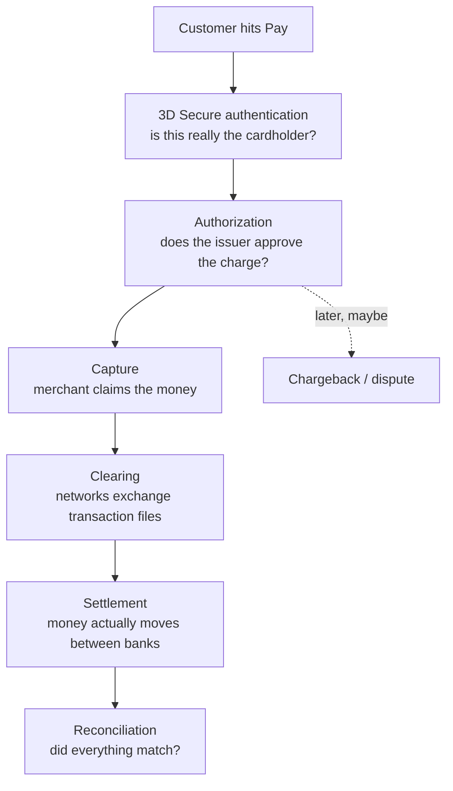

# Fintech

The flows behind moving money: how card payments actually work end to end, what happens in the seconds between "Pay now" and "Order confirmed", and the regulatory machinery (SCA, PSD2, PCI-DSS) that shapes the architecture.

This section is **rails-focused** — the protocols and actors between merchant and bank. For designing your own payment *system* (ledger, idempotency, reconciliation), see the [Payment System case study](../case-studies/payment-system.md). For charging customers as a SaaS, see [Billing & Metering](../architecture/billing-metering.md).

## The flows

-   :material-credit-card-outline:{ .lg .middle } **Card Payments Fundamentals**

    ---

    The four-party model, authorization vs capture vs settlement, interchange, chargebacks, tokenization. The foundation every other flow builds on.

    [:octicons-arrow-right-24: Read](card-payments-fundamentals.md)

-   :material-shield-check-outline:{ .lg .middle } **3D Secure (3DS) Flow**

    ---

    Why Amazon shows "waiting" while Revolut pings your phone — the full authentication flow: frictionless vs challenge, ACS, liability shift, SCA.

    [:octicons-arrow-right-24: Read](3ds-flow.md)

-   :material-book-alphabet:{ .lg .middle } **Fintech Glossary**

    ---

    Every term for review: issuer, acquirer, interchange, clearing, CIT/MIT, nostro/vostro, EMI, rails — grouped by category.

    [:octicons-arrow-right-24: Read](glossary.md)

## How the pieces fit

Authentication (3DS) and authorization are **separate steps** that are easy to conflate: 3DS proves *who you are*; authorization decides *whether the charge is approved*. The Revolut popup belongs to the first; the final "payment successful" on the merchant page requires both.

## Coming later

Candidates for this section as it grows: open banking (PIS/AIS), bank transfer rails (SEPA Instant, ACH, FedNow), wallet payments and network tokenization (Apple Pay / Google Pay), payouts and ledger design, AML/KYC engineering, reconciliation at scale.

## Related

- [Payment System case study](../case-studies/payment-system.md) — ledger, exactly-once, internal design
- [Billing & Metering Engineering](../architecture/billing-metering.md) — subscription/usage billing on top of these rails
- [Idempotency](../patterns/idempotency.md) — non-negotiable for anything touching money
- [Compliance & Regulatory Engineering](../security/compliance-regulatory-engineering.md) — PCI-DSS scope reduction
