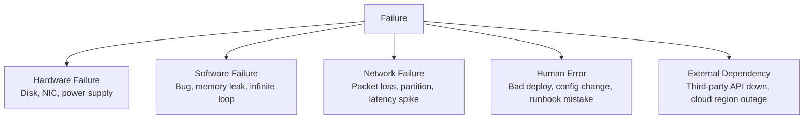
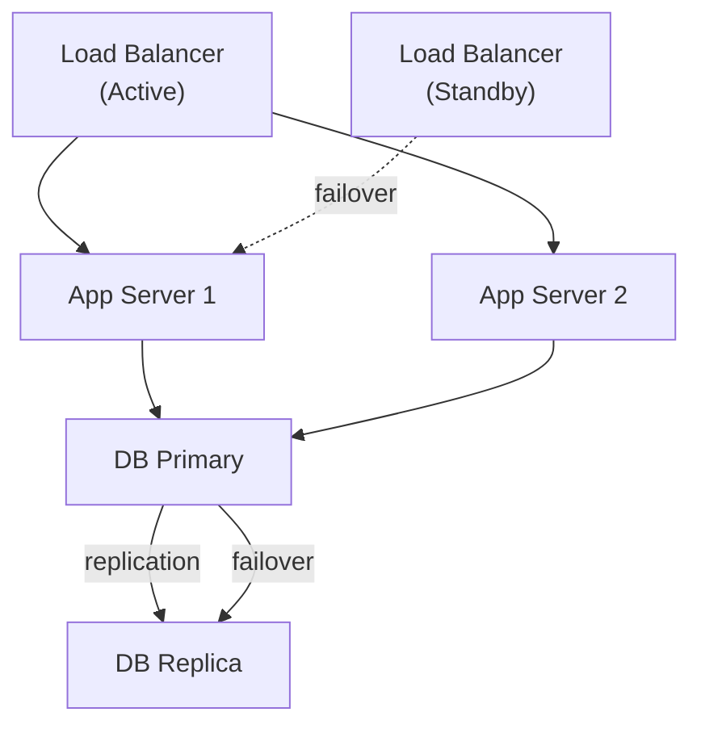

# Availability & Reliability

## Definitions

**Availability** — the percentage of time a system is operational and serving requests.

**Reliability** — the probability that a system performs its intended function without failure over a given time period.

**Durability** — the guarantee that data, once written, is not lost (storage-specific).

They are related but distinct:
- A system can be *available* but *unreliable* (responds but gives wrong answers)
- A system can be *reliable* but *not highly available* (rarely fails, but takes 30 min to restart when it does)

## The Nines

| Availability | Downtime per year | Downtime per month | Downtime per week |
|---|---|---|---|
| 90% (one nine) | 36.5 days | 72 hours | 16.8 hours |
| 99% (two nines) | 3.65 days | 7.2 hours | 1.68 hours |
| 99.9% (three nines) | 8.77 hours | 43.8 min | 10.1 min |
| 99.99% (four nines) | 52.6 min | 4.38 min | 1.01 min |
| 99.999% (five nines) | 5.26 min | 26.3 sec | 6.06 sec |

**Reality check:**
- Most internal tools: 99% is fine
- Consumer-facing products: 99.9% is the minimum expectation
- Payments, healthcare, critical infra: 99.99%+
- Five nines requires extraordinary investment — Netflix targets ~99.99%

## Availability in series vs parallel

**Series (sequential):** Both components must work. Availability compounds downward.

```
A (99.9%) → B (99.9%) → Total = 99.9% × 99.9% = 99.8%
```

**Parallel (redundant):** Either component can serve. Availability compounds upward.

```
A (99.9%) ──┐
            ├→ Total = 1 - (1-0.999)² = 1 - 0.000001 = 99.9999%
A (99.9%) ──┘
```

**Implication:** Add redundancy in parallel to increase availability. Chaining dependencies in series degrades it. Every microservice hop is a series dependency.

## Failure modes



**MTTR vs MTBF:**
- **MTBF** (Mean Time Between Failures) — how often failures occur. Reliability metric.
- **MTTR** (Mean Time To Recovery) — how long it takes to recover. Availability metric.

```
Availability ≈ MTBF / (MTBF + MTTR)
```

Improving availability means either making failures less frequent (↑ MTBF) or recovering faster (↓ MTTR). In cloud environments, MTTR is often more impactful — hardware fails, but fast recovery keeps availability high.

## Techniques for high availability

### Redundancy

Eliminate single points of failure (SPOF) by duplicating every component:



### Active-Active vs Active-Passive

| Mode | Both nodes serve traffic? | Failover time | Capacity utilization |
|---|---|---|---|
| Active-Active | Yes | Near-zero (existing nodes absorb load) | Both nodes carry load |
| Active-Passive | No (standby is idle) | Seconds to minutes (promotion required) | 50% utilized |

**Active-Active** is harder (requires conflict resolution) but better utilization and no failover gap.

### Health checks and auto-recovery

```
Load Balancer: polls /health every 10s
3 consecutive failures → remove instance from rotation
Instance recovers → health check passes → add back
```

Auto Scaling Group: detects unhealthy EC2 instances and replaces them automatically.

### Graceful degradation

When a dependency fails, serve a degraded but still useful response rather than failing entirely.

```
Recommendation service down →
  Don't: return 500 error
  Do:    return generic top-10 products list from cache
```

### Bulkhead pattern

Isolate failures to prevent cascade. Use separate thread pools/connections per downstream dependency.

```
Payment service has its own connection pool (max 10)
User service has its own connection pool (max 20)
Payment service overload → only payment pool exhausted, user service unaffected
```

See [Bulkhead](../patterns/bulkhead.md) for full coverage.

### Chaos engineering

Netflix's principle: intentionally inject failures in production to verify your resilience.

- Chaos Monkey: randomly terminates EC2 instances
- Chaos Kong: simulates entire region failure
- Fail in production (with safeguards) — you don't really know your system's resilience until it fails

## SLI, SLO, SLA

See [SLI, SLO & SLA](../observability/slo-sla.md) for full coverage.

Quick summary:

| Term | Definition | Example |
|---|---|---|
| SLI (Indicator) | The measurement | "99.5% of requests succeed" |
| SLO (Objective) | Your internal target | "We target 99.9% success rate" |
| SLA (Agreement) | External contractual commitment | "We guarantee 99.9% or credit issued" |

**Error budget:** `100% - SLO target = error budget`  
99.9% SLO → 0.1% error budget → ~43 minutes of downtime per month available to spend.

## AWS tools for availability

| Technique | AWS service |
|---|---|
| Multi-AZ redundancy | RDS Multi-AZ, ElastiCache Multi-AZ, ALB spans AZs |
| Auto-recovery | EC2 Auto Recovery, ASG health checks |
| Health checks | ALB target health, Route 53 health checks |
| Cross-region failover | Route 53 failover routing, Aurora Global Database |
| Chaos engineering | AWS Fault Injection Simulator (FIS) |

## Interview angle

!!! tip "What interviewers are testing"
    They want to see you identify SPOFs and address them, and reason about availability math.

**Strong answer pattern:**
1. State your availability target (e.g., 99.99%)
2. Walk through your design and identify every SPOF
3. Address each with redundancy (active-active or active-passive)
4. Mention health checks and auto-recovery
5. Touch on graceful degradation for external dependencies

**Common follow-up:** *"What happens if your cache goes down?"*
> Cache failure is a degraded-mode scenario, not a total outage. With cache-aside, reads fall back to the DB. The risk is a thundering herd overwhelming the DB. Mitigate with: circuit breaker on the cache client, request coalescing, and a hot standby replica.

## Related topics

- [SLI, SLO & SLA](../observability/slo-sla.md) — how to measure and commit to availability
- [Circuit Breaker](../patterns/circuit-breaker.md) — preventing cascade failures
- [Replication](../patterns/replication.md) — data-layer redundancy
- [Bulkhead](../patterns/bulkhead.md) — isolating failure domains
