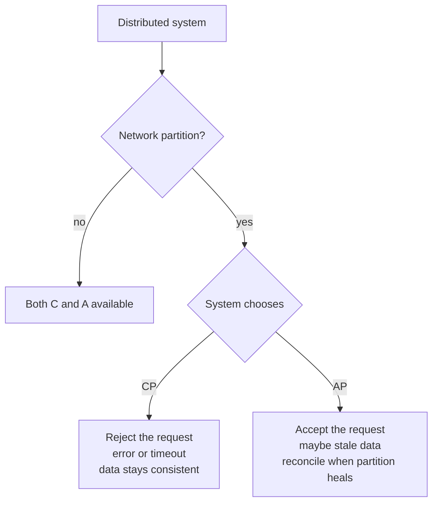
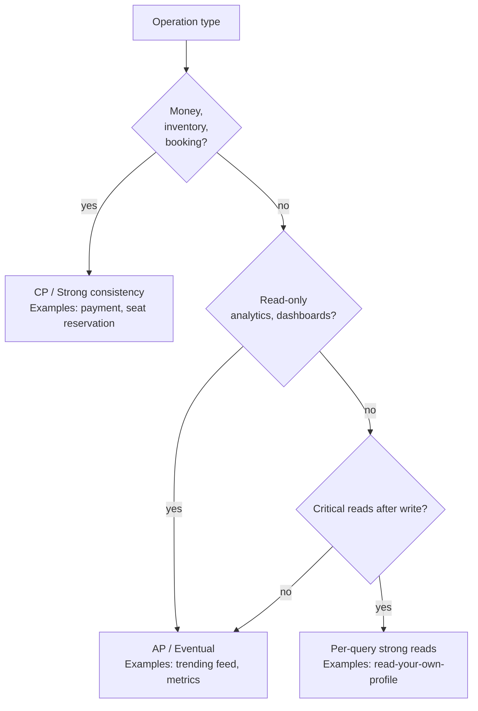

---
tags:
  - interview-critical
  - for-scale
  - applied
---

# CAP Theorem in Practice

The [CAP Theorem page](cap-theorem.md) covers the theory. This page covers **what CAP looks like in real code**: how you actually choose C vs A per query, what tunable consistency knobs look like in Cassandra and DynamoDB, what failures look like to your application, and how PACELC shows up in everyday performance.

---

## CAP in 30 seconds



The **interesting part isn't the theory** — it's that almost every distributed database lets you **choose per-query**, and what you choose has real code consequences.

---

## Tunable consistency in Cassandra

Cassandra is famously AP — but it lets you tune it per query. The knob is the **consistency level**.

### The model

For each read or write, you specify how many replicas must respond before considering the operation successful. Cassandra has 3 replicas of every row by default (replication factor 3).

```python
# Cassandra Python driver example
from cassandra.cluster import Cluster
from cassandra import ConsistencyLevel

cluster = Cluster(['cassandra1', 'cassandra2', 'cassandra3'])
session = cluster.connect('mykeyspace')

# Strong consistency: read from quorum (2 of 3 replicas)
query = SimpleStatement(
    "SELECT balance FROM accounts WHERE id = %s",
    consistency_level=ConsistencyLevel.QUORUM
)
result = session.execute(query, ('user123',))

# Fast read: any 1 replica responds
query = SimpleStatement(
    "SELECT name FROM users WHERE id = %s",
    consistency_level=ConsistencyLevel.ONE
)

# Strongest: all 3 replicas must agree (rarely worth it)
query = SimpleStatement(
    "SELECT amount FROM critical_transactions WHERE id = %s",
    consistency_level=ConsistencyLevel.ALL
)
```

### Consistency levels explained

| Level | Reads | Writes | Use case |
|---|---|---|---|
| `ONE` | First replica responds | First replica acknowledges | Performance > consistency (analytics, logs) |
| `QUORUM` | Majority (2 of 3) responds | Majority acknowledges | Standard for "strong-ish" reads |
| `ALL` | Every replica responds | Every replica acknowledges | Critical data; expensive |
| `LOCAL_QUORUM` | Quorum in local datacenter | Quorum in local DC | Multi-DC; avoid cross-region latency |
| `EACH_QUORUM` | Quorum in EACH datacenter | Quorum everywhere | Multi-DC strict consistency |
| `ANY` | n/a for reads | First node (even hint) acks | Maximum write availability |

### The R + W > N rule

For **strong consistency**, your read consistency + write consistency must exceed replicas:

```
N = 3 (replicas)
R + W > N → strong consistency

Write QUORUM (W=2) + Read QUORUM (R=2) = 4 > 3 ✓ strong
Write ONE (W=1) + Read ONE (R=1) = 2 ≤ 3 ✗ eventual
Write ALL (W=3) + Read ONE (R=1) = 4 > 3 ✓ strong, fast reads
```

This is **how you tune CAP per query**. The combination determines whether you're operating CP or AP for that operation.

### Real-world pattern

```python
# Read-heavy data — eventual is fine
def get_user_profile(user_id):
    query = SimpleStatement(
        "SELECT * FROM users WHERE id = %s",
        consistency_level=ConsistencyLevel.ONE  # fast, eventual
    )
    return session.execute(query, (user_id,))

# Money — must be strong
def get_account_balance(account_id):
    query = SimpleStatement(
        "SELECT balance FROM accounts WHERE id = %s",
        consistency_level=ConsistencyLevel.QUORUM  # strong
    )
    return session.execute(query, (account_id,))

# Analytics — speed matters more than freshness
def count_signups_today():
    query = SimpleStatement(
        "SELECT COUNT(*) FROM signups WHERE date = today()",
        consistency_level=ConsistencyLevel.ONE
    )
    return session.execute(query)
```

Same database, three different CAP positions — chosen per query.

---

## Tunable consistency in DynamoDB

DynamoDB is also AP by default. You opt into stronger consistency per read with `ConsistentRead=True`.

```python
import boto3

dynamodb = boto3.resource('dynamodb')
table = dynamodb.Table('Users')

# Eventually consistent read (default) — fast, cheap, may be stale
response = table.get_item(
    Key={'user_id': 'user123'},
    ConsistentRead=False  # default
)
# Reads from any replica; might be milliseconds stale

# Strongly consistent read — slower, more expensive, fresh
response = table.get_item(
    Key={'user_id': 'user123'},
    ConsistentRead=True
)
# Reads from the primary replica; always fresh
```

### What you pay for ConsistentRead

```
Eventually consistent read:  0.5 RCU per 4KB item
Strongly consistent read:    1 RCU per 4KB item   ← 2× cost
Transactional read:          2 RCU per 4KB item   ← 4× cost
```

Plus latency: strong reads are ~5-15ms slower because they hit the partition leader, not the nearest replica.

### Writes are always strongly consistent

DynamoDB writes always go to the leader of the partition. You can't tune write consistency. But you can chain operations into a transaction:

```python
# Multi-item transaction — all-or-nothing, strongly consistent
dynamodb.transact_write_items(
    TransactItems=[
        {'Update': {
            'TableName': 'Accounts',
            'Key': {'id': 'acc1'},
            'UpdateExpression': 'SET balance = balance - :amt',
            'ExpressionAttributeValues': {':amt': 100}
        }},
        {'Update': {
            'TableName': 'Accounts',
            'Key': {'id': 'acc2'},
            'UpdateExpression': 'SET balance = balance + :amt',
            'ExpressionAttributeValues': {':amt': 100}
        }},
    ]
)
# Both succeed or both fail; ACID guarantees across items
```

### Global tables — the multi-region twist

DynamoDB Global Tables (multi-region active-active) **cannot be strongly consistent across regions**. Each region's writes propagate asynchronously.

```python
# In us-east-1
table.put_item(Item={'user_id': 'u1', 'name': 'alice'})

# Immediate read in eu-west-1
table.get_item(Key={'user_id': 'u1'}, ConsistentRead=True)
# May return nothing — write hasn't replicated yet (~0.5-2s typical)
```

If you need strong consistency globally, you can't use Global Tables. Options: Spanner, CockroachDB, or accept eventual consistency and design for it.

---

## What CP failures look like in code

When a CP system loses quorum, your code sees explicit errors. Here's what they look like:

### Cassandra — quorum unreachable

```python
from cassandra import OperationTimedOut, UnavailableException

try:
    result = session.execute(
        SimpleStatement(
            "SELECT * FROM accounts WHERE id = %s",
            consistency_level=ConsistencyLevel.QUORUM
        ),
        ('user123',)
    )
except UnavailableException as e:
    # Quorum can't be reached: enough replicas are down/partitioned
    # System chose C over A — refused to serve potentially stale data
    log.error(f"Quorum unreachable: required {e.required_replicas}, alive {e.alive_replicas}")
    # Application decision: retry, queue, degrade
except OperationTimedOut:
    # Coordinator couldn't reach replicas in time
    # Don't know if write succeeded; treat as failed and retry safely
    log.error("Operation timed out — needs idempotent retry")
```

### MongoDB — primary unreachable

```python
from pymongo.errors import NetworkTimeout, NotPrimaryError

try:
    result = users.find_one(
        {'_id': 'user123'},
        read_concern={'level': 'majority'}  # strong read
    )
except NetworkTimeout:
    # Can't reach a majority — system chose CP
    # Reads fail rather than serve stale data
    log.error("Network timeout — majority unreachable")
except NotPrimaryError:
    # Primary stepped down during a write
    # Client driver auto-retries on new primary, but explicit case
    log.error("Primary changed; retrying...")
```

### PostgreSQL with quorum sync replication

```python
import psycopg2
from psycopg2.errors import SerializationFailure

try:
    cursor.execute("UPDATE accounts SET balance = balance - 100 WHERE id = 'a1'")
    conn.commit()
except SerializationFailure:
    # Concurrent transaction conflict; system chose C
    # Retry the transaction
    log.warning("Serialization conflict — retrying transaction")
    conn.rollback()
    # ... retry logic
```

The pattern: **CP systems give you explicit errors**. Your code must handle them. AP systems give you data — possibly stale — and you must reason about staleness.

---

## What AP "stale data" looks like in code

```python
# DynamoDB eventually consistent read after a write
table.put_item(Item={'user_id': 'u1', 'name': 'Alice', 'updated_at': '2026-05-11T10:00:00'})

# Immediately read again with eventually consistent (default)
result = table.get_item(Key={'user_id': 'u1'})
print(result['Item'])
# Possible outcomes (all valid for AP):
#   1. {'name': 'Alice', 'updated_at': '2026-05-11T10:00:00'} — fresh
#   2. {'name': 'PreviousName', 'updated_at': '2026-04-30T...'} — stale (from before the write)
#   3. {'Item': None} — write hasn't replicated to this read replica yet
```

Your code must tolerate any of these. Common patterns:

### Pattern 1: Read-your-own-writes via consistent read

```python
def update_profile(user_id, name):
    table.put_item(Item={'user_id': user_id, 'name': name})

def get_profile(user_id, just_updated=False):
    # If we just wrote, force consistent read
    return table.get_item(
        Key={'user_id': user_id},
        ConsistentRead=just_updated
    )
```

### Pattern 2: Optimistic UI — show local change immediately, sync server later

```javascript
// React UI
function updateProfile(name) {
  // 1. Show change immediately (optimistic)
  setProfileName(name);
  
  // 2. Send to server (async)
  api.put('/profile', { name }).catch(err => {
    // 3. On failure, revert
    setProfileName(previousName);
    showError("Couldn't save");
  });
}
```

### Pattern 3: Versioning with optimistic concurrency

```python
# Read includes a version
item = table.get_item(Key={'user_id': 'u1'})
current_version = item['Item']['version']

# Update only if version unchanged
try:
    table.update_item(
        Key={'user_id': 'u1'},
        UpdateExpression='SET name = :name, version = version + :one',
        ConditionExpression='version = :current',
        ExpressionAttributeValues={
            ':name': 'New Alice',
            ':current': current_version,
            ':one': 1,
        }
    )
except ClientError as e:
    if e.response['Error']['Code'] == 'ConditionalCheckFailedException':
        # Someone else updated; reread and retry
        retry_with_fresh_version()
```

This is **how you build correctness on top of an AP system** — the database is eventual, your code adds the necessary checks.

---

## PACELC walkthrough — the latency dimension

CAP only describes behaviour during a partition. PACELC adds: **even without a partition, you choose between Latency and Consistency**.

### The full statement

```
If Partition: choose Availability or Consistency
Else (normal operation): choose Latency or Consistency
```

### Why this matters

A "CP" system isn't always slow during normal operation. A "AP" system isn't always fast. The PACELC label tells you both:

| System | Partition | Normal | What it means |
|---|---|---|---|
| **DynamoDB** | PA | EL | Multi-region; chooses A on partition, L on normal — eventually consistent everywhere |
| **Cassandra** | PA | EL | Default eventual; tune with QUORUM for stricter |
| **MongoDB** | PC | EL/EC | CP on partition (primary required); default eventually consistent reads |
| **PostgreSQL** | n/a | EC | Single-node ACID; no partition because no distribution |
| **Spanner** | PC | EC | Strong consistency everywhere; pays latency cost (TrueTime) |
| **CockroachDB** | PC | EC | Like Spanner; serializable across regions |

### The latency cost of consistency in normal operation

```
Strong consistency in a multi-region active-active system:
  Write → coordinate with leader in another region → ~50-200ms RTT added
  
Eventual consistency:
  Write to local region → return → propagate asynchronously
  Local write latency: ~5-10ms
```

This is why DynamoDB Global Tables, Cassandra multi-DC, CouchDB are all eventually consistent: strong consistency across regions is expensive.

### When the latency cost is worth it

Spanner uses **TrueTime** (synchronised atomic clocks) to minimise the cost of strong consistency:

```
Without TrueTime: must coordinate across regions for every commit
With TrueTime: wait out the clock uncertainty interval (~7ms)
              then commit locally; other regions trust the timestamp

Result: strong consistency at ~10-20ms write latency multi-region
```

That's the engineering achievement that makes Spanner unique.

---

## Decision: which CAP position fits your use case?



### Real-world choices

| Use case | CAP choice | Implementation |
|---|---|---|
| Bank balance | CP | Spanner / Postgres with single-region writes |
| Order placement | CP (within a service) | Postgres with row locks |
| Inventory count | CP (with reservations) | Postgres + optimistic concurrency |
| Shopping cart | AP | DynamoDB + last-write-wins or CRDT |
| User profile | AP | DynamoDB / Cassandra; OK to be slightly stale |
| Social feed | AP | Cassandra / Redis; stale by seconds is fine |
| Search index | AP | OpenSearch / Algolia; lag of seconds OK |
| Game leaderboard | AP | Redis sorted sets; eventual consistency |
| Audit log | AP | Append-only stream; never lost |
| Distributed lock | CP | etcd, ZooKeeper, Redis with Redlock |

---

## CAP + Idempotency = practical resilience

CAP tells you what *can* happen during failures. **Idempotency** is how your application *handles* it. The two are inseparable in practice.

```python
# AP system: write succeeded, but client got timeout
# Should client retry?

# Without idempotency: retry = double charge
def charge(user_id, amount):
    db.execute("UPDATE balances SET amount = amount - %s WHERE user_id = %s",
               (amount, user_id))

# With idempotency: retry = safe
def charge(user_id, amount, idempotency_key):
    # If this key already processed, return the prior result
    existing = db.fetch_one(
        "SELECT result FROM charges WHERE idempotency_key = %s",
        (idempotency_key,)
    )
    if existing:
        return existing['result']
    
    # Process and record atomically
    result = process_charge(user_id, amount)
    db.execute(
        "INSERT INTO charges (idempotency_key, user_id, amount, result) VALUES (%s, %s, %s, %s)",
        (idempotency_key, user_id, amount, result)
    )
    return result
```

This is **why every modern API uses idempotency keys** — Stripe, Square, AWS, etc. They make AP systems behave reliably from the caller's perspective.

See [Idempotency](../patterns/idempotency.md).

---

## Anti-patterns

| Anti-pattern | Why it fails |
|---|---|
| "We use DynamoDB so we're always available" | DynamoDB is AP, but your code reads stale data; if you ignore that, you have bugs |
| Always using `ConsistentRead=True` on DynamoDB | 2× cost; 5-15ms latency; usually unnecessary |
| Trusting "strong consistency" across regions in multi-region DBs (besides Spanner-class) | Most multi-region DBs sacrifice cross-region consistency |
| Assuming Cassandra is consistent because you wrote there | Default consistency is ONE; eventually you'll read from a stale replica |
| Designing for CP when AP is fine | You pay latency cost everywhere; users complain |
| Designing for AP when CP is needed | Money disappears, inventory oversold |

---

## Quick reference card

```
WRITES go to:                    READS get:
─────────────────────────────────────────────────────────────────
Cassandra ONE:    1 replica       Cassandra ONE:    fast, possibly stale
Cassandra QUORUM: majority         Cassandra QUORUM: strong (if W also QUORUM)
Cassandra ALL:    every replica    Cassandra ALL:    strongest, slowest

DynamoDB default: leader           DynamoDB default: fast, possibly stale
DynamoDB:         (always strong)  DynamoDB Consistent=True: strong, 2× cost

MongoDB default:  primary          MongoDB primary read: strong
MongoDB:          (strong by default) MongoDB secondaryPreferred: eventual

PostgreSQL:       primary           PostgreSQL primary: strong
PostgreSQL:       async replicas    PostgreSQL replica: eventual (replica lag)
```

---

## Test yourself

Answers are hidden — commit to an answer before expanding.

??? question "Why does R + W > N guarantee strong consistency in Cassandra?"

    With N replicas, if read quorum plus write quorum exceeds N, every read set must overlap with every write set in at least one replica — so a read is guaranteed to touch at least one node holding the latest write. Example: N=3, W=QUORUM (2), R=QUORUM (2) gives 4 > 3, so reads are strong. W=1 + R=1 = 2 ≤ 3 leaves you with eventual consistency. This combination is how you tune CAP per query.

??? question "Why are multi-region active-active databases like DynamoDB Global Tables almost always eventually consistent across regions?"

    Because strong consistency across regions requires coordinating every write with a leader in another region, adding ~50-200ms of cross-region RTT to each operation — this is the PACELC 'Else: Latency vs Consistency' tradeoff. Eventual consistency lets you write locally in ~5-10ms and propagate asynchronously. Spanner is the notable exception: TrueTime atomic clocks shrink the coordination cost to roughly 10-20ms.

??? question "Your Cassandra read at consistency level QUORUM throws `UnavailableException` — what's happening, and what should your code do?"

    Enough replicas are down or partitioned that a quorum (2 of 3) cannot be reached, and the system is choosing C over A: it refuses to serve potentially stale data rather than answer. This is what a CP failure looks like in code — an explicit error. Your application must decide how to respond: retry, queue the operation, or degrade gracefully.

??? question "You write an item to a DynamoDB Global Table in us-east-1, then immediately read it in eu-west-1 with `ConsistentRead=True` — and get nothing back. Why?"

    Global Tables replicate across regions asynchronously, typically taking ~0.5-2s, so the write simply hasn't arrived in eu-west-1 yet. `ConsistentRead=True` only gives strong consistency within a region — it cannot make cross-region replication synchronous. If you truly need global strong consistency, you need a Spanner-class system (or CockroachDB), or you design your application for eventual consistency.

??? question "An interviewer asks: 'Your client got a timeout on a charge request against a distributed datastore — should it retry?' How do you answer?"

    Only if the operation is idempotent — on a timeout you don't know whether the write actually succeeded, so a naive retry risks a double charge. The fix is idempotency keys: the client sends a unique key, the server records it with the result, and a retry with the same key returns the prior result instead of charging again. This is why Stripe, Square, and AWS all use idempotency keys — it makes AP systems behave reliably from the caller's perspective.

## Related

- [CAP Theorem](cap-theorem.md) — the foundational theory
- [Consistency Models](consistency-models.md) — strong, eventual, causal, and the spectrum
- [Database Transactions & Isolation](isolation-levels.md) — single-node consistency
- [Quorum](../distributed/quorum.md) — the R+W>N foundation
- [Idempotency](../patterns/idempotency.md) — handling AP-system retries safely
- [Replication](../patterns/replication.md) — async vs sync, multi-region implications
