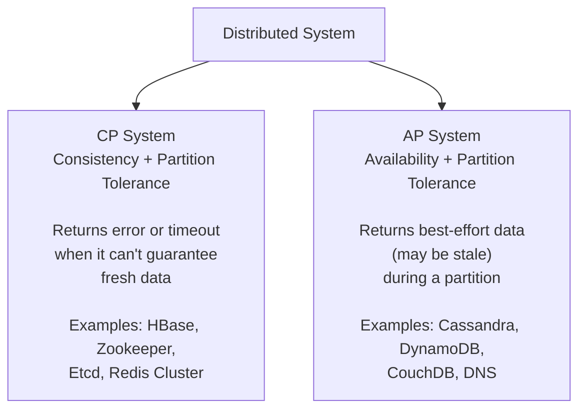

# CAP Theorem

## What it is

In any distributed data store, you can guarantee at most **2 of 3** properties simultaneously:

- **C — Consistency**: every read receives the most recent write or an error
- **A — Availability**: every request receives a (non-error) response, but it may not be the most recent write
- **P — Partition Tolerance**: the system continues operating even when network partitions occur

## The catch

**Partition Tolerance is not optional.** Networks fail. In any real distributed system you *must* tolerate partitions. So the real choice is:

> **When a partition occurs, do you sacrifice Consistency or Availability?**

This makes CAP a binary choice between **CP** and **AP** systems.



## CP vs AP in practice

| Scenario | CP (prefer consistency) | AP (prefer availability) |
|---|---|---|
| Banking / payments | Correct choice — stale balance is dangerous | Wrong — double-spend risk |
| Shopping cart | Wrong — lost items are bad UX | Correct — stale cart is tolerable |
| User profile / settings | Either works | Correct — eventual is fine |
| Inventory count | Correct choice | Wrong — overselling risk |
| Social media feed | Wrong — overkill | Correct — stale feed is fine |

## How each system behaves during a partition

=== "CP System"
    ```
    Client → Node A (can't reach Node B) → Error / Timeout
    
    Node A refuses to serve stale data.
    System is consistent but unavailable during the partition.
    ```

=== "AP System"
    ```
    Client → Node A (can't reach Node B) → Returns last known value
    
    Node A serves potentially stale data.
    System is available but may be inconsistent during the partition.
    When partition heals, nodes reconcile (eventual consistency).
    ```

## PACELC — the extension worth knowing

CAP only describes behavior during a partition. **PACELC** adds the latency/consistency tradeoff that exists *even without* a partition:

```
If Partition:  choose Availability or Consistency
Else:          choose Latency or Consistency
```

| System | Partition choice | Normal operation choice |
|---|---|---|
| DynamoDB | A | L (low latency by default, tunable) |
| Cassandra | A | L |
| PostgreSQL | C | C (single-node: no tradeoff) |
| Spanner | C | C (uses atomic clocks to minimize latency cost) |

## AWS equivalent

| Concept | AWS Service | Default choice |
|---|---|---|
| CP store | ElastiCache (Redis) with write concern | CP |
| AP store | DynamoDB (default) | AP |
| Tunable | DynamoDB with `ConsistentRead=true` | AP → CP per-request |
| CP at global scale | Aurora Global Database with primary writes | CP |

## Interview angle

!!! tip "What interviewers are testing"
    They want to know you understand the **real tradeoff**, not just the acronym.

**Strong answer pattern:**

1. State that P is non-negotiable in distributed systems
2. Frame it as: "Do we sacrifice C or A when a partition happens?"
3. Connect it to the specific system being designed — e.g., "For a payment system, I'd go CP because an inconsistent balance is worse than a failed transaction"
4. Mention PACELC if you want to go deeper — shows you understand the latency dimension too

**Common follow-up:** *"Is Cassandra always AP?"*
> Not always — Cassandra lets you tune consistency per-query (e.g., `QUORUM` reads/writes). At `ALL` consistency level it behaves like a CP system. The default is AP-leaning.

## Related topics

- [Consistency Models](consistency-models.md) — strong, eventual, causal and the spectrum between CP and AP
- [Replication](../patterns/replication.md) — how CP vs AP plays out in leader election
- [Key-Value Stores](../storage/key-value-stores.md) — Redis (CP) vs DynamoDB (AP) side by side
