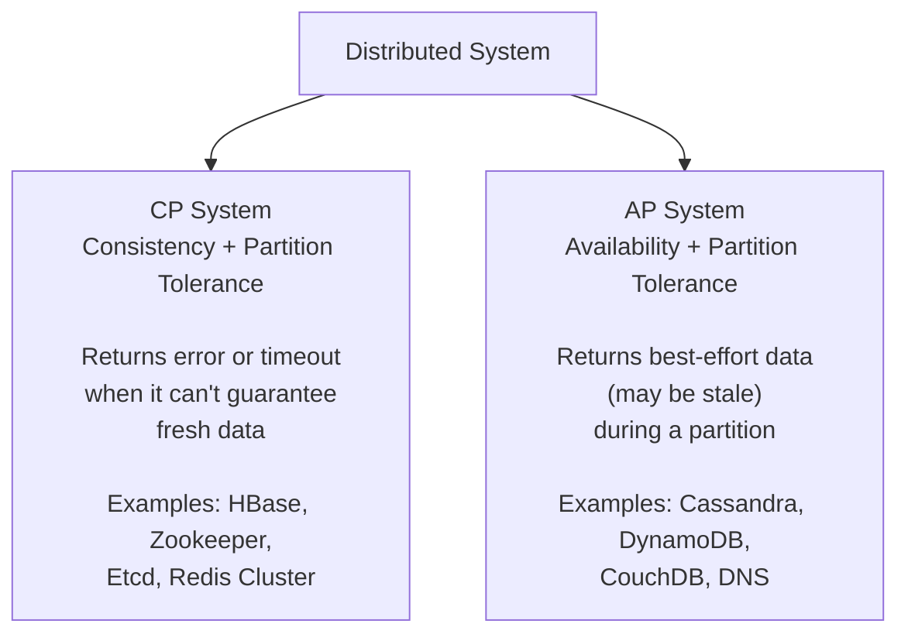

---
tags:
  - interview-critical
  - for-scale
---

# CAP Theorem

!!! tip "Applied companion"
    For the **practical side** — tunable consistency in Cassandra and DynamoDB, what CP/AP failures look like in code, PACELC walkthrough — see **[CAP Theorem in Practice](cap-theorem-applied.md)**.

## What it is

In any distributed data store, you can guarantee at most **2 of 3** properties simultaneously:

- **C — Consistency**: every read receives the most recent write or an error
- **A — Availability**: every request receives a (non-error) response, but it may not be the most recent write
- **P — Partition Tolerance**: the system continues operating even when network partitions occur

## You'll see this when...

- Choosing a database: "DynamoDB is AP, but Spanner is CP — which fits our use case?"
- Network partition during a deploy / region issue → behaviour depends on CP vs AP
- Banking app must reject the transaction (CP); social feed can show stale data (AP)
- Cassandra docs talk about "tunable consistency" — let you slide on the CAP curve per query
- "Why is our DynamoDB returning stale reads?" → AP system; use `ConsistentRead=true` if needed
- Architecture review asks "what happens when this DC fails?"
- Postmortem: split-brain — both halves of a partition kept accepting writes

## The catch

**Partition Tolerance is not optional.** Networks fail. In any real distributed system you *must* tolerate partitions. So the real choice is:

> **When a partition occurs, do you sacrifice Consistency or Availability?**

This makes CAP a binary choice between **CP** and **AP** systems.



## CP vs AP in practice

| Scenario | CP (prefer consistency) | AP (prefer availability) |
|---|---|---|
| Banking / payments | Correct choice — stale balance is dangerous | Wrong — double-spend risk |
| Shopping cart | Wrong — lost items are bad UX | Correct — stale cart is tolerable |
| User profile / settings | Either works | Correct — eventual is fine |
| Inventory count | Correct choice | Wrong — overselling risk |
| Social media feed | Wrong — overkill | Correct — stale feed is fine |

## How each system behaves during a partition

=== "CP System"
    ```
    Client → Node A (can't reach Node B) → Error / Timeout
    
    Node A refuses to serve stale data.
    System is consistent but unavailable during the partition.
    ```

=== "AP System"
    ```
    Client → Node A (can't reach Node B) → Returns last known value
    
    Node A serves potentially stale data.
    System is available but may be inconsistent during the partition.
    When partition heals, nodes reconcile (eventual consistency).
    ```

## PACELC — the extension worth knowing

CAP only describes behavior during a partition. **PACELC** adds the latency/consistency tradeoff that exists *even without* a partition:

```
If Partition:  choose Availability or Consistency
Else:          choose Latency or Consistency
```

| System | Partition choice | Normal operation choice |
|---|---|---|
| DynamoDB | A | L (low latency by default, tunable) |
| Cassandra | A | L |
| PostgreSQL | C | C (single-node: no tradeoff) |
| Spanner | C | C (uses atomic clocks to minimize latency cost) |

## AWS equivalent

| Concept | AWS Service | Default choice |
|---|---|---|
| CP store | ElastiCache (Redis) with write concern | CP |
| AP store | DynamoDB (default) | AP |
| Tunable | DynamoDB with `ConsistentRead=true` | AP → CP per-request |
| CP at global scale | Aurora Global Database with primary writes | CP |

## Interview angle

!!! tip "What interviewers are testing"
    They want to know you understand the **real tradeoff**, not just the acronym.

**Strong answer pattern:**

1. State that P is non-negotiable in distributed systems
2. Frame it as: "Do we sacrifice C or A when a partition happens?"
3. Connect it to the specific system being designed — e.g., "For a payment system, I'd go CP because an inconsistent balance is worse than a failed transaction"
4. Mention PACELC if you want to go deeper — shows you understand the latency dimension too

**Common follow-up:** *"Is Cassandra always AP?"*
> Not always — Cassandra lets you tune consistency per-query (e.g., `QUORUM` reads/writes). At `ALL` consistency level it behaves like a CP system. The default is AP-leaning.

## Test yourself

Answers are hidden — commit to an answer before expanding.

??? question "Why is Partition Tolerance not really optional in a distributed system?"

    Because networks fail — partitions will happen whether you plan for them or not. Any real distributed system must tolerate partitions, so CAP collapses into a binary choice: when a partition occurs, do you sacrifice Consistency or Availability? That makes systems effectively CP or AP, not "CA".

??? question "Why does a CP system return errors or timeouts during a partition instead of just serving the data it has?"

    Because the node cannot verify it holds the most recent write while it's cut off from its peers. Serving the local copy could mean serving stale data, which violates consistency — so a CP system refuses to answer rather than risk being wrong. It stays consistent but becomes unavailable for the duration of the partition.

??? question "Your team uses DynamoDB and users report occasionally seeing stale data right after an update — what's happening, and what's the fix?"

    DynamoDB is an AP system by default: reads are eventually consistent and may come from a replica that hasn't received the latest write yet. For reads that must be fresh, set `ConsistentRead=true`, which switches that request to CP behavior. This is per-request tunable consistency.

??? question "A postmortem reveals that during a network partition, both halves of your cluster kept accepting writes and the data diverged — what is this called, and which CAP choice does it reflect?"

    This is split-brain: each side of the partition continued serving (and accepting writes) independently, which is AP behavior — availability was preserved at the cost of consistency. When the partition heals, the nodes must reconcile the divergent writes (eventual consistency). A CP system would instead have refused writes on the side that lost quorum.

??? question "An interviewer asks: 'Is Cassandra always AP?' How do you answer?"

    Not always — Cassandra offers tunable consistency per query. With `QUORUM` reads/writes you get stronger guarantees, and at consistency level `ALL` it behaves like a CP system. The default configuration is AP-leaning, but you slide along the CAP curve per operation.

## Related topics

- [Consistency Models](consistency-models.md) — strong, eventual, causal and the spectrum between CP and AP
- [Replication](../patterns/replication.md) — how CP vs AP plays out in leader election
- [Key-Value Stores](../storage/key-value-stores.md) — Redis (CP) vs DynamoDB (AP) side by side
