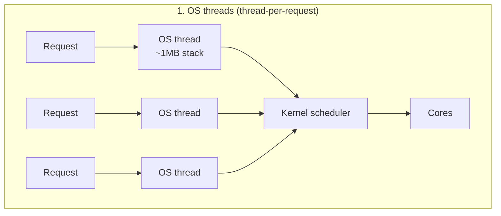
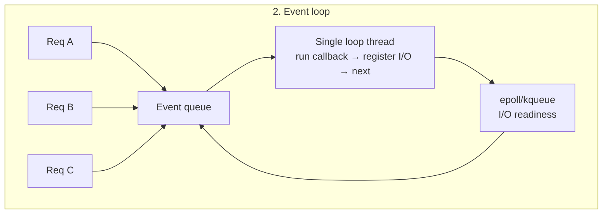
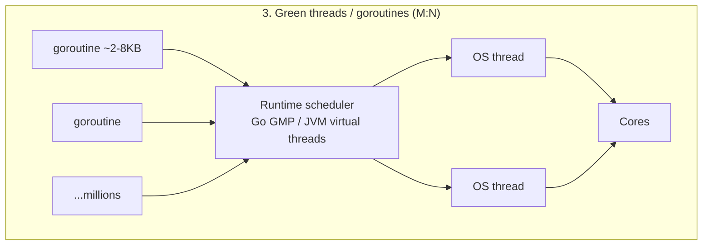
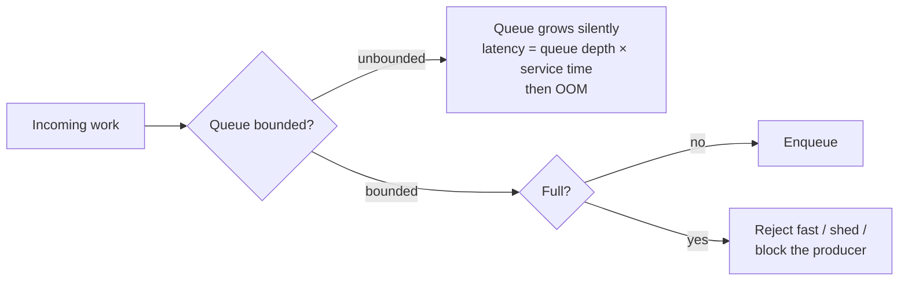

---
tags:
  - applied
  - interview-critical
---

# Concurrency Runtimes in Practice

[Concurrency](concurrency.md) covers the primitives — locks, races, atomics. This page is about the layer above: **how your language runtime maps concurrent work onto CPU cores**, why that choice decides your service's memory footprint and failure modes, and how to size thread pools instead of guessing.

---

## You'll see this when...

- A Java service falls over at ~5K concurrent requests while a Go service on the same hardware handles 500K
- A Node.js API's p99 explodes whenever one endpoint parses a large JSON payload
- A service deadlocks under load with all threads "busy" but zero CPU usage — and recovers the moment traffic drops
- Someone sets a thread pool to 200 "to be safe" and the database falls over instead
- Goroutine count (or virtual thread count) climbs forever in a dashboard until the process OOMs
- An interviewer asks "thread-per-request or event loop?" and expects more than a vibe

---

## The three models

All concurrency runtimes answer one question: **when a task blocks, who pays, and how much?**







### 1. OS threads — the JVM classic

One kernel thread per request. The kernel schedules; blocking is free *conceptually* — the thread just sleeps — but expensive *physically*:

```
Per-thread cost:
  Stack:            ~1MB reserved (JVM default; Linux pthread default 8MB virtual)
  Kernel structures: a few KB
  Context switch:    ~1-10µs + cache pollution (the hidden cost)

10,000 concurrent requests = 10,000 threads ≈ 10GB of stack reservation
plus a kernel scheduler juggling 10K runnables → switch overhead eats CPU
```

This is why classic Tomcat/Spring tops out around a few thousand concurrent connections: not CPU, **thread memory and scheduling overhead**. Simple mental model, terrible density.

### 2. Event loop — Node.js / libuv

One thread runs a loop: take a ready event, run its callback to completion, register interest in future I/O (via epoll/kqueue), repeat. I/O never blocks the thread — but **your callback owns the only thread while it runs**.

```
What blocks the Node event loop (and therefore every request in flight):
  - Synchronous CPU work: JSON.parse/stringify on big payloads, regex backtracking,
    crypto, compression, big array sorts
  - Sync fs APIs (readFileSync) — anything ending in "Sync"
  - Long microtask chains (a tight loop of resolved promises never yields)

What does NOT block it:
  - Network/disk I/O via async APIs (handled by epoll + libuv's small worker
    pool for fs/DNS/crypto)
```

**Concrete latency math** — why "don't block the event loop" is arithmetic, not folklore:

```
Endpoint A: parses a 10MB JSON body → JSON.parse takes ~100ms of pure CPU
Service also serves endpoint B: normally 2ms, at 200 req/s

One call to A arrives:
  For 100ms the loop runs nothing else.
  Requests to B arriving in that window: 200/s × 0.1s = 20 requests
  They queue: the last one waits ~100ms before its 2ms of work
  → B's p99 jumps from 2ms to ~100ms because of A's payload

At just 2 calls/s to endpoint A: 2 × 100ms = 200ms of blockage per second
  → the loop is blocked 20% of the time → every endpoint's tail inherits it
```

Escape hatches: `worker_threads` for CPU work (transfer `ArrayBuffer`s to avoid copy), chunked/streaming parse, or move the heavy endpoint to its own process. Detect blockage by measuring **event loop lag** (`perf_hooks.monitorEventLoopDelay()` — alert when p99 lag > a few ms).

### 3. Green threads — goroutines and Java virtual threads

M:N scheduling: millions of cheap runtime-managed tasks multiplexed onto ~`GOMAXPROCS` OS threads. You write blocking-style code; the **runtime**, not the kernel, parks the task at I/O points and reuses the OS thread.

**Go's GMP model:**

```
G — goroutine: the task, starts at a few KB of growable stack
M — machine:   an OS thread
P — processor: a scheduling context holding a run queue; #P = GOMAXPROCS

Each P has a local run queue (work-stealing from other Ps when empty).
G blocks on channel/network → parked, M picks the next G. Nearly free.
G blocks in a syscall      → M is detached and stuck in the kernel;
                              the runtime hands the P to another M.
Preemption: since Go 1.14, async preemption (signal-based) stops tight
            loops from hogging a P.
```

**Java virtual threads** (final since Java 21, the default choice for server work by 2026): same idea on the JVM. A virtual thread's stack lives on the heap; blocking I/O in JDK APIs unmounts it from its carrier thread. The thread-per-request programming model survives; the 1MB-per-thread cost doesn't. Remaining sharp edge: **pinning** — blocking inside native/`Object.wait` contexts can pin the carrier (synchronized-block pinning was fixed in JDK 24); diagnose with `-Djdk.tracePinnedThreads=full`.

---

## async/await across languages

Same keyword, very different machinery:

| Language | What `await` really is | Key implication |
|---|---|---|
| **Python (asyncio)** | Single-threaded event loop; coroutines yield at `await` | The GIL means even *threads* don't give CPU parallelism — asyncio is honest about it. One blocking call (sync `requests`, heavy CPU) freezes the loop, exactly like Node. CPU work → `ProcessPoolExecutor`. **3.13+ free-threading** (PEP 703, still opt-in `python3.13t` builds; maturing through 3.14) removes the GIL, making *threads* genuinely parallel — but doesn't change asyncio's single-loop rule. |
| **Rust** | Compile-time state machine; futures are inert until polled by an executor (tokio) | No runtime in the language — you pick one. Zero-cost tasks (~hundreds of bytes), but holding a non-`Send` type or a `std::sync::Mutex` guard across `.await` bites you. Blocking code must go via `spawn_blocking`. |
| **C#/.NET** | Tasks scheduled on the ThreadPool; `await` releases the thread | Mature and multi-threaded, but `.Result`/`.Wait()` on async code = classic sync-over-async deadlock and pool starvation. |
| **JS/Node** | Sugar over promises on the one loop | `await` yields to the loop; CPU between awaits still blocks everyone. |

**The colored functions problem** (Bob Nystrom's essay): async functions can call sync functions, but sync functions can't call async ones without ceremony — so `async` infects every caller up the stack, splits ecosystems into sync and async flavors of every library, and makes refactoring "make this one call async" a cross-cutting change. This is the strongest argument *for* the green-thread model: Go and Java virtual threads have **no colors** — everything looks blocking, the runtime does the yielding.

---

## Sizing thread pools — Little's law, not folklore

From [Queuing Theory](queuing-theory.md): concurrency needed `L = λ × W` (arrival rate × time in system).

```
Pool size ≈ QPS × avg latency (in seconds)

Service does 200 QPS, each request takes 50ms end-to-end:
  L = 200 × 0.05 = 10 concurrent requests on average
  → a pool of ~10-15 (headroom for variance) is enough. 200 is waste.
```

By workload type:

```
CPU-bound:   pool = #cores (maybe +1). More threads ≠ more CPU;
             extra threads just add context switches.

IO-bound:    pool = #cores × (1 + wait_time / compute_time)
             e.g. 8 cores, requests wait 90ms on I/O per 10ms of CPU:
             8 × (1 + 90/10) = 80 threads keeps cores busy.

Mixed:       split into two pools (CPU pool sized to cores, I/O pool sized
             by the formula) rather than one compromise pool.
```

Two ceilings override the math: **downstream capacity** (a 100-thread pool hammering a DB that allows 20 connections just moves the queue — see [Connection Pooling](../patterns/connection-pooling.md)) and **memory** (threads × stack size). With virtual threads/goroutines, you stop sizing for the runtime and size *semaphores* around scarce downstream resources instead.

---

## Backpressure at the runtime level

The executor's queue is where overload hides. From [Backpressure](../messaging/backpressure.md), applied to runtimes:



```
Unbounded executor death spiral:
  Downstream slows 2× → tasks complete at half rate → queue grows
  → every queued task waits longer → clients time out and RETRY
  → arrival rate goes UP as capacity goes down → queue grows faster
  → heap fills with queued Runnables → GC thrash → OOM

The service never "failed" — it just queued itself to death.
```

Rules that hold across runtimes:

- **Bound every queue.** Java: `ThreadPoolExecutor` with a bounded queue + a rejection policy you chose deliberately (`CallerRunsPolicy` = built-in backpressure; `AbortPolicy` = fail fast). Note: `ThreadPoolExecutor` only grows past core size *after* the queue is full — an unbounded queue means max pool size is never reached.
- Go: a buffered channel + fixed worker count *is* a bounded pool; `select` with `default` gives you reject-when-full.
- Node: limit concurrent in-flight work (e.g. `p-limit`); reject on event-loop lag.
- Cheap tasks don't repeal the rule: a semaphore in front of goroutines/virtual threads bounds *work admitted*, even though tasks themselves are nearly free.

---

## Common production failures

### 1. Thread pool exhaustion deadlock (nested blocking)

```java
// Pool of N threads. Task A, running IN the pool, submits task B
// to the SAME pool and blocks waiting for it:
Future<X> f = sharedPool.submit(subTask);   // called from inside sharedPool
return f.get();                              // blocks a pool thread

// Under load: all N threads are parent tasks blocked in f.get(),
// every subTask sits in the queue with no thread to run it.
// Deadlock — at 0% CPU, with all threads "active".
```

Telltale: thread dump shows all pool threads `WAITING` on futures; recovers when traffic drops. Fixes: never block a pool thread on work scheduled to the same pool — separate pools per dependency level, make the chain fully async, or use virtual threads (blocking unmounts instead of consuming a carrier).

### 2. Event loop starvation

The JSON.parse math above. Variants: regex catastrophic backtracking on user input, synchronous template rendering, `JSON.stringify` of a huge response. Telltale: *every* endpoint's p99 degrades together, correlated with one endpoint's traffic; event-loop-lag metric spikes. Fix: workers, streaming, or payload limits at the edge.

### 3. Goroutine (and virtual thread) leaks

```go
// Goroutine sends to a channel nobody will ever read:
func fetch(ctx context.Context) string {
    ch := make(chan string)            // unbuffered
    go func() { ch <- slowCall() }()   // leaks if we return early
    select {
    case v := <-ch:
        return v
    case <-ctx.Done():
        return ""                      // goroutine now blocked on send, forever
    }
}
// Fix: make(chan string, 1) — buffered send always completes.
```

Each leak holds its stack plus everything it references. Telltale: `runtime.NumGoroutine()` (or virtual thread count) climbs monotonically with traffic, never returning to baseline; memory follows. Monitor it like a file-descriptor count; `pprof`'s goroutine profile groups leaked stacks so the offending `select` is usually obvious.

---

## Comparison table

| Model | Memory / task | Blocking tolerance | Best for | Watch out |
|---|---|---|---|---|
| **OS threads** (classic JVM, Python threads) | ~1MB stack | High — blocking is the model | Moderate concurrency (<~1K), CPU-heavy work, simplest debugging | Memory and context-switch cost cap concurrency; pool sizing is on you |
| **Event loop** (Node, Python asyncio, Redis) | ~KB per pending callback/coroutine | **Zero** — one blocked callback stalls every request | High-concurrency I/O-bound work, gateways, fan-out | CPU work is poison; one bad payload degrades all endpoints; colored functions |
| **Green threads** (Go, Java 21+ virtual threads, Erlang) | ~2-10KB growable | High — runtime parks tasks at I/O | High concurrency *with* blocking-style code; the 2026 default for new server work | Leaks (forgotten tasks) replace pool exhaustion; pinning (JVM)/syscall-stuck Ms (Go); cheap tasks still need admission control |
| **async/await on a pool** (Rust tokio, C#) | ~100s of bytes (state machine) | Low-medium — must route blocking to dedicated threads | Maximum efficiency, predictable latency, systems work | Colored functions; accidental blocking in async context; steeper learning curve |

---

## Anti-patterns

| Anti-pattern | Why it hurts | Better |
|---|---|---|
| Sizing a pool by gut ("200 to be safe") | Wastes memory; overwhelms downstreams; hides the real concurrency need | Little's law: QPS × latency, then bound by downstream capacity |
| Unbounded executor queues | Queue absorbs overload silently until latency explodes, then OOM | Bounded queue + explicit rejection policy; shed load early |
| Blocking calls inside an event loop or async context | One callback stalls every in-flight request | Workers/`spawn_blocking`/process pool; monitor event-loop lag |
| Submitting to a pool and blocking on the result from inside that pool | Classic exhaustion deadlock at exactly full load | Separate pools per stage, fully async chains, or virtual threads |
| `.Result`/`.get()`/`runBlocking` bridging sync→async "just this once" | Sync-over-async deadlocks and starves the scheduler | Stay async end-to-end, or isolate on a dedicated thread |
| Spawning goroutines/virtual threads with no lifecycle owner | Leaks accumulate stacks and references until OOM | Tie every task to a context/scope (structured concurrency); watch task counts |
| One shared pool for CPU work and I/O work | The formulas conflict; CPU tasks starve while I/O threads idle | Separate, separately-sized pools |
| Treating "goroutines are cheap" as "no admission control needed" | A million cheap tasks still hammer one finite database | Semaphore/bounded channel in front of scarce resources |

---

## Quick reference

| Need | Reach for |
|---|---|
| Highest concurrency with blocking-style code | Go, or Java 21+ virtual threads |
| I/O-heavy gateway / BFF, JS team | Node event loop + worker_threads for any CPU work |
| Maximum per-task efficiency, predictable tails | Rust + tokio |
| CPU-bound pool size | `#cores` (+1) |
| I/O-bound pool size | `#cores × (1 + wait/compute)`, cross-checked with `QPS × latency` |
| Detect event loop blockage | `monitorEventLoopDelay()` (Node) / loop lag metric (asyncio debug mode) |
| Detect goroutine leaks | `runtime.NumGoroutine()` trend + pprof goroutine profile |
| Detect virtual-thread pinning | `-Djdk.tracePinnedThreads=full` (largely moot ≥ JDK 24) |
| CPU parallelism in Python | `ProcessPoolExecutor`; free-threaded 3.13+ builds where deps support it |
| Backpressure in Java executor | Bounded queue + `CallerRunsPolicy`/`AbortPolicy` |
| Backpressure in Go | Buffered channel as semaphore; `select` + `default` to reject |
| Bridging blocking code in Rust async | `tokio::task::spawn_blocking` |

---

## Interview angle

!!! tip "What interviewers are testing"
    Whether you understand what a runtime *does with a blocked task* — and whether you can size concurrency with arithmetic instead of adjectives. "Node is fast because async" is a red flag; the loop-blockage math and Little's law are green flags.

**Strong answer pattern:**

1. Frame it as "who pays when a task blocks": kernel thread asleep (1MB + context switches) vs event loop stalled (everyone waits) vs runtime parks a green thread (~KBs, nearly free)
2. Quantify the OS-thread ceiling: 10K threads ≈ 10GB stacks + scheduler overhead — that's why thread-per-request capped out, and what virtual threads/goroutines fixed
3. Show the event-loop math: 100ms of sync CPU at 200 QPS queues 20 requests behind it; every endpoint's tail inherits one endpoint's payload
4. Size pools with Little's law (QPS × latency), then state the real ceiling is downstream capacity, not the formula
5. Always mention bounded queues — unbounded executors convert overload into OOM via retry amplification
6. Name the failure mode of whichever model you pick: pool-exhaustion deadlock / loop starvation / task leaks

**Common follow-ups:**

- *"Why can Go handle a million goroutines but Java traditionally couldn't handle a million threads?"*
  > A goroutine starts with a few KB of growable, heap-managed stack and is scheduled in user space — parking it at an I/O point is a pointer swap, not a kernel transition. An OS thread reserves ~1MB of stack, costs kernel memory, and every block/wake is a context switch with cache pollution. A million goroutines ≈ a few GB; a million platform threads ≈ a terabyte of stack reservation and an unschedulable kernel run queue. Java 21+ virtual threads close exactly this gap with the same M:N trick.

- *"Your Node service's p99 spikes across all endpoints whenever one endpoint gets traffic. Diagnose."*
  > Cross-endpoint correlation is the signature of event-loop blockage: all requests share one thread. I'd check event-loop lag (`monitorEventLoopDelay`), then look at what that endpoint does synchronously — big `JSON.parse`/`stringify`, regex backtracking, sync crypto/compression. Fix by moving CPU work to `worker_threads`, streaming the parse, or capping payload size at the edge.

- *"How do you size a thread pool for a service doing 300 QPS where each request spends 5ms on CPU and 95ms waiting on a downstream API?"*
  > Little's law: 300 × 0.1s = 30 concurrent requests on average, so ~30-40 threads with headroom. The I/O-bound formula agrees: on 4 cores, 4 × (1 + 95/5) = 80 is an upper bound — but the binding constraint is the downstream: if it only tolerates 25 concurrent calls, the pool (or a semaphore) should be ~25 and the rest of the load should queue with a bound or shed.

- *"With virtual threads and goroutines being so cheap, do thread pools still matter?"*
  > Pools as a *thread-reuse* mechanism stop mattering — spawn freely. But pools as a *concurrency limit* were doing a second job: protecting downstream resources. That job moves to explicit semaphores, bounded channels, and connection pool limits. Unbounded admission of cheap tasks against a finite database is the new pool-exhaustion.

---

## Test yourself

??? question "A Java service's thread dump shows all 50 pool threads WAITING, CPU near 0%, queue full — and it recovers when traffic drops. What happened?"

    Thread pool exhaustion deadlock from nested blocking. Tasks running in the pool submitted subtasks to the same pool and blocked on `Future.get()`. Once all 50 threads are blocked parents, the subtasks they're waiting on sit in the queue with no thread to run them — a deadlock that needs full load to manifest, which is why light traffic "fixes" it. Resolve by never blocking a pool thread on the same pool: separate pools per stage, an end-to-end async chain, or virtual threads where blocking unmounts the carrier.

??? question "Do the math: a Node endpoint spends 80ms of synchronous CPU per call and gets 5 calls/second. What happens to a 3ms endpoint on the same service?"

    5 × 80ms = 400ms of every second the loop is blocked — 40% loop utilization by one endpoint's CPU work. The 3ms endpoint's requests that arrive during a block wait up to 80ms just to start; with blocks covering 40% of the timeline, roughly 40% of its requests see tens of milliseconds of queueing, so its p50 stays ~3ms but p95/p99 land near 80ms+. The fix is moving that CPU work to worker_threads or another process — no amount of "async" in the I/O helps, because the cost is CPU between awaits.

??? question "Explain Go's G, M, and P — and what happens differently when a goroutine blocks on a channel vs on a syscall."

    G is a goroutine (the task, KB-scale growable stack), M is an OS thread, P is a scheduling context with a local run queue; the number of Ps is GOMAXPROCS, and idle Ps steal work from busy ones. Channel/network/mutex blocking is handled in user space: the G is parked, the M immediately picks the next G from the P's queue — microsecond-cheap. A blocking *syscall* takes the M down with it into the kernel; the runtime detaches the P from the stuck M and hands it to another (possibly new) M so the other goroutines keep running. That's why a flood of blocking syscalls (cgo, file I/O on some systems) can balloon the OS thread count even in Go.

??? question "What is the colored functions problem, and which runtime model eliminates it?"

    In async/await languages, functions come in two "colors": sync and async. Async functions can call either, but sync functions can't call async ones without blocking or ceremony — so making one deep call async forces `async` annotations up the entire call chain, and ecosystems end up with parallel sync/async versions of every library (Python's `requests` vs `aiohttp`). Green-thread runtimes eliminate it: in Go or on Java virtual threads, all code is written blocking-style and the runtime parks tasks at I/O points, so there's nothing to color. Rust, C#, Python asyncio, and JS all live with colors as the price of explicit suspension points.

??? question "A service does 150 QPS with 200ms average latency, of which 10ms is CPU on an 8-core box. Size the worker pool and name the two ceilings that could override your number."

    Little's law: L = 150 × 0.2 = 30 concurrent requests on average — a pool of ~30-45 covers it with variance headroom. The I/O-bound formula gives the upper bound: 8 × (1 + 190/10) = 160 threads before cores idle, so 30-45 is comfortably inside it. Ceiling one: downstream capacity — if those 190ms are spent on a database that only handles 20 concurrent connections, the effective limit is 20 and extra workers just relocate the queue. Ceiling two: memory — at ~1MB stack per platform thread it's trivial here, but the same arithmetic at 10K concurrency is 10GB, which is the cue for virtual threads or goroutines plus a semaphore.

---

## Related

- [Concurrency](concurrency.md) — the primitives underneath: locks, races, atomics
- [OS Concepts](os-concepts.md) — threads, scheduling, context switches
- [Queuing Theory](queuing-theory.md) — Little's law and why queues explode near saturation
- [Throughput Limits](throughput-limits.md) — Amdahl's law and the serialized fraction
- [Backpressure](../messaging/backpressure.md) — flow control beyond the process boundary
- [Connection Pooling](../patterns/connection-pooling.md) — the downstream limit that really sizes your pool
