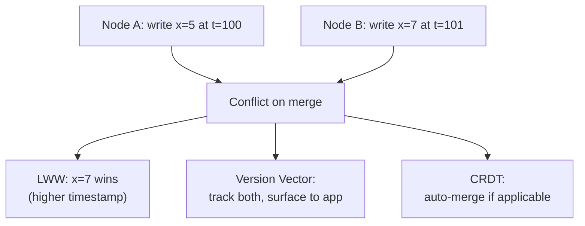

# Consistency Models

## What it is

A consistency model defines the rules a system makes about the order and visibility of reads and writes across multiple nodes. It answers: "If I write a value, when and where will others see it?"

This is the spectrum between **strong consistency** (everyone sees the latest write immediately) and **eventual consistency** (everyone will see it eventually, but maybe not now).

## The spectrum

```
Strict ←————————————————————————————————————→ Weak

Linearizability → Sequential → Causal → Read-your-writes → Eventual
```

### Linearizability (Strongest)

Every operation appears to take effect instantaneously at some point between its invocation and completion. The system behaves as if there is a single global copy of the data.

```
Timeline:
Client A: [write x=1]─────────────────────────┤
Client B:             [read x] → must return 1 │
```

- **Systems:** Single-node databases, etcd, Zookeeper, Redis (single instance)
- **Cost:** High — requires coordination across nodes for every operation
- **Use when:** Distributed locks, leader election, financial transactions

### Sequential Consistency

All operations appear to execute in some sequential order, and each client's operations appear in the order it issued them — but not necessarily in real-time order.

```
Client A: write(x=1), write(x=2)
Client B: read(x) → could return 1 or 2, but must see A's writes in order
```

- Weaker than linearizability — no real-time constraint
- Used in: CPU memory models, some distributed databases

### Causal Consistency

Operations that are causally related must be seen in causal order by all nodes. Concurrent (causally unrelated) operations may be seen in different orders.

```
A writes "post"
B reads "post", writes "reply"        ← causally depends on A's write
C must see "post" before "reply"      ← causal order preserved
D may see them in any order if it never saw the post ← concurrent
```

- **Systems:** MongoDB (causal sessions), DynamoDB (transaction tokens), Cosmos DB
- **Use when:** Social feeds, comment threads — order within a thread matters

### Read-Your-Writes (Session Consistency)

After you write a value, you will always read that value (or a later one) in the same session. Other clients may still see stale data.

```
User updates profile photo
User refreshes page → always sees new photo
Other users → may see old photo for a while
```

- **Systems:** DynamoDB (strongly consistent reads opt-in), most SQL DBs with sticky sessions
- **Use when:** User-facing writes — profile updates, settings, posts

### Monotonic Read Consistency

Once a client reads a value, it will never read an older value. Reads move forward in time, never backward.

```
Client reads x=5 at t=1
Client reads x=3 at t=2 → VIOLATION (not monotonic)
Client reads x=5 or x=7 at t=2 → OK
```

### Eventual Consistency (Weakest)

If no new updates are made to a key, eventually all reads will return the last written value. During updates, nodes may return stale data.

```
Write x=1 to Node A
Node A → Node B replication happens asynchronously
Read from Node B immediately → may return old value
Read from Node B after replication → returns x=1
```

- **Systems:** Cassandra (default), DynamoDB (default), DNS, CDN
- **Cost:** Low — no coordination needed, maximum availability
- **Use when:** Shopping carts, DNS, social feeds, analytics counters

## Comparison table

| Model | Guarantee | Latency Cost | Availability | Examples |
|---|---|---|---|---|
| Linearizability | Real-time global order | Highest | Lower | etcd, Zookeeper |
| Sequential | Per-client order, globally ordered | High | Medium | Single-leader DBs |
| Causal | Causal dependencies preserved | Medium | Higher | MongoDB sessions |
| Read-your-writes | Session-scoped freshness | Low | High | DynamoDB strong reads |
| Eventual | Eventually converges | Lowest | Highest | Cassandra, DNS |

## Conflict resolution in eventual consistency

When two nodes accept concurrent writes to the same key, a conflict arises on reconciliation.

**Strategies:**

| Strategy | How it works | Risk |
|---|---|---|
| Last-Write-Wins (LWW) | Wall clock timestamp determines winner | Clock skew causes data loss |
| Version vectors | Track causality per node | More complex, but accurate |
| CRDTs | Data structures that merge without conflicts | Limited to certain types (counters, sets) |
| Application-level merge | App handles conflicts (e.g. git merge) | Most flexible, most complex |



## Tunable consistency

Some systems let you choose per-operation:

**Cassandra:**
```sql
-- Write to all replicas (strong, slow)
INSERT INTO table ... USING CONSISTENCY ALL

-- Write to majority (balanced)
INSERT INTO table ... USING CONSISTENCY QUORUM

-- Write to one node (weak, fast)
INSERT INTO table ... USING CONSISTENCY ONE
```

**DynamoDB:**
```python
# Eventually consistent (default, cheaper)
table.get_item(Key={'id': '123'})

# Strongly consistent (2x read cost)
table.get_item(Key={'id': '123'}, ConsistentRead=True)
```

**Quorum formula:**
```
N = total replicas
W = write quorum
R = read quorum

Strong consistency: R + W > N
Example: N=3, W=2, R=2 → 2+2=4 > 3 ✓ (QUORUM in Cassandra)
```

## AWS equivalent

| Consistency level | AWS service/setting |
|---|---|
| Linearizable | DynamoDB Transactions, Aurora single-region |
| Causal | DynamoDB transactions (within a session) |
| Read-your-writes | DynamoDB `ConsistentRead=True` |
| Eventual | DynamoDB default, S3, ElastiCache |

## Interview angle

!!! tip "What interviewers are testing"
    They want to see you connect consistency to the specific data and user experience in the system being designed.

**Strong answer pattern:**
1. Identify the data — is it user-facing, financial, or analytics?
2. State the staleness tolerance — can the user see stale data for 1 second? 10 seconds?
3. Map to a model — read-your-writes for profile data, eventual for feed rankings, strong for balances
4. Mention the performance cost — strong consistency = more latency, less throughput

## Related topics

- [CAP Theorem](cap-theorem.md) — CP vs AP is a coarse version of this spectrum
- [Replication](../patterns/replication.md) — consistency model is determined by replication strategy
- [Caching](../storage/caching.md) — caches are explicitly eventually consistent with their source
