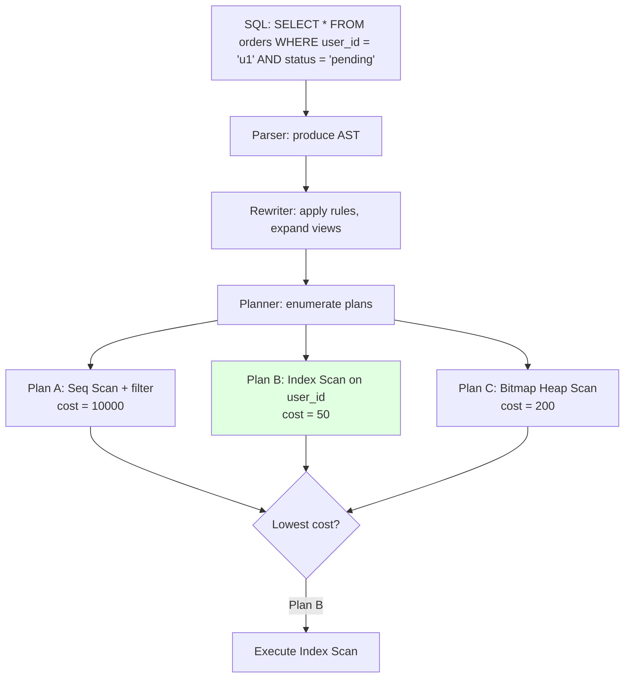

---
tags:
  - applied
  - interview-critical
---

# Database Internals: Query Planners, MVCC, and Vacuum

The encyclopedia covers B-tree vs LSM at a high level. Real production debugging needs the layer below: **how the query planner picks a plan**, **how MVCC actually works**, **why vacuum exists and how to tune it**. This page is Postgres-focused because it's the most common target, but the concepts apply to MySQL/InnoDB and most modern RDBMS.

For *what storage engines are*, see [Storage Engine Internals](storage-internals.md). This is the **applied** companion for "why is my query slow / why is my DB getting bloated."

---

## Why this matters at staff level

```
At junior level: "the DB is slow; add an index"
At senior level: "EXPLAIN shows a Seq Scan because the planner thinks Bitmap Heap Scan is cheaper above selectivity X; here's why"
At staff level: "the table is bloated 40% because of long-running transactions; here's how vacuum decides what to clean and why it isn't"
```

Most Postgres production incidents in year 2+ come from this layer. If you can't read `EXPLAIN ANALYZE` and reason about vacuum, you'll diagnose by guess.

---

## Part 1: The query planner

Postgres takes your SQL → builds a tree of possible execution plans → picks the cheapest one based on cost estimates.

### Steps the planner takes



### The scan types you'll see in EXPLAIN

| Scan type | When picked | What it does |
|---|---|---|
| **Seq Scan** | No index, or planner thinks scanning is cheaper | Reads every row in the table |
| **Index Scan** | Small result set; index covers the filter | Walks index B-tree, fetches matching rows |
| **Index Only Scan** | Query needs only indexed columns | No heap (table) access; very fast |
| **Bitmap Heap Scan** | Medium result set; multiple indexes combinable | Builds bitmap from index → fetches sorted by heap location |
| **Bitmap Index Scan** | Subordinate to Bitmap Heap Scan | Walks index, produces row-id bitmap |
| **Index Scan Backward** | `ORDER BY ... DESC` with matching index | Like Index Scan but reverse |

### Reading EXPLAIN ANALYZE

```sql
EXPLAIN (ANALYZE, BUFFERS, FORMAT TEXT)
SELECT * FROM orders WHERE user_id = 'u1' AND status = 'pending';
```

```
Index Scan using orders_user_id_idx on orders  (cost=0.42..8.45 rows=2 width=120) (actual time=0.024..0.029 rows=3 loops=1)
  Index Cond: (user_id = 'u1'::text)
  Filter: (status = 'pending'::text)
  Rows Removed by Filter: 7
  Buffers: shared hit=4
Planning Time: 0.182 ms
Execution Time: 0.054 ms
```

Reading this:

```
cost=0.42..8.45      ← planner's estimated cost: startup..total (arbitrary units)
rows=2               ← planner's estimated row count
width=120            ← average row width in bytes

actual time=0.024..0.029  ← actual: startup..total per loop, in ms
rows=3                    ← actual rows returned
loops=1                   ← how many times this node executed

Rows Removed by Filter: 7 ← rows that matched the Index Cond but failed Filter
                            (i.e., user_id matched, but status != 'pending')

Buffers: shared hit=4  ← read 4 8KB blocks from buffer pool (no disk)
                        "read" would mean from OS / disk
```

The key insight: **compare estimated rows to actual rows**. Massive divergence (e.g., estimate 10, actual 10M) means the planner is misled — usually outdated statistics.

### When the planner picks wrong

Most "planner picked wrong" problems trace to:

**1. Out-of-date statistics**

The planner uses sampled statistics about column value distributions. If a table has been changed significantly without `ANALYZE`, estimates are wrong.

```sql
-- Inspect statistics for a column
SELECT * FROM pg_stats WHERE tablename = 'orders' AND attname = 'user_id';
```

Run `ANALYZE` manually after bulk loads:

```sql
ANALYZE orders;
ANALYZE VERBOSE orders;  -- prints what it's doing
```

Autovacuum normally handles this. If you're bulk-loading, manual ANALYZE accelerates planning fixes.

**2. Correlated columns (extended statistics)**

Postgres assumes columns are independent. If two columns are correlated (e.g., `country` and `currency`), estimates are wrong.

```sql
-- Tell Postgres these are correlated
CREATE STATISTICS orders_country_currency 
  (dependencies) ON country, currency FROM orders;
ANALYZE orders;
```

**3. Wrong selectivity estimate**

The planner estimates how many rows match a WHERE clause. For `WHERE user_id = ?` with low-cardinality data, it might be wrong.

```sql
-- Check estimated vs actual via EXPLAIN ANALYZE
-- If "rows=10 (actual rows=10000)" → estimate way off
-- Fix: increase statistics target
ALTER TABLE orders ALTER COLUMN user_id SET STATISTICS 1000;
ANALYZE orders;
```

Default is 100 sample points; up to 10000 maximum. Higher = better estimates, slower ANALYZE, more memory.

**4. Index not used despite existing**

Common reasons:

- Implicit type cast: `WHERE id = '123'` when id is `bigint` → may skip index
- Function in WHERE: `WHERE LOWER(email) = '...'` → needs functional index
- Statistics suggest seq scan is cheaper (small table)
- Query returns large % of rows (>5-10% → seq scan often wins)

### Forcing a plan (when you must)

Don't do this lightly, but tools exist:

```sql
-- Disable specific scan types for a session (debugging only!)
SET enable_seqscan = OFF;
EXPLAIN ANALYZE SELECT ...;
RESET enable_seqscan;

-- Postgres doesn't have query hints natively; use pg_hint_plan extension
/*+ IndexScan(orders orders_user_id_idx) */
SELECT * FROM orders WHERE user_id = 'u1';
```

Better: fix the underlying cause (statistics, indexes, query shape).

### Practical EXPLAIN reading checklist

```
✓ Estimated rows ≈ actual rows? (within 2-3×)
✓ Buffer hits (shared hit) much higher than reads (shared read)?
✓ No "Rows Removed by Filter" with high count?
✓ No surprises (Seq Scan on big table without good reason)?
✓ Planning time + Execution time aligned with expectations?

Red flags:
✗ "rows=1 (actual rows=1000000)" — statistics broken
✗ "Rows Removed by Filter: 1000000" — index covers wrong columns
✗ "shared read=10000" — buffer pool too small or cold cache
✗ Heavy "Sort" or "Hash Join" with disk spill — work_mem too small
```

---

## Part 2: MVCC (Multi-Version Concurrency Control)

Postgres's secret weapon. Lets readers and writers not block each other. Also the root cause of most operational headaches.

### The basic mechanic

Every row has hidden columns:

```
       id | user_id |  data  | xmin | xmax | ctid
       1  |   u1    |  ...   |  100 |    0 | (0,1)
       2  |   u2    |  ...   |  101 |    0 | (0,2)
```

- `xmin` — transaction ID that created this row version
- `xmax` — transaction ID that deleted/superseded this row version (0 = still alive)
- `ctid` — physical location (page,offset)

When you `UPDATE` row 1:

```
       id | user_id |  data  | xmin | xmax | ctid
       1  |   u1    |  old   |  100 |  200 | (0,1)   ← old version, marked deleted by txn 200
       1  |   u1    |  new   |  200 |    0 | (0,3)   ← new version, current
```

The old version is **not removed**. It stays until vacuum cleans it up.

### Why this is brilliant

```
Reader at txn 150: sees row version (0,1) — "user_id=u1, data=old"
Reader at txn 200: sees row version (0,3) — "user_id=u1, data=new"
Reader at txn 250: sees row version (0,3)

Neither reader blocks the writer. The writer doesn't block readers.
Each transaction sees a consistent "snapshot" defined by visible xmin/xmax range.
```

This is **how Postgres implements isolation without locks**.

### Snapshot visibility rules

A row version is visible to transaction T if:

```
1. xmin < T's snapshot horizon (the creating txn is "in the past")
2. xmin was committed (not aborted, not in-flight)
3. xmax > T's snapshot horizon OR xmax = 0 (not deleted yet from T's perspective)
4. OR xmax was the creating txn's own delete (rolled back somehow)
```

The actual rules are more nuanced (HOT updates, hint bits, freezing) but this captures the core.

### Long-running transactions are the enemy

```
T1 starts at txn 100, runs for 4 hours (a long-running analytical query)
Meanwhile: UPDATE/DELETE operations on the same tables create new versions
Old versions cannot be removed (T1 might still need them)
Result: massive bloat
```

This is the **#1 cause of mysterious Postgres slowdowns** in production. A pg_dump, an idle BEGIN; that no one rolled back, a stuck analytics query — all can block vacuum from cleaning anything.

### Inspecting MVCC state

```sql
-- See all in-flight transactions
SELECT pid, state, xact_start, query 
FROM pg_stat_activity 
WHERE state IN ('active', 'idle in transaction')
ORDER BY xact_start;

-- Oldest transaction in the system
SELECT now() - xact_start AS age, pid, query 
FROM pg_stat_activity 
WHERE xact_start IS NOT NULL
ORDER BY xact_start LIMIT 1;
```

If you see "idle in transaction" for hours: **that's your bloat villain**. Find the application that started a transaction and never committed.

### Common MVCC pitfalls

**Idle in transaction from app pool**

```python
# Bad: connection from pool with implicit transaction not committed
conn = pool.get()
cur = conn.cursor()
cur.execute("SELECT ...")  # implicit BEGIN
# ... worker fails, connection returned to pool without commit
# Transaction stays open
```

Fix: explicit `conn.commit()` or `with conn:` context manager. Configure `idle_in_transaction_session_timeout`:

```sql
ALTER SYSTEM SET idle_in_transaction_session_timeout = '30s';
SELECT pg_reload_conf();
```

After 30s of idle-in-transaction, Postgres kills the connection.

**Long analytical queries on the OLTP DB**

Solution: read replica for analytics. Long queries on the replica don't block vacuum on the primary.

**Replication slots accumulating WAL**

A logical replication slot for CDC keeps WAL files until consumed. Slow consumer → WAL grows on disk:

```sql
-- Inspect slots
SELECT slot_name, active, restart_lsn, 
       pg_wal_lsn_diff(pg_current_wal_lsn(), restart_lsn) AS lag_bytes
FROM pg_replication_slots;
```

If lag_bytes is huge: consumer is behind. Either speed up consumer or drop the slot.

---

## Part 3: Vacuum — the unsung hero

Vacuum reclaims space from dead row versions. Without it, your tables grow forever.

### What VACUUM does

```
1. Scans each table page
2. For each tuple, checks if xmin/xmax indicates it's "dead" (no active transaction can see it)
3. Marks dead tuples' space as reusable for future inserts/updates
4. Updates the Visibility Map (which pages are all-visible to all txns)
5. Updates the Free Space Map (which pages have room for inserts)
```

VACUUM **doesn't return space to OS** (unless VACUUM FULL). It marks space reusable within the table file.

### VACUUM vs VACUUM FULL

```
VACUUM (regular):
  - Marks dead tuples as reusable
  - No table-level lock; runs concurrently with reads/writes
  - File size on disk doesn't shrink
  - This is what autovacuum runs

VACUUM FULL:
  - Rewrites the table without dead tuples
  - ACCESS EXCLUSIVE lock; blocks everything
  - File size shrinks to actual data
  - Expensive; use only when truly needed (use pg_repack instead for production)
```

### Autovacuum

Autovacuum runs in the background, automatically. Triggers based on thresholds:

```
Vacuum threshold = vacuum_base_threshold + vacuum_scale_factor * table_rows
Defaults:
  vacuum_base_threshold = 50 rows
  vacuum_scale_factor = 0.2 (20%)
  
For a 10M row table: vacuum runs after ~2M dead tuples (20%)
```

**This default is wrong for large tables.** A 100M row table won't vacuum until 20M dead tuples — by then, performance has degraded for hours.

### Tuning autovacuum

For high-write tables, lower the threshold:

```sql
ALTER TABLE orders SET (
  autovacuum_vacuum_scale_factor = 0.05,  -- 5% instead of 20%
  autovacuum_vacuum_threshold = 1000,      -- baseline
  autovacuum_analyze_scale_factor = 0.025
);
```

Also make autovacuum more aggressive system-wide:

```sql
-- More workers (default 3 — often too few)
ALTER SYSTEM SET autovacuum_max_workers = 6;

-- Faster vacuum (more I/O bandwidth per round)
ALTER SYSTEM SET autovacuum_vacuum_cost_limit = 2000;  -- default 200

-- Reload
SELECT pg_reload_conf();
```

### Monitoring vacuum

```sql
-- Bloat per table (rough)
SELECT 
  schemaname, tablename,
  n_dead_tup, n_live_tup,
  round(100.0 * n_dead_tup / NULLIF(n_live_tup + n_dead_tup, 0), 1) AS pct_dead
FROM pg_stat_user_tables
WHERE n_dead_tup > 1000
ORDER BY pct_dead DESC NULLS LAST
LIMIT 10;

-- Last vacuum / autovacuum
SELECT 
  schemaname, tablename,
  last_vacuum, last_autovacuum,
  last_analyze, last_autoanalyze,
  n_dead_tup
FROM pg_stat_user_tables
WHERE schemaname = 'public'
ORDER BY last_autovacuum DESC NULLS LAST;
```

`> 20% dead tuples` is concerning. `> 50%` is broken.

### When VACUUM can't run

```sql
-- Show currently-blocking transactions
SELECT 
  pid, 
  now() - xact_start AS age,
  state,
  query 
FROM pg_stat_activity 
WHERE backend_xmin IS NOT NULL
ORDER BY backend_xmin
LIMIT 5;

-- The oldest backend_xmin is the constraint on vacuum
```

If autovacuum runs but doesn't reduce dead tuples → something is holding back the **xmin horizon**. Common culprits:
- Long-running transaction (see Part 2)
- Stale replication slot
- `hot_standby_feedback = on` on a replica with a long query

### pg_repack — the production hero

When you need to reclaim disk space without `VACUUM FULL`'s lock:

```bash
pg_repack -h prod-db -d orders_db -t orders
```

`pg_repack` rebuilds the table online (no exclusive lock; uses triggers to track changes during rebuild). Production-safe.

---

## Part 4: Lock types and contention

Postgres has many lock types beyond "row locked" / "table locked."

### Lock hierarchy

```
Lock types (lighter → heavier):
  ACCESS SHARE                — SELECT
  ROW SHARE                   — SELECT FOR UPDATE / FOR SHARE
  ROW EXCLUSIVE               — INSERT, UPDATE, DELETE
  SHARE UPDATE EXCLUSIVE      — VACUUM (non-FULL), ANALYZE, CREATE INDEX CONCURRENTLY
  SHARE                       — CREATE INDEX (non-concurrent)
  SHARE ROW EXCLUSIVE         — rare
  EXCLUSIVE                   — REFRESH MATERIALIZED VIEW CONCURRENTLY
  ACCESS EXCLUSIVE            — DROP TABLE, TRUNCATE, ALTER TABLE, VACUUM FULL
```

Two lock requests can coexist only if **none of them conflict**.

The trap: `ALTER TABLE ADD COLUMN` takes `ACCESS EXCLUSIVE` — blocks **everything** on that table, including SELECTs.

### Online migrations to avoid ACCESS EXCLUSIVE

```sql
-- BAD: blocks all reads/writes
ALTER TABLE orders ADD COLUMN tracking_code TEXT NOT NULL DEFAULT '';

-- GOOD: short locks, no full rewrite
ALTER TABLE orders ADD COLUMN tracking_code TEXT;             -- instant
ALTER TABLE orders ALTER COLUMN tracking_code SET DEFAULT ''; -- instant
-- Backfill in batches (no lock):
UPDATE orders SET tracking_code = '' WHERE tracking_code IS NULL LIMIT 1000;
-- Eventually add NOT NULL constraint via a CHECK constraint (NOT VALID first)
ALTER TABLE orders ADD CONSTRAINT tracking_code_not_null
  CHECK (tracking_code IS NOT NULL) NOT VALID;
ALTER TABLE orders VALIDATE CONSTRAINT tracking_code_not_null;
```

See [Database Operations at Scale](database-operations-at-scale.md) for the full playbook.

### Inspecting current locks

```sql
-- What's locked right now
SELECT 
  pid,
  locktype,
  relation::regclass,
  mode,
  granted
FROM pg_locks
WHERE NOT granted
ORDER BY pid;

-- Blocking chains (who blocks whom)
SELECT 
  blocked_locks.pid AS blocked_pid,
  blocked_activity.query AS blocked_query,
  blocking_locks.pid AS blocking_pid,
  blocking_activity.query AS blocking_query
FROM pg_catalog.pg_locks blocked_locks
JOIN pg_catalog.pg_stat_activity blocked_activity ON blocked_activity.pid = blocked_locks.pid
JOIN pg_catalog.pg_locks blocking_locks 
  ON blocking_locks.locktype = blocked_locks.locktype
  AND blocking_locks.relation = blocked_locks.relation
  AND blocking_locks.pid != blocked_locks.pid
JOIN pg_catalog.pg_stat_activity blocking_activity ON blocking_activity.pid = blocking_locks.pid
WHERE NOT blocked_locks.granted;
```

When the DB feels stuck, run this. The blocker is at the top of the chain.

---

## Part 5: Connection pooling beyond "use pgbouncer"

Connection pooling matters because each Postgres backend uses ~10-15MB of memory plus prepared statement memory plus work_mem allocations.

### Three pgbouncer modes

```
Session pooling:    Client keeps connection until disconnect
                    Backend assigned 1:1
                    OK for low concurrency; defeats pooling

Transaction pooling: Client gets backend per transaction (BEGIN..COMMIT)
                    Most common; great for typical web apps
                    Cannot use prepared statements (without care)
                    Cannot use LISTEN/NOTIFY across transactions
                    Cannot use SET (other than within txn)

Statement pooling:  Client gets backend per statement
                    Most aggressive sharing
                    Breaks most apps (no transactions)
                    Rare
```

**Default to transaction pooling.** Configure your app to commit appropriately.

### Sizing the pool

```
Total Postgres connections = max_connections
Reserve some for admin / superuser
Subtract that → available for pgbouncer

pgbouncer's pool_size per database × N pgbouncer instances ≤ available

App connections → pgbouncer is unlimited (well, limited by pgbouncer's max_client_conn)
```

Example:

```
Postgres max_connections = 200
Reserve = 10
Available = 190

pgbouncer pool_size = 50, 2 pgbouncer instances = 100 backend conns used
Plenty of headroom

App side: 100 app servers × 20 conns each = 2000 app conns
All multiplexed onto 100 backend conns through pgbouncer
```

### Connection limits in cloud Postgres

```
AWS RDS db.m6i.large:           ~83 connections (limit ≈ DBInstanceClass-based)
AWS RDS db.r6g.xlarge:           ~600 connections
Aurora reduces limits more aggressively per instance class

Without pgbouncer, you'll hit "too many connections" at modest scale.
```

---

## Part 6: WAL and checkpointing

Write-Ahead Log is how Postgres guarantees durability + enables replication.

### What WAL does

```
Every write → WAL record first (sequential write; fast)
Eventually → data pages flushed to disk (random writes; slow)
On crash → replay WAL since last checkpoint to recover
```

WAL is the source of truth during crash recovery. Replication is just streaming WAL to another node.

### Checkpoint tuning

A checkpoint flushes dirty pages to disk. Frequent checkpoints = lots of I/O; infrequent = long recovery on crash.

```sql
-- Defaults are usually too conservative for modern hardware
ALTER SYSTEM SET checkpoint_timeout = '15min';        -- default 5min
ALTER SYSTEM SET max_wal_size = '10GB';                -- default 1GB
ALTER SYSTEM SET min_wal_size = '2GB';                 -- default 80MB
ALTER SYSTEM SET checkpoint_completion_target = 0.9;   -- spread the I/O
```

Monitor checkpoint frequency:

```sql
SELECT * FROM pg_stat_bgwriter;
-- checkpoints_timed vs checkpoints_req
-- Want timed >> requested (requested = forced by max_wal_size; means too small)
```

### WAL archive for PITR

For point-in-time recovery, archive WAL segments to S3:

```sql
ALTER SYSTEM SET archive_mode = 'on';
ALTER SYSTEM SET archive_command = 'aws s3 cp %p s3://my-wal-bucket/%f';
```

Now you have: base backup + continuous WAL → recover to any moment in time.

---

## Part 7: Common production debugging scenarios

### Scenario: "Postgres CPU pegged, slow queries"

```sql
-- Step 1: What's running now?
SELECT pid, now() - query_start AS duration, state, query
FROM pg_stat_activity
WHERE state = 'active'
ORDER BY duration DESC;

-- Step 2: Which queries consume the most resources?
SELECT 
  query, calls, total_exec_time,
  total_exec_time / calls AS avg_ms,
  rows / calls AS avg_rows
FROM pg_stat_statements
ORDER BY total_exec_time DESC
LIMIT 10;

-- Step 3: Get EXPLAIN for the worst offender
EXPLAIN (ANALYZE, BUFFERS) ...the slow query...;
```

`pg_stat_statements` is the most important Postgres extension. Enable it always.

### Scenario: "Table is huge but only N rows"

Bloat. Run vacuum or pg_repack.

```sql
-- Check bloat ratio
SELECT 
  schemaname, tablename,
  pg_size_pretty(pg_total_relation_size(schemaname || '.' || tablename)) AS total_size,
  n_live_tup, n_dead_tup,
  round(100.0 * n_dead_tup / NULLIF(n_live_tup + n_dead_tup, 0), 1) AS pct_dead
FROM pg_stat_user_tables
ORDER BY pg_total_relation_size(schemaname || '.' || tablename) DESC
LIMIT 10;
```

If pct_dead > 30%: vacuum, or rebuild with pg_repack.

### Scenario: "Replication lag growing"

```sql
-- On primary
SELECT 
  client_addr, state, sent_lsn, write_lsn, flush_lsn, replay_lsn,
  pg_wal_lsn_diff(sent_lsn, replay_lsn) AS replay_lag_bytes
FROM pg_stat_replication;

-- On replica
SELECT 
  pg_is_in_recovery(),
  now() - pg_last_xact_replay_timestamp() AS replay_lag_seconds;
```

Causes: replica CPU bound, replica disk slow, network bandwidth, lock conflicts on replica.

### Scenario: "Connections exhausted"

```sql
-- Count by state
SELECT state, count(*) FROM pg_stat_activity GROUP BY state;
-- Look for many "idle in transaction"

-- Kill an idle-in-transaction backend
SELECT pg_terminate_backend(pid)
FROM pg_stat_activity
WHERE state = 'idle in transaction'
  AND now() - state_change > interval '5 minutes';
```

Long-term fix: configure `idle_in_transaction_session_timeout` and use pgbouncer.

---

## Practical observability stack

```
Essential extensions:
  pg_stat_statements    — query-level performance stats
  pg_stat_user_tables   — table-level read/write stats (built-in)
  pg_locks              — current locks (built-in)
  pg_stat_activity      — current connections (built-in)
  auto_explain          — auto-log EXPLAIN for slow queries

External tooling:
  pganalyze / Datadog DB / DataDog APM — dashboard the above
  pgwatch2 — open-source monitoring
  pg_top — top-like for Postgres processes
```

Enable `pg_stat_statements` and `auto_explain` from day 1. Without them you're flying blind.

```sql
-- Auto-log queries running > 1s
ALTER SYSTEM SET auto_explain.log_min_duration = '1s';
ALTER SYSTEM SET auto_explain.log_analyze = on;
ALTER SYSTEM SET auto_explain.log_buffers = on;
```

---

## Quick reference card

```
"Query slow"            → EXPLAIN ANALYZE; check estimated vs actual rows
"DB CPU pegged"         → pg_stat_statements top by total_exec_time
"Table bloated"         → check n_dead_tup; vacuum or pg_repack
"Connections exhausted" → kill idle-in-transaction; pgbouncer; raise limits
"Vacuum not working"    → check pg_stat_activity for old backend_xmin
"Replication lag"       → pg_stat_replication; replica too slow / locked
"Lock contention"       → pg_locks; find blocking chain
"Schema migration scary" → never ALTER ADD NOT NULL DEFAULT; staged migration
```

---

## What this teaches you

After internalising this, you can:

- Read `EXPLAIN ANALYZE` and reason about why the planner picked a plan
- Spot the difference between "DB is slow" and "this specific query is slow"
- Diagnose mysterious bloat from long-running transactions
- Tune autovacuum for real workloads (not just defaults)
- Write safe schema migrations under load
- Choose connection pooling modes appropriately
- Investigate "the database is acting weird" with specific queries

This is the layer where junior engineers ask senior engineers for help. Owning it is a real staff-level marker.

---

## Beyond Postgres

The concepts generalise:

| Postgres concept | MySQL/InnoDB equivalent | Oracle equivalent |
|---|---|---|
| MVCC via xmin/xmax | MVCC via undo log | MVCC via UNDO tablespace |
| Vacuum | Purge / undo cleanup | Automatic Undo Management |
| pg_stat_statements | Performance Schema | AWR / Statspack |
| EXPLAIN ANALYZE | EXPLAIN ANALYZE / EXPLAIN FORMAT=JSON | EXPLAIN PLAN / DBMS_XPLAN |
| pg_repack | pt-online-schema-change | Online Redefinition |
| Autovacuum | Purge thread (auto) | Background tasks |

Different mechanics, same problems. The skills transfer.

---

## Interview angle

!!! tip "What interviewers are testing"
    Whether you can debug a production DB issue past "we'll add an index" — actual reasoning about planner, MVCC, and vacuum.

**Strong answer pattern:**
1. EXPLAIN ANALYZE shows estimated vs actual; divergence = stats stale or correlated columns
2. Most production "DB is slow" is missing index, bad query, or bloat — diagnose specifically
3. Long-running transactions block vacuum → bloat → more slow → vicious cycle
4. Autovacuum defaults are too lazy for large tables; tune per-table
5. Connection pooling with pgbouncer in transaction mode is the default
6. pg_stat_statements + auto_explain are non-negotiable from day 1

**Common follow-up:** *"Our Postgres has been getting slower for weeks. What do you check?"*
> Hit the diagnostic checklist: pg_stat_statements for which queries got slower; pg_stat_user_tables for dead tuple ratios; pg_stat_activity for long-running transactions or idle-in-transaction. The most common culprits in week-2+ of production are: bloat from long transactions blocking vacuum, autovacuum falling behind on growing tables, missing indexes on queries that now hit larger data, or replication slots accumulating WAL. Each has a specific signature in those queries.

---

## Related

- [Storage Engine Internals](storage-internals.md) — B-tree vs LSM at conceptual level
- [Database Indexes](database-indexes.md) — index types and usage
- [Database Transactions & Isolation](isolation-levels.md) — what MVCC enables
- [Database Operations at Scale](database-operations-at-scale.md) — online migrations, backups, capacity
- [Performance Engineering Discipline](../observability/performance-engineering.md) — profiling beyond just SQL
- [Connection Pooling](../patterns/connection-pooling.md) — pooler internals
