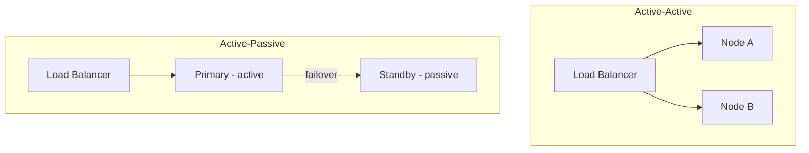

# Fault Tolerance & Resilience

A fault-tolerant system continues operating correctly when components fail. Resilience is the ability to recover. At scale, failures are not exceptional — they are the steady state.

> *"Everything fails all the time."* — Werner Vogels, CTO of Amazon

---

## Failure taxonomy

Not all failures are equal. Know the type before choosing a mitigation.

| Failure type | Description | Example |
|---|---|---|
| **Crash failure** | Node stops and stays stopped | Process killed, OOM, kernel panic |
| **Omission failure** | Node stops sending/receiving messages | Network interface down |
| **Timing failure** | Response arrives too late | Slow GC pause, disk I/O spike |
| **Byzantine failure** | Node behaves arbitrarily / sends corrupt data | Hardware bit flip, malicious node |
| **Network partition** | Two groups of nodes can't communicate | Switch failure, datacenter link cut |

Crash failures are the easiest to handle. Byzantine failures are the hardest — most systems assume crash failures and tolerate Byzantine faults only in blockchain/consensus systems.

---

## Fault tolerance strategies

### Redundancy

The foundation of fault tolerance: have more than one copy.

```
Active-Active:   Both nodes handle traffic. If one fails, the other absorbs load.
Active-Passive:  One handles traffic, one stands by. Failover on failure.
N+1:             N nodes needed, N+1 deployed. One can fail without degradation.
N+2:             Two can fail simultaneously.
```



### Replication

Redundancy for data: keep multiple copies on different nodes.

| Type | Consistency | Latency | Failure tolerance |
|---|---|---|---|
| **Synchronous** | Strong — all replicas updated before ack | Higher write latency | No data loss |
| **Asynchronous** | Eventual — replicas may lag | Low write latency | Possible data loss on failover |
| **Semi-synchronous** | One replica must ack (MySQL) | Medium | Bounded data loss |

### Timeouts

Every network call must have a timeout. Without one, a slow dependency hangs your thread forever.

```python
import requests

# Never do this — will hang indefinitely if the service is slow
response = requests.get("http://payment-service/charge")

# Always set timeouts
response = requests.get(
    "http://payment-service/charge",
    timeout=(3.0, 10.0)   # (connect_timeout, read_timeout) in seconds
)
```

**Timeout sizing:**
- Too short → false positives, reject valid slow requests
- Too long → threads pile up waiting for a dead service
- Rule of thumb: P99 latency × 2, capped at a business-reasonable limit (e.g., 5s for user-facing)

### Retries with backoff

Retry transient failures, but not blindly.

```python
import time
import random

def call_with_retry(fn, max_attempts=3, base_delay=0.5):
    for attempt in range(max_attempts):
        try:
            return fn()
        except TransientError as e:
            if attempt == max_attempts - 1:
                raise
            # Exponential backoff with jitter
            delay = base_delay * (2 ** attempt) + random.uniform(0, 0.5)
            time.sleep(delay)
```

**Retry only transient errors:** Don't retry 400 Bad Request or 404 Not Found — those won't succeed.

See [Retry & Timeout](../patterns/retry-timeout.md) and [Backoff Strategies](../patterns/backoff.md) for full coverage.

---

## Failure detection

How does a system know a node has failed?

### Heartbeats

Nodes periodically send "I'm alive" signals. If a heartbeat is missed for N intervals, the node is declared failed.

```
Node A → heartbeat every 1s → Monitor
Monitor: last heartbeat 3s ago → Node A suspected dead (timeout: 3s)
```

**Tradeoff:** Short timeout = fast detection but false positives. Long timeout = slow detection but fewer false positives.

### Health checks

External probes check if a service responds correctly:

```yaml
# Kubernetes liveness probe
livenessProbe:
  httpGet:
    path: /healthz
    port: 8080
  initialDelaySeconds: 10
  periodSeconds: 5
  failureThreshold: 3   # restart after 3 consecutive failures
```

Three layers of health:
- **Liveness:** Is the process running? (Restart if not)
- **Readiness:** Is it ready to serve traffic? (Remove from load balancer if not)
- **Startup:** Has it finished initializing? (Don't kill during slow boot)

See [Failure Detection](../distributed/failure-detection.md) for distributed algorithms.

---

## Degraded modes & graceful degradation

A resilient system degrades gracefully — it keeps working at reduced capacity rather than failing completely.

```
Full capability:          Search + recommendations + personalization
Degraded (cache miss):    Search + recommendations (no personalization)
Degraded (DB overload):   Search only (cached results)
Degraded (worst case):    Static "sorry, try again later" page
```

### Feature flags for degradation

```python
def get_recommendations(user_id):
    if feature_flags.is_enabled("recommendations"):
        try:
            return recommendation_service.get(user_id, timeout=0.5)
        except (TimeoutError, ServiceUnavailableError):
            pass
    # Fallback: return popular items
    return cache.get("popular_items") or []
```

### Circuit Breaker

Stops calling a failing service to give it time to recover:

```
Closed → Calls pass through
Open   → Calls fail fast (no attempt) — service is recovering
Half   → Test calls: if they succeed, close again
```

See [Circuit Breaker](../patterns/circuit-breaker.md) for full implementation.

---

## Bulkhead pattern

Isolate failures so one component can't bring down the entire system. Named after watertight compartments in ships.

```
Without bulkhead:
  Slow payment service → threads pile up → all threads exhausted → entire API crashes

With bulkhead:
  Payment service gets its own thread pool (max 20 threads)
  If it exhausts: only payment calls fail, rest of API unaffected
```

```python
from concurrent.futures import ThreadPoolExecutor

# Separate thread pools per downstream service
payment_pool = ThreadPoolExecutor(max_workers=20)
inventory_pool = ThreadPoolExecutor(max_workers=50)
search_pool = ThreadPoolExecutor(max_workers=100)
```

See [Bulkhead](../patterns/bulkhead.md) for full coverage.

---

## Single Points of Failure (SPOF)

A SPOF is any component whose failure causes total system failure. Eliminate them.

| Common SPOFs | Solution |
|---|---|
| Single database node | Primary + replicas, automatic failover |
| Single load balancer | Active-active pair, DNS failover |
| Single region | Multi-region deployment, global load balancing |
| Single DNS provider | Multiple DNS providers |
| Single availability zone | Deploy across multiple AZs |
| Shared database for all services | Per-service databases (microservices) |

**Design principle:** For every component ask: *"What happens if this fails?"* If the answer is "total outage," it's a SPOF.

---

## Availability math

| Availability | Downtime/year | Downtime/month |
|---|---|---|
| 99% (2 nines) | 87.6 hours | 7.3 hours |
| 99.9% (3 nines) | 8.76 hours | 43.8 minutes |
| 99.99% (4 nines) | 52.6 minutes | 4.4 minutes |
| 99.999% (5 nines) | 5.26 minutes | 26 seconds |

**Series systems** (all must work): `A_total = A1 × A2 × A3`
- Three 99.9% services in series: `0.999³ = 99.7%`

**Parallel systems** (any can fail): `A_total = 1 - (1-A1) × (1-A2)`
- Two 99% services in parallel: `1 - (0.01 × 0.01) = 99.99%`

This is why **redundancy dramatically improves availability** — parallel components multiply the uptime.

---

## Chaos engineering

Deliberately inject failures to verify resilience holds. If you don't test failures, you don't know if your fault tolerance actually works.

```
Principles of Chaos (Netflix):
1. Hypothesize about steady-state behavior
2. Vary real-world events (kill an instance, inject latency)
3. Run experiments in production (start in non-prod)
4. Automate experiments to run continuously
```

Tools: **Chaos Monkey** (kill random EC2), **Gremlin**, **AWS Fault Injection Simulator**

---

## Interview angle

!!! tip "Fault tolerance in system design interviews"
    - *"What's your strategy for high availability?"* → Redundancy + health checks + automatic failover + multi-AZ deployment. Quote the nines you're targeting and what downtime budget that gives you.
    - *"What happens if your database goes down?"* → Read replicas for reads, standby replica with automatic failover for writes. Recovery time objective (RTO) and recovery point objective (RPO).
    - *"How do you prevent a slow dependency from taking down your service?"* → Timeouts, circuit breaker, bulkhead thread pools, retry with backoff. Fail fast, fail gracefully.

## Related topics

- [Availability & Reliability](availability.md) — SLOs, failure budgets, nines
- [Circuit Breaker](../patterns/circuit-breaker.md) — fail-fast protection
- [Bulkhead](../patterns/bulkhead.md) — isolation to contain failures
- [Retry & Timeout](../patterns/retry-timeout.md) — safe retry strategies
- [Failure Detection](../distributed/failure-detection.md) — distributed failure detection algorithms
- [Replication](../patterns/replication.md) — redundancy for data
