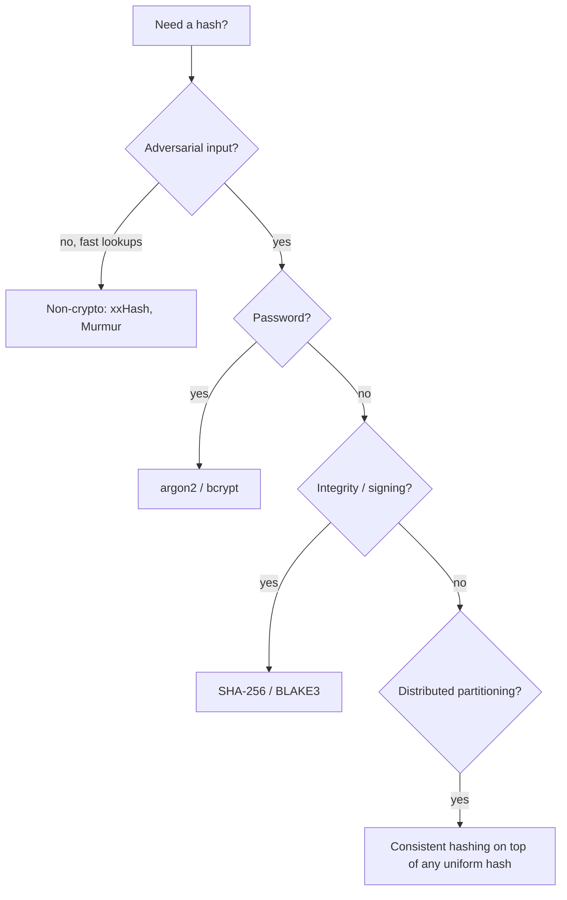

# Hashing

Hashing turns arbitrary data into a fixed-size value used for lookup, integrity, partitioning, and identification. The same word covers wildly different goals: O(1) hash maps, content-addressable storage, password hashing, distributed sharding. The right hash function depends on which goal you're after.

---

## What a hash function is

A function `h: input → fixed-size output` such that:

- **Deterministic**: same input → same output
- **Uniform**: outputs spread evenly across the output range
- **Fast** (for non-cryptographic uses)

Different goals require different additional properties.

---

## Three families of hash functions

| Family | Output size | Speed | Properties | Examples |
|---|---|---|---|---|
| **Non-cryptographic** | 32-128 bits | Very fast (GB/s) | Uniform, deterministic | xxHash, MurmurHash, CityHash, FNV |
| **Cryptographic** | 256-512 bits | Slower (100s MB/s) | Pre-image resistance, collision resistance | SHA-256, SHA-3, BLAKE3 |
| **Password hashing** | Variable | Intentionally slow | Resistant to brute force, uses salt | bcrypt, scrypt, argon2 |

Picking the wrong family is a classic mistake: SHA-256 in a hot inner loop wastes cycles; MurmurHash for password storage is a security hole.

---

## Hash maps

The most common use. `(key, value)` pairs stored in a table indexed by `hash(key) mod N`:

```
Table size N = 16
Insert ("alice", 42)
  hash("alice") = 0x9c8a4f...
  index = 0x9c8a4f... mod 16 = 7
  Table[7] = ("alice", 42)
```

**Collisions** are inevitable (pigeonhole principle). Two strategies:

### Chaining

Each bucket is a linked list:

```
Table[7] → ("alice", 42) → ("eve", 17) → null
```

Simple. Cache-unfriendly (pointer chasing). Java's older `HashMap` used this.

### Open addressing

Buckets hold one entry; collisions probe to nearby buckets:

```
Linear probing:    Table[7], Table[8], Table[9], ...
Quadratic probing: Table[7], Table[7+1], Table[7+4], Table[7+9], ...
```

Better cache behaviour. Modern hash maps (Rust `HashMap`, Go `map`, Python `dict`, Java `HashMap` since 8 with treeification) use open addressing or hybrid schemes.

### Load factor

`load = occupancy / capacity`. Above ~0.7-0.85, collisions explode. Hash maps **resize** (double capacity, rehash) when load is exceeded — amortised O(1), occasional O(n) rehash.

---

## Hash function quality

```
Bad hash:  hash("alice") = 7, hash("alicia") = 7, hash("bob") = 7
            → all entries in Table[7] → degraded to linked list scan
            
Good hash: outputs spread uniformly across [0, 2^64)
            → minimal collisions, even with adversarial inputs
```

**MurmurHash3, xxHash, CityHash** are good general-purpose choices for in-process hash maps.

---

## Hash flooding (DoS via collisions)

If an attacker controls keys and knows your hash function, they can craft inputs that all hash to the same bucket, degrading O(1) lookup to O(n).

Mitigation:

- **Randomised hashing**: process startup picks a random seed (Python, Java, Go, Rust all do this)
- **Tree-based fallback** for high-collision buckets (Java HashMap since Java 8)
- **Cryptographic hashes** (SipHash) when adversarial input is the threat (rare for hot paths)

---

## Cryptographic hashes

Three properties beyond uniformity:

| Property | Definition |
|---|---|
| **Pre-image resistance** | Given `h(x)`, can't compute `x` |
| **Second pre-image resistance** | Given `x`, can't find `x' ≠ x` with `h(x) = h(x')` |
| **Collision resistance** | Can't find any `x, x'` with `h(x) = h(x')` |

These let you treat the hash as a **fingerprint** of the data.

| Algorithm | Output | Status |
|---|---|---|
| MD5 | 128 bits | Broken (collisions) — never use for security |
| SHA-1 | 160 bits | Broken (collisions) — never use for security |
| SHA-256 / SHA-512 | 256 / 512 bits | Standard, secure |
| SHA-3 | 256+ bits | Different design (Keccak); also secure |
| BLAKE2 / BLAKE3 | Variable | Faster than SHA-256, secure |

For new code: **SHA-256** is the safe default. **BLAKE3** if you want speed too.

### Use cases

- **Content addressing**: Git commits, IPFS, deduplication — file ID = hash of contents
- **Integrity**: download a file, compare its hash to a published value
- **HMAC**: keyed hash for authenticated messages
- **Digital signatures**: sign the hash, not the message
- **Bloom filter / probabilistic structures**: need uniformity + speed (BLAKE3 is great here)

---

## Password hashing

Cryptographic hashes are *too fast* for passwords. An attacker with the hash can compute billions per second on GPUs.

Password hashes are **deliberately slow** and **memory-hard**:

| Algorithm | Properties |
|---|---|
| **bcrypt** | CPU-bound; long-standing default; up to 72-byte limit |
| **scrypt** | Memory-hard (defeats GPUs better) |
| **argon2** | Modern; tunable memory + parallelism; OWASP-recommended |
| **PBKDF2** | Older; CPU-only; still used in some standards |

```python
import argon2
hasher = argon2.PasswordHasher(time_cost=3, memory_cost=65536, parallelism=4)
hash = hasher.hash("user_password")
hasher.verify(hash, "user_password")  # True or raises
```

Always use **per-user salt** (built into modern algorithms). Never use SHA-256 or MD5 for passwords.

---

## Consistent hashing

Standard `hash(key) mod N` partitioning fails when N changes (add/remove a node) — almost every key remaps to a new bucket.

Consistent hashing maps both keys and nodes onto a ring; each key goes to the next node clockwise:

```
       hash("alice") → 0x3a
       hash("bob")   → 0x7c

Ring (sorted):
       Node-A @ 0x10
       Node-B @ 0x40
       Node-C @ 0x90

"alice" (0x3a) → Node-B (0x40)
"bob"   (0x7c) → Node-C (0x90)

Add Node-D @ 0x60:
"alice" → Node-B (still)
"bob"   → Node-C (still)
Only keys in (0x40, 0x60] move from Node-C to Node-D
```

Used by Cassandra, DynamoDB, Memcached clients, Akamai, sharded caches. See [Consistent Hashing](../patterns/consistent-hashing.md).

**Virtual nodes** are the practical refinement: each physical node owns many ring positions. Spreads load more evenly and reduces hot spots.

---

## Cryptographic hash performance

Throughputs on modern CPU:

```
SHA-256:    ~500 MB/s   (with hardware acceleration)
SHA-256:    ~150 MB/s   (without)
SHA-3:      ~250 MB/s
BLAKE3:     ~3-5 GB/s   (parallel, SIMD)
xxHash:     ~30 GB/s    (non-cryptographic)
MurmurHash: ~5 GB/s     (non-cryptographic)
```

For inner-loop hashing of millions of small keys, the difference between MurmurHash and SHA-256 is 60×.

---

## HMAC

Hash-based Message Authentication Code: combine a secret key with a message and hash. Attackers can't forge without the key.

```python
import hmac, hashlib
mac = hmac.new(key=b"secret", msg=b"data", digestmod=hashlib.sha256).hexdigest()
```

Used in:

- **JWT signatures** (HS256 = HMAC-SHA-256)
- **AWS Signature v4** (request signing)
- **Webhook authentication** (verify the message came from Stripe, GitHub, etc.)
- **API authentication** (request signing)

Critical: use `hmac.compare_digest` for comparison — constant-time to prevent timing attacks.

---

## Merkle trees

Hashes of hashes:

```
                   h(h1+h2+h3+h4)
                  /              \
              h(h1+h2)          h(h3+h4)
              /     \           /      \
            h1      h2        h3       h4
            ↑       ↑         ↑        ↑
          chunk1  chunk2   chunk3   chunk4
```

Properties:

- **Verifiable inclusion**: prove `chunk2` is in the tree by revealing `h1` and `h(h3+h4)`. Verifier rebuilds the root hash.
- **Tamper detection**: any byte change anywhere → root hash changes.
- **Efficient sync**: compare root hashes; if different, descend; identify which subtrees differ.

Used in:

- **Git** (commit = hash of tree of hashes of contents)
- **Bitcoin / blockchains** (transaction integrity)
- **Cassandra anti-entropy** (compare merkle trees of partitions)
- **DynamoDB internal repair**
- **Certificate Transparency**

---

## Common mistakes

| Mistake | Consequence |
|---|---|
| Using MD5 / SHA-1 for security | Broken; collisions can be crafted |
| SHA-256 for password storage | Brute-forceable; use argon2/bcrypt |
| `==` for HMAC comparison | Timing attack leaks valid prefix |
| Non-cryptographic hash for adversarial input | Hash flooding DoS |
| Reusing salt across users | Defeats salting purpose |
| `hash(key) mod N` for sharding | Resharding moves nearly all keys |
| Cryptographic hash for in-process hash map | Wasted CPU; non-crypto is fine and faster |

---

## Picking the right hash



---

## Interview angle

!!! tip "What interviewers are testing"
    Whether you can match hash-function choice to the problem, not default to "I'll use SHA-256."

**Strong answer pattern:**
1. Three families: non-crypto (lookups), crypto (integrity/signing), password-specific (slow + salted)
2. Hash maps use non-crypto + open addressing or chaining; resize when load exceeds ~0.75
3. Consistent hashing solves resharding pain in distributed systems
4. HMAC for authenticated messages; constant-time compare
5. Merkle trees for efficient integrity verification

**Common follow-up:** *"Why does Bitcoin use SHA-256 twice?"*
> SHA-256d (double SHA-256) is a defense against length-extension attacks against Merkle-Damgård hash constructions. Bitcoin uses it for both block hashing and Merkle trees of transactions. Modern hashes like SHA-3 and BLAKE3 don't have the length-extension weakness, but Bitcoin was designed when SHA-2 was the obvious choice and committed to it.

---

## Related topics

- [Consistent Hashing](../patterns/consistent-hashing.md) — distributed partitioning with hashing
- [Probabilistic Data Structures](probabilistic-data-structures.md) — Bloom filters use multiple hashes
- [Encryption](../security/encryption.md) — pairs with hashing for crypto primitives
- [Sharding](../patterns/sharding.md) — hash-based partitioning
- [Database Indexes](database-indexes.md) — hash indexes
