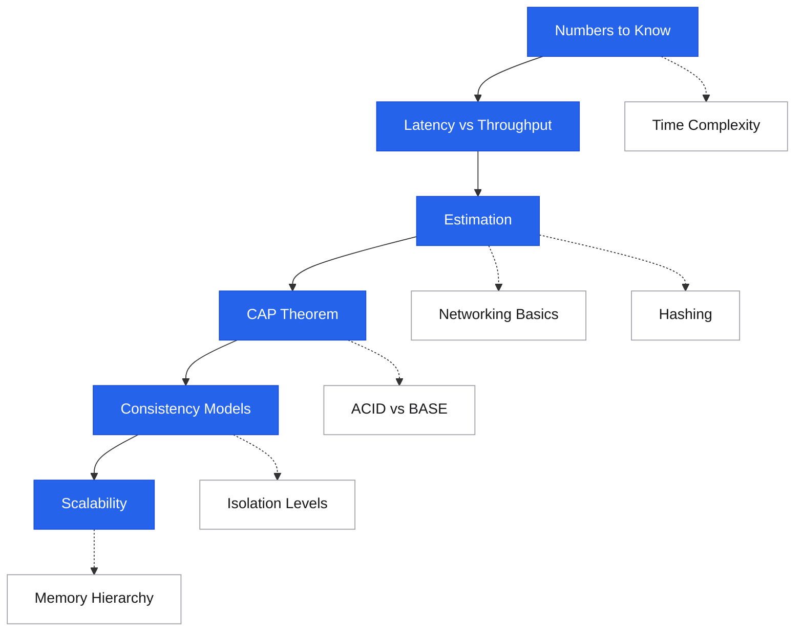

# Fundamentals

Foundations · the bedrock
The concepts every other section builds on — numbers, hardware, OS, networking, data structures, distributed theory. Without working intuition here, every higher-level decision (which database, which cache, which protocol) is guessing.

## Roadmap

Follow the spine top-to-bottom your first time. Dashed branches hang off the topic they support — grab them when you need them.

## Suggested reading order

New to this topic? Read these in order — each builds on the previous:

1. [Numbers Every Engineer Should Know](numbers-to-know.md) — latency intuition is the foundation for every other judgment call
2. [Latency vs Throughput](latency-throughput.md) — the core tension behind most design trade-offs
3. [Back-of-Envelope Estimation](estimation.md) — turn those numbers into QPS, storage, and bandwidth sizing
4. [CAP Theorem](cap-theorem.md) — the constraint that shapes every distributed-system choice
5. [ACID vs BASE](acid-vs-base.md) — the two transactional worldviews you'll choose between
6. [Consistency Models](consistency-models.md) — the full spectrum between strong and eventual
7. [Database Transactions & Isolation](isolation-levels.md) — what databases actually guarantee under concurrency
8. [Scalability](scalability.md) — horizontal vs vertical, and where bottlenecks hide

**Then, as needed (reference):** [Networking Basics](networking-basics.md), [Hashing](hashing.md), [Time Complexity Cheatsheet](time-complexity.md), [Data Encoding & Serialization](serialization.md), [Compression](compression.md), [Database Indexes](database-indexes.md), [Operating System Concepts](os-concepts.md), [TLS and Certificates](tls-certificates.md)

**Advanced — come back later:** [Queuing Theory & Little's Law](queuing-theory.md), [Throughput Limits (Amdahl's & USL)](throughput-limits.md), [Memory Hierarchy & Cache Lines](memory-hierarchy.md), [Memory Models & Cache Coherency](memory-models.md), [Concurrency & Locking](concurrency.md), [Storage Engine Internals](storage-internals.md), [Failure Modes Catalogue](failure-modes.md), [Hot Partitions & Hotspots](hot-partitions.md), [CAP Theorem Applied](cap-theorem-applied.md)

## Numbers & Estimation

Quick math, latency intuition, and the throughput / queueing principles that underpin all capacity decisions.

<a class="pcard" href="numbers-to-know/">Numbers Every Engineer Should KnowLatency reference table — RAM, SSD, disk, network</a>
<a class="pcard" href="latency-throughput/">Latency vs ThroughputThe tension that shapes most design choices</a>
<a class="pcard" href="queuing-theory/">Queuing Theory & Little's LawWhy systems get slow before they fail</a>
<a class="pcard" href="estimation/">Back-of-Envelope EstimationQPS, storage, bandwidth on a napkin</a>
<a class="pcard" href="time-complexity/">Time Complexity CheatsheetBig-O for the data structures you actually use</a>

## Hardware & OS

The layer beneath your runtime. Memory hierarchy explains every latency number; the OS layer explains every weird performance issue.

<a class="pcard" href="memory-hierarchy/">Memory Hierarchy & Cache LinesWhy locality dominates Big-O in practice</a>
<a class="pcard" href="disk-ssd-internals/">Disk and SSD InternalsSequential vs random; fsync; write amplification</a>
<a class="pcard" href="os-concepts/">Operating System ConceptsProcesses, threads, syscalls, page cache, FDs</a>
<a class="pcard" href="memory-models/">Memory Models & Cache CoherencyWhy concurrent code is hard; happens-before</a>

## Networking

The wire and what runs over it. Most distributed-systems performance issues trace back here.

<a class="pcard" href="networking-basics/">Networking BasicsOSI, IP, TCP/UDP at a glance</a>
<a class="pcard" href="tcp-udp-deep-dive/">TCP/UDP Deep DiveHandshake, slow start, head-of-line blocking</a>
<a class="pcard" href="tls-certificates/">TLS and CertificatesHandshake, PKI, mTLS, modern best practices</a>

## Data

Encoding, hashing, compression, indexing, storage internals, probabilistic structures. Everything about representing and accessing data.

<a class="pcard" href="hashing/">HashingThree families: non-crypto, crypto, password</a>
<a class="pcard" href="compression/">Compressiongzip, zstd, brotli, lz4 — when each wins</a>
<a class="pcard" href="encoding-pitfalls/">Encoding PitfallsEndianness, UTF-8, Base64, varints</a>
<a class="pcard" href="serialization/">Data Encoding & SerializationJSON, Protobuf, Avro, MessagePack</a>
<a class="pcard" href="probabilistic-data-structures/">Probabilistic Data StructuresBloom filters, HyperLogLog</a>
<a class="pcard" href="database-indexes/">Database IndexesB-tree, hash, partial, composite</a>
<a class="pcard" href="storage-internals/">Storage Engine InternalsB-tree vs LSM-tree internals</a>

## Reliability & Consistency Theory

The properties and constraints that govern multi-node systems. For the *mechanisms* that implement these properties — consensus, leader election, locks, clocks, CRDTs — see [Distributed Systems](../distributed/index.md).

<a class="pcard" href="acid-vs-base/">ACID vs BASETwo transactional models</a>
<a class="pcard" href="cap-theorem/">CAP TheoremThe C/A choice during partitions</a>
<a class="pcard" href="consistency-models/">Consistency ModelsStrong → eventual and the spectrum between</a>
<a class="pcard" href="isolation-levels/">Database Transactions & IsolationRead committed, snapshot, serializable, write skew</a>
<a class="pcard" href="scalability/">ScalabilityHorizontal vs vertical; bottlenecks</a>
<a class="pcard" href="throughput-limits/">Throughput Limits (Amdahl's & USL)Why doubling cores doesn't double throughput</a>
<a class="pcard" href="availability/">Availability & Reliability9s, MTBF, MTTR</a>
<a class="pcard" href="fault-tolerance/">Fault Tolerance & ResilienceDesigning for failure</a>
<a class="pcard" href="failure-modes/">Failure Modes CatalogueCrash, omission, gray failure, cascading</a>
<a class="pcard" href="concurrency/">Concurrency & LockingMutexes, atomics, lock-free patterns</a>
<a class="pcard" href="hot-partitions/">Hot Partitions & HotspotsWhen sharding doesn't help</a>

## Reading paths

| If you have... | Read first |
|---|---|
| 30 minutes | numbers-to-know, CAP theorem, latency-throughput |
| 2 hours | + queuing theory, isolation levels, memory hierarchy, hashing |
| A weekend | + everything in Hardware & OS + Reliability & Consistency Theory |

## Interview shortlist

| Question | Section |
|---|---|
| *"What's the latency of a memory access vs a disk read?"* | Numbers, Memory Hierarchy |
| *"Explain CAP."* | CAP Theorem |
| *"What's the difference between read committed and serializable?"* | Isolation Levels |
| *"Why does TCP take a round trip before sending data?"* | TCP Deep Dive |
| *"What's a bloom filter and where would you use one?"* | Probabilistic Data Structures |
| *"Why doesn't doubling the servers double the throughput?"* | Throughput Limits |
| *"What's gray failure?"* | Failure Modes |
| *"How does a hash map handle collisions?"* | Hashing, Time Complexity |
