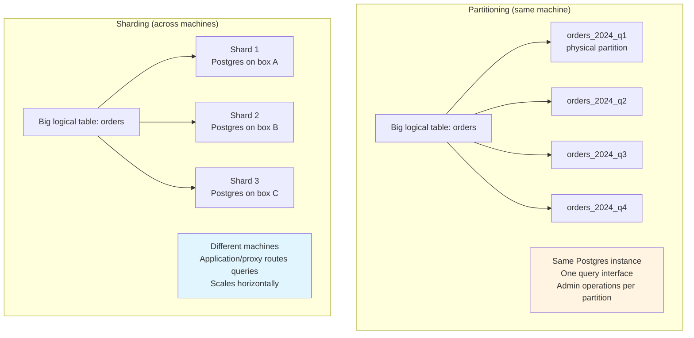
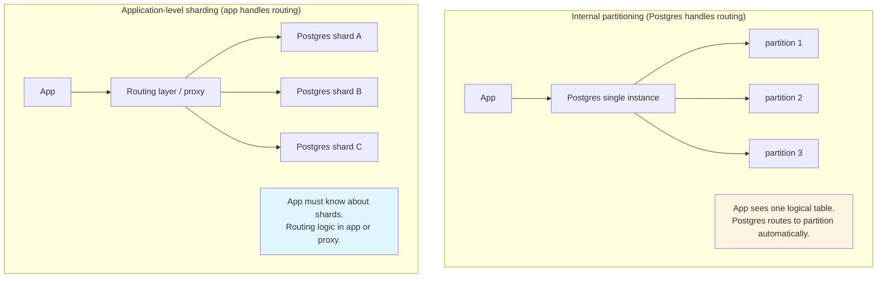

---
tags:
  - for-scale
  - applied
---

# Partitioning Fundamentals

People conflate "partitioning" and "sharding" — they're related but not the same. Partitioning is the **broader concept** (any way of splitting data); sharding is one specific strategy (splitting across machines for scale). This page covers the full picture: what partitioning is, the strategies, when each fits, and how it differs from sharding.

---

## What partitioning is

**Partitioning** is dividing a logical dataset into smaller physical pieces. Why:

- **Performance**: smaller tables = faster queries, smaller indexes
- **Manageability**: drop a partition instead of `DELETE FROM big_table` (much faster)
- **Scale**: distribute across machines (then it's also sharding)
- **Locality**: keep related data together for query efficiency
- **Lifecycle**: archive or compress old partitions independently

Partitioning can happen at **multiple levels**:

```
Single database, one table:
  → Internal partitioning (Postgres, MySQL native partitioning)
  → Same machine, divided table; admin & query benefits

Single database, multiple tables/schemas:
  → Vertical partitioning (split columns) or by tenant/feature
  → Same machine still

Multiple databases / multiple machines:
  → Horizontal partitioning = sharding
  → Different machines; scale benefits
```

The term **"partitioning" alone usually means same-machine logical partitioning**; **"sharding" means across machines**. But Kafka calls its shards "partitions," Cassandra calls them "partitions," DynamoDB calls them "partitions" too. The vocabulary is inconsistent.

---

## Partitioning vs sharding — the actual difference



| | Partitioning | Sharding |
|---|---|---|
| **Where data lives** | Same machine | Different machines |
| **Why** | Query speed, manageability | Scale beyond one machine |
| **Query interface** | Same — DB does the routing | Application or proxy routes |
| **Joins across partitions** | Free (same DB) | Hard (cross-shard) |
| **Adding capacity** | Add disk | Add servers, rebalance |
| **Failure unit** | Whole DB | One shard |
| **Examples** | Postgres native partitioning, MySQL partitioning | Cassandra, DynamoDB, Vitess |

Many systems do both: shard across machines, and **within each shard**, partition for query efficiency. Cassandra is the canonical example — a row's "partition" is its physical clustering on disk; multiple partitions live on each shard.

---

## Horizontal vs vertical partitioning

### Horizontal partitioning (split rows)

```
Original orders table:
  order_id | user_id | amount | created_at
  1        | u1      | 100    | 2024-01-05
  2        | u2      | 200    | 2024-01-08
  3        | u1      | 50     | 2024-02-15
  ... (10M rows)

Horizontally partitioned by created_at:
  orders_2024_01 → 1M rows
  orders_2024_02 → 1.5M rows
  orders_2024_03 → 1.8M rows
  ...
```

Every partition has the **same schema**, different rows. This is what people usually mean by "partitioning."

### Vertical partitioning (split columns)

```
Original users table:
  user_id | name | email | bio | preferences_json | avatar_blob | last_login
  1       | ...  | ...   | ... | ...              | <500KB>     | ...
  ...

Vertical partition:
  users_hot:    user_id, name, email, last_login        (small, indexed, fast)
  users_warm:   user_id, bio, preferences_json          (medium)
  users_cold:   user_id, avatar_blob                    (large, infrequent access)
```

Different schemas, related by key. Used to:
- Keep hot data small (most queries don't need bio + avatar)
- Avoid bloat on the main table from rarely-accessed large fields
- Separate access patterns (admin queries vs user queries)

**Less common than horizontal**, but useful when one table has heterogeneous columns with different access frequencies.

---

## Horizontal partitioning strategies

### 1. Range partitioning

Split by a contiguous range of a key.

```sql
-- Postgres example
CREATE TABLE orders (
    order_id BIGSERIAL,
    user_id BIGINT,
    amount NUMERIC,
    created_at TIMESTAMP
) PARTITION BY RANGE (created_at);

CREATE TABLE orders_2024_q1 PARTITION OF orders
    FOR VALUES FROM ('2024-01-01') TO ('2024-04-01');

CREATE TABLE orders_2024_q2 PARTITION OF orders
    FOR VALUES FROM ('2024-04-01') TO ('2024-07-01');
```

**Good for:**
- Time-series data (most common use case)
- Queries that filter by the range (`WHERE created_at BETWEEN ...`)
- Lifecycle operations (drop old partition = drop old data)

**Watch out for:**
- Hot partition if all writes go to "current" range (e.g., new orders all hit `q4`)
- Mitigate by sub-partitioning (range + hash combo)

### 2. List partitioning

Split by discrete values.

```sql
CREATE TABLE customers (
    customer_id BIGINT,
    region TEXT,
    name TEXT
) PARTITION BY LIST (region);

CREATE TABLE customers_us PARTITION OF customers FOR VALUES IN ('US', 'CA');
CREATE TABLE customers_eu PARTITION OF customers FOR VALUES IN ('GB', 'DE', 'FR');
CREATE TABLE customers_apac PARTITION OF customers FOR VALUES IN ('JP', 'SG', 'AU');
```

**Good for:**
- Region-based data
- Tenant isolation in multi-tenant systems
- Different retention policies per category

**Watch out for:**
- Uneven distribution (US has 80% of users)
- New values require new partitions (`other` catch-all helps)

### 3. Hash partitioning

Apply a hash function to the partition key.

```sql
CREATE TABLE events (
    event_id BIGINT,
    user_id BIGINT,
    payload JSONB
) PARTITION BY HASH (user_id);

CREATE TABLE events_p0 PARTITION OF events FOR VALUES WITH (MODULUS 4, REMAINDER 0);
CREATE TABLE events_p1 PARTITION OF events FOR VALUES WITH (MODULUS 4, REMAINDER 1);
CREATE TABLE events_p2 PARTITION OF events FOR VALUES WITH (MODULUS 4, REMAINDER 2);
CREATE TABLE events_p3 PARTITION OF events FOR VALUES WITH (MODULUS 4, REMAINDER 3);
```

**Good for:**
- Even distribution regardless of key skew
- High-write workloads where you want load spread
- No natural range (e.g., random user IDs)

**Watch out for:**
- Range queries hit every partition (no locality)
- Adding partitions is expensive (rehash needed) — use **consistent hashing** for the sharding-across-machines variant

### 4. Composite partitioning (range + hash)

Combine strategies: range on one dimension, hash on another.

```sql
-- Range by time, then hash by user within each time range
CREATE TABLE events (
    event_id BIGINT,
    user_id BIGINT,
    created_at TIMESTAMP
) PARTITION BY RANGE (created_at);

CREATE TABLE events_2024_q1 PARTITION OF events
    FOR VALUES FROM ('2024-01-01') TO ('2024-04-01')
    PARTITION BY HASH (user_id);

CREATE TABLE events_2024_q1_p0 PARTITION OF events_2024_q1
    FOR VALUES WITH (MODULUS 4, REMAINDER 0);
CREATE TABLE events_2024_q1_p1 PARTITION OF events_2024_q1
    FOR VALUES WITH (MODULUS 4, REMAINDER 1);
-- ... etc
```

**Good for:**
- Time-series with high write rate per period — spreads writes within a time bucket
- Avoids the "all writes hit current partition" problem
- Cassandra and DynamoDB do this naturally with composite primary keys (partition key + clustering key)

### 5. Geographic partitioning

Partition by region for **data residency** or **locality**.

```sql
-- Each region's data lives in that region's database
CREATE TABLE users_eu (...);  -- in EU Postgres cluster
CREATE TABLE users_us (...);  -- in US Postgres cluster
```

**Good for:**
- GDPR / data residency requirements
- Latency optimisation (serve user from their region)
- Regulatory compliance per country

**Watch out for:**
- Cross-region queries are expensive
- Schema migrations must be coordinated across regions
- User moving between regions is complex

---

## Time-series partitioning — the most common pattern

Time-series data is ~50% of partitioning use cases. The pattern:

```sql
-- Postgres native partitioning by month
CREATE TABLE metrics (
    timestamp TIMESTAMP NOT NULL,
    metric_name TEXT NOT NULL,
    value DOUBLE PRECISION
) PARTITION BY RANGE (timestamp);

-- Create partitions in advance for the next 12 months
CREATE TABLE metrics_2026_05 PARTITION OF metrics
    FOR VALUES FROM ('2026-05-01') TO ('2026-06-01');

CREATE TABLE metrics_2026_06 PARTITION OF metrics
    FOR VALUES FROM ('2026-06-01') TO ('2026-07-01');
-- ... etc
```

**Why it works**:

```
Queries usually filter by recent time:
  SELECT AVG(value) FROM metrics 
  WHERE timestamp > NOW() - INTERVAL '1 hour'
  
Without partitioning: full table scan of 10TB
With partitioning: scan only the current month's partition (50GB)
                   → ~200× faster
```

**Lifecycle**:

```sql
-- Drop old data — instant
DROP TABLE metrics_2024_01;

-- vs DELETE: slow, locks rows, leaves bloat
DELETE FROM metrics WHERE timestamp < '2024-02-01';
```

`DROP TABLE` for a partition is **near-instant** because it's a separate table. `DELETE` rewrites everything. Time-series partitioning's biggest benefit isn't query speed — it's making data lifecycle operations fast.

**Tools that automate this**:

- **TimescaleDB**: Postgres extension that auto-creates partitions, compresses old ones, drops old ones
- **pg_partman**: Postgres extension for time-based partition management
- **AWS Timestream**: managed time-series DB; partitioning hidden from you
- **InfluxDB / ClickHouse**: time-series-native, partitioning built in

---

## Internal partitioning vs application-level sharding

A subtle but important distinction:



| | Internal partitioning | Application sharding |
|---|---|---|
| Query syntax | Same `SELECT * FROM orders WHERE...` | Routes through application |
| Cross-partition queries | Free | Hard (see [Querying Sharded Data](../patterns/querying-sharded-data.md)) |
| Adding capacity | Add disk to DB instance | Add shard, rebalance |
| Failure isolation | DB-wide outage | Per-shard failure |
| Operational complexity | Low | High |
| Scale ceiling | One machine's limit | Effectively unlimited |

**Rule of thumb**: use internal partitioning until one machine isn't enough. Then move to sharding.

---

## Partitioning in popular databases

### PostgreSQL

```sql
-- Native partitioning (PG 10+)
CREATE TABLE events (...) PARTITION BY RANGE (created_at);

-- Partitions are real tables; you can have indexes, constraints, triggers
CREATE INDEX ON events_2026_05 (user_id);

-- Postgres automatically routes INSERT to the correct partition
INSERT INTO events VALUES ('2026-05-11', 'click', ...);
```

### MySQL

```sql
CREATE TABLE orders (
    id INT,
    created_at DATE
) PARTITION BY RANGE (YEAR(created_at)) (
    PARTITION p2024 VALUES LESS THAN (2025),
    PARTITION p2025 VALUES LESS THAN (2026),
    PARTITION p2026 VALUES LESS THAN (2027)
);
```

MySQL's partitioning is older and less feature-rich than Postgres's.

### Cassandra

Partitioning is the foundation, not an option.

```sql
CREATE TABLE events (
    user_id UUID,
    event_time TIMESTAMP,
    event_data TEXT,
    PRIMARY KEY ((user_id), event_time)
);
-- (user_id) is the PARTITION KEY — determines the shard
-- event_time is the CLUSTERING COLUMN — sorts within the partition
```

Reads with the partition key are fast (single shard). Reads without it span all shards (expensive).

### DynamoDB

Similar to Cassandra — partition key + sort key. Partition key determines the shard; sort key orders within the partition.

```python
table.put_item(Item={
    'user_id': 'u1',       # partition key
    'event_time': '2026-05-11T10:00:00',  # sort key
    'event_data': '...'
})

# Query within partition — efficient
table.query(
    KeyConditionExpression='user_id = :uid AND event_time > :t',
    ExpressionAttributeValues={':uid': 'u1', ':t': '2026-05-10'}
)
```

### Kafka

Topics are partitioned. Each partition is an ordered log; messages with the same key go to the same partition.

```
Topic: user_events
  Partition 0: user_ids 0-25M
  Partition 1: user_ids 25-50M
  Partition 2: user_ids 50-75M
  Partition 3: user_ids 75-100M

Ordering: guaranteed within a partition, not across partitions
Parallelism: each consumer in a group takes some partitions
```

### ClickHouse

Partition by date, sub-partition (clustering) by other columns.

```sql
CREATE TABLE events (
    timestamp DateTime,
    user_id UInt32,
    event_type LowCardinality(String)
) ENGINE = MergeTree()
PARTITION BY toYYYYMM(timestamp)
ORDER BY (user_id, timestamp);
```

`PARTITION BY` is the coarse split; `ORDER BY` clusters within each partition.

---

## Best practices

### 1. Partition for queries, not just storage

The biggest win is making queries scan less data. Partition by the column most queries filter on:

```
Query pattern: WHERE created_at > X
  → Partition by date

Query pattern: WHERE user_id = X
  → Partition by user_id (hash for even distribution)

Query pattern: WHERE region = X AND created_at > Y
  → Composite: partition by region, sub-partition by date
```

### 2. Pre-create future partitions

Don't wait until midnight on January 1 to discover the new month's partition is missing. Automate:

```python
# Cron job, daily, ensures 3 months of partitions exist ahead
def ensure_partitions(months_ahead=3):
    for offset in range(months_ahead + 1):
        target_month = today() + relativedelta(months=offset)
        partition_name = f"events_{target_month.year}_{target_month.month:02d}"
        if not partition_exists(partition_name):
            create_partition(partition_name, target_month)
```

Or use `pg_partman` / `TimescaleDB` to do this automatically.

### 3. Keep partitions a sensible size

```
Too small: thousands of partitions, slow planning, overhead
Too large: doesn't help queries, hard to manage

Sweet spot: 1-100 GB per partition typically
  - Time series: 1 day to 1 month per partition
  - Hash partitions: aim for ~16-256 partitions total
```

### 4. Drop old partitions, don't DELETE

```sql
-- Slow: rewrites everything, leaves bloat
DELETE FROM events WHERE created_at < '2025-01-01';

-- Fast: drops the file
DROP TABLE events_2024_01;
ALTER TABLE events DETACH PARTITION events_2024_01;  -- detach first if you want backup
```

### 5. Watch for partition pruning

Your query needs the partition key in the WHERE clause for the database to skip irrelevant partitions:

```sql
-- Partition pruning works (only relevant partitions scanned)
SELECT * FROM orders WHERE created_at > '2026-05-01';

-- Partition pruning fails (all partitions scanned)
SELECT * FROM orders WHERE amount > 100;  -- no created_at filter
```

Always include the partition key in WHERE for performance-critical queries. `EXPLAIN` shows which partitions are scanned.

### 6. Avoid cross-partition queries when possible

```sql
-- Scans all partitions
SELECT COUNT(*) FROM events;

-- Add partition key, or use materialized aggregate
SELECT SUM(monthly_count) FROM events_monthly_stats;
```

Maintain pre-aggregated tables for cross-partition analytics.

### 7. Index per partition, not globally

Partitioned tables can have indexes per partition. This is usually what you want — smaller indexes, faster lookups within a partition.

---

## When NOT to partition

Common over-engineering:

| Scenario | Why not |
|---|---|
| Table is 10GB | Postgres handles this without partitioning |
| Queries don't filter by partition key | No pruning benefit; pure overhead |
| Random access, no time/range pattern | Hash partitioning rarely helps unless sharding |
| Frequent cross-partition JOINs | Partitions hurt performance |

**Default**: don't partition until you have a clear reason. Either query speed (10× scan reduction), lifecycle (drop old), or pre-sharding setup.

---

## Migration: adding partitioning to an existing table

This is painful but well-trodden:

```sql
-- 1. Create new partitioned table
CREATE TABLE events_new (LIKE events INCLUDING ALL) PARTITION BY RANGE (created_at);

-- 2. Create partitions
CREATE TABLE events_2024_q1 PARTITION OF events_new
    FOR VALUES FROM ('2024-01-01') TO ('2024-04-01');
-- ... etc

-- 3. Copy data (during low traffic, or in batches)
INSERT INTO events_new SELECT * FROM events;

-- 4. Catch up any new rows written during copy (multiple iterations)
INSERT INTO events_new SELECT * FROM events WHERE id > last_copied_id;

-- 5. Atomic swap
BEGIN;
ALTER TABLE events RENAME TO events_old;
ALTER TABLE events_new RENAME TO events;
COMMIT;

-- 6. Verify, then drop the old table
DROP TABLE events_old;
```

Tools like `pg_pathman`, `pg_partman`, or AWS DMS make this less manual.

Better: design with partitioning in mind from the start.

---

## Interview angle

!!! tip "What interviewers are testing"
    Whether you understand partitioning as a query/manageability tool, not just "sharding by another name."

**Strong answer pattern:**
1. Partitioning = logical division; sharding = physical distribution across machines
2. Most common use: time-based range partitioning for time-series data
3. Picking partition key based on query patterns (filter column)
4. Pre-create future partitions; drop old instead of DELETE
5. Partition pruning requires the partition key in WHERE — without it, all partitions scanned

**Common follow-up:** *"How is partitioning different from sharding?"*
> Partitioning typically refers to logical division within one database — same machine, same query interface, the database handles routing. Sharding means physically splitting across multiple machines, with the application or proxy doing the routing. Cassandra and DynamoDB do both: they shard across machines, and each shard has many internal partitions. Postgres native partitioning is "just" partitioning — single instance, no scale benefit beyond what one machine can hold.

---

## Related

- [Sharding](../patterns/sharding.md) — partitioning across machines
- [Querying Sharded Data](../patterns/querying-sharded-data.md) — the routing problem
- [Sharding Best Practices](../patterns/sharding-best-practices.md) — applied details
- [Hot Partitions & Hotspots](hot-partitions.md) — when partitioning goes wrong
- [Consistent Hashing](../patterns/consistent-hashing.md) — minimising rebalance cost
- [Time-Series Databases](../storage/time-series-databases.md) — purpose-built for this
- [Wide-Column Stores](../storage/wide-column-stores.md) — Cassandra's partition model
