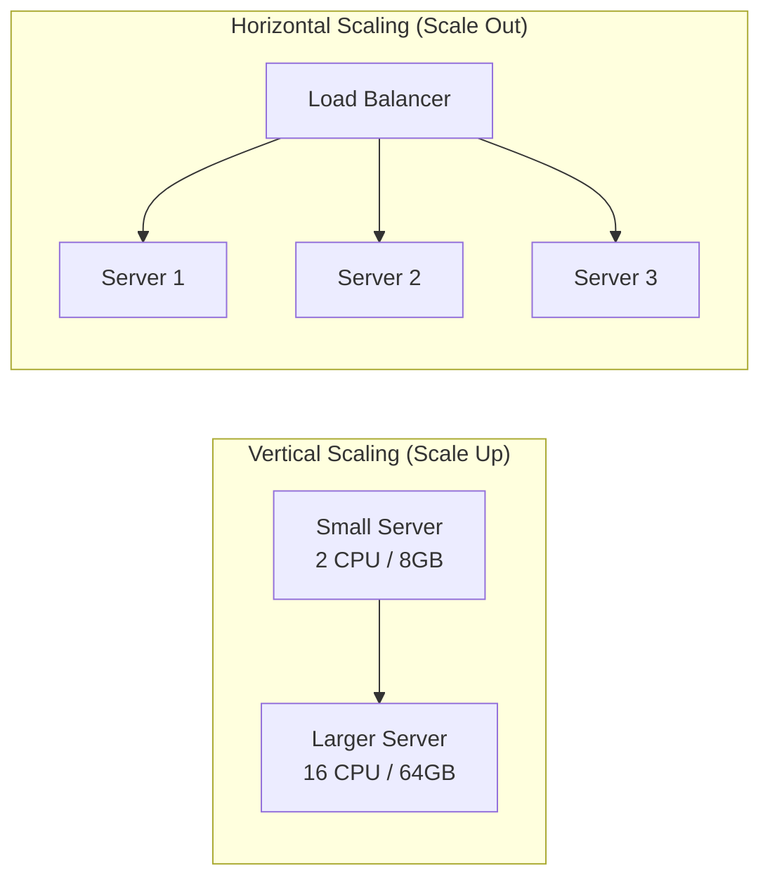
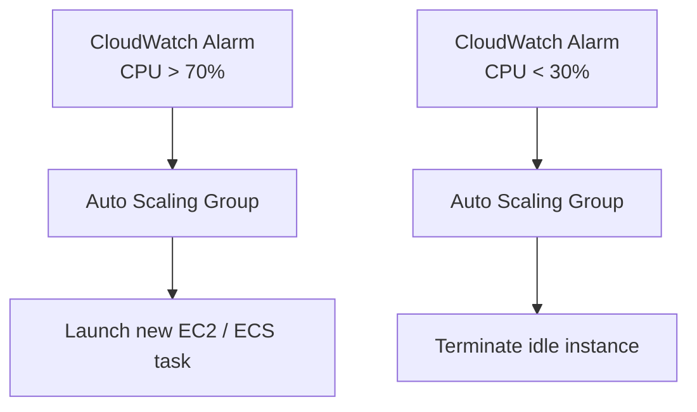

# Scalability

## What it is

Scalability is a system's ability to handle increasing load by adding resources. A scalable system maintains acceptable performance as demand grows.

## Vertical vs Horizontal Scaling



| | Vertical (Scale Up) | Horizontal (Scale Out) |
|---|---|---|
| Method | Bigger machine | More machines |
| Limit | Hardware ceiling (largest EC2 = ~448 vCPU) | Practically unlimited |
| Complexity | Simple — no code changes | Complex — distributed coordination |
| Downtime | Often requires restart | Rolling upgrades possible |
| Cost curve | Superlinear (bigger = disproportionately expensive) | Linear |
| Failure | Single point of failure | Redundant by default |
| State | Easy — all state on one machine | Hard — state must be shared or partitioned |

**Rule of thumb:** Start vertical (simpler), design for horizontal (necessary at scale).

## Dimensions of scale

Not all scale is the same. Know which dimension you're optimizing:

| Dimension | What it means | Solutions |
|---|---|---|
| **Read scale** | More reads than writes | Read replicas, caching, CDN |
| **Write scale** | High write throughput | Sharding, write-behind caching, async queues |
| **Storage scale** | Data volume growth | Sharding, tiered storage, archival |
| **Geographic scale** | Users in multiple regions | Multi-region replication, CDN, GeoDNS |
| **Compute scale** | CPU/memory intensive work | Horizontal scaling, auto-scaling |

## Stateless vs Stateful services

**Stateless:** Each request carries all context needed to serve it. Any server can handle any request.

```
Client → Load Balancer → Any Server (no shared state problem)
```

- Easy to scale horizontally — just add nodes
- JWT is stateless auth; sessions in a cookie are stateless to the server

**Stateful:** Server holds state between requests (session, connection, in-memory data).

```
Client → Load Balancer → Must route to SAME Server (sticky sessions)
                       → Or share state via external store (Redis)
```

- Harder to scale — requires sticky routing or externalized state
- Solutions: externalize state to Redis/DB, use consistent hashing for routing

**Design principle:** Push state to the edges (databases, caches). Keep application servers stateless.

## Load balancing for scale

See [Load Balancing](../networking/load-balancing.md) for full coverage. Key points for scalability:

- **Round-robin / least-connections:** Good for stateless services
- **Consistent hashing:** Good for stateful services (routes same client to same server)
- **Auto-scaling trigger:** CPU > 70%, request queue depth, custom metrics

## Database scalability

| Technique | What it solves | Complexity |
|---|---|---|
| Read replicas | Read-heavy load | Low |
| Connection pooling | Too many DB connections | Low |
| Caching | Repeated reads | Medium |
| Vertical scaling | Overall throughput | Low |
| Sharding | Write-heavy, massive data | High |
| Switching to NoSQL | Schema inflexibility, KV access patterns | High |

## Caching as a scalability tool

```
Without cache:  100k req/s → DB → 100k queries/s (DB collapses)
With cache:     100k req/s → Cache (95% hit rate) → DB → 5k queries/s
```

Cache hit rate directly translates to DB load reduction. 95% hit rate = 20x DB load reduction.

## Auto-scaling

AWS Auto Scaling groups adjust capacity based on demand:



**Scale-in protection:** Prevent terminating instances that are processing work.  
**Warm pools:** Pre-warmed instances ready to join immediately (avoid cold start latency on scale-out).

## Performance vs Scalability

These are related but different:

- **Performance problem:** System is slow for a single user
- **Scalability problem:** System is fast for one user but slow under load

A system can be high-performance but not scalable (single powerful server). It can also be scalable but slow (many slow servers). You want both.

## Interview angle

!!! tip "What interviewers are testing"
    They want to see you identify *which dimension* of scale the system faces and pick the right tools.

**Strong answer pattern:**
1. Estimate the load (QPS, read/write ratio, data volume)
2. Identify the bottleneck — is it reads, writes, or storage?
3. Apply targeted solutions — don't just say "add more servers"
4. Address state — explain how your app servers stay stateless

**Common follow-up:** *"How would you scale your design to 10x the load?"*
> Identify the bottleneck at 10x. Usually: DB becomes the constraint → add read replicas + caching → if writes are the problem → sharding → if still not enough → consider async write paths via queues.

## Related topics

- [Load Balancing](../networking/load-balancing.md) — distributing load across instances
- [Caching](../caching/index.md) — the fastest scalability win
- [Sharding](../patterns/sharding.md) — horizontal partitioning for storage scale
- [Consistent Hashing](../patterns/consistent-hashing.md) — routing with minimal reshuffling
