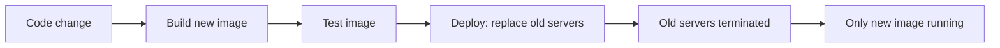

# IaC Fundamentals

Before tool specifics, four concepts shape every IaC decision: declarative vs imperative, mutable vs immutable infrastructure, state, and idempotency. Understanding these explains *why* tools behave the way they do.

---

## Declarative vs imperative

### Imperative
You write the *steps* to reach a state.

```bash
# Imperative shell script
aws ec2 create-vpc --cidr-block 10.0.0.0/16
aws ec2 create-subnet --vpc-id vpc-abc --cidr-block 10.0.1.0/24
aws ec2 create-internet-gateway
# ...
```

Problem: the script assumes a starting state. Run it twice → errors or duplicates. Run it on a different account → may fail because something already exists.

### Declarative
You describe the *end state*. The tool computes the diff.

```hcl
resource "aws_vpc" "main" {
  cidr_block = "10.0.0.0/16"
}

resource "aws_subnet" "private" {
  vpc_id     = aws_vpc.main.id
  cidr_block = "10.0.1.0/24"
}
```

Run twice → tool sees nothing to do. Run on a fresh account → tool creates everything. Run after a manual change → tool reverts (or shows drift).

### Why declarative wins for infrastructure

| | Declarative | Imperative |
|---|---|---|
| Idempotent | Yes by design | Manual effort |
| Diff-able | Yes (`plan`) | No (run and pray) |
| Convergent | Yes (reconciles to desired state) | No (assumes initial state) |
| Reviewable | Final state is in the file | Must read whole script |
| Examples | Terraform, CloudFormation, K8s manifests | Bash, Ansible (mostly) |

**Imperative still has uses**: complex orchestration that's hard to model declaratively (DB migrations, one-off data fixes, multi-step workflows). Tools like Ansible blend both.

---

## Mutable vs immutable infrastructure

### Mutable (the old way)
Provision a server once, then SSH in to update it. Server lives for years, accumulates configuration drift.

```
Server created in 2018:
  - Patched manually 50 times
  - 3 different config management tools used
  - 17 cron jobs nobody remembers adding
  - Critical service depends on a file someone copied in 2020

Replacement is terrifying. Nobody knows what's actually on it.
```

### Immutable (the modern way)
Servers are never modified after creation. To change anything, build a new image and replace the server.

```
v1 image deployed → 5 servers running v1
Need to upgrade Python? → build v2 image → replace all 5 servers
Bug? → build v3 image → replace
Server lifetime: hours to days, not years
```

Containers and golden AMIs make this practical. Cloud auto-scaling groups make it routine.

### Why immutable wins

- **No drift** — every server is identical to the image
- **Easy rollback** — revert to the previous image
- **Reproducible** — image + IaC = full environment from scratch
- **Security** — patches happen via rebuild, not in-place



---

## State

State is the **mapping between your IaC code and real cloud resources**.

```
Your code says:        State says:                Cloud says:
resource "aws_vpc"     vpc_main → vpc-0a1b2c3d    vpc-0a1b2c3d exists
  "main" {...}                                     in us-east-1
```

Without state, the tool can't know:
- Does this VPC already exist? (Or do I need to create it?)
- Which real VPC does my logical `main` reference?
- What attributes did the cloud assign (ARN, IP, default security group)?

### Where state lives

| Tool | State location |
|---|---|
| Terraform | Local file (default), or S3/Azure Blob/GCS (remote) — required for teams |
| CloudFormation | Inside the CloudFormation service itself |
| CDK | CloudFormation (since CDK synthesises to CloudFormation) |
| Pulumi | Pulumi service or self-hosted backend (S3, etc.) |
| Crossplane | Inside the Kubernetes cluster as CRDs |

### Why state is the most failure-prone part

- **Locking**: two people apply at once → state corruption.
- **Loss**: lose state → tool thinks nothing exists → tries to recreate (potentially destroying things or duplicating).
- **Secrets**: state captures actual values, including secrets. Encrypt at rest, restrict access.
- **Surgery**: occasionally you need to manually edit state (`terraform state mv`, `rm`, `import`) — risky.

See [State Management](state-management.md) for the deep dive.

---

## Idempotency

Running the same IaC code N times must produce the same result as running it once.

```hcl
# Run 1: creates the VPC
# Run 2: tool sees VPC exists with matching attributes → no-op
# Run 3: same → no-op
```

This sounds trivial but takes deliberate design:

- **Resource attributes drive identity.** The tool decides "is this the same resource?" by comparing what's in state vs what's in code.
- **Implicit dependencies.** `aws_subnet` references `aws_vpc.main.id` — tool sees order, applies in correct sequence.
- **No side effects in code itself.** Pure description; effects happen only at apply.

### What breaks idempotency

```hcl
# BAD: random ID changes every plan
resource "aws_s3_bucket" "logs" {
  bucket = "logs-${random_id.suffix.hex}"
}
# random_id regenerates → bucket name changes → recreate every apply

# GOOD: stable ID
resource "aws_s3_bucket" "logs" {
  bucket = "${var.environment}-logs-${data.aws_caller_identity.current.account_id}"
}
```

---

## Push vs pull (and GitOps)

### Push model
CI/CD pipeline applies changes outward to the cloud.

```
Git push → CI runs → terraform apply → cloud
```

### Pull model (GitOps)
A controller running *inside* the target environment watches Git and reconciles.

```
Git push → Git updated
Controller in cluster sees new commit → applies it
```

Pull dominates for Kubernetes (ArgoCD, Flux). Push dominates for cloud infra (Terraform). Both can coexist.

See [GitOps](../cicd/gitops.md).

---

## Plan, apply, destroy — the universal lifecycle

Almost every IaC tool follows the same pattern under different names:

| Phase | Terraform | CloudFormation | CDK | Pulumi |
|---|---|---|---|---|
| Show diff | `plan` | `change-set` | `diff` | `preview` |
| Execute change | `apply` | `execute-change-set` | `deploy` | `up` |
| Tear down | `destroy` | `delete-stack` | `destroy` | `destroy` |
| Initialise | `init` | (none) | `bootstrap` | `stack init` |

**Always plan before apply.** Always.

---

## Blast radius

How much of your infrastructure can a single bad apply break?

```
Single state file for all of production:
  Bad apply → could destroy everything
  Blast radius: 100%

Per-service state files:
  Bad apply → only that service affected
  Blast radius: ~5-10%

Per-environment + per-service state:
  Bad apply in dev/payments → dev/payments only
  Blast radius: <1%
```

Senior IaC engineers obsess over blast radius. See [Modules & Repository Structure](modules-and-structure.md).

---

## Interview angle

!!! tip "What interviewers are testing"
    Whether you understand *why* IaC works, not just *which tool* you use.

**Strong answer pattern:**
1. Declarative + state = idempotent reconciliation; that's what makes it safe
2. Immutable infrastructure removes drift entirely; mutable creates configuration debt
3. State is the failure point — must be remote, locked, encrypted, and backed up
4. Blast radius matters; never one state file for the whole world
5. Plan before apply, always; review the diff like a code review

**Common follow-up:** *"Why not just use shell scripts?"*
> Scripts are imperative — they assume initial state, aren't idempotent without effort, and don't track what they created. You can't run `bash deploy.sh` against an existing environment safely. IaC tools maintain state and compute diffs; scripts don't.

---

## Related topics

- [Terraform](terraform.md) — concrete tool walkthrough
- [State Management](state-management.md) — the most error-prone area
- [Drift Detection](drift-detection.md) — what happens when state and reality diverge
- [GitOps](../cicd/gitops.md) — pull-model IaC for Kubernetes
- [Containers](../infrastructure/containers.md) — immutable infrastructure in practice
