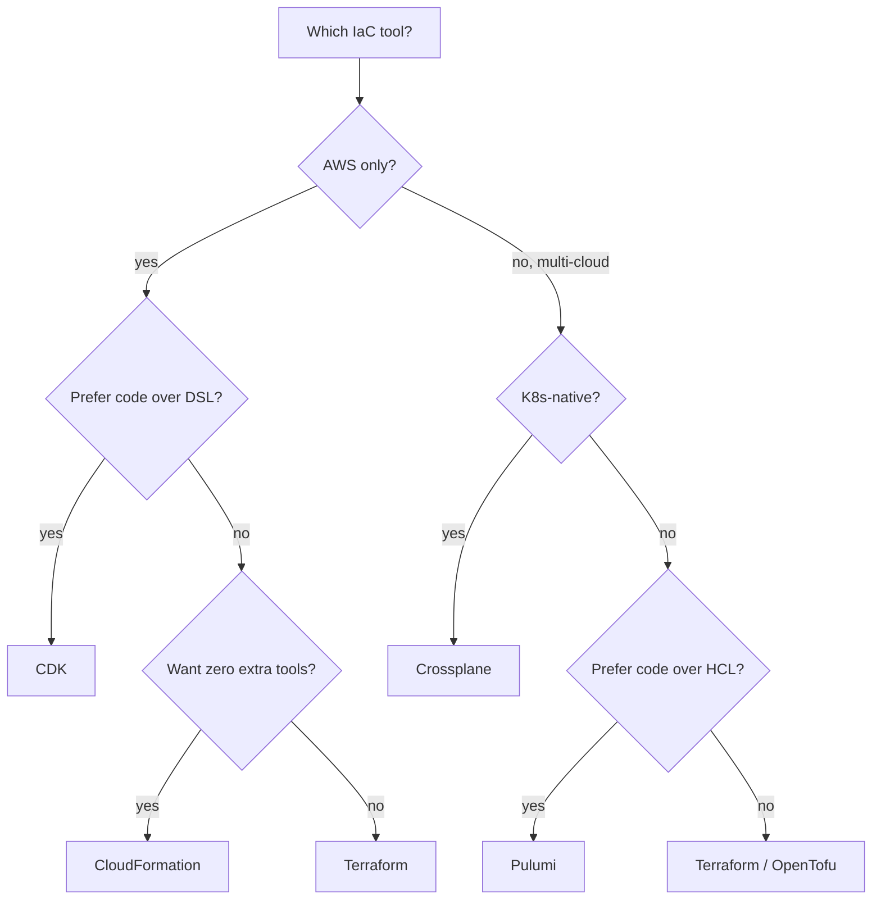

# Pulumi and Other IaC Alternatives

Terraform, CDK, and CloudFormation cover most cases — but Pulumi, Crossplane, Ansible, and a few others occupy useful niches. This page covers the alternatives, what makes them different, and when to pick each.

---

## Pulumi

**Tagline**: Infrastructure as Code in your favourite language, multi-cloud.

```python
import pulumi
import pulumi_aws as aws

vpc = aws.ec2.Vpc("main",
    cidr_block="10.0.0.0/16",
    tags={"Name": "main-vpc"},
)

bucket = aws.s3.BucketV2("logs",
    bucket="company-logs",
)

aws.s3.BucketServerSideEncryptionConfigurationV2("logs-encryption",
    bucket=bucket.id,
    rules=[{
        "apply_server_side_encryption_by_default": {
            "sse_algorithm": "AES256"
        }
    }],
)

pulumi.export("vpc_id", vpc.id)
pulumi.export("bucket_name", bucket.bucket)
```

### Pulumi vs CDK vs Terraform

| | Terraform | CDK | Pulumi |
|---|---|---|---|
| **Language** | HCL | TS, Python, Java, Go, C# | TS, Python, Java, Go, C#, YAML |
| **Multi-cloud** | Yes | AWS only (CDKTF for multi) | Yes (native) |
| **State backend** | S3, etc. | CloudFormation | Pulumi service or self-hosted |
| **Maturity** | Most mature | Mature (AWS) | Mature, smaller community |
| **Speed** | Fast plan | Slower (CFN deploy) | Fast (similar to TF) |
| **Cost** | Free | Free | Free OSS, paid Pulumi Cloud |
| **Best for** | Standard | AWS-native | Multi-cloud + real code |

### When to choose Pulumi

- You want **real code** for infrastructure (loops, conditionals, classes, tests)
- You're **multi-cloud** (Pulumi handles AWS, GCP, Azure, Kubernetes equally)
- Your team prefers **TypeScript/Python over HCL**
- You want **policy-as-code** built in (Pulumi CrossGuard)

### When to skip Pulumi

- Smaller community = fewer Stack Overflow answers
- More vendor lock-in (Pulumi Cloud is the common backend)
- Existing Terraform investment is hard to migrate

### Pulumi lifecycle (similar to Terraform)

```bash
pulumi new aws-python      # bootstrap
pulumi preview             # plan
pulumi up                  # apply
pulumi destroy             # tear down
pulumi stack ls            # list stacks (= environments)
```

---

## Crossplane

**Tagline**: Manage cloud resources with Kubernetes APIs.

Crossplane runs *inside* a Kubernetes cluster. You define cloud resources as **Kubernetes Custom Resources**:

```yaml
apiVersion: rds.aws.upbound.io/v1beta1
kind: Instance
metadata:
  name: order-db
spec:
  forProvider:
    region: us-east-1
    instanceClass: db.r6g.xlarge
    allocatedStorage: 100
    engine: postgres
    engineVersion: "15"
    masterUsername: admin
    autoGeneratePassword: true
    masterPasswordSecretRef:
      namespace: default
      name: order-db-password
      key: password
  providerConfigRef:
    name: default
```

```bash
kubectl apply -f order-db.yaml
kubectl get instances.rds.aws.upbound.io
```

A Crossplane controller watches these CRDs and reconciles them with the actual cloud — like an Operator for cloud resources.

### When to choose Crossplane

- You're already heavily Kubernetes-native
- You want **GitOps** for cloud resources (ArgoCD applies Crossplane CRDs)
- You need self-service infra for app teams (define a `Composition` exposing only the inputs they should set)
- You like declarative reconciliation continuously running, not just on apply

### When to skip Crossplane

- Not a heavy Kubernetes shop
- Smaller team that doesn't need self-service abstractions
- More moving parts (Crossplane controller, providers, CRDs) than Terraform

### Crossplane Compositions — the killer feature

Define a high-level abstraction (e.g., `PostgresDatabase`) that maps to many AWS resources (`RDSInstance`, `SubnetGroup`, `SecurityGroup`, `Secret`):

```yaml
apiVersion: apiextensions.crossplane.io/v1
kind: Composition
metadata:
  name: postgres-database
spec:
  compositeTypeRef:
    apiVersion: example.org/v1alpha1
    kind: PostgresDatabase
  resources:
    - base:
        apiVersion: rds.aws.upbound.io/v1beta1
        kind: Instance
        # ...
    - base:
        apiVersion: rds.aws.upbound.io/v1beta1
        kind: SubnetGroup
        # ...
```

App teams then provision a database with:

```yaml
apiVersion: example.org/v1alpha1
kind: PostgresDatabase
metadata:
  name: order-db
spec:
  parameters:
    size: large
```

Without knowing about subnets, security groups, or even RDS specifics.

---

## Ansible

**Tagline**: Configuration management with infra as a side hustle.

Ansible is primarily for **configuring servers** (install packages, edit configs, manage services), not provisioning cloud resources. But it has cloud modules:

```yaml
- name: Provision EC2 instance
  hosts: localhost
  tasks:
    - name: Create instance
      amazon.aws.ec2_instance:
        name: web-server
        instance_type: t3.medium
        image_id: ami-0abcdef1234567890
        vpc_subnet_id: subnet-abc123
        security_group: web-sg
        tags:
          Environment: production
        wait: yes
```

### When Ansible makes sense

- **Server configuration** post-provisioning (apt install, systemd, file templating)
- **Hybrid infra** with on-prem servers
- Small teams that want one tool for configuration AND infra
- Imperative workflows (orderly multi-step operations)

### When to skip Ansible for IaC

- Pure cloud-native — Terraform handles cloud better
- You want declarative reconciliation — Ansible is imperative-ish
- State management is bolted on, not native

### Ansible + Terraform pattern

Most common combo:

```
Terraform: provisions VMs, networks, IAM
  ↓
Ansible: configures the VMs (install software, deploy app)
```

Modern alternative: containers/AMIs replace Ansible. The VM is provisioned with the software already installed.

---

## OpenTofu

**Tagline**: Open-source fork of Terraform after the BSL licence change.

In 2023, HashiCorp re-licensed Terraform under BSL (Business Source Licence). The community forked the last MPL-licensed version as OpenTofu.

### Key facts

- **Drop-in replacement**: `opentofu` CLI, same HCL, same providers, same modules
- **Maintained by Linux Foundation** — vendor-neutral
- **State files compatible** with Terraform (mostly)
- **New features** diverging gradually — OpenTofu has its own roadmap

### Why teams pick OpenTofu

- Avoid HashiCorp licensing concerns (especially if building products on top)
- Want vendor-neutral governance
- Comfortable with active community development

### Why teams stay on Terraform

- HashiCorp's enterprise support
- Terraform Cloud / HCP integration
- Risk-aversion — Terraform is the established name

If you're starting fresh in 2026, both are reasonable. Most enterprises continue on Terraform; many infrastructure-as-product companies (Spacelift, env0) support both.

---

## Bicep (Azure)

Microsoft's domain-specific language for Azure Resource Manager (ARM) templates. Compiles to ARM JSON.

```bicep
resource storageAccount 'Microsoft.Storage/storageAccounts@2023-01-01' = {
  name: 'mystorageaccount'
  location: 'westeurope'
  sku: {
    name: 'Standard_LRS'
  }
  kind: 'StorageV2'
}
```

Cleaner than ARM JSON; tightly integrated with Azure DevOps. Azure-only.

---

## Comparison matrix

| Tool | Language | Multi-cloud | Native runtime | Best fit |
|---|---|---|---|---|
| **Terraform** | HCL | Yes | None (CLI) | Default modern choice |
| **OpenTofu** | HCL | Yes | None (CLI) | Open-source-first orgs |
| **CDK** | TS/Py/Java/Go/C# | AWS (CDKTF for multi) | None (CLI) | AWS-heavy, prefer code |
| **Pulumi** | TS/Py/Java/Go/C# | Yes | None (CLI) | Multi-cloud + real code |
| **CloudFormation** | YAML/JSON | AWS | AWS service | AWS-only, no extra tools |
| **Bicep** | Bicep DSL | Azure | None (CLI) | Azure-only |
| **Crossplane** | YAML (K8s CRDs) | Yes | K8s controller | K8s-native, self-service infra |
| **Ansible** | YAML (playbooks) | Limited | None (CLI) | Server config + light infra |

---

## How to pick



Most teams end up on **Terraform/OpenTofu**. The exceptions:

- AWS-only + heavy serverless → **CDK** (or SAM via CloudFormation)
- Multi-cloud + want real code → **Pulumi**
- Heavy Kubernetes + want self-service → **Crossplane** (often + Terraform for the cluster itself)
- Hybrid cloud + on-prem servers → **Ansible** for config, Terraform for cloud

Mixing tools is normal: Terraform for cloud infra, Ansible for VM config, Crossplane for app-team self-service.

---

## Interview angle

!!! tip "What interviewers are testing"
    Whether you've used multiple tools and can articulate trade-offs, not just defend your favourite.

**Strong answer pattern:**
1. Terraform is the default; ecosystem and maturity win
2. CDK shines for AWS-heavy shops that prefer code; ecosystem narrower
3. Pulumi is Terraform's spiritual successor — same lifecycle, real languages
4. Crossplane is for K8s-native shops wanting self-service infra
5. Ansible is for configuration management, not primary IaC

**Common follow-up:** *"Why might a company use both Terraform and Crossplane?"*
> Terraform provisions the K8s cluster and the platform-level infrastructure (VPC, IAM). Crossplane runs inside the cluster and lets app teams self-service request databases or queues via simple CRDs, abstracting the underlying cloud details. Different tools for different audiences.

---

## Related topics

- [Terraform](terraform.md) — the dominant tool
- [CDK](cdk.md) — AWS-native code-first
- [CloudFormation](cloudformation.md) — AWS native YAML
- [Best Practices](best-practices.md) — applies regardless of tool
- [Kubernetes](../infrastructure/kubernetes.md) — Crossplane runs here
