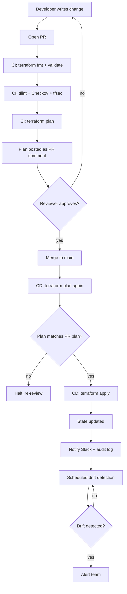

# Terraform in CI/CD: The End-to-End Lifecycle

Running Terraform on a laptop is one thing. Running it as a team, in CI/CD, against production — that's a different discipline. This page covers the **complete lifecycle** of a Terraform change from a developer's keyboard to a deployed cloud resource, including review, apply, drift, and rollback.

---

## The full lifecycle in one picture



The hardest parts of this lifecycle aren't the Terraform commands — they're the **gates between them**: PR review, plan-before-apply, post-apply verification, drift detection.

---

## Stage 1: Repository structure

A repo layout that scales:

```
infra/
├── modules/                          # reusable building blocks
│   ├── vpc/
│   ├── ecs-service/
│   ├── rds-postgres/
│   └── alb/
├── environments/
│   ├── dev/
│   │   ├── main.tf                   # composes modules
│   │   ├── terraform.tfvars          # dev-specific values
│   │   ├── backend.tf                # dev state config
│   │   └── providers.tf
│   ├── staging/
│   └── production/
├── global/                           # shared: Route53, ECR, IAM roles
└── .github/workflows/
    ├── terraform-plan.yml
    ├── terraform-apply.yml
    └── terraform-drift.yml
```

Why per-environment directories instead of `terraform workspaces`?

- **Different backends per env** — prod state in a locked-down account, dev state elsewhere
- **Different IAM roles** — least privilege per environment
- **Blast radius** — apply in dev cannot touch prod
- **Promotion** — changes flow `dev → staging → production` via PRs

Workspaces are fine for trivial cases but conflate state in ways that bite at scale.

---

## Stage 2: Local development workflow

```bash
# Engineer makes a change in environments/dev/
cd infra/environments/dev

# Format check (CI will fail if not formatted)
terraform fmt -recursive

# Validate syntax + provider schema
terraform validate

# Initialize (first time, or when modules change)
terraform init

# Plan locally — sanity check before committing
terraform plan -var-file=terraform.tfvars

# Engineer never runs `apply` locally for shared environments.
# Apply only happens through CI.
```

Senior teams **block local apply** entirely for staging and production via IAM (the engineer's role can `plan` but not `apply`).

---

## Stage 3: Pull request — what CI does on every push

This is where most quality gates live.

```yaml
# .github/workflows/terraform-plan.yml
name: Terraform Plan

on:
  pull_request:
    paths:
      - 'infra/**'
      - '.github/workflows/terraform-*.yml'

permissions:
  id-token: write       # OIDC to AWS
  contents: read
  pull-requests: write  # to comment on PR

jobs:
  detect-changes:
    runs-on: ubuntu-latest
    outputs:
      environments: ${{ steps.matrix.outputs.environments }}
    steps:
      - uses: actions/checkout@v4
      - name: Detect changed environments
        id: matrix
        run: |
          # List which environments have changes
          dirs=$(git diff --name-only origin/main HEAD -- infra/environments/ \
            | cut -d/ -f3 | sort -u | jq -R -s -c 'split("\n")[:-1]')
          echo "environments=$dirs" >> $GITHUB_OUTPUT

  plan:
    needs: detect-changes
    runs-on: ubuntu-latest
    strategy:
      matrix:
        environment: ${{ fromJSON(needs.detect-changes.outputs.environments) }}

    defaults:
      run:
        working-directory: infra/environments/${{ matrix.environment }}

    steps:
      - uses: actions/checkout@v4

      - uses: hashicorp/setup-terraform@v3
        with:
          terraform_version: 1.7.0

      - name: AWS OIDC auth (read-only role)
        uses: aws-actions/configure-aws-credentials@v4
        with:
          role-to-assume: arn:aws:iam::123456789:role/terraform-plan-${{ matrix.environment }}
          aws-region: us-east-1

      - name: terraform fmt check
        run: terraform fmt -check -recursive

      - name: tflint
        uses: terraform-linters/setup-tflint@v4
        # then: tflint --init && tflint

      - name: Checkov (security policies)
        uses: bridgecrewio/checkov-action@master
        with:
          directory: infra/environments/${{ matrix.environment }}
          framework: terraform
          soft_fail: false   # block on policy violations

      - name: tfsec (additional security scan)
        uses: aquasecurity/tfsec-action@v1.0.3

      - name: terraform init
        run: terraform init

      - name: terraform validate
        run: terraform validate

      - name: terraform plan
        id: plan
        run: |
          terraform plan -no-color -out=tfplan -var-file=terraform.tfvars
          terraform show -no-color tfplan > plan.txt

      - name: Save plan artifact
        uses: actions/upload-artifact@v4
        with:
          name: tfplan-${{ matrix.environment }}
          path: |
            infra/environments/${{ matrix.environment }}/tfplan
            infra/environments/${{ matrix.environment }}/plan.txt
          retention-days: 7

      - name: Comment plan on PR
        uses: actions/github-script@v7
        with:
          script: |
            const fs = require('fs');
            const plan = fs.readFileSync(
              'infra/environments/${{ matrix.environment }}/plan.txt', 'utf8'
            );
            const truncated = plan.length > 60000 ? plan.slice(0, 60000) + '\n... (truncated)' : plan;
            github.rest.issues.createComment({
              issue_number: context.issue.number,
              owner: context.repo.owner,
              repo: context.repo.repo,
              body: `### Terraform Plan: \`${{ matrix.environment }}\`\n\n\`\`\`hcl\n${truncated}\n\`\`\``
            });
```

Key choices:

- **OIDC, not stored credentials.** The CI role is assumed via OIDC trust on `repo:org/repo:pull_request` — no AWS keys in GitHub.
- **Plan-only role.** The role used for PRs has `Describe*` and `Get*` only; it cannot create or modify anything.
- **Plan posted as comment.** Reviewers read the actual diff in the PR.
- **Plan saved as artifact.** Used in apply step to ensure exactly the reviewed plan is what runs.
- **Per-environment matrix.** Only environments that changed are planned.
- **Static security scans (Checkov, tfsec).** Catch open security groups, unencrypted S3, IAM wildcards before review.

---

## Stage 4: Code review

Reviewers look at:

1. **The plan output**, not just the HCL. A 5-line HCL change can produce a 200-line destructive plan.
2. **`# forces replacement`** lines — these mean the resource is destroyed and recreated. Critical for stateful resources.
3. **Module version pinning** — `source = "..."` should reference a tag, not `main`.
4. **Tags** — every resource should have `Environment`, `Team`, `ManagedBy`, `CostCenter`.
5. **Secrets** — never hardcoded; references to Secrets Manager / SSM only.
6. **Provider version pinning** — major version updates in `required_providers` need a separate PR.
7. **Blast radius** — does this change touch shared resources (VPC, IAM)?

Common dangerous diff patterns:

```diff
# DESTRUCTIVE — investigate before merging
- resource "aws_db_instance" "main" {
+ resource "aws_db_instance" "main" {
-   identifier = "prod-orders"
+   identifier = "prod-orders-v2"   # changing identifier destroys the DB
  }

# DRIFT-COVERING — someone changed prod manually, code is "fixing" the drift
- size = 100
+ size = 200   # was already 200 in real prod due to manual change
```

---

## Stage 5: Merge → apply

```yaml
# .github/workflows/terraform-apply.yml
name: Terraform Apply

on:
  push:
    branches: [main]
    paths:
      - 'infra/**'

permissions:
  id-token: write
  contents: read

concurrency:
  group: terraform-apply-${{ github.workflow }}
  cancel-in-progress: false   # never cancel a running apply

jobs:
  detect-changes:
    # same as plan workflow
    ...

  apply:
    needs: detect-changes
    runs-on: ubuntu-latest
    strategy:
      max-parallel: 1                  # apply one env at a time
      matrix:
        environment: ${{ fromJSON(needs.detect-changes.outputs.environments) }}
    environment: ${{ matrix.environment }}   # GitHub environment with protection rules
    
    defaults:
      run:
        working-directory: infra/environments/${{ matrix.environment }}

    steps:
      - uses: actions/checkout@v4

      - uses: hashicorp/setup-terraform@v3
        with:
          terraform_version: 1.7.0

      - name: AWS OIDC auth (apply role)
        uses: aws-actions/configure-aws-credentials@v4
        with:
          role-to-assume: arn:aws:iam::123456789:role/terraform-apply-${{ matrix.environment }}
          aws-region: us-east-1

      - name: terraform init
        run: terraform init

      - name: terraform plan (re-plan)
        id: plan
        run: |
          terraform plan -no-color -out=tfplan -var-file=terraform.tfvars -detailed-exitcode
        # exit code 0 = no changes, 2 = changes, 1 = error
        continue-on-error: true

      - name: Stop if no changes
        if: steps.plan.outputs.exitcode == '0'
        run: echo "No changes — exiting" && exit 0

      - name: terraform apply
        if: steps.plan.outputs.exitcode == '2'
        run: terraform apply -auto-approve tfplan

      - name: Notify Slack
        if: always()
        uses: slackapi/slack-github-action@v1
        with:
          payload: |
            {
              "text": "Terraform apply ${{ job.status }} for ${{ matrix.environment }}\nCommit: ${{ github.sha }}\nActor: ${{ github.actor }}"
            }
```

Critical details:

- **GitHub Environment with required reviewers.** Production deploys require manual approval from a designated team in GitHub UI before the job runs.
- **`concurrency` block.** Two merges to main never run apply in parallel — state lock would block but explicit serialisation is safer.
- **Re-plan, don't apply the saved plan from PR.** State may have changed between PR open and merge. Re-plan and abort if exit code shows unexpected changes.
- **`-detailed-exitcode`.** Distinguish "no changes" from "changes" without parsing output.
- **Production has a different IAM role** than dev — apply role for prod is more privileged but only assumable from the protected workflow.

---

## Stage 6: Post-apply verification

Apply succeeded ≠ change worked. Verify:

```yaml
      - name: Smoke test
        run: |
          # New ALB DNS resolves
          dns=$(terraform output -raw alb_dns_name)
          curl -sf https://$dns/health || exit 1
          
          # Database is reachable
          # (run from a step container in the VPC)
```

For app deployments, the CI/CD pipeline (separate from infra pipeline) runs integration tests post-deploy.

---

## Stage 7: Drift detection (the missing piece in most teams)

Drift = real cloud state differs from Terraform state, because:
- Someone made a manual console change ("just this once")
- Another tool modified a resource
- Provider auto-updates (e.g., AWS bumping a default)

Schedule a daily plan-only run that alerts on drift:

```yaml
# .github/workflows/terraform-drift.yml
name: Terraform Drift Detection

on:
  schedule:
    - cron: '0 6 * * *'   # daily 06:00 UTC
  workflow_dispatch:

jobs:
  drift:
    strategy:
      matrix:
        environment: [dev, staging, production]
    runs-on: ubuntu-latest
    
    steps:
      - uses: actions/checkout@v4
      - uses: hashicorp/setup-terraform@v3
      - uses: aws-actions/configure-aws-credentials@v4
        with:
          role-to-assume: arn:aws:iam::123456789:role/terraform-plan-${{ matrix.environment }}
          aws-region: us-east-1
      
      - name: Plan
        id: plan
        working-directory: infra/environments/${{ matrix.environment }}
        run: |
          terraform init
          terraform plan -no-color -detailed-exitcode -var-file=terraform.tfvars > plan.txt
        continue-on-error: true
      
      - name: Alert on drift
        if: steps.plan.outputs.exitcode == '2'
        uses: slackapi/slack-github-action@v1
        with:
          payload: |
            {
              "text": "🚨 Drift detected in ${{ matrix.environment }}\n```$(head -100 plan.txt)```"
            }
```

When drift is detected, the team has three choices:

1. **Re-apply** to revert the manual change (if it was unauthorized)
2. **Codify** the change in Terraform (if it was a hotfix that should stay)
3. **Investigate** if neither (could indicate compromise)

---

## Stage 8: Rollback

There's no `terraform rollback` command. Rollback means **applying the previous version of the code**.

```bash
# Revert the merge commit
git revert <bad-commit-sha>
git push origin main

# CD pipeline triggers → plans the revert → applies
```

For non-recoverable changes (e.g., a destroyed database), rollback is **not possible**. This is why:

- Stateful resources have `lifecycle { prevent_destroy = true }`
- Production reviews are stricter
- Backups exist independently of Terraform

```hcl
resource "aws_db_instance" "primary" {
  # ...
  lifecycle {
    prevent_destroy = true
  }
}
```

`prevent_destroy` causes apply to fail rather than destroy. Engineer must explicitly remove the lifecycle block + apply, then re-add it.

---

## Stage 9: Secrets and credentials in the lifecycle

```
Engineer's laptop:
  - Read-only AWS profile (or no AWS access at all)
  - Cannot run apply against shared envs
  
CI plan job:
  - OIDC → IAM role: terraform-plan-<env>
  - Permissions: Describe*, Get*, List* only
  
CI apply job:
  - OIDC → IAM role: terraform-apply-<env>
  - Permissions: full create/update/delete on the resources Terraform manages
  - Production role: only assumable from protected workflow on main branch
  
Terraform state:
  - S3 bucket with KMS encryption (separate per environment)
  - DynamoDB lock table
  - Bucket policy: only the corresponding apply role can write
```

See [Secrets in IaC](secrets-in-iac.md) for how application-level secrets are referenced.

---

## Common failure modes and fixes

| Failure | Cause | Fix |
|---|---|---|
| `Error acquiring the state lock` | Previous apply crashed or another job is running | Wait, then check — never `force-unlock` casually |
| Plan shows changes even though nothing was edited | Drift, or provider auto-update | Investigate; either re-apply or update code |
| Apply destroys a resource you wanted to keep | Renamed resource block (Terraform sees: delete old, create new) | Use `terraform state mv` to rename without destroying |
| OIDC auth fails | Trust policy doesn't match `sub` claim | Check IAM trust policy `StringEquals` matches `repo:org/repo:ref:refs/heads/main` |
| Apply succeeds but app broken | IaC and app deploys are out of sync | Run app smoke tests post-apply; consider feature flags |
| Two environments share state | Misconfigured backend | Each env must have unique backend `key` |

---

## Tooling alternatives to raw GitHub Actions

For larger teams, dedicated Terraform CI/CD platforms reduce boilerplate:

| Tool | What it adds |
|---|---|
| **Terraform Cloud / HCP Terraform** | Managed state, plan-as-PR-check, policy enforcement, cost estimates, drift detection |
| **Atlantis** | Self-hosted, comments `atlantis plan` / `atlantis apply` on PRs |
| **Spacelift** | Managed, multi-tool (Terraform, Pulumi, CloudFormation), policy via OPA |
| **env0** | Similar to Spacelift, focus on developer self-service |
| **Scalr** | Multi-cloud, hierarchical workspaces |

Atlantis is the most common open-source choice. Terraform Cloud is the easiest managed option.

---

## Putting it together — minimal viable lifecycle

If you're starting from scratch, build in this order:

1. **Remote state with locking** (S3 + DynamoDB) — non-negotiable
2. **OIDC auth** from CI to AWS — no stored credentials
3. **Per-environment directories + state** — blast radius
4. **Plan in PR** with output as comment — review safety
5. **Apply on merge to main** with manual approval for production
6. **Static security scans** (Checkov, tfsec) — catch the obvious
7. **Daily drift detection** — catch the slow rot
8. **`prevent_destroy`** on stateful resources — block the worst mistakes

Most teams don't get past step 4 without help. Steps 5–8 are what separate junior IaC users from senior ones.

---

## Interview angle

!!! tip "What interviewers are testing"
    Whether you've actually run Terraform at scale, or just used it on a laptop. They want to hear about state, locking, blast radius, OIDC, and drift.

**Strong answer pattern:**
1. State is remote with locking; per-environment, encrypted; never local for shared infra
2. Apply only happens through CI/CD; engineers can't apply locally to staging/prod
3. PR opens → plan runs with read-only role → posted as comment → reviewed → merged → apply role triggered with manual approval for prod
4. Drift detection runs nightly; alerts on unexpected diffs
5. Rollback = revert commit + apply; stateful resources have `prevent_destroy`
6. Security scans (Checkov/tfsec) gate the PR

**Common follow-up:** *"What if the state file gets corrupted?"*
> Backup the state bucket with versioning. S3 versioning lets you restore a previous state. For surgical fixes, `terraform state` subcommands (`mv`, `rm`, `import`) — but treat them like database surgery: backup, double-check, sometimes pair with a second engineer.

**Common follow-up:** *"How do you prevent two engineers from apply'ing at once?"*
> Remote state with locking — DynamoDB for Terraform's S3 backend. Plus CI concurrency groups so the workflow itself serialises. Plus blocking local apply via IAM.

---

## Related topics

- [Terraform](terraform.md) — the tool itself
- [State Management](state-management.md) — locking, backends, surgery
- [Drift Detection](drift-detection.md) — when reality diverges from code
- [Testing IaC](testing-iac.md) — Checkov, tfsec, Terratest
- [CI/CD Pipelines](../cicd/pipelines.md) — broader CI/CD patterns
- [GitOps](../cicd/gitops.md) — pull-model alternative for K8s
- [Secrets Management](../security/secrets-management.md) — what to reference, what never to embed
