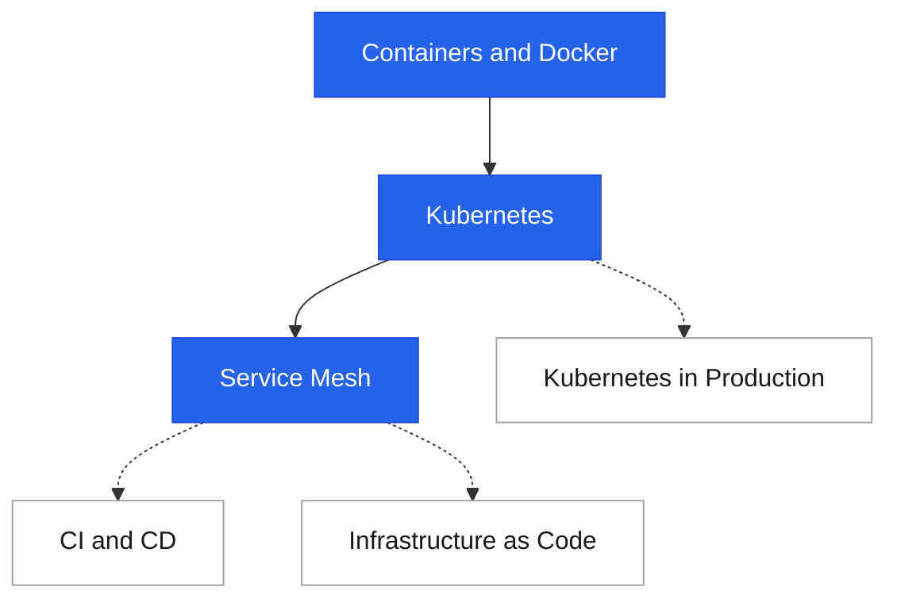

# Infrastructure

<div class="sec-hero" markdown>
<span class="ey">Delivery · where it runs</span>
Modern infrastructure is code — repeatable, versionable, auditable, and automated. The shift from manually provisioned servers to declarative infrastructure changed what reliability means: consistency (every environment is identical), speed (deploy in minutes, not days), and recovery (rebuild from code, not memory).
</div>

## Roadmap

Follow the spine top-to-bottom your first time. Dashed branches hang off the topic they support — grab them when you need them.

<div class="sd-mermaid-links" data-links='{
  "Containers and Docker": "containers/",
  "Kubernetes": "kubernetes/",
  "Service Mesh": "service-mesh/",
  "Kubernetes in Production": "kubernetes-in-production/",
  "CI and CD": "../cicd/",
  "Infrastructure as Code": "../iac/"
}'></div>



## Topics in this section

How applications are packaged, orchestrated, and connected at scale.

<div class="pcards">
<a class="pcard" href="containers/"><span class="t">Containers & Docker</span><span class="d">Process isolation, image layering, Dockerfile best practices, multi-stage builds</span></a>
<a class="pcard" href="kubernetes/"><span class="t">Kubernetes</span><span class="d">Pods, Deployments, Services, HPA, RBAC, resource limits</span></a>
<a class="pcard" href="service-mesh/"><span class="t">Service Mesh</span><span class="d">Istio, Envoy — mTLS, observability, traffic management at the proxy layer</span></a>
<a class="pcard" href="kubernetes-in-production/"><span class="t">Kubernetes in Production</span><span class="d">Running clusters for real: scaling, upgrades, failure modes</span></a>
</div>

## Adjacent sections

<div class="pcards">
<a class="pcard" href="../cicd/"><span class="t">CI/CD</span><span class="d">Pipelines, branching, deployment strategies — drives the whole stack</span></a>
<a class="pcard" href="../iac/"><span class="t">Infrastructure as Code</span><span class="d">Terraform, CDK, CloudFormation — reproducible, auditable infrastructure</span></a>
</div>

## Suggested reading order

New to this topic? Read these in order — each builds on the previous:

1. [Containers & Docker](containers.md) — how applications are packaged; everything else runs on this
2. [Kubernetes](kubernetes.md) — orchestrating those containers at scale with self-healing
3. [Service Mesh](service-mesh.md) — cross-cutting networking concerns layered on top of Kubernetes

**Then, as needed (reference):** [CI/CD](../cicd/index.md), [Infrastructure as Code](../iac/index.md)

**Advanced — come back later:** [Kubernetes in Production](kubernetes-in-production.md)

---

## The infrastructure stack

```
Application code
  └─ Container image (Docker)
       └─ Container runtime (containerd)
            └─ Orchestration (Kubernetes)
                 ├─ Cluster on cloud VMs (EC2, GKE nodes)
                 ├─ Networking (service mesh: Istio/Linkerd)
                 └─ Provisioned via IaC (Terraform, CDK)

CI/CD pipeline drives the whole stack:
  Code push → Build → Test → Bake image → Deploy (blue/green/canary)
```

---

## Topics in this section

| Topic | What it covers | When it matters |
|---|---|---|
| [Containers & Docker](containers.md) | Process isolation, image layering, Dockerfile best practices, multi-stage builds | Packaging any application consistently |
| [Kubernetes](kubernetes.md) | Pods, Deployments, Services, HPA, RBAC, resource limits | Running containers at scale with self-healing |
| [Service Mesh](service-mesh.md) | Istio, Envoy — mTLS, observability, traffic management at the proxy layer | Microservices needing cross-cutting concerns without code changes |
| [CI/CD →](../cicd/index.md) | (Now its own section) Pipelines, branching, deployment strategies | Every team shipping software repeatedly |
| [Infrastructure as Code →](../iac/index.md) | (Now its own section) Terraform, CDK, CloudFormation, lifecycle | Reproducible, auditable infrastructure |

---

## How the pieces connect

```
Developer workflow:
  git push
    → CI: lint + test + build Docker image
    → CD: push image to registry, update Kubernetes manifests
    → Kubernetes: rolling deploy, health checks, rollback on failure

Deployment safety (Deployment Strategies):
  Canary: 5% traffic to new version → watch error rate → ramp up
  Blue/Green: full parallel environment → instant cutover → instant rollback
  Feature flags: code deployed but feature off → gradual rollout by user %

Cross-cutting concerns (Service Mesh):
  mTLS between every service (no explicit cert management in code)
  Traffic splitting (canary at L7)
  Distributed tracing via sidecar
  Retries and circuit breaking (policy, not code)

Infrastructure lifecycle (IaC):
  terraform plan → human review → terraform apply
  All cloud resources as code → drift detection → auditability
```

---

## Container + Kubernetes mental model

```
Docker:
  Image     = frozen snapshot of code + runtime
  Container = running instance of an image
  Layer     = diff from previous image layer (cached on build)

Kubernetes:
  Pod         = 1+ containers sharing network + storage
  Deployment  = declarative spec for N replicas of a Pod
  Service     = stable DNS + load balancer for a Deployment
  Ingress     = external HTTP routing to Services
  HPA         = auto-scale Pods based on CPU/custom metrics
  Namespace   = logical cluster partition (env, team, app)
```

---

## Interview shortlist

| Question | Key answer |
|---|---|
| *"Why containers instead of VMs?"* | Faster startup (seconds vs minutes), denser packing (no guest OS), consistent environments, image immutability. VMs for stronger isolation (multi-tenant untrusted workloads). |
| *"How does Kubernetes ensure a Deployment stays healthy?"* | Deployment controller continuously reconciles desired state vs actual. If a Pod crashes, controller creates a replacement. Liveness probes kill unhealthy Pods; readiness probes gate traffic. |
| *"Blue-green vs canary — which to use?"* | Blue-green: instant cutover + rollback (need 2× infra). Canary: gradual rollout with real traffic signal (catch bugs before full exposure). Canary is safer for large user bases. |
| *"What problem does a service mesh solve?"* | Moves mTLS, retries, circuit breaking, and tracing to the sidecar proxy — so every service gets these capabilities without per-service code changes. |
| *"Why is IaC important?"* | Reproducibility (rebuild prod in DR), auditability (git blame for infra changes), consistency (dev/staging/prod identical), automated provisioning. |

---

## Related topics

- [Observability](../observability/index.md) — what you deploy needs to be instrumented
- [Patterns: Deployment Strategies](../patterns/replication.md) — reliability patterns for infra
- [Security: Zero Trust](../security/zero-trust.md) — network security meets service mesh
- [AWS](../aws/index.md) — mapping these concepts to managed cloud services
