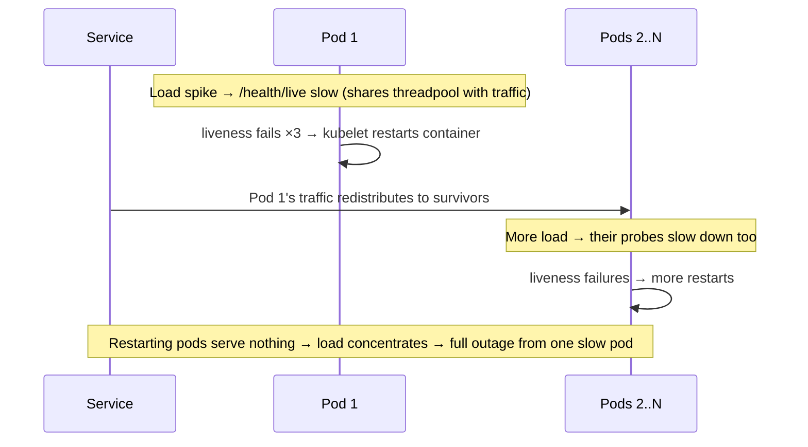

---
tags:
  - applied
  - for-scale
---

# Kubernetes in Production

Knowing the Kubernetes objects is table stakes. Operating a cluster is a different discipline: pods get OOMKilled at 3am, the HPA scales on a metric that lies, a liveness probe takes down a whole service, and a node upgrade drains the wrong pods at the wrong time. This page covers the operational layer — resource management, scheduling, autoscaling pitfalls, graceful deploys, cluster upgrades, and the day-2 debugging playbook.

For the *objects themselves* (Deployment, Service, Ingress, RBAC), see [Kubernetes](kubernetes.md). This page focuses on **running** them.

---

## You'll see this when...

- Pods restart with exit code 137 and nobody knows why
- p99 latency spikes despite CPU utilisation showing "only 60%"
- HPA never scales your queue consumer because CPU sits at 20%
- A deploy drops a few hundred 502s every single time
- One liveness probe failure cascades into the entire deployment restarting
- A node upgrade evicts both replicas of a service simultaneously
- The cluster bill doubles but `kubectl top nodes` shows 30% utilisation
- A pod is stuck `Terminating` for 20 minutes and on-call is force-deleting

---

## Resource management: requests, limits, and what actually happens

**Requests** are what the scheduler uses for placement and what the kernel uses for CPU weighting. **Limits** are hard ceilings enforced by cgroups.

```yaml
resources:
  requests:
    cpu: "500m"      # scheduler reserves this; cgroup cpu.weight derived from it
    memory: "512Mi"  # scheduler reserves this; also eviction ranking input
  limits:
    cpu: "2"         # CFS quota: throttled above this (controversial — see below)
    memory: "1Gi"    # hard ceiling: exceed it → OOMKilled
```

The asymmetry that matters:

| | CPU | Memory |
|---|---|---|
| Compressible? | Yes — can be throttled | No — can't take memory back |
| Exceed request | Fine, uses spare capacity | Fine, but first eviction candidate under node pressure |
| Exceed limit | **Throttled** (CFS quota) | **OOMKilled** (exit 137) |

### Why CPU limits are controversial

CPU limits are enforced via the CFS quota: in every 100ms period, your container gets `limit × 100ms` of CPU time. A multi-threaded app can burn its entire quota in the first 10ms of a period, then sit **frozen for 90ms** — that's a 90ms latency cliff invisible in average CPU graphs.

```
Period (100ms):  |##########..........................................|
                  ^ 8 threads burn 2-core quota in ~25ms   ^ throttled 75ms
Result: p99 latency spikes while "CPU utilisation" looks fine
```

The widely adopted production stance (2026):

- **Set CPU requests accurately, skip CPU limits** for latency-sensitive services. Requests still guarantee fair share via cpu.weight; spare capacity is borrowable.
- Keep CPU limits only where you need hard isolation (multi-tenant, untrusted workloads) or Guaranteed QoS for static CPU pinning.
- **Always set memory limits** — memory is incompressible, and an unbounded leak takes the node down.
- Watch `container_cpu_cfs_throttled_periods_total` — if it's nonzero on a latency-sensitive service, your limits are hurting you.

### QoS classes

Kubernetes derives a QoS class from your requests/limits; it determines eviction order under node pressure:

| QoS class | Condition | Evicted |
|---|---|---|
| `Guaranteed` | requests == limits for **all** containers, both CPU & memory | Last |
| `Burstable` | At least one request set, not Guaranteed | Middle (ranked by usage above request) |
| `BestEffort` | No requests or limits at all | First |

`BestEffort` in production is a bug: the scheduler packs these pods anywhere and the kubelet kills them first. Most services should be `Burstable` (accurate requests, memory limit, no CPU limit); reserve `Guaranteed` for things that genuinely need it (e.g. static CPU manager pinning).

### OOMKilled: debugging exit code 137

137 = 128 + 9: the kernel sent SIGKILL. Either the container breached its memory limit, or the node ran out and the kubelet/kernel chose a victim.

```bash
kubectl describe pod api-7d9f -n prod
#   Last State:  Terminated
#     Reason:    OOMKilled
#     Exit Code: 137

kubectl get events -n prod --field-selector reason=Evicted   # node-pressure eviction?
kubectl top pod api-7d9f --containers                        # working set right now
```

The metric that decides your fate is the **working set** (`container_memory_working_set_bytes`), not RSS: working set = total usage minus inactive (reclaimable) file cache. A pod can show modest RSS but get killed because page cache it touched recently counts against it — common for apps doing heavy file I/O. Conversely, dashboards plotting RSS will under-report how close you are to the limit.

Frequent culprits:

- **JVM/runtime unaware of cgroup limits** — modern JVMs are container-aware, but check `-XX:MaxRAMPercentage`; heap + metaspace + threads + off-heap must fit *under* the container limit, not equal it.
- **Spiky allocators** (image processing, large query results) — limit must cover the spike, not the average.
- **Memory limit == request set by a copy-pasted VPA recommendation** — leaves zero burst headroom.

---

## Scheduling and disruption

### Node-pressure evictions

When a node runs low on memory, disk, or PIDs, the kubelet evicts pods *before* the kernel OOM killer fires — BestEffort first, then Burstable pods using most above their request. These show as `Evicted`/`Terminated` pods with reason in `kubectl describe node` conditions (`MemoryPressure`, `DiskPressure`). Persistent disk-pressure evictions usually mean log files or image cache filling the node, not your app.

### PodDisruptionBudgets — your contract with the eviction API

Voluntary disruptions (drains, upgrades, cluster-autoscaler scale-down, Karpenter consolidation) go through the eviction API, which respects PDBs. No PDB = a drain can take out every replica at once.

```yaml
apiVersion: policy/v1
kind: PodDisruptionBudget
metadata:
  name: order-service-pdb
spec:
  maxUnavailable: 1          # prefer maxUnavailable over minAvailable for Deployments
  selector:
    matchLabels:
      app: order-service
```

Gotchas:

- A PDB on a **single-replica** deployment with `maxUnavailable: 0` blocks node drains forever — upgrades hang, autoscalers can't consolidate. Run ≥2 replicas or accept the disruption.
- PDBs do **nothing** for involuntary disruptions (node crash, OOM, spot reclamation that bypasses graceful drain).
- Percentages round in your favour: `maxUnavailable: 25%` of 3 replicas = 0 → blocks drains. Check the math.

### Spreading and affinity in practice

```yaml
topologySpreadConstraints:
  - maxSkew: 1
    topologyKey: topology.kubernetes.io/zone
    whenUnsatisfiable: DoNotSchedule      # hard: never pile into one AZ
    labelSelector: { matchLabels: { app: order-service } }
  - maxSkew: 1
    topologyKey: kubernetes.io/hostname
    whenUnsatisfiable: ScheduleAnyway     # soft: prefer node spread, don't block
    labelSelector: { matchLabels: { app: order-service } }
```

Practical rules:

- Use **topologySpreadConstraints** for even distribution; use **podAntiAffinity** only for "never co-locate" (e.g. two database replicas). Required anti-affinity caps your replica count at the number of nodes/zones — a classic "pods stuck Pending after scaling to 6 replicas in 3 AZs" cause.
- Prefer `ScheduleAnyway` (soft) unless violating the spread is genuinely worse than not scheduling.
- Remember spread is evaluated **at scheduling time** — after scale-downs and node churn, skew drifts. The descheduler (or Karpenter consolidation) rebalances; vanilla Kubernetes does not.

### Priority classes and preemption

```yaml
apiVersion: scheduling.k8s.io/v1
kind: PriorityClass
metadata:
  name: critical-serving
value: 1000000
preemptionPolicy: PreemptLowerPriority   # may evict lower-priority pods to fit
```

When a high-priority pod can't schedule, the scheduler evicts lower-priority pods to make room (respecting graceful termination, **not** PDB guarantees — PDBs are only best-effort during preemption). Use 2–4 tiers max: critical serving > standard > batch/preemptible. Give batch jobs `preemptionPolicy: Never` so they queue instead of evicting others.

---

## Autoscaling pitfalls

### HPA on CPU lies for many workloads

CPU-based HPA assumes load is CPU-shaped. It isn't for:

- **Queue consumers** — backlog grows while CPU idles waiting on I/O
- **Memory-bound services** — scale signal arrives after the OOMKill
- **Connection-heavy services** (WebSockets) — 10k idle connections, 5% CPU
- **Anything downstream-bottlenecked** — adding pods just adds load to the slow dependency

Scale on what actually saturates: requests-per-replica, queue depth, p95 latency, in-flight connections. For event-driven workloads, **KEDA** is the standard — it feeds external metrics (SQS depth, Kafka consumer lag, Prometheus queries) into an HPA and can scale to zero:

```yaml
apiVersion: keda.sh/v1alpha1
kind: ScaledObject
metadata:
  name: order-consumer
spec:
  scaleTargetRef: { name: order-consumer }
  minReplicaCount: 0
  maxReplicaCount: 100
  triggers:
    - type: aws-sqs-queue
      metadata:
        queueURL: https://sqs.eu-central-1.amazonaws.com/123/orders
        queueLength: "50"        # target backlog per replica
```

Also remember: HPA computes utilisation against **requests**. Wrong requests = wrong scaling, independent of which metric you pick.

### VPA vs HPA

VPA rewrites requests; HPA scales replica count based on utilisation relative to requests. Run both on the **same metric** (CPU/memory) and they fight — VPA raises requests, utilisation drops, HPA scales in, repeat. Safe combos: VPA on memory + HPA on CPU/custom metric, or VPA in `Off`/recommendation mode as a right-sizing advisor (its most common production use).

### Cluster Autoscaler vs Karpenter

| | Cluster Autoscaler | Karpenter |
|---|---|---|
| Model | Scales pre-defined node groups (ASGs) | Provisions individual nodes per pending-pod shape |
| Instance choice | Fixed per node group | Picks cheapest fitting type from a flexible list |
| Speed | Minutes (ASG round-trip) | Tens of seconds (direct EC2 API) |
| Bin-packing | Per-group, coarse | Consolidation: actively replaces/repacks nodes |
| Where | Any cloud | AWS-native; Azure support maturing |

On EKS, Karpenter is the default choice in 2026. The flip side of consolidation: it **deliberately disrupts pods** to repack nodes. Without PDBs, consolidation is a self-inflicted chaos monkey. Annotate genuinely un-movable pods with `karpenter.sh/do-not-disrupt: "true"`, and give long-running jobs a `terminationGracePeriodSeconds` they can actually use.

### Scale-down is where the outages live

Scale-*up* failures are slow pages; scale-*down* failures drop traffic. Checklist:

- PDBs on everything with >1 replica
- HPA `behavior.scaleDown.stabilizationWindowSeconds: 300` to stop flapping
- Graceful termination actually implemented (next two sections)

---

## Probes done right

| Probe | Question it answers | On failure |
|---|---|---|
| **Startup** | "Has it finished booting?" | Keep waiting (other probes disabled until it passes) |
| **Readiness** | "Should it receive traffic *right now*?" | Remove from Service endpoints — **no restart** |
| **Liveness** | "Is the process irrecoverably wedged?" | **Restart the container** |

The rules that prevent incidents:

1. **Liveness must not check dependencies.** It answers "is this process deadlocked," nothing more. A liveness probe that pings the database converts a database blip into a fleet-wide restart storm.
2. **Readiness may check dependencies** — but only ones this pod can't serve without. Failing readiness on a degraded-but-optional dependency removes capacity exactly when you need it.
3. **Use a startup probe for slow boots** instead of a huge `initialDelaySeconds` on liveness — you get fast failure detection after boot without killing slow starters during it.

### The classic failure: liveness-induced cascading restarts



Mitigations: liveness endpoint does **zero work** (no locks, no I/O, ideally a dedicated listener or thread), generous `failureThreshold × periodSeconds` (30s+ of failure before restart), and `timeoutSeconds` > your worst GC pause. If a service "recovers when restarted," fix the wedge — don't tune the probe to restart it faster.

---

## Rolling deploys that don't drop traffic

The 502s during deploys come from a race: Kubernetes sends SIGTERM and removes the pod from endpoints **in parallel**. Load balancers (kube-proxy, ALB target groups, mesh sidecars) keep sending traffic for a few seconds after SIGTERM arrives.

```mermaid
gantt
    dateFormat s
    axisFormat %Ss
    title Graceful termination timeline (terminationGracePeriodSeconds: 45)
    section Pod
    preStop hook (sleep 10)            :a1, 0, 10s
    SIGTERM → app stops accepting, drains in-flight :a2, 10, 30s
    SIGKILL if still alive             :crit, a3, 40, 5s
    section Traffic
    Endpoint removal propagates (LBs, kube-proxy) :b1, 0, 8s
    Traffic fully stopped              :b2, 8, 37s
```



The sequence that works:

```yaml
spec:
  terminationGracePeriodSeconds: 45    # must exceed preStop + worst-case drain
  containers:
    - name: api
      lifecycle:
        preStop:
          exec:
            command: ["sleep", "10"]   # absorb endpoint-propagation lag BEFORE SIGTERM
```

1. Pod marked Terminating → endpoint removal starts propagating **and** `preStop` runs.
2. `sleep 10` delays SIGTERM until LBs have actually stopped sending new requests.
3. App receives SIGTERM: stop accepting new connections, finish in-flight work, close gracefully. (Your app **must** handle SIGTERM — and must run as PID 1 or under an init that forwards signals.)
4. If still running at `terminationGracePeriodSeconds`, SIGKILL. Size the grace period for your longest legitimate request — and much longer for WebSocket/streaming workloads (see the [proptech chat case study](../case-studies/proptech-chat.md) for a real graceful WebSocket drain).

Pair with surge settings so capacity never dips:

```yaml
strategy:
  rollingUpdate:
    maxSurge: 25%        # new pods come up first
    maxUnavailable: 0    # never run below desired replicas
```

`maxUnavailable: 0` costs temporary extra capacity (cluster must fit surge pods) but is the only setting that guarantees no capacity dip — the default `25% unavailable` is why small deployments drop traffic under load during deploys.

---

## Cluster operations

### Upgrades: rotate node pools, don't mutate nodes

The safe pattern is **blue/green at the node-pool level**: upgrade the control plane first (it's backward-compatible with kubelets up to three minor versions older), then create a new node pool on the new version, cordon the old pool, and drain it node by node — PDBs pace the migration. Managed offerings (EKS managed node groups, GKE) automate exactly this rotation; Karpenter does it via drift detection, replacing nodes whose spec no longer matches.

Pre-upgrade checklist: scan for **removed APIs** (`kubectl-convert`, Pluto, or `kube-no-trouble`) — deprecated API removals are the top upgrade breakage; verify every workload has a PDB and ≥2 replicas; upgrade one minor version at a time; do a staging cluster first, always.

### etcd health

Every Kubernetes object lives in etcd; etcd latency *is* API server latency.

- Watch `etcd_disk_wal_fsync_duration_seconds` (p99 should be <10ms) and `etcd_server_leader_changes_seen_total` (leader flapping = disk or network trouble).
- The 8GB practical DB size limit is real. The usual bloat sources: **events** (tune `--event-ttl`), high-churn CRDs, and huge ConfigMaps used as data stores.
- Defragment after large deletions; compaction alone doesn't return space.
- On managed control planes (EKS/GKE/AKS) etcd is the provider's problem — but you can still *cause* the problem (next point).

### API server overload: too many watches

The API server fans out every object change to all watchers. Common self-inflicted overloads:

- **Operators/controllers watching cluster-wide** without label/field selectors or resync tuning — every pod update hits every sloppy controller.
- **Thousands of CRD instances with status churn** — each status update is an etcd write plus watch fan-out.
- **CI systems hammering `kubectl get` without caching** — LIST on large collections is the most expensive API call; uncached LISTs against etcd can OOM the API server.

API Priority and Fairness (APF) shields the API server by throttling per flow-schema — when you see `429`s with `PriorityLevel` headers, a client is misbehaving; check `apiserver_flowcontrol_*` metrics to find which.

---

## Day-2 debugging playbook

| Symptom | First three commands | Likely cause |
|---|---|---|
| Pod stuck `Pending` | `kubectl describe pod X` (read Events) · `kubectl get nodes -o wide` · `kubectl get pdb,priorityclass` | Unschedulable: requests too big for any node, unsatisfiable affinity/spread, taint without toleration, volume zone mismatch, autoscaler at limits |
| `CrashLoopBackOff` | `kubectl logs X --previous` · `kubectl describe pod X` (exit code) · `kubectl get events --field-selector involvedObject.name=X` | Exit 137 → OOM; exit 1 → app error at boot (config/secret missing); liveness probe killing a slow-starting app |
| `ImagePullBackOff` | `kubectl describe pod X` (exact pull error) · `kubectl get sa X -o yaml` (imagePullSecrets) · pull the image manually from a node | Typo'd tag, registry auth expired, image pushed to wrong registry, node can't reach registry (NAT/proxy), arch mismatch (arm64 node, amd64-only image) |
| Stuck `Terminating` | `kubectl describe pod X` (finalizers!) · `kubectl get pod X -o jsonpath='{.metadata.finalizers}'` · check kubelet/node health | Finalizer whose controller is dead; volume unmount hung; node itself is gone (kubelet can't confirm death). Fix the finalizer/controller — `--force --grace-period=0` only lies to the API about a pod that may still be running |
| Service has no endpoints | `kubectl get endpointslices -l kubernetes.io/service-name=X` · `kubectl get pods -l <selector> -o wide` · `kubectl describe pod` (readiness) | Selector/label mismatch (the classic), all pods failing readiness, targetPort doesn't match containerPort |
| Node `NotReady` | `kubectl describe node X` (conditions) · `kubectl get pods -A -o wide --field-selector spec.nodeName=X` · cloud console / SSM session to the node | kubelet down/disk full/PLEG unhealthy; network plugin crashed; cloud instance impaired |

The meta-rule: **`kubectl describe` + Events answer 80% of incidents.** Events expire (default 1h) — ship them to your log store.

---

## Cost: the cluster is a bin-packing problem

Cluster cost = nodes you pay for; nodes are sized by **requests**, not usage. The two gaps to attack:

```
Billed capacity ──┬── allocation gap: requested but unused  → right-size requests (VPA recommendations)
                  └── packing gap: unallocated node space   → consolidation (Karpenter), fewer/odd-sized node shapes
```

In practice:

1. **Right-size requests** — run VPA in recommendation mode (or Goldilocks/Kubecost) and reconcile requests with actual p95 usage quarterly. Over-requested CPU is the single biggest line item in most clusters.
2. **Let Karpenter consolidate** — `consolidationPolicy: WhenEmptyOrUnderutilized` actively repacks pods onto fewer, cheaper nodes. Requires PDBs to be safe (see above).
3. **Spot node pools for disruption-tolerant workloads** — 60–90% discount. Make it safe: ≥2 replicas spread across capacity types, PDBs, graceful SIGTERM handling within the ~2-minute reclaim notice, and on-demand fallback in the NodePool requirements (`karpenter.sh/capacity-type: ["spot", "on-demand"]`). Keep stateful singletons and anything that can't drain in 2 minutes on on-demand.
4. **Namespace-level showback** (Kubecost/OpenCost) — bin-packing discipline only happens when teams see their own number.

---

## Anti-patterns

| Anti-pattern | Why it hurts | Better |
|---|---|---|
| No resource requests (`BestEffort`) | Random placement, first evicted under pressure, HPA can't compute utilisation | Set requests from observed p95 usage; memory limit always |
| CPU limits on latency-sensitive services "for safety" | CFS throttling adds invisible p99 latency cliffs | Accurate CPU requests, no CPU limit; monitor throttle metrics |
| Liveness probe checks database/dependencies | Dependency blip → fleet-wide restart storm → outage | Liveness = process-deadlock check only; dependencies belong in readiness (sparingly) |
| Copying liveness config into readiness (or vice versa) | Restarts when you meant "remove from LB", or no restart when wedged | Distinct endpoints with distinct semantics |
| No PDBs, then enabling Karpenter consolidation | Autoscaler legally evicts all replicas at once | PDB (`maxUnavailable: 1`) on every multi-replica workload |
| `kubectl delete pod --force --grace-period=0` as a habit | Pod may still be running on the node; data corruption for stateful workloads | Find the stuck finalizer or dead node; force-delete only when the node is confirmed gone |
| HPA on CPU for queue consumers / WebSocket gateways | CPU idles while the real bottleneck (backlog, connections) grows | KEDA / custom metrics matching the actual saturation signal |
| VPA and HPA both on CPU | They fight: VPA raises requests, HPA scales in, repeat | VPA in recommendation mode, or split metrics |
| `terminationGracePeriodSeconds: 30` default + no preStop | LBs still route to the pod after SIGTERM → 502s every deploy | preStop sleep + SIGTERM drain + grace period sized to real drain time |
| Skipping deprecated-API audit before upgrade | Workloads fail to apply/reconcile after the control-plane upgrade | Pluto/kube-no-trouble scan, fix manifests, then upgrade |
| Events/ConfigMaps as a database | etcd bloat → API server latency for the whole cluster | Real datastore; keep etcd for control-plane state |

---

## Quick reference

| Need | Reach for |
|---|---|
| Right-size pods | VPA recommendation mode / Goldilocks; reconcile with p95 usage |
| Stop OOMKills | Memory limit > real working set + burst; container-aware runtime flags |
| Diagnose 137 / OOM | `kubectl describe pod` Last State; `container_memory_working_set_bytes` |
| Find CPU throttling | `container_cpu_cfs_throttled_periods_total`; drop CPU limits |
| Survive node drains | PDB `maxUnavailable: 1` + ≥2 replicas |
| Spread across AZs | `topologySpreadConstraints` with `DoNotSchedule` on zone key |
| Scale queue consumers | KEDA ScaledObject on queue depth / consumer lag |
| Fast, cheap node scaling (AWS) | Karpenter with flexible instance types + consolidation |
| Zero-502 deploys | `maxUnavailable: 0` + preStop sleep + SIGTERM drain |
| Slow-booting app | startupProbe, not a giant `initialDelaySeconds` |
| Safe cluster upgrade | Deprecated-API scan → control plane → node pool rotation with PDBs |
| Stuck Terminating pod | Check finalizers and node health before force-delete |
| Cost visibility | OpenCost/Kubecost per-namespace showback |
| Spot savings safely | Spot NodePool + PDBs + 2-min-drainable workloads + on-demand fallback |

---

## Interview angle

!!! tip "What interviewers are testing"
    Whether you've operated Kubernetes beyond `kubectl apply` — can you explain what happens *between* "deploy starts" and "traffic is safe", and can you debug a pod death from an exit code?

**Strong answer pattern:**

1. Requests drive scheduling and cost; limits drive throttling/OOM — and explain why you'd skip CPU limits but never memory limits
2. QoS classes determine eviction order; BestEffort pods in production are a misconfiguration
3. Liveness = "deadlocked?", readiness = "traffic now?" — and name the cascading-restart failure mode unprompted
4. Graceful termination as a timeline: endpoint removal races SIGTERM, so preStop sleep + drain + grace period; `maxUnavailable: 0` to never dip capacity
5. HPA needs a metric that reflects the real bottleneck — CPU lies for queue/connection-bound workloads; KEDA for event-driven
6. PDBs are the contract every voluntary disruption (drains, upgrades, Karpenter consolidation) respects — no PDB, no safety
7. Cost is a bin-packing problem: right-size requests, consolidate nodes, spot with PDB protection

**Common follow-ups:**

- *"A pod keeps restarting with exit code 137. Walk me through it."* → 137 = SIGKILL. Check `kubectl describe pod` Last State for `OOMKilled` (limit breach) vs node-pressure eviction events. Compare `container_memory_working_set_bytes` (the metric the kernel kills on — includes active page cache, not just RSS) against the limit. Then ask whether the runtime is container-aware (JVM heap sizing) and whether the limit covers allocation spikes, not just steady state.
- *"Your deploys drop 502s for a few seconds. Why, and what's the fix?"* → Endpoint removal and SIGTERM happen in parallel; LBs keep routing briefly after SIGTERM. Fix: preStop `sleep 10` so traffic stops before SIGTERM, app drains in-flight on SIGTERM, grace period sized to drain time, `maxUnavailable: 0` with surge.
- *"Why might you not set CPU limits?"* → CFS quota throttling: a multi-threaded service can exhaust its per-100ms quota early and freeze for the rest of the period, creating p99 spikes at moderate average utilisation. Requests already guarantee fair-share isolation; limits add a hard cliff with little benefit on trusted single-tenant clusters.
- *"HPA isn't scaling your Kafka consumer. Why?"* → It's scaling on CPU, which idles while consumer lag grows (I/O-bound). Use KEDA on consumer lag with a per-replica target; also verify requests are accurate since HPA utilisation is computed against them.
- *"How do you upgrade a cluster without an outage?"* → Deprecated-API scan first; control plane (kubelet skew allows up to three minor versions); then node-pool rotation: new pool on new version, cordon old, drain paced by PDBs; one minor version at a time, staging first.

---

## Test yourself

Answers are hidden — commit to an answer before expanding.

??? question "A service shows 60% average CPU but p99 latency spikes every few seconds. CPU limit is 2 cores, the app runs 16 threads. What's happening and what do you check?"

    CFS throttling. With a 2-core limit, the container gets 200ms of CPU per 100ms period; 16 threads can burn that in ~12ms and then freeze for the rest of the period — a latency cliff invisible in averaged CPU graphs. Check `container_cpu_cfs_throttled_periods_total` / throttled-seconds metrics. Fix: remove the CPU limit (keep an accurate request for fair-share), or raise the limit well above peak parallel demand.

??? question "Why does a liveness probe that checks the database turn a database blip into a full outage?"

    When the DB slows down, every pod's liveness check fails simultaneously, so the kubelet restarts *all* of them. Restarting pods serve nothing, so the surviving pods absorb redistributed load, slow down, fail their probes, and restart too — a cascading restart storm. The DB recovers, but the service is now down because of the probes. Liveness should only detect a wedged process; dependency health belongs (sparingly) in readiness, which removes pods from the load balancer without restarting them.

??? question "You run 3 replicas with a PDB of `minAvailable: 3`. What happens during the next node-pool upgrade, and what's the right config?"

    Every node drain that would evict one of these pods is blocked — the eviction API can never satisfy the PDB, so the upgrade hangs (or times out and someone force-deletes, defeating the purpose). The PDB allows zero disruption with zero headroom. Right config: `maxUnavailable: 1` (preferably expressed as maxUnavailable rather than minAvailable), so drains proceed one pod at a time while two replicas keep serving. PDBs must always leave the evictor a legal move.

??? question "A pod is OOMKilled but your dashboard shows RSS well under the memory limit. How is that possible?"

    The kernel's OOM decision in a cgroup is based on the working set — total memory usage minus *inactive* (easily reclaimable) file cache — not RSS alone. Recently touched page cache counts against the container, so an app doing heavy file I/O can breach its limit while RSS looks fine. Dashboard the same metric the kubelet uses, `container_memory_working_set_bytes`, and size limits against its peaks.

??? question "Your team enables Karpenter consolidation to cut costs and starts seeing brief error bursts at random times of day. What's the connection and the fix?"

    Consolidation deliberately evicts pods to repack them onto fewer or cheaper nodes — it's a continuous, automated node drain. Workloads without PDBs can lose multiple replicas at once, and workloads without proper SIGTERM handling drop in-flight requests on every consolidation event. Fix: PDBs (`maxUnavailable: 1`) on all multi-replica services, the full graceful-termination sequence (preStop sleep + drain + adequate grace period), and `karpenter.sh/do-not-disrupt: "true"` on pods that genuinely can't be moved.

---

## Related

- [Kubernetes](kubernetes.md) — the objects this page assumes you know
- [Containers](containers.md) — images, cgroups, what the kubelet actually runs
- [Service Mesh](service-mesh.md) — sidecars add their own probe/termination wrinkles
- [Performance Engineering Discipline](../observability/performance-engineering.md) — finding the p99 cliffs throttling causes
- [Cost Engineering](../architecture/cost-engineering.md) — the FinOps frame around bin-packing
- [Proptech Buyer–Seller Chat](../case-studies/proptech-chat.md) — real WebSocket graceful-drain example on Kubernetes
