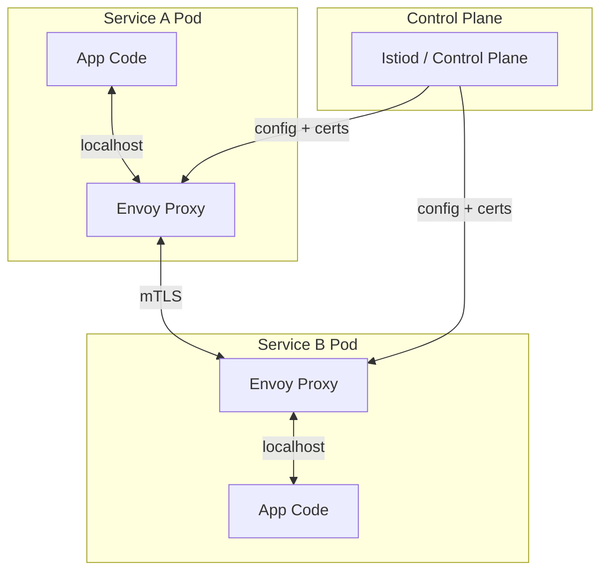

# Service Mesh

## What it is

A service mesh is a dedicated infrastructure layer for managing service-to-service communication. It handles traffic management, security (mTLS), observability, and resilience — without requiring code changes in your services.

```
Without service mesh: each service implements its own
  ├── Retry logic
  ├── Circuit breaker
  ├── TLS/mTLS
  ├── Distributed tracing
  ├── Rate limiting
  └── Load balancing

With service mesh: sidecar proxy handles all of this
  ├── Order Service (business logic only)
  └── Envoy sidecar (networking, observability, security)

→ Cross-cutting concerns extracted from application code
→ Consistent behavior across all services, regardless of language
```

## Architecture



**Data plane:** Envoy sidecars — handle actual traffic.  
**Control plane:** Istiod (Istio) — distributes config and certificates to all proxies.

## Sidecar injection

```yaml
# Kubernetes: enable auto-injection per namespace
kubectl label namespace production istio-injection=enabled

# All new pods in this namespace get an Envoy sidecar injected automatically
# No Dockerfile or application code change needed
```

```yaml
# Resulting pod has 2 containers:
# Container 1: order-service (your app)
# Container 2: istio-proxy (Envoy, injected by Istio)
kubectl describe pod order-service-abc123
# Containers:
#   order-service:   (your app, port 8080)
#   istio-proxy:     (Envoy, listening on all ports, intercepts all traffic)
```

## Traffic management

### Virtual Services (routing rules)

```yaml
# Route 90% to stable, 10% to canary
apiVersion: networking.istio.io/v1beta1
kind: VirtualService
metadata:
  name: order-service
spec:
  hosts:
    - order-service
  http:
    - match:
        - headers:
            x-canary-user:
              exact: "true"
      route:
        - destination:
            host: order-service
            subset: canary
    - route:
        - destination:
            host: order-service
            subset: stable
          weight: 90
        - destination:
            host: order-service
            subset: canary
          weight: 10
```

```yaml
# DestinationRule: define stable and canary subsets
apiVersion: networking.istio.io/v1beta1
kind: DestinationRule
metadata:
  name: order-service
spec:
  host: order-service
  trafficPolicy:
    connectionPool:
      tcp:
        maxConnections: 100
      http:
        http2MaxRequests: 1000
    outlierDetection:          # circuit breaker
      consecutiveGatewayErrors: 5
      interval: 30s
      baseEjectionTime: 30s
      maxEjectionPercent: 50
  subsets:
    - name: stable
      labels:
        version: stable
    - name: canary
      labels:
        version: canary
```

### Retries

```yaml
apiVersion: networking.istio.io/v1beta1
kind: VirtualService
metadata:
  name: payment-service
spec:
  hosts:
    - payment-service
  http:
    - route:
        - destination:
            host: payment-service
      timeout: 10s
      retries:
        attempts: 3
        perTryTimeout: 3s
        retryOn: 5xx,reset,connect-failure,retriable-4xx
```

### Fault injection (chaos testing)

```yaml
# Inject 100ms latency to 10% of requests (test resilience)
apiVersion: networking.istio.io/v1beta1
kind: VirtualService
spec:
  http:
    - fault:
        delay:
          percentage:
            value: 10.0
          fixedDelay: 100ms
        abort:
          percentage:
            value: 1.0   # 1% of requests return 503
          httpStatus: 503
      route:
        - destination:
            host: payment-service
```

## Security (mTLS)

```yaml
# Enforce mTLS for all traffic in namespace
apiVersion: security.istio.io/v1beta1
kind: PeerAuthentication
metadata:
  name: default
  namespace: production
spec:
  mtls:
    mode: STRICT  # reject non-mTLS connections

# Authorization: order-service can call payment-service POST /charge only
apiVersion: security.istio.io/v1beta1
kind: AuthorizationPolicy
metadata:
  name: payment-service
  namespace: production
spec:
  selector:
    matchLabels:
      app: payment-service
  action: ALLOW
  rules:
    - from:
        - source:
            principals: ["cluster.local/ns/production/sa/order-service"]
      to:
        - operation:
            methods: ["POST"]
            paths: ["/charge", "/refund"]
```

**Certificate rotation:** Istio CA (built into istiod) automatically rotates service certificates every 24 hours. Services don't manage certs.

## Observability

Istio automatically generates:

```
Metrics (without any code change):
  istio_request_total{source="order-service", destination="payment-service", ...}
  istio_request_duration_milliseconds_bucket{...}
  
Distributed traces:
  Propagates B3 or W3C trace headers automatically
  Spans created for every service-to-service call
  → Jaeger/Zipkin/Datadog shows full request flow
  
Access logs:
  Every request logged with: method, path, status, duration, source, destination
```

```yaml
# Enable Prometheus scraping of Istio metrics
apiVersion: v1
kind: Service
metadata:
  annotations:
    prometheus.io/scrape: "true"
    prometheus.io/path: /stats/prometheus
    prometheus.io/port: "15020"  # Envoy metrics port
```

### Kiali (service mesh visualization)

```
kiali provides:
  - Service graph (visual topology)
  - Traffic flow between services (live)
  - Error rates per edge
  - Latency per edge
  - Security status (mTLS on/off per service)
```

## Traffic policies

```yaml
# Circuit breaker via DestinationRule
spec:
  trafficPolicy:
    outlierDetection:
      consecutiveGatewayErrors: 5    # 5 consecutive 5xx → eject
      consecutive5xxErrors: 5
      interval: 10s                  # evaluation window
      baseEjectionTime: 30s          # eject for 30s (exponential backoff)
      maxEjectionPercent: 50         # max 50% of endpoints ejected
      minHealthPercent: 30           # don't eject if only 30% healthy

# Connection pool limits (bulkhead)
    connectionPool:
      tcp:
        maxConnections: 100
        connectTimeout: 30ms
      http:
        http1MaxPendingRequests: 1000
        http2MaxRequests: 1000
        maxRequestsPerConnection: 10
        maxRetries: 3
```

## Egress control

Control which external services your pods can reach:

```yaml
# Block all external traffic by default
kubectl apply -f - <<EOF
apiVersion: networking.istio.io/v1beta1
kind: Sidecar
metadata:
  name: default
  namespace: production
spec:
  outboundTrafficPolicy:
    mode: REGISTRY_ONLY  # only allow registered external services
EOF

# Allow access to Stripe API
apiVersion: networking.istio.io/v1beta1
kind: ServiceEntry
metadata:
  name: stripe-api
spec:
  hosts:
    - api.stripe.com
  ports:
    - number: 443
      name: https
      protocol: HTTPS
  resolution: DNS
  location: MESH_EXTERNAL
```

## AWS alternatives

| Service mesh | Hosted on | Notes |
|---|---|---|
| **Istio** | EKS (self-managed) | Most feature-rich, complex to operate |
| **AWS App Mesh** | EKS, ECS, EC2 | Managed control plane, Envoy data plane |
| **AWS VPC Lattice** | Any VPC resource | No sidecar, L7 routing at VPC level |
| **Linkerd** | EKS (self-managed) | Simpler than Istio, Rust-based proxy |
| **Consul Connect** | Any | Works outside K8s, HashiCorp ecosystem |

### AWS App Mesh

```python
# App Mesh: managed Istio alternative for ECS/EKS
appmesh = boto3.client('appmesh')

# Create mesh
appmesh.create_mesh(meshName='production')

# Create virtual node (represents a service)
appmesh.create_virtual_node(
    meshName='production',
    virtualNodeName='order-service',
    spec={
        'listeners': [{'portMapping': {'port': 8080, 'protocol': 'http'}}],
        'serviceDiscovery': {
            'awsCloudMap': {
                'namespaceName': 'production.local',
                'serviceName': 'order-service',
            }
        },
        'backends': [
            {'virtualService': {'virtualServiceName': 'payment-service.production.local'}}
        ],
    }
)
```

## When to use a service mesh

```
Use service mesh when:
  ✓ 5+ microservices in production
  ✓ Need mTLS between all services (compliance, Zero Trust)
  ✓ Want consistent observability without per-service instrumentation
  ✓ Need fine-grained traffic control (canary, A/B, circuit breaking)
  ✓ Polyglot: services in Go, Java, Python → consistent networking

Skip service mesh when:
  ✗ Small number of services (2-3) → overhead not worth it
  ✗ Single language → library-level circuit breakers fine
  ✗ Latency budget is extremely tight → sidecar adds ~1-5ms
  ✗ Team unfamiliar with Kubernetes networking → steep learning curve
```

## Interview angle

!!! tip "What interviewers are testing"
    Service mesh comes up in "how do you handle cross-cutting concerns in microservices?"

**Strong answer pattern:**
1. Service mesh = sidecar proxy (Envoy) handles networking so app code doesn't have to
2. mTLS between all services — zero trust at the network level, automated cert rotation
3. Observability for free — metrics, traces, access logs without app code changes
4. Traffic management — canary deployments via weight shifting, not app-level feature flags
5. On AWS: App Mesh for managed control plane; Istio on EKS for most features

## Related topics

- [Zero Trust](../security/zero-trust.md) — mTLS is the Zero Trust mechanism
- [Circuit Breaker](../patterns/circuit-breaker.md) — outlier detection in service mesh
- [Distributed Tracing](../observability/tracing.md) — context propagation via mesh
- [Deployments](../cicd/deployment-strategies.md) — canary via VirtualService weight
- [Kubernetes](kubernetes.md) — service mesh runs on top of K8s
