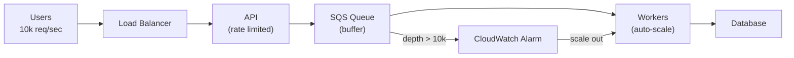

# Backpressure

## What it is

Backpressure is a mechanism for a downstream consumer to signal to an upstream producer to slow down, preventing the consumer from being overwhelmed. Without backpressure, a fast producer overwhelms a slow consumer — buffers fill up, memory exhausts, or data is dropped.

## The problem

```
Producer: 10,000 events/sec
Consumer: 1,000 events/sec

Without backpressure:
  Buffer fills: 9,000 events/sec accumulate
  After 1 minute: 9,000 × 60 = 540,000 buffered events
  Buffer full → events dropped or OOM crash
```

## Backpressure strategies

### Blocking (synchronous)

Producer blocks until consumer is ready:

```
Producer → BLOCKED → Consumer processes → unblocks → Producer continues
```

- Simple to implement
- Producer threads tied up during block
- Risk: deadlock if not careful

**Example:** Java `BlockingQueue.put()` — blocks producer when queue is full.

```java
BlockingQueue<Event> queue = new LinkedBlockingQueue<>(1000); // bounded

// Producer: blocks when queue full
queue.put(event);  // waits until space available

// Consumer
Event e = queue.take();
```

### Buffering with queue depth signal

Use queue depth as a backpressure signal:

```
Queue depth < 80%: produce at full rate
Queue depth > 80%: slow down production
Queue depth = 100%: stop producing (or drop + alert)
```

**SQS queue depth → Auto Scaling:**
```
CloudWatch Alarm: SQS ApproximateNumberOfMessagesVisible > 10,000
→ Scale out consumer Auto Scaling Group
```

### Rate limiting with feedback

Producer checks consumer health before sending:

```
Producer → check consumer capacity endpoint
         → consumer responds: "currently at 80% capacity, slow to 500/s"
         → producer throttles to 500/s

# Reactive Streams protocol (Java):
# Consumer sends "request(N)" to receive N items
# Producer sends exactly N items
# Consumer sends next "request(N)" when ready
```

### Load shedding

When consumer can't keep up, deliberately drop lowest-priority requests:

```
Priority queue:
  P0 (critical payments): never shed
  P1 (user requests): shed if queue > 5000
  P2 (analytics events): shed if queue > 1000
  P3 (audit logs): best-effort only
```

### Debounce / throttle at producer

Reduce event volume at the source:

```python
# Debounce: only emit after N ms of inactivity
def debounce(func, wait_ms):
    timer = None
    def wrapper(*args):
        nonlocal timer
        if timer:
            timer.cancel()
        timer = threading.Timer(wait_ms / 1000, func, args)
        timer.start()
    return wrapper

# Throttle: emit at most once per N ms
def throttle(func, interval_ms):
    last_called = 0
    def wrapper(*args):
        nonlocal last_called
        now = time.time() * 1000
        if now - last_called >= interval_ms:
            last_called = now
            return func(*args)
    return wrapper
```

## Kafka backpressure

Kafka handles backpressure naturally through consumer offset management:

```
Producer: writes to partition at 10,000 events/sec
Consumer: reads from partition at 1,000 events/sec

Kafka stores unread events (consumer lag grows)
Consumer lag = backpressure signal
Alert on lag → scale consumers → lag reduces

Producer is never blocked — it produces at full speed
Consumer drains at its own pace
Storage is the buffer (bounded by retention policy)
```

**Consumer pause:**
```python
# When downstream is overwhelmed, pause consumption
consumer.pause(assigned_partitions)
# ... wait until downstream recovers ...
consumer.resume(assigned_partitions)
```

## Reactive backpressure (Reactive Streams / Project Reactor)

In reactive systems, backpressure is a first-class protocol:

```
Subscriber: request(10)    ← "I can handle 10 items"
Publisher: sends 10 items
Subscriber: processes... request(10)  ← "ready for 10 more"
Publisher: sends 10 items
```

Operators: `onBackpressureBuffer()`, `onBackpressureDrop()`, `onBackpressureLatest()`

```java
Flux.range(1, 1_000_000)
    .onBackpressureBuffer(1000)    // buffer up to 1000, then error
    .publishOn(Schedulers.boundedElastic())
    .subscribe(item -> slowProcess(item));
```

## TCP backpressure

TCP has built-in backpressure via **window size**:

```
Receiver: "I have 64KB receive buffer available" → window=64KB
Sender: sends up to 64KB without waiting for ACK
Receiver buffer fills: window=0KB → "stop sending"
Sender: stops (zero-window probe every T seconds)
Receiver processes data: buffer frees → window=32KB → "you can send again"
```

This is why TCP is "flow-controlled" — and why slow consumers eventually slow TCP producers.

## Backpressure in system design



**Design checklist:**
- Every async pipeline has bounded buffers
- Queue depth is monitored as a SLO metric
- Auto-scaling triggered by queue depth, not just CPU
- DLQ for messages that can't be processed
- Producers have circuit breakers for when consumers are down

## Interview angle

!!! tip "What interviewers are testing"
    They want to see you think about what happens when traffic exceeds consumer capacity — not just the happy path.

**Strong answer pattern:**
1. Identify producer-consumer mismatches in your design
2. Use a queue as the buffer — queue depth is your backpressure indicator
3. Auto-scale consumers based on queue depth, not CPU
4. Implement load shedding for non-critical events when queue is full
5. Design consumers to be idempotent (safe to retry after backpressure-related reprocessing)

## Related topics

- [Message Queues](message-queues.md) — queue depth as natural backpressure
- [Rate Limiting](../patterns/rate-limiting.md) — backpressure at the API level
- [Circuit Breaker](../patterns/circuit-breaker.md) — stop sending to overwhelmed downstream
- [Kafka Deep Dive](kafka.md) — consumer lag as Kafka's backpressure signal
