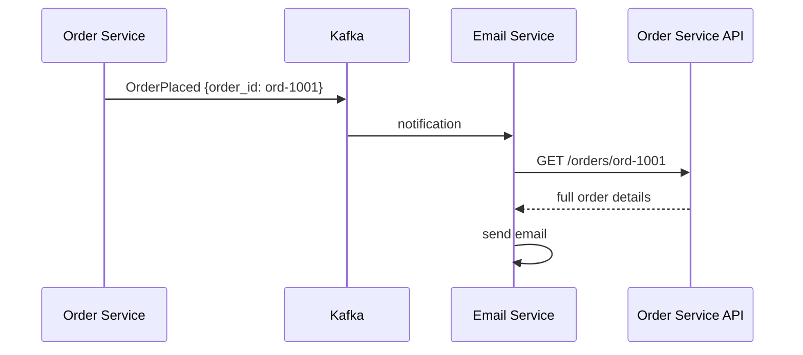

---
tags:
  - applied
  - for-scale
---

# Event Payload Design

What goes inside an event? This question seems trivial but determines whether your event-driven system stays maintainable or rots into chaos. **Fat events vs thin events**, **state-carrying vs notification**, **immutability and versioning** — the decisions you make here echo through every consumer.

For *event-driven concepts*, see [Event-Driven Architecture](../architecture/event-driven.md). For *schema versioning*, see [Event Schema Evolution](event-schema-evolution.md). This page is about **what data to put in each event**.

---

## The fundamental question

```
OrderPlaced event — what's inside?

Option A (thin / notification):
  {"order_id": "ord-1001", "occurred_at": "..."}
  Consumers fetch details from API when needed.

Option B (state-carrying / fat):
  {"order_id": "ord-1001", "user_id": "u1", "items": [...], "total": 9900, ...}
  Consumers have everything they need.

Option C (delta):
  {"order_id": "ord-1001", "changes": {"status": "placed"}}
  Consumers apply the delta to their copy.
```

Each has trade-offs. Real systems mix all three.

---

## Pattern 1: Notification events (thin)

The event just announces that something happened. Consumers fetch details if needed.

```json
{
  "event_type": "OrderPlaced",
  "event_id": "evt-abc-123",
  "order_id": "ord-1001",
  "occurred_at": "2026-05-11T10:00:00Z"
}
```

### Diagram



### When it fits

- Producers want minimal coupling; consumers know where to look up details
- Event is purely a signal (consumer doesn't always need details)
- Detail data is sensitive (avoid putting in events for compliance)
- Detail data is large (videos, blobs)

### Trade-offs

**Pros**:
- Small events; cheap to publish and store
- Producer schema changes less impactful (events don't expose details)
- Less data duplication

**Cons**:
- Every consumer needs to call back to producer's API
- Increased load on producer service from N consumers
- Race conditions: by the time consumer fetches, state may have changed
- Producer must keep API working forever (consumers depend on it)

**Race condition example**:

```
T0: OrderPlaced event published (order status: placed)
T1: Order cancelled (status: cancelled)
T2: Email consumer receives the (older) OrderPlaced event
T3: Email consumer calls GET /orders/ord-1001
T4: API returns status: cancelled

→ Email consumer is confused: was told the order was placed, but API says cancelled.
```

Notification events lose their value when state changes faster than consumers process them.

---

## Pattern 2: State-carrying events (fat)

The event contains all relevant state. Consumers operate purely on the event.

```json
{
  "event_type": "OrderPlaced",
  "event_id": "evt-abc-123",
  "order_id": "ord-1001",
  "user_id": "u-42",
  "user_email": "alice@example.com",
  "items": [
    {"product_id": "p1", "quantity": 2, "price_cents": 4500},
    {"product_id": "p2", "quantity": 1, "price_cents": 900}
  ],
  "subtotal_cents": 9900,
  "tax_cents": 990,
  "total_cents": 10890,
  "shipping_address": {...},
  "occurred_at": "2026-05-11T10:00:00Z"
}
```

### When it fits

- Consumers should be self-sufficient (no callbacks to producer)
- The event represents a moment-in-time snapshot (no race condition issues)
- Event log is also the audit log (everything needed is in the event)
- Multiple consumers benefit from same data — reduces N×API-call load

### Trade-offs

**Pros**:
- Consumers fully decoupled; no callbacks
- No race conditions (event is self-contained)
- Replay works perfectly (events recreate state from a point in time)
- Audit trail is complete

**Cons**:
- Events larger (more storage, network)
- Sensitive data in events (encryption / restricted access)
- Schema changes affect everyone (one big payload)
- Data duplication (same user info in many events)

**Common rule of thumb**: prefer fat events. The decoupling benefit usually outweighs the cost.

---

## Pattern 3: Delta events

Only the change is in the event; consumers apply it to their copy of state.

```json
{
  "event_type": "OrderUpdated",
  "event_id": "evt-abc-789",
  "order_id": "ord-1001",
  "changes": {
    "status": {"from": "pending", "to": "placed"},
    "total_cents": {"from": 9900, "to": 10890}
  },
  "occurred_at": "2026-05-11T10:00:00Z"
}
```

### When it fits

- Consumers maintain their own state copy (event sourcing flavour)
- Want to minimise event size
- Changes are small relative to total state

### Trade-offs

**Pros**:
- Small events
- Easy to see what changed (audit-friendly)

**Cons**:
- Consumers need full history to reconstruct state (or snapshots)
- Out-of-order delivery breaks state reconstruction
- New consumers need a snapshot + replay to bootstrap
- Lost events cause permanent state divergence

Best for event-sourced systems where consumers are designed to reduce events into state.

---

## The recommended default: fat events with care

For most production systems, **fat events are the right default**. Reasons:

```
1. Decoupling is the main benefit of event-driven architecture.
   Notification events undo half of that benefit.
   
2. Race conditions in notification model are real and hard to debug.
   Fat events eliminate them.
   
3. Storage is cheap; engineering time isn't.
   Events are typically <10KB; storage cost is negligible at any sane scale.
   
4. Replay actually works.
   Fat events let you spin up a new consumer and have it function correctly.
```

But: **with care** means thinking about what NOT to include.

---

## What to include — and what not to

### Include

```
✓ Identifier of the entity (order_id, user_id)
✓ The state changes that occurred
✓ Timestamps (event time, processing time)
✓ Event metadata (event_id for idempotency, version, source)
✓ Related context (user_email if email consumer is downstream)
✓ Snapshot of relevant state at event time
```

### Don't include

```
✗ Sensitive raw PII (full social security number, raw passwords — never)
✗ Encrypted blobs that are useless to consumers anyway
✗ Computed values that consumers can derive
✗ Internal IDs / database-specific keys (use stable business keys)
✗ Implementation details of the producer
✗ Large binary data (use a reference: S3 URL + checksum)
✗ Cross-aggregate state that doesn't belong to this event
```

### Example: what NOT to do

```json
// BAD: includes internal DB state, sensitive raw data, derived values
{
  "event_type": "OrderPlaced",
  "internal_db_id": 184729482,             // ✗ internal
  "user_password_hash": "...",             // ✗ NEVER
  "user_ssn": "123-45-6789",               // ✗ sensitive raw PII
  "total_cents_in_words": "nine thousand nine hundred",  // ✗ derived
  "_internal_routing_key": "shard-3",      // ✗ implementation detail
  "raw_db_row": {...}                       // ✗ tightly couples to schema
}

// GOOD: business-meaningful, stable, useful
{
  "event_type": "OrderPlaced",
  "event_id": "evt-abc-123",
  "schema_version": "1.0",
  "order_id": "ord-1001",
  "user_id": "u-42",
  "user_email": "alice@example.com",
  "items": [...],
  "total_cents": 9900,
  "occurred_at": "2026-05-11T10:00:00Z"
}
```

---

## Event envelope vs payload

Separate the **metadata** (envelope) from the **data** (payload).

```json
{
  // ─── ENVELOPE: metadata about the event ───
  "specversion": "1.0",
  "id": "evt-abc-123",            // unique; for idempotency
  "source": "orders-service",     // who emitted it
  "type": "com.example.order.placed",
  "subject": "ord-1001",          // entity this is about
  "time": "2026-05-11T10:00:00Z",
  "datacontenttype": "application/json",
  "tracing": {
    "trace_id": "...",
    "span_id": "..."
  },
  
  // ─── PAYLOAD: the actual event data ───
  "data": {
    "order_id": "ord-1001",
    "user_id": "u-42",
    "items": [...]
  }
}
```

This is the **CloudEvents** spec. Provides:

- Standard metadata across event types
- Tooling compatibility
- Tracing context propagation
- Separates "what kind of event" from "what's in it"

For new event-driven systems, **wrap events in CloudEvents**. Standard tooling expects it.

---

## Event size considerations

### Typical sizes

```
Tiny notification:   <500 bytes
Thin state event:    1-5 KB
Fat state event:     5-50 KB
Heavy event:         50-500 KB (rarely justified)
Too large:           >1 MB (compress, externalise, or redesign)
```

### Kafka limits

```
default max.message.bytes:        1 MB
configurable per topic:           up to ~100 MB practical (much higher possible)

Larger messages =
  - Higher latency
  - More memory pressure
  - Slower replication
  - Awkward to debug
```

### Large payload pattern: externalise to object storage

```json
{
  "event_type": "VideoUploaded",
  "video_id": "vid-1001",
  "user_id": "u-42",
  "video_url": "s3://uploads/vid-1001.mp4",      // reference, not content
  "metadata_url": "s3://uploads/vid-1001.meta.json",
  "checksum": "sha256:abc..."                    // for integrity verification
}
```

Event stays small; large data lives in S3. Consumers download what they need.

### Compression

Modern Kafka supports compression at the producer side:

```python
producer = KafkaProducer(
    bootstrap_servers='kafka:9092',
    compression_type='zstd',   # or 'lz4', 'gzip', 'snappy'
)
```

Typically 50-90% reduction for text-heavy events. **Always enable compression for high-volume topics** — both storage and network bandwidth savings.

---

## Idempotency and identity in events

Every event needs a unique ID for consumer deduplication.

```json
{
  "event_id": "evt-abc-123",       // globally unique
  "idempotency_key": "ord-1001",   // for business-level dedup
  ...
}
```

### Two kinds of dedup

**Technical dedup** (consumer hardening):
```python
def handle_event(event):
    if already_processed(event['event_id']):
        return  # idempotent: skip duplicate
    process(event)
    mark_processed(event['event_id'])
```

**Business dedup** (the actual data layer):
```python
def handle_order_placed(event):
    # Use order_id as the dedup key; even if event is duplicated,
    # processing same order_id twice is safe
    db.execute(
        "INSERT INTO orders (id, ...) VALUES (%s, ...) "
        "ON CONFLICT (id) DO NOTHING",
        (event['data']['order_id'], ...)
    )
```

Both layers help. See [Idempotent Consumers in Production](idempotent-consumers.md) for depth.

---

## Event naming conventions

```
Event names describe past-tense FACTS:
  ✓ OrderPlaced
  ✓ UserSignedUp
  ✓ PaymentCharged
  ✓ ShipmentDelivered

NOT commands or queries:
  ✗ CreateOrder        (that's a command, not an event)
  ✗ GetUser            (that's a query)
  ✗ UpdateProfile      (vague; what changed?)
```

Past-tense + specific. The event is a **fact about something that happened** in the past — immutable, named accordingly.

### Topic vs event type

```
Topic:        orders.events  (or orders.placed for finer-grained topics)
Event type:   com.example.order.placed
```

A single topic can carry multiple event types (Saga events, lifecycle events for one aggregate). Or one event type per topic. Trade-offs:

| Strategy | Pros | Cons |
|---|---|---|
| Topic per event type | Easy to subscribe to just one event | Many topics (1000s in big systems) |
| Topic per aggregate | All events for an aggregate ordered | Consumers filter by type |
| Single firehose | One topic, all events | No isolation; difficult ordering |

**Default**: topic per aggregate (orders.events for all order-related events). Strikes a balance.

---

## Ordering and partitioning

If events for the same entity must be processed in order, **partition by the entity ID**.

```python
producer.send(
    topic='orders.events',
    key=order_id,              # partition key
    value=event_payload
)
```

All events with the same `key` go to the same partition. Kafka guarantees order within a partition.

```
Partition by order_id:
  Order ord-1001: placed → paid → shipped → delivered → all on partition 3
  Order ord-1002: placed → paid → cancelled → all on partition 7

→ Consumer reading partition 3 sees ord-1001's events in correct order
→ Consumer reading partition 7 sees ord-1002's events in correct order
→ No ordering guarantee between ord-1001 and ord-1002 (different partitions)
```

This is usually what you want — order matters per-entity, not globally.

---

## Schema and event payloads

Each event has a schema. See [Event Schema Evolution](event-schema-evolution.md) for the full story.

### Quick rules for payload design that ages well

```
✓ Use stable business keys (order_id) — not internal DB IDs
✓ Mark optional fields explicitly with nullable + default
✓ Include schema_version explicitly OR use schema registry
✓ Don't reuse field names with different semantics
✓ Use ISO 8601 for timestamps (with timezone)
✓ Use enums for status fields; document allowed values
✓ Avoid free-form maps when structured types work
✓ Avoid deeply nested structures (>3 levels gets confusing)
```

---

## Tracing and observability in events

Include tracing context so distributed traces span event boundaries:

```json
{
  "event_id": "evt-abc-123",
  "tracing": {
    "trace_id": "abc123-0011...",     // OpenTelemetry trace ID
    "span_id": "def456...",            // parent span
    "trace_flags": "01"
  },
  "data": {...}
}
```

Consumers extract this and continue the trace:

```python
def handle_event(event):
    ctx = extract_trace_context(event['tracing'])
    with tracer.start_span("handle_order_placed", context=ctx):
        process(event)
```

End-to-end: user request creates trace → event published with trace context → 5 consumers process → all spans appear in same trace in Jaeger/Tempo/X-Ray.

---

## Anti-patterns

### Anti-pattern 1: Events as RPC

```json
{
  "event_type": "SendEmailRequest",
  "to": "...",
  "subject": "...",
  "body": "..."
}
```

This isn't an event — it's a command dressed up. Real events describe facts; commands describe requests. Mixing them creates confusion.

Better: have a clear separation. Events for "X happened"; commands for "do Y."

### Anti-pattern 2: Aggregating multiple things in one event

```json
{
  "event_type": "OrderProcessed",
  "order": {...},
  "payment": {...},
  "shipment": {...},
  "customer_notification_sent": true,
  "loyalty_points_awarded": 50,
  "inventory_decremented": true
}
```

This is multiple distinct events crammed into one. Each consumer wades through the whole thing to find what they care about. And what does "processed" even mean — was each step successful?

Better: separate events for each step. PaymentCharged, ShipmentInitiated, NotificationSent, etc.

### Anti-pattern 3: Mutable history

```
Producer realises a previous event was wrong; rewrites the event in Kafka.
```

Events are immutable. Correct with new events: PaymentCorrected, OrderAmountAdjusted.

### Anti-pattern 4: Free-form maps

```json
{
  "event_type": "UserUpdated",
  "fields": {
    "email": "new@example.com",
    "preferences.notifications.email": true,
    "addresses.0.street": "..."
  }
}
```

Dotted-path strings as keys lose all type safety. Schema can't enforce. Document properly with a structured event:

```json
{
  "event_type": "UserEmailChanged",
  "old_email": "old@example.com",
  "new_email": "new@example.com"
}
```

One specific event per change type is verbose but clear.

### Anti-pattern 5: PII in event topics with long retention

```
Kafka topic with 7-day retention contains events with raw PII.
GDPR request comes in: delete this user's data.
You'd have to scan/rewrite a week of events.
```

Mitigation:
- Don't put unnecessary PII in events
- Encrypt PII fields with per-user keys; delete the key on GDPR request (crypto-shredding)
- Use references (user_id) instead of values (email) where possible

### Anti-pattern 6: Including the entire object state in every event

```json
{
  "event_type": "OrderItemAdded",
  "order": {...complete 50KB order object...}
}
```

Includes everything every time. Better:

```json
{
  "event_type": "OrderItemAdded",
  "order_id": "ord-1001",
  "item": {...},
  "new_total_cents": 11890
}
```

Just the relevant new info + identifier.

---

## Decision matrix

| Question | If yes | If no |
|---|---|---|
| Multiple consumers need rich detail? | Fat events | Notification events |
| Sensitive data unavoidable in event? | Encrypt fields; short retention | Fat events |
| Replay critical for new consumers? | Fat events | Either works |
| Storage cost meaningful at your scale? | Consider thin events + API | Fat events |
| Consumer needs latest state, not historical? | Notification + API | Fat events |
| Cross-aggregate data in one event? | Probably split into multiple events | OK to include |
| Out-of-order arrival possible? | Avoid delta events; use fat events with timestamps | Either |

Most teams converge on: **fat events for primary use cases, notification events for high-volume + always-fresh-required reads**.

---

## Real-world examples

### Stripe webhook events

```json
{
  "id": "evt_1NABC...",
  "object": "event",
  "type": "charge.succeeded",
  "data": {
    "object": {
      "id": "ch_3NABC...",
      "amount": 9900,
      "currency": "usd",
      "customer": "cus_XYZ...",
      "description": "...",
      "metadata": {...},
      // ... lots more ...
    }
  },
  "created": 1700000000
}
```

Fat events. Everything a consumer needs is in `data.object`. Schema versioning via API versioning (`api_version` in the event).

### AWS S3 PutObject event

```json
{
  "eventVersion": "2.1",
  "eventSource": "aws:s3",
  "eventName": "ObjectCreated:Put",
  "s3": {
    "bucket": {"name": "my-bucket"},
    "object": {
      "key": "uploaded.jpg",
      "size": 12345,
      "eTag": "..."
    }
  }
}
```

Notification event. Consumer calls S3 to actually get the bytes if needed. Fits because S3 stores the object regardless.

### GitHub webhook events

Mixed. Push events are fat (full commit list). Issue comments are mid-sized. Star events are thin notifications.

---

## Quick-reference checklist

```
Naming:
  ☐ Past tense, specific (UserSignedUp, OrderPlaced)
  ☐ Domain-prefixed type (com.example.order.placed)

Envelope:
  ☐ event_id (unique, for idempotency)
  ☐ event_type (semantic, stable)
  ☐ schema version or registry ID
  ☐ occurred_at / event_time (ISO 8601 with TZ)
  ☐ source (which service emitted)
  ☐ tracing context (trace_id, span_id)

Payload:
  ☐ Business identifiers (order_id, user_id) — not internal DB IDs
  ☐ Self-contained state (fat events default)
  ☐ No sensitive raw PII without crypto-shredding plan
  ☐ Large data externalised (S3 URL + checksum)
  ☐ Structured fields, not free-form maps

Schema:
  ☐ Registered with schema registry
  ☐ Backward-compatible
  ☐ Code generated from schema

Operational:
  ☐ Compression enabled (zstd/lz4)
  ☐ Partition key includes entity ID for ordering
  ☐ Tracing context propagated
```

---

## Interview angle

!!! tip "What interviewers are testing"
    Whether you've operated event-driven systems and seen what makes events maintainable vs disastrous.

**Strong answer pattern:**
1. Default to fat events — self-contained, decoupled consumers
2. Use CloudEvents envelope + Avro/Protobuf payload + schema registry
3. Business keys (order_id) not internal IDs
4. Past-tense names; one event per fact
5. Externalise large data (S3 reference); don't put 1MB in Kafka
6. Include tracing context for distributed tracing
7. Partition key = entity ID for per-entity ordering

**Common follow-up:** *"You have an OrderPlaced event with 50KB of data. A consumer only needs the total amount. Wasteful?"*
> Marginally — but the cost is low (storage is cheap, network in-region is cheap) and the benefit is significant: that consumer never has to call back to the order service. If the consumer breaks and replays a million events from history, it just works. If we moved to thin events with API callbacks, every consumer adds load to the order service and inherits the race-condition risk of "by the time I look up the details, state has moved on." 50KB × 1M events = 50GB — that's a Redis instance, not a real concern at most scales. The decoupling buy is worth it.

---

## Related

- [Event-Driven Architecture](../architecture/event-driven.md) — broader pattern
- [Event Schema Evolution](event-schema-evolution.md) — versioning over time
- [Idempotent Consumers in Production](idempotent-consumers.md) — handling events safely
- [Event Streaming (Kafka)](event-streaming.md) — the substrate
- [Outbox Pattern](../patterns/outbox.md) — reliable publishing
- [CloudEvents](https://cloudevents.io/) — spec for event envelopes
