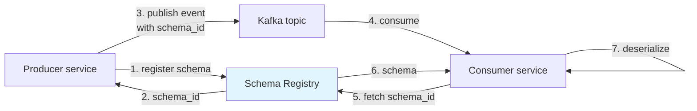

---
tags:
  - applied
  - for-scale
---

# Event Schema Evolution

Events live forever. Schemas don't. **How you evolve event schemas determines whether your event-driven system stays alive or becomes a graveyard of consumer breakages.** This page covers the patterns, the schema registry concept, and the gotchas of versioning events in production.

For the *concept* of event-driven architecture, see [Event-Driven Architecture](../architecture/event-driven.md). This is the applied companion for evolving event schemas safely.

---

## Why event schemas are special

```
HTTP API change:
  Deploy new version → old clients break → you can pressure them to upgrade
  Revert deploy → all clients back to working

Event schema change:
  Publish event with new schema → consumers break → events keep flowing
  Events in Kafka topic: 7 days of retention, all in old format
  Consumers maintained by other teams, can't coordinate deploy timing
  Old events in archive: years of history with old schema
```

Events have **two consumers across time**: the consumers you have today, and any future replay (analytics, new services, debugging). Both must read events that were valid when written.

---

## The compatibility matrix

The fundamental question: when schema changes, what works?

```
                          Old reader      New reader
Old event in topic        ✓               must read old
New event in topic        must read new   ✓
```

Different compatibility modes ensure different cells of this matrix:

| Mode | What it allows |
|---|---|
| **Backward compatibility** | New readers can read old events |
| **Forward compatibility** | Old readers can read new events |
| **Full compatibility** | Both — new readers read old; old readers read new |
| **None** | No constraints; total freedom; chaos |

**Default to backward compatibility** for most event systems. This lets you deploy new producers and new consumers independently, in any order.

---

## Backward compatibility rules

For new consumers to read old events:

```
✓ ADD an optional field (consumer can ignore missing field)
✓ ADD a new event type (consumers ignore unknown types)
✓ Make a required field optional (relaxing constraints is safe)

✗ REMOVE a field (old consumers expect it)
✗ Make an optional field required (old events don't have it)
✗ Change a field's type
✗ Rename a field
✗ Reorder fields (in formats where order matters, like raw bytes)
```

### Examples

**Backward compatible addition**:

```json
// v1 (old)
{
  "event_type": "OrderPlaced",
  "order_id": "ord-1001",
  "user_id": "u-42",
  "amount_cents": 9900
}

// v2 (new) — added currency field with default
{
  "event_type": "OrderPlaced",
  "order_id": "ord-1001",
  "user_id": "u-42",
  "amount_cents": 9900,
  "currency": "USD"        // NEW, optional with default
}
```

A v1 event can be parsed by a v2 consumer (it just sees no currency, uses default).
A v1 consumer can parse a v2 event (it ignores the extra field).

**NOT backward compatible**:

```json
// v1
{"order_id": "ord-1001", "amount": 9900}

// v2 — renamed field
{"order_id": "ord-1001", "amount_cents": 9900}   // ✗ existing consumers expect "amount"
```

To rename: keep both fields temporarily, deprecate over time.

---

## Forward compatibility rules

For old consumers to read new events (less common requirement):

```
✓ Old consumer ignores unknown fields gracefully
✓ Producers can add fields without breaking old consumers

✗ Old consumer crashes on unknown fields
```

Most modern serialisation formats (Avro, Protobuf with `unknown_fields`) handle this automatically. JSON requires `additionalProperties: true` in JSON Schema (or just ignore unknown fields in code).

---

## Schema formats compared

| Format | Schema evolution | Compactness | Speed | Schema registry |
|---|---|---|---|---|
| **JSON** | Manual; convention-based | Verbose | Slow parse | Optional (JSON Schema) |
| **Protobuf** | Strong evolution rules | Compact (binary) | Fast | Optional |
| **Avro** | Designed for evolution | Compact (binary) | Fast | Mandatory (with Confluent) |
| **MessagePack** | Like JSON in binary | Compact | Fast | None standard |
| **CloudEvents** | Spec for event envelopes | Wraps any format | n/a | n/a |

### Avro (industry default for Kafka)

```json
// User v1 schema
{
  "type": "record",
  "name": "UserCreated",
  "fields": [
    {"name": "user_id", "type": "string"},
    {"name": "email", "type": "string"}
  ]
}

// User v2 — add optional field with default
{
  "type": "record",
  "name": "UserCreated",
  "fields": [
    {"name": "user_id", "type": "string"},
    {"name": "email", "type": "string"},
    {"name": "name", "type": ["null", "string"], "default": null}  // optional with default
  ]
}
```

A v1 event can be read with v2 schema; missing `name` defaults to null. A v2 event can be read with v1 schema; v1 reader ignores the extra field.

### Protobuf

```protobuf
// v1
message UserCreated {
  string user_id = 1;
  string email = 2;
}

// v2 — add optional field
message UserCreated {
  string user_id = 1;
  string email = 2;
  optional string name = 3;  // safe addition
}
```

Protobuf field numbers are crucial — they're the actual identifier on the wire. **Never reuse a field number.** Renaming a field is safe (number unchanged); removing one means reserving its number.

```protobuf
// Removed field 3? Reserve it
message UserCreated {
  string user_id = 1;
  string email = 2;
  reserved 3;            // reserved (formerly "name")
  reserved "name";       // reserve the name too
}
```

### JSON Schema (for JSON events)

```json
{
  "$schema": "http://json-schema.org/draft-07/schema",
  "type": "object",
  "additionalProperties": true,        // forward compat: allow unknown fields
  "required": ["user_id", "email"],     // required fields
  "properties": {
    "user_id": {"type": "string"},
    "email": {"type": "string"},
    "name": {"type": "string"}          // optional (not in required)
  }
}
```

JSON Schema is less strict than Avro/Protobuf. Compatibility rules need to be enforced via tooling.

---

## Schema registry

A central service that stores all schemas with versioning and compatibility enforcement.



### What the registry enforces

```
1. Schema registration rejected if it's incompatible with previous versions
2. Each schema gets a unique ID; events carry just the ID, not full schema
3. Consumers fetch schema by ID on first encounter; cache locally
4. Compatibility level configurable per topic (backward, forward, full, none)
```

### Confluent Schema Registry (industry standard)

```python
from confluent_kafka import Producer
from confluent_kafka.schema_registry import SchemaRegistryClient
from confluent_kafka.schema_registry.avro import AvroSerializer

schema_str = """
{
  "type": "record",
  "name": "UserCreated",
  "fields": [
    {"name": "user_id", "type": "string"},
    {"name": "email", "type": "string"}
  ]
}
"""

sr_client = SchemaRegistryClient({'url': 'http://schema-registry:8081'})
avro_serializer = AvroSerializer(sr_client, schema_str)

producer = Producer({'bootstrap.servers': 'kafka:9092'})
producer.produce(
    topic='users.created',
    value=avro_serializer({'user_id': 'u1', 'email': 'a@b.com'}, ...)
)
```

Behind the scenes:
- First publish registers the schema → registry returns schema ID 42
- Event payload prefixed with magic byte + schema_id (5 bytes total)
- Consumer reads schema_id, fetches schema (cached), deserialises
- Producer publishing a v2 schema: registry checks backward compat, accepts or rejects

### Topic naming conventions

```
Subject (schema name) per topic:
  users.created-value      # schema for UserCreated events on "users.created" topic
  users.created-key        # schema for the key (if structured)

Compatibility: configurable per subject
```

### Other registries

- **Apicurio Registry** — open-source alternative to Confluent
- **AWS Glue Schema Registry** — AWS-managed
- **Buf Schema Registry** — Protobuf-specific
- **Schemata** — for non-Kafka systems

For new builds: **use a schema registry from day 1**. Retrofitting later is painful.

---

## Compatibility modes — picking the right one

### Backward compatibility (most common)

```
New schema can read events written by old schema.
Allows: add optional fields, add new event types.

Deployment order: deploy new consumers FIRST (they can read both), then new producers.
Cost: producers must wait for consumer upgrade before adding required fields.
```

Use this 90% of the time.

### Forward compatibility

```
Old schema can read events written by new schema.
Allows: remove fields (old reader ignores), make required optional (old reader still sees value).

Deployment order: deploy new producers FIRST (consumers tolerate change), then update consumers.
Cost: harder to add fields (old consumers may need them).
```

Use when producers move faster than consumers (rare).

### Full compatibility

```
Both backward AND forward.
Allows only: adding optional fields with defaults.

Deployment order: independent.
Cost: strictest — many changes prohibited.
```

Use for highly-stable contracts (financial events, regulatory data).

### None (no compatibility check)

```
Any change accepted.
Allows: anything.

Cost: producers/consumers must coordinate every change manually.
```

Useful for: internal-only topics where teams coordinate tightly; temporary topics; or when you don't care.

---

## Real-world evolution scenarios

### Scenario 1: Adding a new field

```
v1: {"user_id": "u1", "email": "a@b.com"}
v2: {"user_id": "u1", "email": "a@b.com", "name": "Alice"}
```

**Backward compatible** if `name` is optional with a default.

**Deployment**:
1. Register v2 schema in registry (compat check passes)
2. Deploy new consumers (handle both v1 and v2 events)
3. Deploy producers using v2 schema
4. Eventually old v1 events age out of retention

### Scenario 2: Renaming a field

```
v1: {"user_id": "u1", "phone": "+1..."}
v2: {"user_id": "u1", "phone_number": "+1..."}
```

**NOT compatible** if you just rename. Strategy:

```
Phase 1 (v2 schema): keep both fields
{"user_id": "u1", "phone": "+1...", "phone_number": "+1..."}
Producer writes both; consumers can read either.

Phase 2 (after all consumers updated to read phone_number):
Producer stops setting "phone".

Phase 3 (after retention period, all phone-only events aged out):
v3 schema removes "phone" field entirely.
```

Multi-step migration over weeks.

### Scenario 3: Changing field semantics

```
v1: {"amount": 99}    // dollars
v2: {"amount": 9900}  // cents
```

Same type, different meaning. **Semantically incompatible** but schema-compatible. The registry won't catch this.

**Strategy**: introduce a NEW field with the new semantic, deprecate the old:

```
v2: {"amount_legacy_dollars": 99, "amount_cents": 9900}
```

Consumers gradually switch to `amount_cents`. Eventually drop `amount_legacy_dollars`.

### Scenario 4: Splitting one event into two

```
v1: OrderPlaced (contains user, items, payment, shipping)
v2: OrderPlaced + PaymentInitiated + ShipmentRequested (three separate events)
```

**Major change**. Strategy:

```
Phase 1: Publish v1 event AND v2 events (dual-publish)
Phase 2: Update consumers to read from new events
Phase 3: Stop publishing v1
Phase 4: Drop v1 topic (or just let retention expire)
```

Use feature flags / config to control which events are published during transition.

### Scenario 5: Changing the partition key

```
v1: orders topic keyed by order_id
v2: orders topic keyed by user_id (for better partitioning)
```

This changes which partition a key lands on — **breaks order guarantees during transition**.

**Strategy**: create a new topic. Migrate consumers. Eventually deprecate the old topic. Don't try to change keying in-place.

---

## Anti-patterns

### Anti-pattern 1: No schema definition

```
Events are just JSON; no schema; consumers parse by inspection.
```

Inevitable result: producer changes field; consumer breaks; nobody knows until production.

Fix: write down the schema even informally; ideally use a registry.

### Anti-pattern 2: Schemas in code, not in a registry

```python
# Producer
event = {"user_id": user_id, "email": email}  # implicit schema

# Consumer
user_id = event["user_id"]  # what if producer renames?
```

Without a registry, schema is **distributed across code**. Changing it requires coordinating producer and all consumers manually.

Fix: even a `.avsc` file checked into a shared repo is better than nothing. Schema registry is best.

### Anti-pattern 3: Versioning by changing the event type name

```
v1 event_type: "user_created"
v2 event_type: "user_created_v2"
```

Now every consumer must subscribe to both topics or filter on event_type. Doubles the surface area; never converges.

Fix: use schema versioning within the schema (registry handles this); event type stays semantic.

### Anti-pattern 4: Breaking changes without deprecation

```
Tuesday: Producer changes field "name" → "first_name" + "last_name"
Wednesday: All consumers parsing "name" break
```

Fix: every breaking change goes through the multi-phase pattern (Scenario 2 above).

### Anti-pattern 5: Tightly-coupled cross-team consumers

```
Producer team owns events.
10 downstream teams parse the events.
Producer adds a field: 10 teams' code must adapt.
```

Mitigate with:
- **Schema registry compatibility enforcement** (breaks build before merge)
- **Consumer-driven contract tests** (consumers verify they handle changes)
- **Event documentation** (tell consumer teams about upcoming changes)

### Anti-pattern 6: Mutating historical events

```
Bug found in v1 events; team rewrites old events in Kafka to "fix" them.
```

Events are immutable. If you need to correct: publish a new corrective event ("OrderAmountCorrected") that consumers can apply.

---

## CloudEvents — the envelope spec

CNCF's CloudEvents standard wraps any payload format in a common envelope:

```json
{
  "specversion": "1.0",
  "id": "evt-abc-123",
  "source": "https://orders.example.com",
  "type": "com.example.order.placed",
  "subject": "order-1001",
  "time": "2026-05-11T10:00:00Z",
  "datacontenttype": "application/avro",
  "data": "..."           // your actual event payload
}
```

Provides:
- Common metadata across event types
- Tooling compatibility (Kafka, AWS, Azure, GCP all support CloudEvents)
- Standardised tracing context propagation

**Recommended** for new event-driven systems — gives you the envelope; you choose Avro/Protobuf/JSON for the inner payload.

---

## Versioning strategies

### Implicit versioning (registry-managed)

Each event registers with the registry; registry assigns version. Consumers fetch by ID.

```
event header: schema_id=42
registry: schema_id=42 → UserCreated v3
```

Most flexible; preferred with schema registry.

### Explicit versioning in event payload

```json
{
  "event_version": "v2",
  "user_id": "...",
  ...
}
```

Consumers branch on version:

```python
if event['event_version'] == 'v1':
    handle_v1(event)
elif event['event_version'] == 'v2':
    handle_v2(event)
```

Works without registry; verbose; consumers must handle every version.

### Per-event-type topics

```
orders.placed.v1
orders.placed.v2
```

Different topic per version. Consumers subscribe to whichever versions they handle.

**Pros**: clean separation. **Cons**: topic proliferation; producers publish to multiple topics during transition.

---

## Tooling

### Schema registry implementations

- **Confluent Schema Registry** (most popular for Kafka)
- **Apicurio Registry** (open-source alternative)
- **AWS Glue Schema Registry** (managed)
- **Buf Schema Registry** (Protobuf-focused)

### Compatibility checking in CI

```yaml
# Check schema compatibility before merge
- name: Check Avro compatibility
  run: |
    confluent schema-registry subject describe orders.placed-value
    confluent schema-registry compatibility check \
      --schema new-schema.avsc \
      --subject orders.placed-value
```

If a PR breaks backward compatibility, CI rejects it. Schema evolution becomes a code-review-able operation.

### Generating code from schemas

```bash
# Avro → Java/Python/Go code
avro-tools compile schema users.avsc src/

# Protobuf
protoc --go_out=. users.proto
```

Type-safe producers and consumers; compiler catches mismatches.

---

## Observability

```yaml
Track:
  ✓ Schema version distribution in flight (which versions are producers using?)
  ✓ Per-schema-version event rate
  ✓ Schema registry latency from consumer first-time fetches
  ✓ Deserialisation failures per topic / per consumer
  ✓ Compatibility check failures in CI (rejected schemas)
```

If you see "deserialisation failures spiked": a producer pushed an incompatible schema; check the registry.

---

## Best practices summary

```
✓ Use a schema registry from day 1
✓ Default to backward compatibility mode
✓ Use Avro or Protobuf (not raw JSON without schema)
✓ Wrap in CloudEvents envelope for tooling compat
✓ Generate code from schemas (don't hand-write parsing)
✓ Compatibility check in CI before merge
✓ Multi-phase migrations for breaking changes
✓ Document changes in changelogs visible to consumer teams
✓ Long Kafka retention (or external archive) means old schemas live a long time
✓ Events are immutable — corrections via new events, not mutations
```

---

## When schemas don't help

Some real-world cases the registry can't catch:

| Problem | Mitigation |
|---|---|
| Field type same, semantics changed (`amount` dollars → cents) | New field name; deprecation |
| Field value range narrowed (statuses 1-5 → 1-3) | Treat as breaking; deprecate old values |
| New "required" business rule | Consumer-side validation; not schema-level |
| Cross-event invariants ("OrderPlaced before OrderShipped") | Application logic; not schema |

Schema is one defence; not the only one. Pair with contract tests and integration tests.

---

## Interview angle

!!! tip "What interviewers are testing"
    Whether you've operated event-driven systems through real schema changes — not just designed greenfield.

**Strong answer pattern:**
1. Schema registry (Confluent or equivalent) with backward compat by default
2. Avro or Protobuf format; never raw JSON without schema
3. Multi-phase migrations for breaking changes (rename = keep both, deprecate, remove)
4. CloudEvents envelope for tooling compat
5. CI checks compatibility before merge
6. Events immutable; corrections via new events

**Common follow-up:** *"You have 2 years of Kafka history; need to add a new mandatory field; what do you do?"*
> Can't just make it required — old events don't have it. Multi-phase: (1) add as optional with default in schema v2; (2) backfill old events if possible (rewrite to new topic; depends on the case), or have consumers handle the default; (3) only if you've eliminated all events without the field, make it required in v3 — but usually the optional-with-default is the right permanent answer for events. New events get the field; old events use the default; consumers handle both.

---

## Related

- [Event-Driven Architecture](../architecture/event-driven.md) — broader pattern
- [Event Streaming (Kafka)](event-streaming.md) — the substrate
- [Event Payload Design](event-payload-design.md) — what goes in events
- [Idempotent Consumers in Production](idempotent-consumers.md) — handling events safely
- [Outbox Pattern](../patterns/outbox.md) — reliable event publishing
- [API Versioning at Architecture Level](../architecture/api-versioning-architecture.md) — similar concerns
