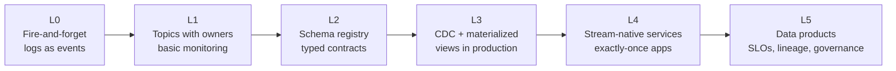
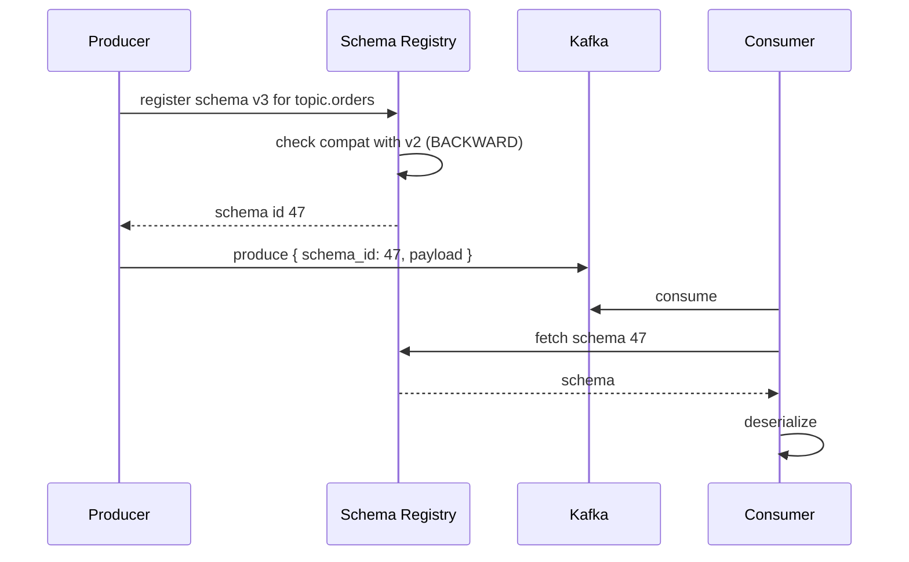
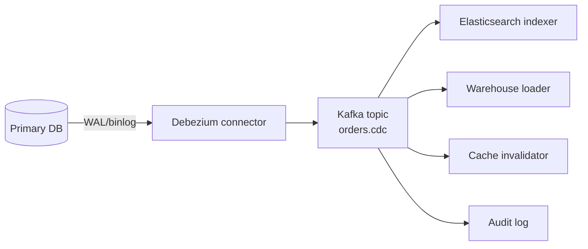
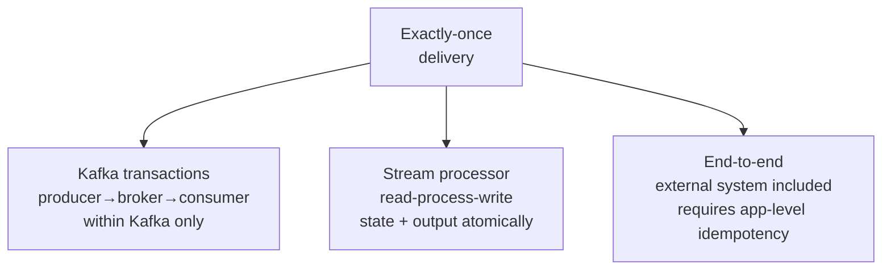
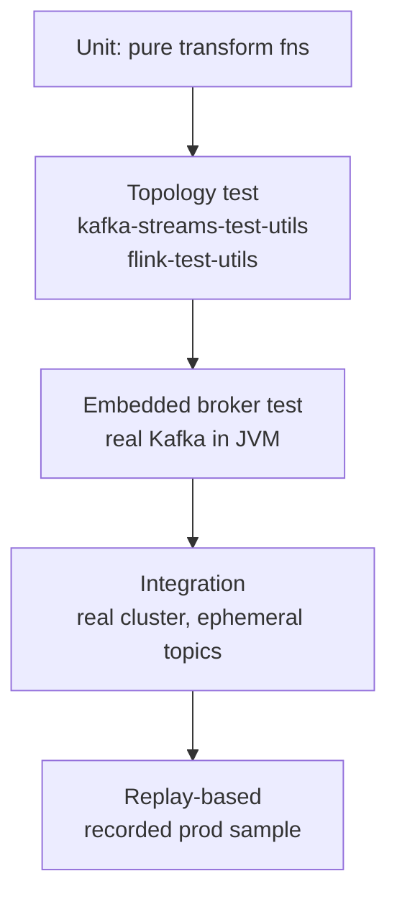

---
tags:
  - applied
  - for-scale
---

# Event Streaming Maturity

## You'll see this when...

- The first Kafka cluster was easy; the 50th topic is chaos — no one knows who owns what
- A schema change breaks three consumers nobody knew existed
- "Exactly once" was promised in a design doc and reality has not cooperated
- CDC pipelines silently fall behind and downstream dashboards lag by hours
- Replaying a topic to rebuild a state store takes 3 days

Streaming starts as "we'll just put events on Kafka." It matures into a contract problem, a data-quality problem, and an operability problem. This page is the maturity path most teams trip on.

## The maturity ladder



Most teams overestimate their level. Walk through this honestly.

| Level | You can answer "yes" to |
|---|---|
| **L0** | We send events |
| **L1** | Every topic has an owner, retention is set deliberately, lag is monitored |
| **L2** | Every event has a schema; breaking changes are blocked at PR time |
| **L3** | Downstream stores are rebuildable from the log; replays are exercised |
| **L4** | Specific consumers achieve effective exactly-once with documented invariants |
| **L5** | Topics are first-class data products with SLAs, lineage, and access control |

## Schema registry operations

A schema registry (Confluent Schema Registry, AWS Glue Schema Registry, Apicurio) holds Avro/Protobuf/JSON schemas and enforces compatibility on produce.



### Compatibility modes (pick deliberately per topic)

| Mode | New consumers can read | New producers can write | Use when |
|---|---|---|---|
| **BACKWARD** | old data | new schema | Consumers upgrade first (the common default) |
| **FORWARD** | new data | old schema | Producers upgrade first |
| **FULL** | both directions | both directions | Strictest, both sides can roll independently |
| **NONE** | — | — | Don't. Truly do not. |

### Practical rules

- Only add fields with defaults (BACKWARD-safe)
- Never rename fields — add a new one, deprecate the old
- Never change a field's type — add a new field
- Never repurpose a field — semantic changes are the worst bugs because no test catches them
- Mark deprecated fields with a doc and a sunset date; check usage before removing

### What goes wrong without a registry

```
- Producer adds a new required field
- Old consumers crash on deserialize
- Operator "fixes" it by skipping bad messages
- Now they're losing real events too
```

## CDC reality

Change Data Capture from a primary DB (Debezium reading Postgres WAL, MySQL binlog, DynamoDB Streams) is the standard way to make a database event-source-able without dual writes.



### Things that bite you

| Issue | Reality |
|---|---|
| **Snapshot vs streaming** | Initial snapshot of a 2TB table takes hours, locks resources, and you must coordinate with streaming reads |
| **Schema changes** | DDL on the source produces tombstones / null fields; consumers must handle |
| **Replication slot lag** | Postgres WAL piles up on disk if the connector falls behind — can fill the disk and crash the DB |
| **Reordering across tables** | Each table is in its own topic; cross-table consistency is gone unless you use a single ordered topic per aggregate |
| **Soft deletes** | Apps that "delete" via `is_deleted=true` produce updates, not deletes — downstreams keep the row |
| **Large rows / blobs** | Kafka has message size limits; large columns must be excluded or stored externally |
| **PII** | CDC ships everything; you need filters or column masks before it leaves the source |
| **Heartbeats** | Without heartbeats, idle tables look like the connector is broken |

### Operational habit

Treat the replication slot / connector as a critical production system: monitor lag, disk used by WAL, restart time after failure (rebuild from snapshot can take hours). Run a **monthly drill** to fail it over.

## Exactly-once: what it actually means

"Exactly-once" is one of the most abused phrases in distributed systems. Be precise.



Kafka transactions (and Flink checkpointed sinks, Kafka Streams) can give you **exactly-once within the Kafka boundary**. The instant your processor writes to a DB or calls an external API, you're back to **at-least-once + idempotency**.

```python
# Naive: not exactly-once
for event in consumer:
    db.insert(event)   # what if commit succeeds, offset commit fails? duplicate
    consumer.commit()

# Better: idempotent write keyed by event id
for event in consumer:
    db.upsert_by_event_id(event)   # safe on retry
    consumer.commit()

# Best: transactional outbox or DB tx that also stores the offset
with db.tx() as tx:
    tx.upsert(event)
    tx.upsert_offset(event.partition, event.offset)
# replay from stored offset on restart
```

Patterns that actually work end-to-end:

1. **Idempotent consumers**: every event has a stable id; the consumer deduplicates by id (Redis SET / DB unique constraint / Bloom filter + DB check). See [Idempotent Consumers](idempotent-consumers.md).
2. **Offset stored in the same DB as the side effect**: consumer commits offset and effect in one transaction; on restart, resume from stored offset.
3. **Transactional outbox** at the producer side prevents "DB wrote, event didn't" duplicates. See [Outbox](../patterns/outbox.md).

## State stores and rebuildability

Stream-native services (Kafka Streams, Flink, Materialize) keep local state. The promise: the log is the source of truth — you can rebuild any view from it.

Reality check:

| Question | If "no", you're not L3 yet |
|---|---|
| Have you actually rebuilt a state store from scratch in production? | |
| Do you know how long it takes? | |
| Is retention long enough to rebuild? (`log.retention=7d` and rebuild takes 10 days → impossible) | |
| Are upstream dependencies replayable too? | |
| Do you have a runbook for it? | |

**Rebuild time** scales with throughput and partitions. A topic at 100 MB/s with 30 days retention is 250 TB to re-read. Compaction helps for upsert-style topics but doesn't make rebuild instant.

### Compacted topics

For "current state per key" use cases (user profiles, configuration, latest order state) Kafka compaction keeps only the latest message per key. Bounded size, infinite history per key — rebuildable forever.

```
log.cleanup.policy=compact
log.cleanup.policy=compact,delete   # also drop after retention
```

Watch out: tombstones (null value = delete) are only cleaned after `delete.retention.ms`. Misconfigured, you keep dead keys forever.

## Stream testing

The hardest part of streaming is **testing**. The standard approach:



### Practices that pay off

- **Snapshot a few hours of production** (anonymized) and re-run new versions against it. The cleanest regression test you can build.
- **Property tests** for state: for any sequence of events, invariants must hold (no negative balance, no orphaned children).
- **Time control**: use injected clocks. Window logic that depends on wall-clock is untestable.
- **Idempotency check**: replay the same input twice; the output must be identical.

## Multi-tenant cluster operations

If you run one Kafka cluster for the whole org:

| Concern | Tool |
|---|---|
| **Quotas** | Per-client byte and request quotas to prevent noisy neighbors |
| **ACLs** | Per-topic produce/consume permissions; Kafka native or via OPA / Confluent RBAC |
| **Naming convention** | `<domain>.<entity>.<event>.<version>` e.g., `billing.invoice.paid.v2` |
| **Lag monitoring** | Burrow, Conduktor, Confluent Control Center; alert on lag growth, not just absolute lag |
| **Rebalance storms** | Static membership (`group.instance.id`), cooperative rebalancing |
| **Hot partitions** | Key skew detection; for write-heavy topics consider key hashing or sub-partitioning |

## Operational anti-patterns

| Anti-pattern | Why it hurts | Better |
|---|---|---|
| One mega-topic for "events" | Coupling, no per-domain retention, hard to grant ACLs | One topic per event type or aggregate |
| No schemas (JSON blobs only) | Breaking change is silent until prod | Schema registry with BACKWARD compat |
| Manually managed offsets in Redis | Drift, no transactional story | Use Kafka offsets or store offset in the same tx as the side effect |
| Producers send PII without filters | Compliance nightmare; replays leak | Field-level encryption or filtering at produce |
| "Just retry forever" on consumer errors | Head-of-line blocking, lag explosion | Dead-letter topic + alert + reprocess workflow |
| `auto.offset.reset=latest` everywhere | New consumers silently skip data | `earliest` for analytical, `latest` only when deliberate |
| Trusting `enable.idempotence=true` to mean exactly-once end-to-end | It only covers producer dedup within Kafka | App-level idempotency for the real story |
| Replaying from beginning into a side-effectful consumer | Sends 10M emails / charges all cards again | Add a replay-mode flag that skips side effects, or shadow stack |

## Capacity sizing intuition

```
Throughput per partition: ~10 MB/s producer, ~30 MB/s consumer (typical, varies)
Consumer parallelism: 1 thread per partition (Kafka), so partitions = max parallelism
Retention: throughput × seconds × replication factor → disk
  100 MB/s × 86400s × 7d × RF=3 = 174 TB
```

Rules of thumb:

- Start with **more partitions than you need** — repartitioning later is painful
- But **don't go crazy** — each partition is metadata; tens of thousands → controller pressure
- Replication factor 3 is the standard; 2 is a footgun (one failure = unavailable)
- `min.insync.replicas=2` with RF=3 keeps you available during one broker loss

## Quick reference

| Need | Reach for |
|---|---|
| Stop schema chaos | Schema registry + BACKWARD compat, gate at CI |
| DB → topic | Debezium / DynamoDB Streams / native CDC |
| Rebuild a state store fast | Compacted topic for keyed state |
| Exactly-once into a DB | Idempotency key + upsert; store offset in DB |
| Dead-letter pattern | Separate DLQ topic, alert + reprocessing job |
| Topic naming | `<domain>.<entity>.<event>.<version>` |
| Test stream logic | Topology tests + replayed prod sample |
| Multi-tenant Kafka | Quotas, ACLs, lag-per-group alerts |

## Interview angle

!!! tip "What interviewers are testing"
    "Add Kafka" is not an answer. The signal they want is that you treat the log as a contract (schemas), an operational system (lag, replays, rebuilds), and a system that demands app-level discipline (idempotency, dedup).

**Strong answer pattern:**

1. Treat each topic as a versioned contract; mention schema registry and compatibility mode
2. Acknowledge exactly-once is a Kafka-scoped property; describe app-level idempotency for the end-to-end story
3. Talk about replayability and rebuild time — compacted topics for keyed state, log retention long enough to rebuild
4. Name the operational risks: lag, hot partitions, replication slot lag for CDC, controller pressure
5. Mention DLQ + reprocessing as a first-class part of the design, not an afterthought

**Common follow-ups:**

- "What does exactly-once mean here?" — Kafka transactions cover producer→broker→consumer; once you write to a DB or call an external API, it's at-least-once + idempotency
- "How would you evolve this event schema?" — additive changes with defaults, BACKWARD compat, schema registry blocks breaking changes
- "How do you handle a poison message?" — DLQ topic with metadata (offset, error, attempt count), alert, manual or automated replay
- "Your downstream is down for 6 hours, what happens?" — lag grows up to retention; if you exceed retention, data loss; mitigate with longer retention for critical topics and pause/throttle producers

## Related topics

- [Event Streaming](event-streaming.md) — fundamentals
- [Kafka](kafka.md)
- [Event Schema Evolution](event-schema-evolution.md)
- [Idempotent Consumers](idempotent-consumers.md)
- [Outbox](../patterns/outbox.md) — producer-side reliability
- [Backpressure](backpressure.md) — when consumers can't keep up
