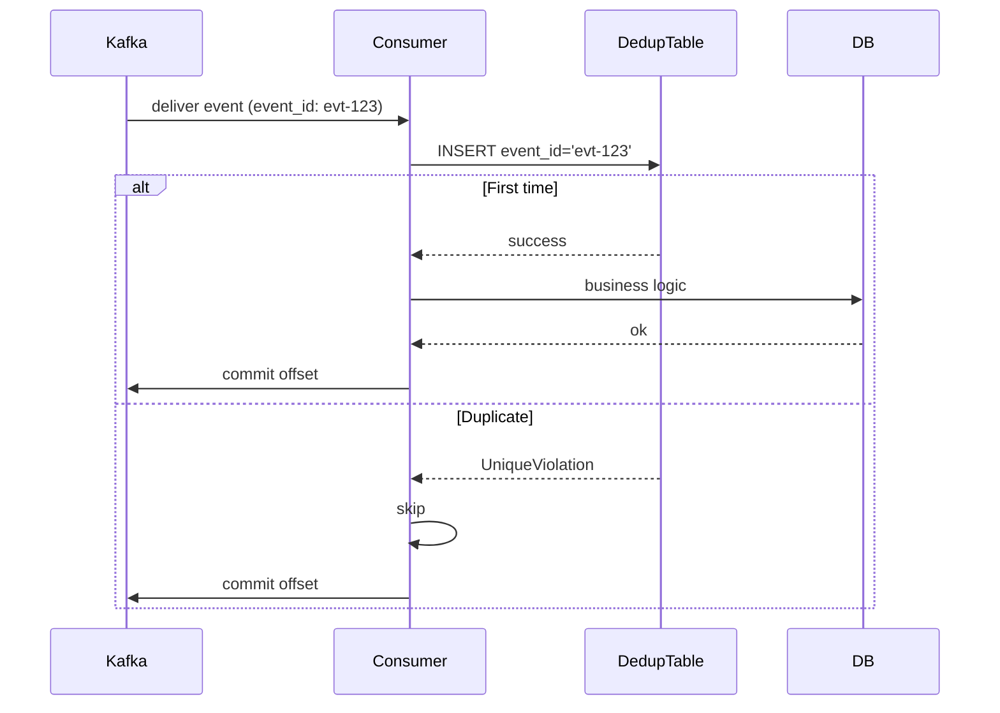
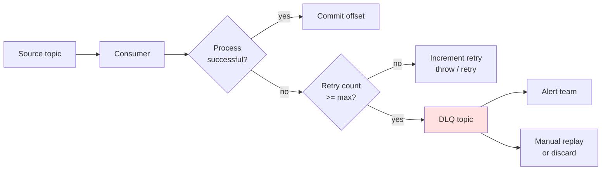

---
tags:
  - applied
  - interview-critical
---

# Idempotent Consumers in Production

Every event system delivers messages **at-least-once**. That means duplicates. Consumers must be **idempotent** — processing the same event twice produces the same result as processing it once. This page covers the patterns, the storage strategies, and the gotchas that turn "we handle duplicates" from a slogan into a real guarantee.

For *event-driven concepts*, see [Event-Driven Architecture](../architecture/event-driven.md). For the general pattern, see [Idempotency](../patterns/idempotency.md). This page focuses on **consumer-side** idempotency in event systems.

---

## Why duplicates happen — and exactly-once is a lie

```
Kafka producer publishes event:
  → broker acknowledges
  → producer crashes before recording success
  → producer retries on restart
  → broker stores duplicate event

Consumer processes event:
  → completes processing
  → crashes before committing offset
  → on restart, reads same offset → reprocesses

Network blip:
  → consumer's offset commit fails
  → next poll re-delivers events from last committed offset
```

**Every distributed message system delivers at-least-once unless you take explicit steps for exactly-once.** Even Kafka's "exactly-once semantics" (EOS) only covers end-to-end within Kafka producers + consumers in specific configurations — not end-to-end with external side effects (like database writes or API calls).

The pragmatic answer: **don't try to prevent duplicates; design consumers to tolerate them.**

---

## What "idempotent" means concretely

```python
# Idempotent: same input → same effect regardless of how many times you run it
def credit_account(account_id, amount, idempotency_key):
    if already_processed(idempotency_key):
        return get_previous_result(idempotency_key)
    
    db.execute("UPDATE accounts SET balance = balance + %s WHERE id = %s",
               (amount, account_id))
    record_processed(idempotency_key, result)

# Non-idempotent: each run adds to the effect
def credit_account_naive(account_id, amount):
    db.execute("UPDATE accounts SET balance = balance + %s WHERE id = %s",
               (amount, account_id))
    # Run twice → credit applied twice
```

The unit of idempotency is the **logical operation** (one credit), not the message delivery.

---

## Strategy 1: Idempotency key + dedup table

The most general pattern. Store each processed event's ID; check before processing.

```python
def handle_event(event):
    event_id = event['event_id']
    
    # Atomic check-and-mark
    try:
        with db.transaction():
            db.execute(
                "INSERT INTO processed_events (event_id, processed_at) "
                "VALUES (%s, NOW())",
                (event_id,)
            )
            # If we get here, this is the first time
            do_business_logic(event)
    except UniqueViolation:
        # Duplicate; already processed
        log.info(f"Skipping duplicate event {event_id}")
        return
```

### Diagram



### Storage options for the dedup table

| Storage | Speed | Cost | TTL support |
|---|---|---|---|
| Postgres / MySQL | ms | Cheap | Manual cleanup |
| DynamoDB | <10ms | Pay-per-request | Native TTL |
| Redis | <1ms | Memory cost | Native TTL |

```python
# Redis with TTL
def is_processed_redis(event_id):
    # SETNX = set if not exists; returns True if first time
    return not redis.set(f"processed:{event_id}", "1", nx=True, ex=86400)
```

### How long to retain the dedup keys

Long enough to outlive any possible duplicate:

```
Kafka retention: 7 days → dedup keys retained for 14 days (2× safety margin)
SQS retention: 14 days → dedup keys retained 30 days
```

After retention, original event is gone from broker; can't be re-delivered.

### Trade-offs

- Extra storage and write per event
- Race condition if you check then write (use atomic INSERT)
- Doesn't catch logical duplicates (same business event, different event_id) — see strategy 2

---

## Strategy 2: Business-level idempotency key

Use a business-meaningful key, not just the message ID.

```python
def handle_payment_event(event):
    payment_id = event['payment_id']     # business key
    amount = event['amount']
    
    # Atomic: insert payment record only if not exists
    result = db.execute(
        "INSERT INTO payments (id, amount, status) "
        "VALUES (%s, %s, 'processing') "
        "ON CONFLICT (id) DO NOTHING "
        "RETURNING id",
        (payment_id, amount)
    )
    
    if result.rowcount == 0:
        # Payment already exists; this is a duplicate
        log.info(f"Payment {payment_id} already processed; skipping")
        return
    
    # First time — actually charge
    charge_card(payment_id, amount)
    db.execute("UPDATE payments SET status='complete' WHERE id=%s", (payment_id,))
```

### Why this is stronger

```
Scenario: producer re-sends the same logical event with a new event_id
  Strategy 1 (event_id dedup): sees new event_id; processes again → DOUBLE CHARGE
  Strategy 2 (business dedup): payment_id unchanged; INSERT fails → safe
```

Always use **business keys** when available. Combine with strategy 1 for defence in depth.

### Combining strategies

```python
def handle_event(event):
    # Layer 1: message-level dedup (catches network duplicates)
    if not redis.set(f"processed:{event['event_id']}", "1", nx=True, ex=86400):
        return  # already processed this exact message
    
    # Layer 2: business-level dedup (catches replay / re-send duplicates)
    try:
        with db.transaction():
            db.execute(
                "INSERT INTO payments (id, ...) VALUES (...) ON CONFLICT DO NOTHING"
            )
            # ... rest of processing
    except Exception:
        # If anything fails, ROLLBACK the dedup record so we can retry
        redis.delete(f"processed:{event['event_id']}")
        raise
```

Belt-and-suspenders. Both layers contribute.

---

## Strategy 3: Naturally idempotent operations

Sometimes you can rewrite the operation to be inherently idempotent.

### Set, don't increment

```python
# Non-idempotent: each delivery increments
db.execute("UPDATE users SET points = points + 100 WHERE id = %s", (user_id,))

# Idempotent: set absolute value
# (calculate it elsewhere; this just records)
db.execute("UPDATE users SET points = %s WHERE id = %s", (new_total, user_id))
```

If the event says "user now has 5000 points" rather than "user just earned 100 points," reprocessing is safe — you just set the value to the same thing.

### Upsert instead of insert

```python
# Non-idempotent: duplicate insert fails on unique violation
db.execute("INSERT INTO orders (id, ...) VALUES (...)")

# Idempotent: UPSERT
db.execute("""
    INSERT INTO orders (id, status, amount) VALUES (%s, %s, %s)
    ON CONFLICT (id) DO UPDATE SET status = EXCLUDED.status
""", (order_id, status, amount))
```

Second delivery just updates with same values; no error.

### Compare-and-swap

```python
# Only update if current state matches what we expect
db.execute("""
    UPDATE orders SET status = %s 
    WHERE id = %s AND status = %s
""", (new_status, order_id, expected_status))

if cursor.rowcount == 0:
    # Either order doesn't exist, or status already changed
    log.info(f"Order {order_id} not in expected state; skipping")
    return
```

If the same event arrives twice, the second update is a no-op (state already changed).

---

## Strategy 4: Outbox-driven processing

Apply changes and emit downstream events in the same transaction as recording the consumed event.

```python
def handle_order_placed(event):
    order_id = event['data']['order_id']
    
    with db.transaction():
        # Layer 1: record this event was consumed (idempotency)
        try:
            db.execute(
                "INSERT INTO processed_events (event_id) VALUES (%s)",
                (event['event_id'],)
            )
        except UniqueViolation:
            return  # duplicate
        
        # Layer 2: business work
        db.execute(
            "INSERT INTO order_summary (order_id, total) VALUES (%s, %s)",
            (order_id, event['data']['total'])
        )
        
        # Layer 3: emit downstream events via outbox
        db.execute(
            "INSERT INTO outbox (event_type, payload) VALUES (%s, %s)",
            ('OrderSummaryCreated', json.dumps({'order_id': order_id}))
        )
    
    # If transaction succeeded, all three are atomic
    # Outbox publisher will pick up the outbox entry and publish to Kafka
```

This combines idempotent consumption with reliable downstream publishing. See [Outbox Pattern](../patterns/outbox.md).

---

## Handling failures during processing

What if processing throws halfway through?

```python
def handle_event(event):
    # Insert dedup record
    db.execute("INSERT INTO processed_events ...", (event['event_id'],))
    
    # Business work
    do_something_expensive(event)        # ← what if this fails?
    do_something_else(event)              # ← or this?
    
    db.commit()
    consumer.commit_offset(event)
```

Two failure modes:

### Failure 1: Crash before commit_offset

```
INSERT processed_events: succeeded
Business work: succeeded (DB committed)
Crash before consumer.commit_offset

→ Kafka re-delivers event on restart
→ INSERT processed_events fails (UniqueViolation)
→ Skip — correct behaviour
```

This is fine. The dedup table catches it.

### Failure 2: Crash mid-business-work

```
INSERT processed_events: succeeded
Business work (multi-step): fails halfway

→ Kafka re-delivers event
→ INSERT processed_events fails
→ Skip — but business work is half-done!
```

This is the **bad case**. To avoid it, either:

**Option A**: Make all business work atomic (single DB transaction including the dedup insert).

```python
def handle_event(event):
    with db.transaction():
        try:
            db.execute("INSERT INTO processed_events ...", (event['event_id'],))
        except UniqueViolation:
            return
        
        # All business work in same transaction
        do_step_1()
        do_step_2()
        do_step_3()
    # If anything throws, transaction rolls back; dedup record also rolls back
    # On retry, dedup table doesn't have the record; we try again
    
    consumer.commit_offset(event)
```

This is the cleanest pattern when business work is all in one DB.

**Option B**: Don't mark as processed until all work is done; use sagas / retries internally.

```python
def handle_event(event):
    if already_processed(event['event_id']):
        return
    
    try:
        do_step_1()
        do_step_2()       # might fail; do_step_1 must be idempotent
        do_step_3()       # might fail; do_step_2 must be idempotent
    except Exception:
        # Don't mark processed; will be retried
        raise
    
    mark_processed(event['event_id'])
    consumer.commit_offset(event)
```

Requires each step to be individually idempotent. Trade-off: complex retry logic.

---

## External side effects (APIs, emails, etc.)

What if the event handler calls a non-idempotent API?

```python
def handle_signup(event):
    # Send welcome email — what if this is the 2nd delivery?
    stripe.charge_card(...)         # might double-charge
    email_provider.send(...)         # might send twice
```

### Make the API idempotent (use its idempotency keys)

```python
# Stripe natively supports idempotency keys
stripe.charges.create(
    amount=9900,
    currency='usd',
    customer=customer_id,
    idempotency_key=event['event_id']  # or business key
)
# Stripe deduplicates on the server side
```

Most modern APIs (Stripe, AWS, etc.) support idempotency keys. Use them.

### Track external operations separately

```python
def handle_signup(event):
    user_id = event['data']['user_id']
    
    # Track which external operations are done for this event
    operations = get_or_create_event_operations(event['event_id'])
    
    if not operations.get('welcome_email_sent'):
        try:
            email_provider.send(to=user.email, template='welcome')
            mark_operation_done(event['event_id'], 'welcome_email_sent')
        except EmailFailure:
            raise  # retry whole event
    
    if not operations.get('analytics_recorded'):
        analytics.track('user.signed_up', user_id)
        mark_operation_done(event['event_id'], 'analytics_recorded')
```

Granular tracking of each step. On retry, skip already-completed steps. Verbose but bulletproof.

---

## Out-of-order delivery

Kafka guarantees order **within a partition**. But not globally.

```
Partition 0: events for order_id=ord-1001 in correct order ✓
Partition 1: events for order_id=ord-1002 in correct order ✓

But across partitions: no guarantee
```

If your events for one entity must be ordered, **partition by entity ID**:

```python
producer.send('orders.events', key=order_id, value=event)
```

If consumers see out-of-order events for the same entity, it's a bug — fix partitioning.

### Handling out-of-order across topics

What if `OrderPlaced` (topic A) arrives before `UserCreated` (topic B), even though logically User was created first?

```python
def handle_order_placed(event):
    user_id = event['data']['user_id']
    
    user = db.fetch_one("SELECT * FROM users WHERE id=%s", (user_id,))
    if not user:
        # Event arrived before user record exists; retry later
        raise RetryableError("User not yet created")
```

Strategies:

- **Retry the event** (consumer doesn't commit offset; tries again later)
- **Buffer in a holding area** (table or stream) until prerequisite arrives
- **Eventual consistency** — process anyway with partial info; reconcile later

For most cases, retry with backoff handles it. Eventually the prerequisite event arrives.

---

## Poison messages

A message that always fails processing.

```
Event arrives → processing throws → consumer retries → throws → retries → ...
→ stuck consumer, blocked partition, growing lag
```

### Solution: Dead Letter Queue (DLQ)

```python
def handle_event(event):
    try:
        process(event)
    except Exception as e:
        retry_count = get_retry_count(event['event_id'])
        if retry_count >= MAX_RETRIES:
            send_to_dlq(event, error=str(e))
            log.error(f"Event {event['event_id']} sent to DLQ after {retry_count} retries")
            # Continue (commit offset; don't block the partition)
            return
        increment_retry_count(event['event_id'])
        raise  # propagate to trigger retry
```

The DLQ is a separate topic/queue holding poison messages. A human (or automation) investigates and either fixes the bug or manually replays.

### Diagram



### When to DLQ vs retry forever

```
Retry forever:
  Transient errors (network, DB temporarily unavailable)
  Eventual consistency issues (prerequisite not yet processed)

DLQ:
  Schema errors (malformed event)
  Permanent business-logic failures (referenced entity deleted)
  Bugs in the consumer code
```

Mistakes happen — over-aggressive DLQs silently lose data; under-aggressive DLQs block partitions. Tune based on actual error patterns.

---

## Concurrency considerations

Multiple consumer instances processing the same partition? Don't — Kafka assigns each partition to one consumer in a group.

But within one consumer instance, parallelism:

```python
# Multi-threaded consumer
for event in kafka_consumer:
    executor.submit(handle_event, event)
# 10 events processed concurrently within one partition
```

This breaks ordering. If you need order, single-thread per partition.

Also breaks dedup unless atomic:

```python
# Race: two threads handle the same event_id simultaneously
# Both check dedup table: not yet there
# Both proceed, both INSERT into business table
# UniqueViolation on one — handle gracefully
```

Use atomic `INSERT ... ON CONFLICT DO NOTHING` pattern; one wins, the other becomes a no-op.

---

## Kafka exactly-once semantics (EOS)

Kafka offers exactly-once within Kafka — atomic produce + consume + commit across Kafka transactions.

```python
producer = KafkaProducer(
    transactional_id='my-tx-id',
    enable_idempotence=True,
)
producer.init_transactions()

consumer = KafkaConsumer(
    isolation_level='read_committed',
    enable_auto_commit=False,
)

while True:
    msgs = consumer.poll(timeout_ms=1000)
    
    producer.begin_transaction()
    try:
        for msg in msgs.values():
            for event in msg:
                # Transform; produce result to output topic
                producer.send('output', transform(event.value))
        
        # Atomic: commit output topic writes + consumer offsets together
        producer.send_offsets_to_transaction(
            consumer.offsets_for_times(...),
            consumer.config['group_id']
        )
        producer.commit_transaction()
    except Exception:
        producer.abort_transaction()
        raise
```

**EOS is only within Kafka.** If your consumer writes to Postgres + Kafka, that's still at-least-once for Postgres. Use idempotency for the external side effects.

---

## Observability

```yaml
Metrics to track:
  ✓ Events processed per second per consumer
  ✓ Duplicate event rate (dedup table hits)
  ✓ Processing latency per event
  ✓ Consumer lag (events behind real-time)
  ✓ DLQ rate (events going to DLQ)
  ✓ Retry rate per event
  
Alerts:
  ✓ Consumer lag growing (events not being processed)
  ✓ DLQ rate spike (something broken)
  ✓ Duplicate rate unusually high (producer issue)
  ✓ Specific event repeatedly retried (poison message)
```

### Correlate events end-to-end

```python
def handle_event(event):
    with tracer.start_span("handle_event",
                           context=extract_context(event['tracing'])):
        # Span linked to the producing span via trace_id
        process(event)
```

End-to-end trace from producer to consumer. Critical for debugging "where did this event go?"

---

## Anti-patterns

| Anti-pattern | Better |
|---|---|
| "We're using Kafka EOS so consumers don't need idempotency" | EOS doesn't cover external side effects (DBs, APIs); always idempotent |
| Dedup table with no TTL | Grows forever; eventually expensive |
| Naive `if exists: skip` check (race condition) | Atomic INSERT with ON CONFLICT |
| Increment-based operations on retries | Use absolute set, or natural idempotency |
| API calls without idempotency keys | Use Stripe-style keys; double-charges are real |
| Same offset commit on every event | Commit periodically (batched); reduces overhead |
| Manual commit + no dedup | Race: crash between business work and commit |
| No DLQ | Poison messages block partitions forever |
| DLQ as the "real" target | Lost messages without action |

---

## Production checklist

```
Consumer architecture:
  ☐ Atomic insert-dedup-and-process (single transaction)
  ☐ Business-level idempotency key (in addition to event_id)
  ☐ Dedup table TTL beyond Kafka retention
  
External operations:
  ☐ Idempotency keys on Stripe/etc.
  ☐ Per-operation tracking for multi-step events
  
Error handling:
  ☐ DLQ configured
  ☐ Max retry count enforced
  ☐ Retry backoff (exponential + jitter)
  ☐ Alerts on DLQ rate
  
Ordering:
  ☐ Partition key set on producer
  ☐ Single thread per partition (if ordering matters)
  
Observability:
  ☐ Lag monitoring
  ☐ Duplicate rate monitoring
  ☐ End-to-end tracing
  ☐ DLQ alerts
```

---

## Interview angle

!!! tip "What interviewers are testing"
    Whether you treat "exactly-once" as a goal to design for, not a setting to enable.

**Strong answer pattern:**
1. Every system is at-least-once; consumers must be idempotent
2. Two layers of dedup: message-level (event_id) + business-level (entity_id)
3. Atomic insert-and-process — dedup record and business work in same transaction
4. External APIs need their own idempotency keys (Stripe, etc.)
5. Poison messages go to DLQ after N retries; alert and investigate
6. Natural idempotency (set vs increment, upsert vs insert) preferred when possible

**Common follow-up:** *"What's the difference between Kafka exactly-once and idempotent consumers?"*
> Kafka EOS guarantees that within Kafka, the chain of "consume → produce → commit offset" is atomic. If you consume from topic A, transform, produce to topic B, and commit offsets, EOS ensures all three happen together or not at all. But it doesn't cover side effects outside Kafka — if your consumer also writes to Postgres or calls Stripe, those are still at-least-once. So even with EOS, your consumers need idempotency for any non-Kafka work. EOS is one defence; idempotency is the primary one.

---

## Test yourself

Answers are hidden — commit to an answer before expanding.

??? question "Why is exactly-once delivery 'a lie' in distributed message systems?"

    Every distributed message system delivers at-least-once unless you take explicit steps: producers retry after crashing before recording success, consumers crash before committing offsets, and failed offset commits cause re-delivery. Even Kafka's exactly-once semantics (EOS) only covers producers + consumers within Kafka — not external side effects like database writes or API calls. The pragmatic answer is to stop trying to prevent duplicates and design consumers to tolerate them.

??? question "Why is a business-level idempotency key stronger than deduplicating on event_id alone?"

    Because a producer can re-send the same logical event with a *new* event_id — message-level dedup sees a fresh ID and processes it again, which for a payment means a double charge. Deduplicating on the business key (e.g. `payment_id` with `INSERT ... ON CONFLICT DO NOTHING`) catches this because the business key is unchanged. The page recommends combining both layers for defence in depth: event_id dedup catches network duplicates, business-key dedup catches replays.

??? question "Your consumer inserts into the dedup table, then runs multi-step business work, and crashes halfway. On re-delivery the event is skipped — but the work is half-done. What went wrong and how do you fix it?"

    You marked the event as processed before the business work completed — this is Failure 2, the bad case. Fix it with Option A: put the dedup INSERT and all business work in a single DB transaction, so a failure rolls back the dedup record too and the retry runs cleanly. If the work spans systems, use Option B: only mark processed after all steps complete, which requires each step to be individually idempotent.

??? question "One event keeps failing in your consumer, lag is growing, and the whole partition is blocked. What's happening and what's the standard fix?"

    That's a poison message — an event that always fails processing, causing an infinite retry loop that blocks the partition. The standard fix is a Dead Letter Queue: after MAX_RETRIES, send the event to a separate DLQ topic, commit the offset so the partition unblocks, and alert a human to investigate, fix, or replay. Reserve endless retries for transient errors (network, DB down); DLQ schema errors, permanent business failures, and consumer bugs.

??? question "An interviewer asks: 'What's the difference between Kafka exactly-once semantics and idempotent consumers?'"

    Kafka EOS makes the chain consume → produce → commit offset atomic *within Kafka* — consume from topic A, transform, produce to topic B, and commit offsets all happen together or not at all. But it doesn't cover side effects outside Kafka: writes to Postgres or calls to Stripe are still at-least-once. So even with EOS, consumers need idempotency for any non-Kafka work — EOS is one defence; idempotency is the primary one.

## Related

- [Idempotency](../patterns/idempotency.md) — broader pattern
- [Event-Driven Architecture](../architecture/event-driven.md) — context
- [Event Schema Evolution](event-schema-evolution.md) — schema concerns
- [Event Payload Design](event-payload-design.md) — payload structure
- [Outbox Pattern](../patterns/outbox.md) — reliable publishing
- [Exactly-Once Semantics](../distributed/exactly-once.md) — depth on EOS
- [Backpressure](backpressure.md) — when consumers can't keep up
- [Saga Pattern](../patterns/saga-pattern.md) — multi-step transactions
