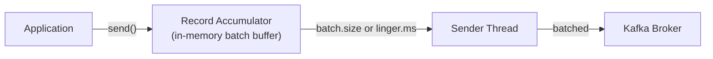

# Kafka Deep Dive

## Architecture internals

### Broker and cluster

```
Kafka Cluster (3 brokers)
  ├── Broker 1 (leader for partitions 0, 3, 6)
  ├── Broker 2 (leader for partitions 1, 4, 7)
  └── Broker 3 (leader for partitions 2, 5, 8)

Each partition leader:
  - Handles all writes for that partition
  - Serves reads (clients can also read from replicas with KIP-392)
  - Replicates to follower brokers
```

**KRaft mode (Kafka 3.3+):** ZooKeeper replaced by Raft-based controller within Kafka itself. Simpler operations, faster failover.

### Log storage

Each partition is a directory of segment files on disk:

```
/data/kafka/orders-0/
  00000000000000000000.log     ← messages offset 0-999
  00000000000000001000.log     ← messages offset 1000-1999
  00000000000000002000.log     ← current active segment
  00000000000000000000.index   ← sparse index (offset → file position)
  00000000000000000000.timeindex ← sparse index (timestamp → offset)
```

**Sequential disk writes:** Kafka appends to the active segment sequentially. This is fast even on spinning disks (200MB/s sequential vs 50 MB/s random IOPS on HDD). On SSDs it's even faster.

**Page cache:** OS caches recent segments in RAM. Consumers reading recent data often served entirely from memory — no disk read.

**Zero-copy transfer:** Kafka uses `sendfile()` syscall to transfer from disk/page cache directly to network socket — bypasses user space entirely.

### Message format

```
Batch header:
  baseOffset, batchLength, magic (version), compressionType
  producerId, producerEpoch, sequence (idempotency)
  
Records:
  attributes, timestampDelta, offsetDelta
  key length, key bytes
  value length, value bytes
  headers (optional key-value pairs)
```

Kafka compresses at the batch level (LZ4, Snappy, GZIP, ZSTD) for better compression ratio.

## Producer internals



**Key producer configs:**

```python
producer = KafkaProducer(
    bootstrap_servers='kafka:9092',
    
    # Batching (throughput optimization)
    batch_size=16384,          # 16KB batch. Increase for higher throughput
    linger_ms=5,               # Wait up to 5ms to fill batch (vs send immediately)
    
    # Reliability
    acks='all',                # Wait for all ISR replicas
    retries=5,                 # Retry on transient failure
    max_in_flight_requests_per_connection=1,  # Required for ordering with retries
    
    # Idempotency (exactly-once on producer side)
    enable_idempotence=True,
    
    # Compression
    compression_type='lz4',    # LZ4 for speed, ZSTD for ratio
    
    # Serialization
    value_serializer=lambda v: json.dumps(v).encode()
)
```

### Throughput vs latency tuning

```
High throughput (batch jobs, analytics):
  linger_ms=100        (wait 100ms to fill large batches)
  batch_size=1048576   (1MB batches)
  compression_type='lz4'
  acks=1               (leader only — tolerate some data loss)

Low latency (real-time, user-facing):
  linger_ms=0          (send immediately)
  batch_size=16384     (small batches)
  compression_type='none'
  acks=1 or all        (depends on durability requirement)
```

## Consumer internals

### Fetch behavior

```python
consumer = KafkaConsumer(
    'orders',
    group_id='email-service',
    
    # Fetch tuning
    fetch_min_bytes=1,         # Return immediately if any data available
    fetch_max_wait_ms=500,     # Wait up to 500ms if less than fetch_min_bytes
    max_partition_fetch_bytes=1048576,  # Max bytes per partition per fetch
    
    # Processing
    max_poll_records=500,      # Max records per poll()
    max_poll_interval_ms=300000,  # 5 min: max time between polls before rebalance
    
    # Session
    session_timeout_ms=10000,  # 10s: heartbeat timeout before consumer removed
    heartbeat_interval_ms=3000, # 3s: heartbeat frequency
    
    # Offsets
    enable_auto_commit=False,  # Manual commit
    auto_offset_reset='earliest'  # Start from beginning if no committed offset
)
```

### Offset management

```python
# Automatic commit (risky — commits before processing complete)
KafkaConsumer(enable_auto_commit=True, auto_commit_interval_ms=5000)

# Manual commit after processing
for msg in consumer:
    process(msg)
    consumer.commit()  # synchronous commit (slow but safe)
    # or
    consumer.commit_async()  # async (faster, rare failure ok)

# Commit specific offsets (for fine-grained control)
consumer.commit({
    TopicPartition('orders', 0): OffsetAndMetadata(msg.offset + 1, None)
})
```

### Consumer lag

The delta between latest offset and consumer's committed offset:

```
Partition 0: latest offset = 10,000
  email-service committed offset = 9,800
  Consumer lag = 200

Monitor lag with:
  kafka-consumer-groups.sh --describe --group email-service
  Or: Prometheus + kafka-exporter → Grafana dashboard
```

**Alert on lag growth** — means consumer can't keep up. Scale by adding partitions + consumers.

### Rebalancing

When group membership changes, partitions are redistributed:

```
Default (Eager rebalance):
  All consumers stop processing
  All partitions revoked
  Partitions redistributed
  All consumers resume
  Gap in processing during rebalance

Incremental Cooperative Rebalance (recommended):
  Only the necessary partitions are moved
  Other consumers continue processing
  Minimal disruption
```

```python
consumer = KafkaConsumer(
    partition_assignment_strategy=[CooperativeStickyAssignor]  # incremental
)
```

## Exactly-once semantics (EOS)

End-to-end exactly-once requires coordination at multiple levels:

```
1. Idempotent producer: prevents duplicate writes from retries
   enable_idempotence=True

2. Transactional writes: atomic multi-partition writes
   producer.init_transactions()
   producer.begin_transaction()
   producer.send(...)
   producer.send_offsets_to_transaction(offsets, consumer_group)  ← atomic offset commit
   producer.commit_transaction()

3. Consumer: read_committed isolation
   KafkaConsumer(isolation_level='read_committed')
   → only sees committed transaction messages
```

## Kafka topic design

### How many partitions?

```
Partitions = max(target throughput / per-partition throughput, parallelism needed)

Per-partition write throughput: ~10-50 MB/s (depends on message size, replication)
Target: 500 MB/s
Partitions: 500 / 50 = 10 minimum

Consumer parallelism: max consumers that can run in parallel = partition count
If you need 20 parallel email workers → 20+ partitions
```

**Over-partitioning costs:**
- More file handles, more memory on broker
- Slower leader election on failover
- More rebalance overhead

**Under-partitioning:** Can't add parallelism without repartitioning (expensive).

**Rule of thumb:** Start with 3-10 partitions. Scale up if needed (can increase, not decrease).

### Partition key design

```python
# Good: distribute load evenly + preserve order per entity
key = order_id.encode()   # spread orders randomly
key = user_id.encode()    # all events for a user in order (good for user-state aggregation)

# Bad: hot partition
key = b'all'              # all messages to one partition
key = region.encode()     # if one region dominates
```

### Retention strategy

```
Event log (keep everything for replay):
  retention.ms = -1  # unlimited
  retention.bytes = 10GB  # or size-based

Temporary processing buffer (queue-like):
  retention.ms = 86400000  # 24 hours

State log (current value per key):
  cleanup.policy = compact  # keep latest per key
  min.cleanable.dirty.ratio = 0.1
```

## Operational patterns

### Consumer group lag monitoring

```yaml
# Prometheus alert
- alert: KafkaConsumerLagHigh
  expr: kafka_consumergroup_lag > 10000
  for: 5m
  labels:
    severity: warning
  annotations:
    summary: "Consumer {{ $labels.consumergroup }} is {{ $value }} messages behind"
```

### Dead letter topic (Kafka equivalent)

```python
for msg in consumer:
    try:
        process(msg)
        consumer.commit()
    except NonRetryableError as e:
        # Send to dead letter topic for investigation
        producer.send('orders.dlq', 
                       key=msg.key, 
                       value=msg.value,
                       headers=[('error', str(e).encode())])
        consumer.commit()
    except RetryableError:
        # Don't commit, message will be reprocessed
        pass
```

### Schema registry

Centralized schema storage for Avro/Protobuf messages. Ensures producers and consumers agree on message format.

```python
# With Confluent Schema Registry
from confluent_kafka.schema_registry import SchemaRegistryClient
from confluent_kafka.schema_registry.avro import AvroSerializer

schema_registry = SchemaRegistryClient({'url': 'http://schema-registry:8081'})
avro_serializer = AvroSerializer(schema_registry, schema_str, to_dict)

producer = SerializingProducer({
    'bootstrap.servers': 'kafka:9092',
    'value.serializer': avro_serializer
})
```

**Benefits:** Schema evolution with backward/forward compatibility. Consumers can detect breaking schema changes.

## AWS MSK (Managed Streaming for Kafka)

- Fully managed Kafka (same API — no code changes)
- Multi-AZ replication built in
- MSK Connect: managed Kafka Connect (CDC, S3 sink, etc.)
- MSK Serverless: auto-scaling, pay per throughput
- Integrates with: Lambda (trigger), Kinesis (bridge), Glue (schema registry)

```
MSK Serverless:
  - No cluster sizing
  - Scales automatically
  - Pay per MB written/read
  - 5 MB/s write per topic, 10 MB/s read
  - Best for variable workloads
```

## Interview angle

!!! tip "What interviewers are testing"
    They want to see you reason about partitioning, consumer groups, and guarantees — not just "use Kafka."

**Strong answer pattern:**
1. State the requirement: ordering needed? → use partition key; multiple consumers? → consumer groups
2. Partition count = parallelism ceiling — set appropriately for expected consumer count
3. Delivery guarantee: at-least-once (default) + idempotent consumers; exactly-once only if needed
4. Consumer lag: monitor as a SLO; alert and scale consumers when lag grows
5. Schema registry for production systems with multiple teams

## Related topics

- [Event Streaming](event-streaming.md) — concepts and patterns
- [Event-Driven Architecture](../architecture/event-driven.md) — Kafka as event backbone
- [CQRS](../patterns/cqrs.md) — Kafka to populate read models
- [AWS Messaging](../aws/messaging.md) — MSK vs Kinesis
