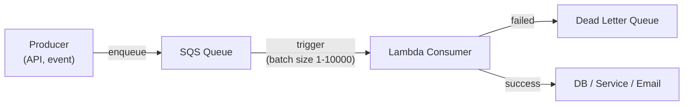

# Message Queues

## What it is

A message queue is an asynchronous communication mechanism where producers send messages to a queue and consumers read them independently. The queue acts as a buffer — decoupling producers and consumers in time and scale.

## Why queues

```
Without queue (synchronous):
  Order Service → Payment Service (synchronous HTTP call)
  If Payment Service is slow → Order Service is slow
  If Payment Service is down → Order Service fails
  If 10x traffic spike → Payment Service is overwhelmed

With queue:
  Order Service → Queue → Payment Service
  Order Service: fast (just enqueues)
  Payment Service: processes at its own pace
  Backpressure handled by queue depth
  Payment Service can scale independently
```

**Benefits:**
- **Decoupling:** Producer and consumer evolve independently
- **Load leveling:** Queue absorbs traffic spikes; consumer drains at steady rate
- **Resilience:** Consumer failure doesn't affect producer; messages wait
- **Retry:** Failed messages can be retried automatically
- **Async processing:** Return fast to user; process in background

## Core semantics

### Delivery guarantees

| Guarantee | Behavior | Implication |
|---|---|---|
| **At-most-once** | Message delivered 0 or 1 times | Fast; possible message loss |
| **At-least-once** | Message delivered 1+ times | Possible duplicates — consumer must be idempotent |
| **Exactly-once** | Message delivered exactly once | Expensive; requires transactions |

**At-least-once** is the most common. Design consumers to be idempotent — processing the same message twice has the same effect as processing it once.

### Visibility timeout

```
Consumer reads message → message becomes invisible (locked)
Consumer processes successfully → delete message from queue
Consumer fails or times out → message becomes visible again → another consumer picks it up

Visibility timeout: how long the message is invisible (e.g., 30 seconds)
If processing takes longer than timeout: set a longer timeout or heartbeat
```

## SQS (AWS Simple Queue Service)

The standard message queue on AWS. Fully managed, serverless, scales automatically.

### Queue types

=== "Standard Queue"
    - **Throughput:** Unlimited (nearly)
    - **Ordering:** Best-effort (messages may arrive out of order)
    - **Delivery:** At-least-once (occasional duplicates)
    - **Use:** Default for most use cases

=== "FIFO Queue"
    - **Throughput:** 300 msg/sec (3,000 with batching)
    - **Ordering:** Exactly first-in-first-out
    - **Delivery:** Exactly-once (within 5-minute deduplication window)
    - **Use:** Financial transactions, inventory updates, order processing

### Key settings

```python
# Send
sqs.send_message(
    QueueUrl=queue_url,
    MessageBody=json.dumps(payload),
    DelaySeconds=10,        # delay before visible (0-900s)
    MessageGroupId='order-123',  # FIFO: group key for ordering
    MessageDeduplicationId='idempotency-key-123'  # FIFO: prevent duplicates
)

# Receive
response = sqs.receive_message(
    QueueUrl=queue_url,
    MaxNumberOfMessages=10,
    VisibilityTimeout=60,      # lock for 60s while processing
    WaitTimeSeconds=20         # long polling — wait up to 20s for messages
)

# Delete after successful processing
sqs.delete_message(QueueUrl=queue_url, ReceiptHandle=receipt_handle)
```

### Dead Letter Queue (DLQ)

Messages that fail to process N times are moved to a DLQ for investigation:

```
Main Queue
  maxReceiveCount: 3
  After 3 failures → move to DLQ

DLQ:
  Inspect failed messages
  Fix consumer bug
  Re-drive messages back to main queue
```

```python
# SQS Redrive policy
{
    "deadLetterTargetArn": "arn:aws:sqs:us-east-1:123:my-dlq",
    "maxReceiveCount": 3
}
```

### Long polling vs short polling

```
Short polling (default): Returns immediately, even if no messages
  → 20 empty responses if queue is idle
  → 20x unnecessary API calls + cost

Long polling (recommended): Waits up to 20s for a message
  → 1 response per 20s when idle
  WaitTimeSeconds=20
```

### SQS + Lambda (event-driven processing)



Lambda polls SQS every 10 seconds. On failure, Lambda returns the batch and messages become visible again (retry). After `maxReceiveCount` failures → DLQ.

**Concurrency:** Lambda scales one instance per polling shard (max 1000 concurrent by default). For FIFO: one concurrent instance per MessageGroupId.

## RabbitMQ

AMQP-based message broker. More control than SQS — exchanges, bindings, routing keys.

```
Producer → Exchange → Binding → Queue → Consumer

Exchange types:
  direct:  Route by exact routing key
  fanout:  Route to ALL bound queues (broadcast)
  topic:   Route by pattern (order.*.created)
  headers: Route by message header values
```

```python
# RabbitMQ example
channel.exchange_declare(exchange='orders', exchange_type='topic')
channel.queue_declare(queue='order_processing', durable=True)
channel.queue_bind(
    exchange='orders',
    queue='order_processing',
    routing_key='order.us.#'  # matches order.us.created, order.us.paid, etc.
)

channel.basic_publish(
    exchange='orders',
    routing_key='order.us.created',
    body=json.dumps(order),
    properties=pika.BasicProperties(delivery_mode=2)  # persistent
)
```

## Queue patterns

### Work Queue (competing consumers)

Multiple consumers share one queue — each message processed by exactly one consumer:

```
Queue: [M1, M2, M3, M4, M5]
Consumer A: M1, M3, M5
Consumer B: M2, M4

Scale consumers by adding workers.
Natural load balancing — busy consumers pick up less.
```

### Fan-out via multiple queues

One message needs to trigger multiple independent workflows:

```
Order created
  → Queue A: send confirmation email
  → Queue B: update inventory
  → Queue C: notify analytics

Via SNS fan-out:
  Producer → SNS Topic → SQS Queue A
                       → SQS Queue B
                       → SQS Queue C
```

### Request-reply (async RPC)

```
Caller: send request to queue, include reply_to queue and correlation_id
Worker: process, send reply to reply_to queue with correlation_id
Caller: polls reply queue for matching correlation_id
```

Useful for async jobs where caller needs the result eventually.

## Interview angle

!!! tip "What interviewers are testing"
    They want to see you use queues to decouple services and handle failure gracefully.

**Strong answer pattern:**
1. Identify the async boundary — which operation can return immediately and process later?
2. State the delivery guarantee needed — is idempotency easy? Use at-least-once.
3. Size the queue depth — it's your buffer. Consumer scale = queue depth / processing rate
4. Always design a DLQ — every queue needs one for visibility into failures
5. Use SQS on AWS; RabbitMQ for complex routing needs

## Related topics

- [Pub/Sub](pub-sub.md) — fan-out to multiple consumers
- [Event Streaming](event-streaming.md) — replayable, ordered event log
- [Idempotency](../patterns/idempotency.md) — required for at-least-once delivery
- [Backpressure](backpressure.md) — queue depth as a backpressure signal
- [AWS Messaging](../aws/messaging.md) — SQS, SNS, EventBridge on AWS
