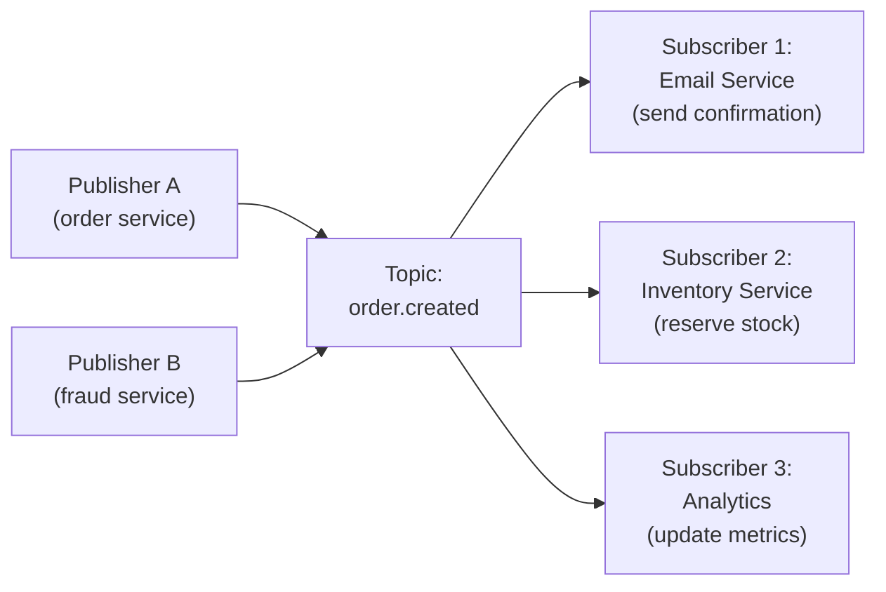
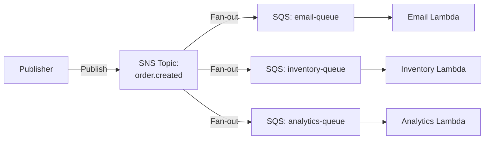
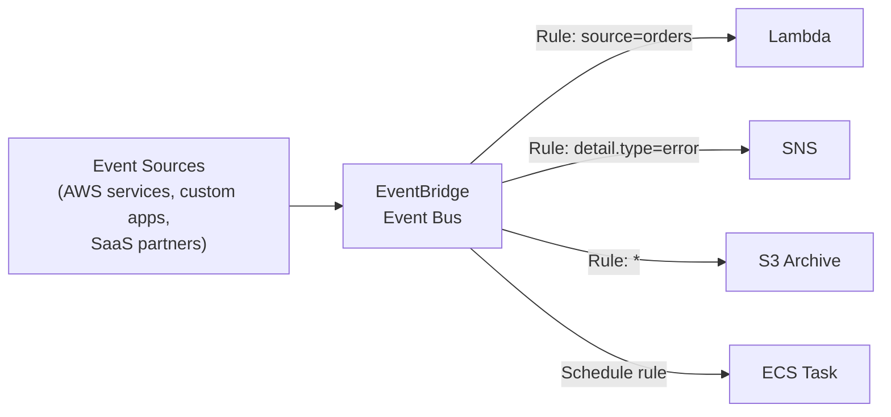

# Pub/Sub

## What it is

Publish/Subscribe is a messaging pattern where **publishers** send messages to a **topic** without knowing who will receive them, and **subscribers** receive messages from topics they've subscribed to without knowing who sent them. Producers and consumers are fully decoupled.

## Pub/Sub vs Message Queue

```
Message Queue (point-to-point):
  Producer → Queue → ONE consumer
  Message is consumed once by one consumer

Pub/Sub (fan-out):
  Publisher → Topic → Subscriber A
                    → Subscriber B
                    → Subscriber C
  Message delivered to ALL subscribers
```

## Core concepts



**Decoupling benefits:**
- Email service doesn't need to know about Order service
- Adding a new subscriber requires no change to publisher
- Subscribers can be added/removed without affecting other subscribers
- Each subscriber processes independently

## SNS (AWS Simple Notification Service)

Fully managed pub/sub service on AWS. Pushes messages to multiple endpoints.

### Supported subscription types

| Subscription | Use case |
|---|---|
| SQS | Fan-out to queues (most common — reliable, retry) |
| Lambda | Direct trigger |
| HTTP/HTTPS | Webhook delivery |
| Email/Email-JSON | Human notifications |
| SMS | Mobile alerts |
| Mobile Push (FCM, APNs) | iOS/Android notifications |

### SNS + SQS fan-out (the canonical pattern)



**Why not SNS → Lambda directly?**
- No retry on Lambda failure without DLQ
- No buffering — Lambda invoked synchronously
- SQS adds: buffering, retry, DLQ, batching, visibility timeout

Use **SNS → SQS → Lambda** for resilient fan-out.

### SNS message filtering

Each subscriber can filter which messages it receives:

```json
// SNS subscription filter policy
{
    "order_type": ["premium", "express"],
    "region": ["US", "CA"],
    "amount": [{ "numeric": [">=", 100] }]
}
```

Without filtering, all messages go to all subscribers. Filtering reduces unnecessary processing.

### Message attributes

```python
sns.publish(
    TopicArn=topic_arn,
    Message=json.dumps(order),
    MessageAttributes={
        'order_type': {
            'DataType': 'String',
            'StringValue': 'premium'
        },
        'amount': {
            'DataType': 'Number',
            'StringValue': '250.00'
        }
    }
)
```

## EventBridge (AWS)

AWS EventBridge is the evolution beyond SNS — a serverless event bus with rules-based routing.



**EventBridge vs SNS:**
- SNS: fast fan-out to subscribed endpoints, topic-based
- EventBridge: content-based routing with rich filtering, integrates with 200+ AWS services, event archive/replay, schema registry

**Event schema:**
```json
{
    "source": "com.myapp.orders",
    "detail-type": "Order Created",
    "detail": {
        "order_id": "ord_123",
        "user_id": "u_456",
        "amount": 250.00,
        "type": "premium"
    }
}
```

**EventBridge rule:**
```json
{
    "source": ["com.myapp.orders"],
    "detail-type": ["Order Created"],
    "detail": {
        "type": ["premium"],
        "amount": [{ "numeric": [">=", 100] }]
    }
}
```

**Scheduler:** EventBridge Scheduler replaces CloudWatch Events for cron-based triggers.

## Redis Pub/Sub

In-memory pub/sub — ideal for low-latency, fire-and-forget messaging within a service (e.g., WebSocket backplane).

```python
# Publisher
redis.publish('room:123', json.dumps({'user': 'alice', 'text': 'hello'}))

# Subscriber (runs in separate thread/process)
pubsub = redis.pubsub()
pubsub.subscribe('room:123')
for message in pubsub.listen():
    if message['type'] == 'message':
        broadcast_to_ws_clients(message['data'])
```

**Redis Pub/Sub limitations:**
- No persistence — subscriber must be connected when message is published
- No consumer groups — all subscribers receive all messages
- Fire-and-forget — no delivery guarantees
- Not for durable, reliable messaging — use SQS/Kafka for that

## Delivery guarantees in Pub/Sub

| System | Default guarantee | Durable? |
|---|---|---|
| Redis Pub/Sub | Fire-and-forget | No |
| SNS | At-least-once | No (ephemeral) |
| SNS → SQS | At-least-once | Yes (SQS stores) |
| EventBridge | At-least-once | Archive optional |
| Kafka | Configurable | Yes |
| Google Pub/Sub | At-least-once | Yes |

## Push vs Pull

**Push (SNS, EventBridge, Redis):** Topic pushes to subscribers. Subscriber must be available.

**Pull (Kafka, SQS):** Subscriber pulls from topic/queue. Can pull at own pace. Can replay. Better for backpressure.

## Interview angle

!!! tip "What interviewers are testing"
    They want to see you use pub/sub to avoid tight coupling and enable multiple independent reactions to a single event.

**Strong answer pattern:**
1. Identify the "one event, many reactions" pattern — order placed: email, inventory, analytics
2. Use SNS + SQS fan-out (not SNS → Lambda directly) for resilience
3. Use EventBridge for complex routing and integration with AWS services
4. Use Redis Pub/Sub only for ephemeral, low-latency scenarios (WebSocket backplane)
5. Add message filtering to avoid unnecessary processing

## Related topics

- [Message Queues](message-queues.md) — point-to-point, the building block of fan-out
- [Event Streaming](event-streaming.md) — durable, replayable, ordered events (Kafka)
- [Event-Driven Architecture](../architecture/event-driven.md) — how pub/sub fits into event-driven systems
- [WebSockets & SSE](../networking/websockets-sse.md) — Redis Pub/Sub as WebSocket backplane
