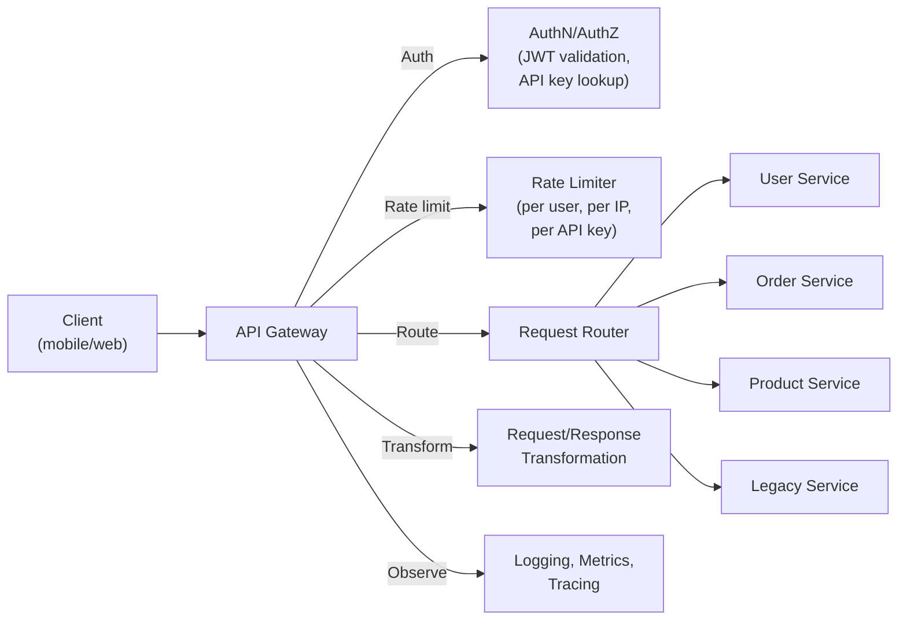

# API Gateway

## What it is

An API Gateway is a reverse proxy specialized for managing APIs. It sits at the entry point of your backend and handles cross-cutting concerns that would otherwise need to be implemented in every service: authentication, rate limiting, routing, transformation, and observability.

## What it does



**Responsibilities:**
- **Authentication & Authorization:** Validate JWT, API keys, OAuth tokens before requests reach services
- **Rate limiting:** Per user, per API key, per IP — protect backends from abuse
- **Request routing:** Path/host-based routing to microservices
- **Protocol translation:** REST → gRPC, HTTP/1.1 → HTTP/2
- **Request/Response transformation:** Add headers, modify payloads, aggregate responses
- **SSL/TLS termination:** Handle HTTPS at the gateway
- **Caching:** Cache identical responses
- **Observability:** Centralized logging, metrics, distributed trace injection

## AWS API Gateway

### Types

| Type | Protocol | Use case |
|---|---|---|
| REST API | HTTP/1.1 REST | Traditional REST APIs, full feature set |
| HTTP API | HTTP/1.1 REST | Low latency, lower cost, JWT auth only |
| WebSocket API | WebSocket | Real-time two-way communication |

**HTTP API vs REST API:**
- HTTP API: 70% cheaper, lower latency, JWT/OAuth2 authorizers, no usage plans
- REST API: More features (API keys, usage plans, request validation, caching, WAF direct integration)

### Integrations

```
API Gateway → Lambda (serverless)
API Gateway → HTTP backend (ALB, ECS, on-prem)
API Gateway → AWS service (SQS, DynamoDB, S3 — direct service integration)
API Gateway → Mock (return fixed response — useful for CORS preflight)
```

**Direct SQS integration (no Lambda):**
```
POST /orders → API Gateway → SQS → Consumer Lambda
```
API Gateway transforms the HTTP request into an SQS message. Zero servers for the API layer.

### Authorizers

=== "JWT Authorizer (HTTP API)"
    ```yaml
    # Validates JWT signature + claims
    Issuer: https://cognito-idp.us-east-1.amazonaws.com/us-east-1_abc
    Audience: ["client_app_id"]
    
    # Extracts claims for downstream use
    $context.authorizer.claims.sub → user_id
    ```

=== "Lambda Authorizer"
    ```python
    # Custom logic — API key lookup, complex claims validation
    def lambda_handler(event, context):
        token = event['authorizationToken']
        user = validate_and_lookup(token)
        if not user:
            raise Exception("Unauthorized")
        
        return {
            "principalId": user['id'],
            "policyDocument": {
                "Statement": [{
                    "Effect": "Allow",
                    "Action": "execute-api:Invoke",
                    "Resource": event['methodArn']
                }]
            },
            "context": { "user_id": user['id'], "plan": user['plan'] }
        }
    ```

    Cach the result for 300s (TTL-based) to avoid Lambda invocation per request.

### Usage plans and throttling

```
Usage Plan: "Basic Tier"
  Throttle: 100 req/sec burst, 50 req/sec steady
  Quota: 10,000 req/day

Usage Plan: "Pro Tier"  
  Throttle: 1000 req/sec burst, 500 req/sec steady
  Quota: Unlimited
```

API keys are associated with usage plans — different limits per customer tier.

## Self-managed API Gateways

### Kong

Popular open-source API gateway. Runs on Nginx/OpenResty with a plugin system.

```yaml
# Kong declarative config
services:
  - name: user-service
    url: http://user-svc:8080
    routes:
      - name: user-api
        paths: ["/users"]
    plugins:
      - name: jwt
      - name: rate-limiting
        config:
          minute: 100
      - name: prometheus
```

### Envoy / Istio Gateway

In Kubernetes, Istio Gateway uses Envoy as the ingress gateway — combines API gateway features with service mesh capabilities.

## BFF (Backend for Frontend)

A pattern where each frontend has its own dedicated API gateway:

```
Mobile App  → Mobile BFF → (aggregates 3 service calls → 1 response)
Web App     → Web BFF    → (different data shape, different auth)
Partner API → Partner GW → (external-facing, different rate limits)

                     ↓ (all backends call)
           User Service | Order Service | Product Service
```

BFF benefits:
- Tailored responses per client (mobile gets slimmer payloads)
- Client-specific auth flows
- Insulates clients from internal service changes

## Request aggregation / GraphQL gateway

```
Client sends one request:
POST /graphql
{
  user { name, email }
  orders { id, total }
  recommendations { products }
}

Gateway fans out to 3 services in parallel:
  User Service → user data
  Order Service → order data  
  ML Service → recommendations

Aggregates and returns one response
```

## Interview angle

!!! tip "What interviewers are testing"
    They want to see you place cross-cutting concerns at the gateway and keep services focused on business logic.

**Strong answer pattern:**
1. Auth validation at the gateway — services trust the gateway and read user context from headers
2. Rate limiting at the gateway — centralized, not per-service
3. Describe BFF if there are multiple clients with different needs
4. On AWS: use API Gateway + Lambda for serverless, API Gateway + ALB for containerized services

**Common follow-up:** *"Won't the API gateway become a bottleneck?"*
> It can — mitigate by: keeping the gateway stateless (auth state in JWT, not gateway), horizontal scaling (AWS API Gateway scales automatically), caching authorizer responses, and offloading heavy transformations to services.

## Related topics

- [Load Balancing](load-balancing.md) — gateway and LB often co-located
- [Rate Limiting](../patterns/rate-limiting.md) — one of the gateway's primary jobs
- [Authentication & Authorization](../security/authn-authz.md) — what the gateway validates
- [REST vs gRPC vs GraphQL](../api/comparison.md) — what the gateway routes/translates
