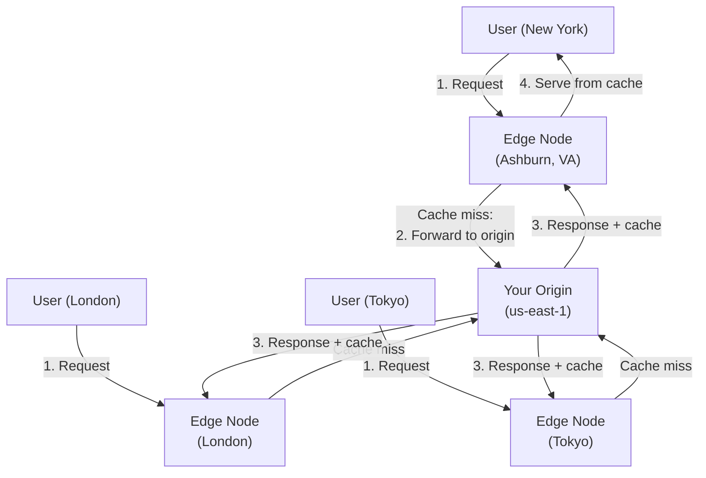

# CDN

## What it is

A Content Delivery Network (CDN) is a globally distributed network of edge servers that cache content close to users. Instead of all users hitting your origin server, they get responses from the nearest edge node — reducing latency and offloading origin traffic.

## How it works



**First request:** Cache miss → edge forwards to origin, caches the response  
**Subsequent requests:** Cache hit → served from edge (sub-millisecond for nearby users)

## Push vs Pull CDN

=== "Pull (most common)"
    CDN pulls content from origin on first cache miss. Content lives on origin.

    ```
    User → CDN (miss) → Origin (fetches + caches) → CDN → User
    User → CDN (hit) → User (no origin contact)
    ```

    - No pre-upload needed
    - Cold start on first request per edge node
    - Good for dynamic + semi-static content

=== "Push"
    You proactively upload content to the CDN. CDN stores the authoritative copy.

    ```
    You → push content to CDN → CDN distributes to all edges
    User → CDN (always hits) → User
    ```

    - No cold start
    - Content is at all edges before any request
    - Good for large files (video, software downloads) with predictable demand
    - Requires managing uploads and invalidations

## Cache-Control headers

You control CDN caching behavior via HTTP headers:

```http
# Cache for 1 day at CDN and browser
Cache-Control: public, max-age=86400

# Cache at CDN but not browser
Cache-Control: public, s-maxage=86400, max-age=0

# Do not cache (for authenticated/dynamic content)
Cache-Control: private, no-store

# Stale-while-revalidate: serve stale for 24h while refreshing in background
Cache-Control: public, max-age=3600, stale-while-revalidate=86400
```

## What to cache vs not

| Content | CDN appropriate? | Cache-Control |
|---|---|---|
| Static assets (JS, CSS, images) | Yes | `public, max-age=31536000, immutable` (with content hash in filename) |
| Fonts | Yes | `public, max-age=31536000` |
| Video / audio files | Yes (push CDN) | `public, max-age=86400` |
| API responses (public, infrequent change) | Yes | `public, s-maxage=300` |
| API responses (user-specific) | No | `private, no-store` |
| HTML pages | Careful | `public, s-maxage=60` or `no-store` |
| Auth endpoints | Never | `private, no-store` |

## Cache invalidation

Content at CDN edges remains cached until TTL expires. To force immediate update:

**1. Versioned URLs (best practice):**
```
/assets/app.a8f3d921.js    ← content hash in filename
/assets/app.b91f2c33.js    ← new hash when file changes
```
Deploy new file with new name → new URL → CDN treats as new object. No invalidation needed.

**2. Manual invalidation (CloudFront):**
```
# Invalidate specific path
aws cloudfront create-invalidation --distribution-id EDFDVBD6EXAMPLE \
  --paths "/index.html" "/api/config.json"

# Wildcard (expensive — counts as 1 invalidation path)
aws cloudfront create-invalidation --distribution-id EDFDVBD6EXAMPLE \
  --paths "/*"
```

- First 1,000 invalidation paths/month free, then $0.005/path
- Propagation takes 5-15 minutes
- Expensive and slow — use versioned URLs instead whenever possible

## CloudFront (AWS CDN)

### Key concepts

**Distribution:** Your CDN configuration  
**Origin:** Where CloudFront fetches content from (S3, ALB, EC2, API Gateway, custom HTTP)  
**Behavior:** Rules matching URL patterns to specific origins + cache settings

```
Distribution: d1234.cloudfront.net
  Behavior 1: /api/*       → origin: ALB (no caching, forward all headers)
  Behavior 2: /assets/*    → origin: S3 (cache 1 year)
  Behavior 3: /*           → origin: ALB (cache HTML 5 min)
```

### Origin Access Control (OAC)

Keep S3 bucket private — only CloudFront can access it:

```
S3 bucket policy: allow only CloudFront service principal
CloudFront: signs requests to S3 using SigV4

User → CloudFront (public) → S3 (private, OAC only) ✓
User → S3 directly (403 Forbidden) ✗
```

### Lambda@Edge / CloudFront Functions

Run code at the edge — before/after cache:

```
Viewer Request:  Modify incoming request (A/B testing, URL rewrite, auth)
Origin Request:  Modify request to origin (add headers, custom routing)
Origin Response: Modify origin response (add security headers)
Viewer Response: Modify response to client
```

**CloudFront Functions (lightweight, JS):** Sub-millisecond, for simple transforms  
**Lambda@Edge (full Lambda):** More powerful, higher latency, runs in ~12 regional edge locations

Use cases:
- Token validation at the edge (avoid auth hitting origin)
- URL rewrites / redirects
- Security headers injection
- A/B testing via cookie manipulation

### CloudFront + S3 for static sites

```
Route 53 → CloudFront → S3 (static website hosting)

No EC2, no ALB, no containers.
Infinitely scalable, ~$0.0085/GB transferred.
```

## CDN for APIs (dynamic content)

CDNs aren't just for static files. With proper `Cache-Control`, API responses can be cached:

```
GET /api/products/featured
Cache-Control: public, s-maxage=60

→ First user: CloudFront misses, fetches from ALB, caches 60s
→ Next 1000 users within 60s: served from edge, zero origin load
```

**Vary header:** Cache different responses for different variants:
```http
Vary: Accept-Encoding, Accept-Language
```
CloudFront keeps separate caches for each combination.

## Interview angle

!!! tip "What interviewers are testing"
    They want to see you use CDN to reduce latency AND reduce origin load — and know the invalidation tradeoffs.

**Strong answer pattern:**
1. Put CDN in front of static assets with versioned URLs (no invalidation needed)
2. Put CDN in front of S3 with OAC for security
3. Cache public API responses with appropriate TTL (s-maxage)
4. Use Lambda@Edge for auth at the edge
5. Mention that CDN is the first line of defense against traffic spikes (DDoS absorption)

## Related topics

- [DNS](dns.md) — DNS routes users to nearest CDN edge
- [Load Balancing](load-balancing.md) — CDN is L7 load balancing at global scale
- [Blob Storage](../storage/blob-storage.md) — S3 + CloudFront is the canonical static content pattern
- [Caching](../storage/caching.md) — CDN is the outermost cache layer
