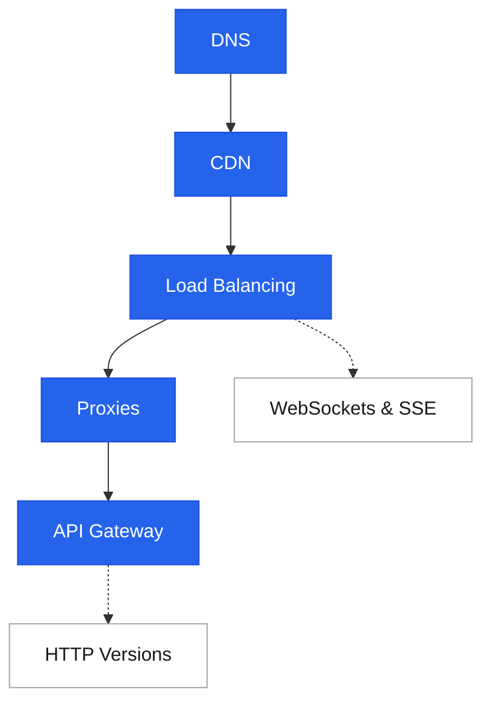

# Networking

<div class="sec-hero" markdown>
<span class="ey">Communication · the wire</span>
Every request a user makes traverses multiple networking layers before hitting your application code. Understanding how these layers work — and where they fail — is essential for designing systems with predictable latency, high availability, and correct behavior under load.
</div>

## Roadmap

Follow the spine top-to-bottom your first time. Dashed branches hang off the topic they support — grab them when you need them.

<div class="sd-mermaid-links" data-links='{
  "DNS": "dns/",
  "CDN": "cdn/",
  "Load Balancing": "load-balancing/",
  "Proxies": "proxies/",
  "API Gateway": "api-gateway/",
  "WebSockets & SSE": "websockets-sse/",
  "HTTP Versions": "http-versions/"
}'></div>



## Suggested reading order

New to this topic? Read these in order — each builds on the previous:

1. [DNS](dns.md) — the first hop of every request; nothing connects before a name resolves
2. [CDN](cdn.md) — the edge layer that decides whether a request even reaches you
3. [Load Balancing](load-balancing.md) — how traffic spreads across instances once it arrives
4. [Proxies](proxies.md) — forward vs reverse, and the layer load balancers and gateways are built on
5. [API Gateway](api-gateway.md) — auth, rate limiting, and routing composed at the entry point

**Then, as needed (reference):** [WebSockets & SSE](websockets-sse.md)

**Advanced — come back later:** [HTTP Versions](http-versions.md)

---

## The request path

```
User types URL
  │
  ├─ DNS resolution     → IP address for the hostname
  ├─ CDN edge           → Serves cached response (cache hit) or forwards upstream
  ├─ Load balancer      → Picks a healthy backend instance
  ├─ Reverse proxy      → TLS termination, auth, rate limiting
  ├─ API gateway        → Routing, versioning, observability
  └─ App server         → Business logic
```

Each hop adds latency. Each hop is a failure point. Designing well means placing logic at the right hop.

---

## The request path

Each topic below maps to a hop on the path a request takes from the user to your application code.

<div class="pcards">
<a class="pcard" href="dns/"><span class="t">DNS</span><span class="d">Name resolution, TTLs, routing tricks — the first hop before any connection</span></a>
<a class="pcard" href="cdn/"><span class="t">CDN</span><span class="d">Edge caching, push vs pull, invalidation, DDoS absorption</span></a>
<a class="pcard" href="load-balancing/"><span class="t">Load Balancing</span><span class="d">L4 vs L7, algorithms, sticky sessions, health checks</span></a>
<a class="pcard" href="proxies/"><span class="t">Proxies</span><span class="d">Forward vs reverse proxy, what each solves</span></a>
<a class="pcard" href="api-gateway/"><span class="t">API Gateway</span><span class="d">Auth, rate limiting, routing, observability at the edge</span></a>
</div>

## Real-time & protocols

Persistent connections and the evolution of HTTP itself — reach for these once the basic request path is clear.

<div class="pcards">
<a class="pcard" href="websockets-sse/"><span class="t">WebSockets & SSE</span><span class="d">Persistent connections for real-time data push — chat, live feeds, collaboration</span></a>
<a class="pcard" href="http-versions/"><span class="t">HTTP Versions</span><span class="d">HTTP/1.1 vs HTTP/2 vs HTTP/3 — multiplexing, QUIC</span></a>
</div>

---

## Concept map

```
DNS
  ├── A / CNAME records          → hostname → IP
  ├── TTL tuning                 → failover speed vs cache poisoning
  └── Weighted routing (Route 53)→ canary, regional failover

CDN
  ├── Edge PoP caches response
  ├── Pull (lazy) vs Push (pre-warm)
  └── Cache-Control / Surrogate-Control headers

Load Balancer
  ├── L4 (TCP/UDP)  → fast, dumb, no HTTP awareness
  ├── L7 (HTTP/gRPC)→ routing by path/host, sticky sessions, TLS termination
  └── Algorithms: Round robin, least-connections, IP hash, consistent hashing

Proxy
  ├── Forward proxy  → client side, egress control, caching
  └── Reverse proxy  → server side, TLS termination, WAF, rate limiting

API Gateway
  ├── Auth (JWT validation, API keys)
  ├── Rate limiting / throttling
  ├── Request routing and transformation
  └── Observability (access logs, metrics)

HTTP Evolution
  HTTP/1.1 → 1 request per connection (head-of-line blocking)
  HTTP/2   → multiplexed streams over 1 TCP conn
  HTTP/3   → streams over QUIC (UDP), eliminates TCP HOL blocking
```

---

## Interview shortlist

| Question | Key answer |
|---|---|
| *"How does DNS failover work?"* | Low TTL (30-60s) on health-checked records. Route 53 health checks → swap A record. Downtime = TTL window. |
| *"L4 vs L7 load balancer — when to use each?"* | L4: low latency, TLS passthrough, non-HTTP protocols. L7: path-based routing, sticky sessions, WebSocket upgrades, gRPC. |
| *"Why does CDN help with DDoS?"* | Absorbs volumetric attacks at the edge. Anycast routing means attack traffic is distributed across PoPs. Origin never sees the flood. |
| *"How do WebSockets work behind a load balancer?"* | Need sticky sessions or L7 LB that understands WS upgrades. Stateful connection lives on one backend — if it dies, client reconnects. |
| *"HTTP/2 vs HTTP/3 — what problem does each solve?"* | HTTP/2: multiplexing (no per-request connections). HTTP/3: QUIC removes TCP head-of-line blocking that HTTP/2 still had at transport layer. |

---

## Related topics

- [API Design](../api/index.md) — what travels over the network
- [Caching](../caching/index.md) — CDN and in-process caching strategies
- [Patterns: Rate Limiting](../patterns/rate-limiting.md) — enforced at the API gateway
- [Fundamentals: Networking Basics](../fundamentals/networking-basics.md) — TCP/IP, DNS, TLS fundamentals
