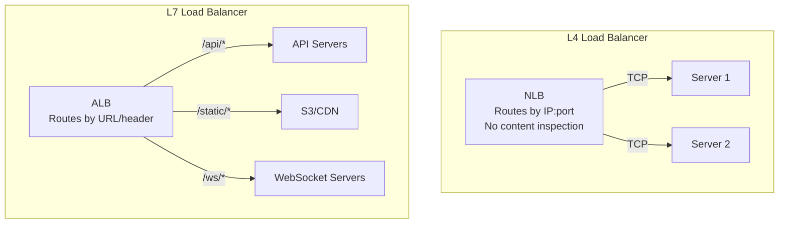
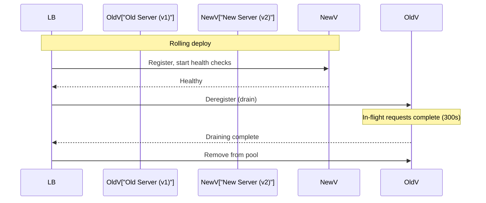

# Load Balancing

## What it is

A load balancer distributes incoming traffic across multiple backend servers to maximize throughput, minimize latency, and eliminate single points of failure. It's the entry point for virtually all production traffic.

## L4 vs L7 Load Balancing

The OSI layer determines what the load balancer can see and act on.

| | L4 (Transport Layer) | L7 (Application Layer) |
|---|---|---|
| **Sees** | IP, TCP/UDP ports | HTTP headers, URL, cookies, body |
| **Routing basis** | Source IP, port | URL path, header, content |
| **TLS** | Pass-through or terminate | Terminate and inspect |
| **Protocols** | TCP, UDP | HTTP, HTTPS, WebSocket, gRPC |
| **Performance** | Very fast (no parsing) | Slower (full packet inspection) |
| **Features** | Basic routing | Host-based routing, sticky sessions, content-based routing |
| **AWS** | NLB (Network Load Balancer) | ALB (Application Load Balancer) |



## Load balancing algorithms

### Round Robin

Requests distributed sequentially. Simple, no state.

```
Requests: R1, R2, R3, R4, R5, R6
Servers:  S1, S2, S3, S1, S2, S3
```

Best for: Identical servers, similar request costs.

### Weighted Round Robin

Like round robin, but servers get proportionally more traffic by weight.

```
S1 (weight=3): gets 3x traffic
S2 (weight=1): gets 1x traffic
Pattern: S1, S1, S1, S2, S1, S1, S1, S2, ...
```

Best for: Heterogeneous servers (different CPU/memory), gradual traffic shifting (canary).

### Least Connections

Route to the server with the fewest active connections.

```
S1: 10 active connections
S2: 3 active connections  ← next request goes here
S3: 7 active connections
```

Best for: Variable-length requests (some fast, some slow).

### Least Response Time

Route to the server with the lowest average response time.

Best for: Performance-sensitive routing where server speed varies.

### IP Hash (Sticky Sessions via Hash)

Hash client IP → consistent server. Same client always hits same server.

```
hash(client_ip) % num_servers = server_index
hash("192.168.1.1") % 3 = 2 → always Server 3
```

Best for: Stateful applications where session must stay on one server.

**Problem:** Uneven distribution if clients have few IPs (office NAT). Server failure breaks sessions.

### Random

Pick a random server. Simple, surprisingly effective.

Best for: Stateless services with many servers.

## Health checks

Load balancers continuously probe backends:

```
Active health check (LB initiates):
  Every 30s: GET /health HTTP/1.1 Host: server1
  2xx response → healthy
  Timeout / 5xx → unhealthy → remove from rotation
  
Passive health check (monitor traffic):
  5 consecutive errors → mark unhealthy
```

**Graceful shutdown:** Send SIGTERM → app stops accepting new connections → drains in-flight requests → exits.

```
ALB: deregistration delay (default 300s)
  When instance is deregistering:
  - New connections: routed to other instances
  - Existing connections: allowed to complete for 300s
  - After 300s: force terminate
```

## Sticky sessions

Route the same client to the same server for session continuity.

**Cookie-based (L7 only):**
```
LB sets cookie: AWSALB=abc123
On next request: LB reads cookie → routes to same server
```

**Duration-based sticky:** Cookie expires after N seconds.

**Application-based sticky:** App sets the stickiness cookie with its own logic.

**Better approach:** Externalize session state to Redis. Then any server can handle any request. No stickiness needed.

## ALB (Application Load Balancer) — AWS

The standard L7 load balancer on AWS.

**Host-based routing:**
```
api.example.com → Target Group: API servers
static.example.com → Target Group: S3 / static servers
```

**Path-based routing:**
```
/api/*       → Target Group: API servers (ECS)
/admin/*     → Target Group: Admin app (EC2)
/health      → Fixed response: 200 OK  (no backend needed)
```

**Header-based routing:**
```
X-Version: v2 → Target Group: v2 servers
```

**Weighted target groups (canary):**
```
Production TG: weight=90
Canary TG:     weight=10
```

## NLB (Network Load Balancer) — AWS

L4 TCP/UDP load balancer. Ultra-high performance — 10M+ requests/sec, single-digit ms latency.

**Use NLB when:**
- Extreme performance required (gaming, trading)
- Non-HTTP protocols (TCP custom protocols, UDP)
- Need static IP addresses (NLB provides, ALB doesn't)
- TLS pass-through to backend (end-to-end encryption without LB termination)

## Global load balancing

**Route 53 (DNS-level):** Latency or geolocation routing across regions.

**AWS Global Accelerator:** Anycast IP routing — traffic enters AWS backbone at nearest edge, routed to optimal region.

```
User → AWS Global Accelerator (Anycast IP)
                ↓
       AWS backbone (fast, private)
                ↓
       Regional ALB (optimal region)
```

Global Accelerator vs CloudFront:
- CloudFront: caches content at edge (static assets, API responses)
- Global Accelerator: routes to origin at lowest latency (non-cacheable, stateful)

## Connection draining and rolling deploys



## Interview angle

!!! tip "What interviewers are testing"
    They want to see you pick L4 vs L7 appropriately and reason about algorithm choice for the workload.

**Strong answer pattern:**
1. Default to ALB (L7) for HTTP APIs — path routing, sticky sessions, WAF integration
2. Use NLB for TCP/UDP, extreme throughput, or static IP requirements
3. Algorithm: round-robin for stateless, least-connections for variable-cost requests
4. Always externalize session state rather than using sticky sessions
5. For global systems: Route 53 latency routing + regional ALBs

## Related topics

- [DNS](dns.md) — DNS routes to the load balancer
- [CDN](cdn.md) — CDN is global L7 load balancing for cached content
- [API Gateway](api-gateway.md) — API-specific routing, auth, rate limiting
- [Scalability](../fundamentals/scalability.md) — load balancing is how horizontal scaling works
