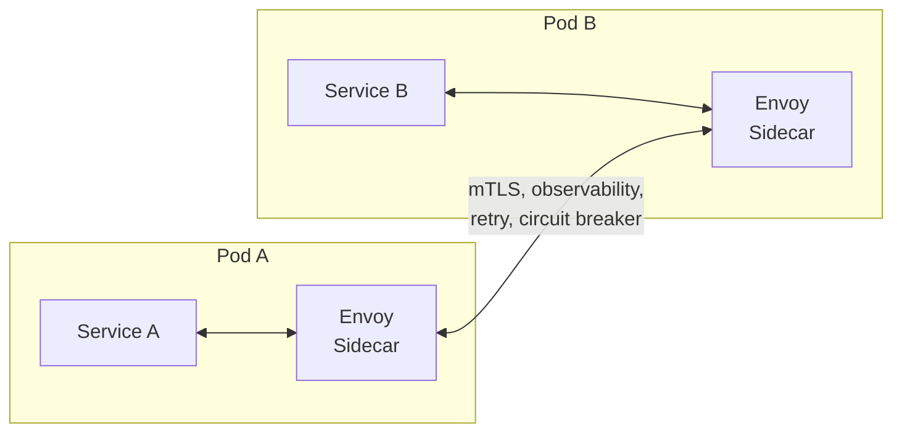

# Proxies

## What it is

A proxy is an intermediary that sits between two parties in a communication. It intercepts requests, potentially modifies them, and forwards them. The key question is: **whose behalf does it act on?**

## Forward Proxy

Acts on behalf of the **client**. The server doesn't know the real client.

```
Client → Forward Proxy → Internet → Server

Server sees: Proxy IP, not client IP
Client sees: Normal response
```

**Use cases:**
- **Privacy / anonymity:** VPNs, Tor
- **Corporate filtering:** Company proxy blocks social media, logs employee traffic
- **Caching:** Shared cache for outbound requests (all clients share cached responses)
- **Access control:** Only allow outbound traffic through proxy (firewall + audit)

## Reverse Proxy

Acts on behalf of the **server**. The client doesn't know the real server.

```
Client → Reverse Proxy → Server 1
                       → Server 2
                       → Server 3

Client sees: One address (proxy)
Servers see: Proxy IP (unless X-Forwarded-For header preserved)
```

**Use cases:**
- **Load balancing:** Distribute across multiple backend servers
- **TLS termination:** Proxy handles HTTPS, backends can use plain HTTP internally
- **Caching:** Cache responses, serve repeated requests without hitting backend
- **Compression:** Gzip/Brotli responses before sending to client
- **Security:** Hide backend topology, WAF, rate limiting, IP blocking
- **A/B testing / canary:** Route % of traffic to new version
- **Auth:** Validate tokens at proxy layer before hitting services

**Common reverse proxies:** Nginx, HAProxy, Envoy, Caddy, Traefik

## Nginx as a reverse proxy

```nginx
# nginx.conf
http {
    upstream backend {
        server 10.0.1.10:8080 weight=3;
        server 10.0.1.11:8080 weight=1;
        keepalive 32;
    }

    server {
        listen 443 ssl;
        server_name api.example.com;

        ssl_certificate     /etc/ssl/cert.pem;
        ssl_certificate_key /etc/ssl/key.pem;

        # Proxy to backend
        location /api/ {
            proxy_pass         http://backend;
            proxy_set_header   X-Forwarded-For $remote_addr;
            proxy_set_header   Host $host;
            
            # Timeouts
            proxy_connect_timeout 5s;
            proxy_send_timeout    60s;
            proxy_read_timeout    60s;
        }

        # Serve static files directly (bypass backend)
        location /static/ {
            root /var/www;
            expires 1y;
            add_header Cache-Control "public, immutable";
        }
    }
}
```

## Sidecar Proxy (Service Mesh)

In microservices, a sidecar proxy is deployed alongside each service container. All traffic in/out goes through the sidecar — invisible to the application.



The sidecar provides (without code changes to the app):
- mTLS encryption between services
- Distributed tracing
- Retry and timeout policies
- Circuit breaking
- Traffic shaping (canary, A/B)

See [Service Mesh](../infrastructure/service-mesh.md) for full coverage.

## Transparent proxy

A proxy the client doesn't know about — all traffic is routed through it by network config (iptables, DNS, router policy).

Common in:
- Corporate networks (traffic inspection)
- Kubernetes (kube-proxy routes traffic to pod IPs transparently)
- Service mesh (Envoy sidecar intercepts via iptables)

## TLS termination

```
Internet → Reverse Proxy (TLS termination) → Backend (plain HTTP)

Benefits:
  - Backend doesn't handle TLS overhead (offloaded to proxy)
  - Centralized certificate management
  - Backend can be simple HTTP

Consideration:
  - Traffic between proxy and backend is unencrypted
  - If in same VPC / trusted network, acceptable
  - If sensitive, use TLS re-encryption (proxy → backend also TLS) or end-to-end TLS (pass-through)
```

**mTLS (mutual TLS):** Both sides present certificates. Used for service-to-service auth in zero-trust networks. Sidecar proxies automate this.

## Proxy vs Gateway vs Load Balancer

| | Forward Proxy | Reverse Proxy | Load Balancer | API Gateway |
|---|---|---|---|---|
| Acts for | Client | Server | Server | Server |
| Primary purpose | Outbound filtering/privacy | Inbound routing/security | Distribute load | API management |
| Layer | L4/L7 | L4/L7 | L4/L7 | L7 |
| Features | Caching, filtering | TLS, caching, routing | Health checks, algorithms | Auth, rate limiting, transforms |

In practice these overlap — Nginx can be all four. The distinction is conceptual.

## Interview angle

!!! tip "What interviewers are testing"
    They want to see you place proxies correctly in architecture diagrams and know what each layer is responsible for.

**Strong answer pattern:**
1. Use reverse proxy for TLS termination at the edge (don't let TLS reach individual services)
2. Place WAF/rate limiting at the reverse proxy layer (not in every service)
3. For microservices: mention sidecar proxy / service mesh for cross-cutting concerns (mTLS, retries)
4. Distinguish: corporate forward proxy vs CDN (reverse proxy for caching) vs API Gateway (auth + routing)

## Related topics

- [Load Balancing](load-balancing.md) — reverse proxy with traffic distribution
- [API Gateway](api-gateway.md) — reverse proxy with API-specific features
- [Service Mesh](../infrastructure/service-mesh.md) — sidecar proxies for microservices
- [Security](../security/zero-trust.md) — mTLS and zero-trust via proxies
