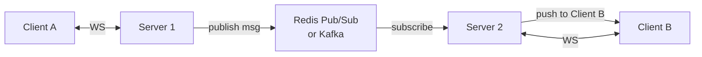
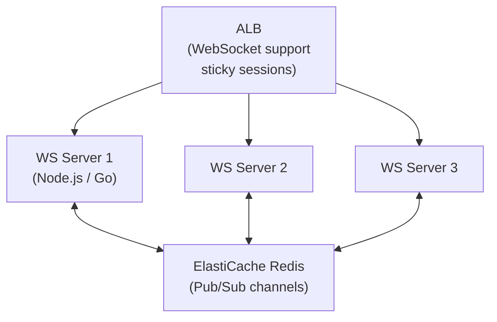

# WebSockets & SSE

## The problem with HTTP polling

Standard HTTP is request-response: client asks, server answers. For real-time features, you'd have to poll:

```
Client → GET /messages?since=last_id  (every 1 second)
Client → GET /messages?since=last_id
Client → GET /messages?since=last_id  ← 99% of these return "no new messages"
```

**Short polling:** Fixed interval. Wasteful — most requests return nothing.  
**Long polling:** Server holds the connection open until it has data or times out. Better, but complex and inefficient at scale.

## WebSockets

A full-duplex, bidirectional communication channel over a single TCP connection. Both client and server can send messages at any time.

### Handshake

```
Client → Server: HTTP Upgrade request
GET /chat HTTP/1.1
Host: ws.example.com
Upgrade: websocket
Connection: Upgrade
Sec-WebSocket-Key: dGhlIHNhbXBsZSBub25jZQ==
Sec-WebSocket-Version: 13

Server → Client: 101 Switching Protocols
HTTP/1.1 101 Switching Protocols
Upgrade: websocket
Connection: Upgrade
Sec-WebSocket-Accept: s3pPLMBiTxaQ9kYGzzhZRbK+xOo=

← TCP connection is now a WebSocket. No more HTTP.
```

### Message framing

```
WebSocket frame:
  FIN bit (1 = last fragment)
  Opcode: Text (0x1) / Binary (0x2) / Ping (0x9) / Pong (0xA) / Close (0x8)
  Payload length
  Masking key (client→server must mask)
  Payload data
```

### Client example (browser)

```javascript
const ws = new WebSocket('wss://ws.example.com/chat/room-123');

ws.onopen = () => {
    ws.send(JSON.stringify({ type: 'join', room: 'room-123', user: 'alice' }));
};

ws.onmessage = (event) => {
    const msg = JSON.parse(event.data);
    console.log(`${msg.user}: ${msg.text}`);
};

ws.onclose = (event) => {
    console.log('Disconnected:', event.code, event.reason);
    // Reconnect with exponential backoff
};

ws.onerror = (error) => console.error('WS error:', error);
```

### Server scalability challenge

WebSockets are **stateful, persistent connections**. This breaks horizontal scaling:

```
Client A connected to Server 1
Client B connected to Server 2

Client A sends message to Client B:
  → Server 1 has no connection to Client B!
```

**Solution: Pub/Sub backplane**



**Redis Pub/Sub:** Server subscribes to room channels. When a message arrives for room-123, all servers subscribed to `room:123` receive it and push to their connected clients.

### Connection management

**Heartbeat:** Send periodic ping/pong to detect dead connections:
```
Client → Server: Ping (every 30s)
Server → Client: Pong
If no pong in 60s: close connection
```

**Reconnection:** Client must handle disconnects and reconnect with backoff:
```javascript
function connect() {
    const ws = new WebSocket(url);
    ws.onclose = () => {
        setTimeout(connect, Math.min(1000 * 2 ** reconnectAttempts, 30000));
        reconnectAttempts++;
    };
}
```

**State recovery:** When client reconnects, it needs to catch up on missed messages. Store message history in DB or use a message cursor.

## Server-Sent Events (SSE)

A unidirectional channel: server pushes events to client. The client cannot send messages (still uses regular HTTP for that).

```
GET /events HTTP/1.1
Accept: text/event-stream

HTTP/1.1 200 OK
Content-Type: text/event-stream
Cache-Control: no-cache

data: {"type": "update", "count": 42}

data: {"type": "notification", "message": "New order received"}

event: heartbeat
data: ping

: comment (ignored by client)
```

### SSE format

```
event: custom_event_name  (optional, default: "message")
id: 123                   (for reconnection cursor)
retry: 3000               (ms before reconnect)
data: {"key": "value"}    (the payload, can be multiline)
                          (blank line = end of event)
```

### Client example

```javascript
const evtSource = new EventSource('/notifications');

evtSource.onmessage = (event) => {
    const data = JSON.parse(event.data);
    updateUI(data);
};

evtSource.addEventListener('order_update', (event) => {
    const order = JSON.parse(event.data);
    updateOrderStatus(order);
});

// Auto-reconnects with Last-Event-ID header
// Browser handles reconnection natively
```

**Reconnection:** SSE reconnects automatically. Browser sends `Last-Event-ID` header — server can replay missed events.

## WebSocket vs SSE vs Long Polling

| | WebSocket | SSE | Long Polling |
|---|---|---|---|
| **Direction** | Bidirectional | Server → Client only | Server → Client |
| **Protocol** | WS/WSS (upgrade) | HTTP/HTTPS | HTTP/HTTPS |
| **Reconnect** | Manual | Automatic | Manual |
| **Binary support** | Yes | No (text only) | Yes |
| **Load balancer** | Needs sticky sessions or pub/sub | Works with stateless LB | Works with stateless LB |
| **HTTP/2** | Incompatible (different protocol) | Native (multiplexed) | Works |
| **Browser support** | Universal | Universal (no IE) | Universal |
| **Complexity** | Higher | Low | Medium |
| **Use case** | Chat, gaming, collaboration | Notifications, feeds, live data | Fallback |

## When to use each

**WebSocket:**
- Real-time bidirectional: chat, multiplayer gaming, collaborative editing, live trading
- Low latency required: sub-100ms interaction

**SSE:**
- Server pushes, client reads: live dashboards, news feeds, progress updates, notifications
- Simple, works with HTTP/2 multiplexing

**Long polling:**
- Legacy support where WebSocket not available
- Infrequent updates that don't justify a persistent connection

## AWS architecture for WebSockets

### API Gateway WebSocket API

```
Client ←→ API Gateway WebSocket ←→ Lambda (connect/disconnect/message)

Connection table in DynamoDB:
  connectionId → userId, roomId, created_at

Send to specific client:
  api_gw_management.post_to_connection(
      ConnectionId=connection_id,
      Data=json.dumps(message)
  )
```

**Limitation:** Lambda is stateless — to fan out to other connections, query DynamoDB for all connections in the room and call `post_to_connection` for each.

### ECS/EC2 with Redis Pub/Sub

For high-volume, low-latency WebSocket servers:



## Interview angle

!!! tip "What interviewers are testing"
    For chat/real-time systems, they want to see you address the horizontal scaling problem — not just say "use WebSockets."

**Strong answer pattern:**
1. Choose WebSocket for bidirectional (chat), SSE for server-push (notifications/feed)
2. Explain the scaling challenge — persistent connections break stateless servers
3. Solution: pub/sub backplane (Redis Pub/Sub or Kafka)
4. Discuss connection recovery — heartbeat + reconnect + catch-up from DB
5. For API Gateway WebSocket: note DynamoDB connection table + `post_to_connection`

## Related topics

- [Messaging](../messaging/pub-sub.md) — Redis Pub/Sub as the backplane
- [Chat System case study](../case-studies/chat-system.md) — full design using WebSockets
- [HTTP Versions](http-versions.md) — HTTP/2 and why SSE is better there
- [Load Balancing](load-balancing.md) — sticky sessions for WebSocket
