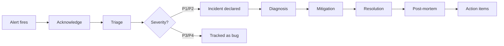

# Incident Management

## What it is

Incident management is the process for detecting, responding to, resolving, and learning from production outages. Good incident management minimizes customer impact (MTTR) and prevents recurrence.

```
Key metrics:
  MTTD: Mean Time To Detect     — how fast do you know something is wrong?
  MTTI: Mean Time To Investigate — how fast can you diagnose the cause?
  MTTR: Mean Time To Recover    — how fast do you restore service?
  MTBF: Mean Time Between Failures — how often do incidents occur?

Goal: minimize MTTR while increasing MTBF
```

## Incident lifecycle



## Severity levels

| Severity | Impact | Response time | Example |
|---|---|---|---|
| **P1/SEV-1** | Full outage, data loss | Immediate, 24/7 | Checkout down, no orders possible |
| **P2/SEV-2** | Significant degradation | 30 minutes, 24/7 | 50% of payments failing |
| **P3/SEV-3** | Partial impact, workaround exists | Next business hours | Search autocomplete slow |
| **P4/SEV-4** | Minor, cosmetic | Normal sprint | UI glitch, non-critical feature |

## Incident roles

**Incident Commander (IC):** Owns the incident process. Coordinates people, delegates tasks, communicates status. Does NOT do hands-on debugging.

**Technical Lead:** Does the debugging and mitigation. Reports status to IC.

**Communications Lead:** Updates stakeholders, writes status page updates, manages Slack threads.

**Scribe:** Documents timeline in real-time (what was tried, when, results).

```
IC → "What's the current hypothesis?"
TL → "Looks like DB connection pool exhausted — investigating"
IC → "Comms lead, update status page: investigating increased error rates"
IC → "Scribe, log: 14:15 - DB connection pool suspected"
IC → "Do we need DBA on call?"
```

## Incident communication

### Status page updates

Write for customers — avoid jargon:

```
BAD: "Elevated 5xx error rates observed across multiple availability zones 
      in us-east-1. Engineering is investigating increased connection pool 
      exhaustion in the payment microservice."

GOOD: "We are investigating issues affecting checkout. Some customers 
       may experience errors when placing orders. Our team is actively 
       working on a fix. Updates every 15 minutes."
```

### Internal communication

```
#incident-2024-04-26-checkout Slack channel:

14:00 - @oncall-payments - INCIDENT DECLARED - P1 checkout errors
        Dashboard: https://grafana/d/checkout
        Error rate: 15% (SLO: 0.1%)
        
14:05 - @alice (IC) taking over coordination
        @bob investigating payment service
        @carol updating status page

14:12 - @bob - DB connections maxed out. payment-service pods showing 
        max_connections exceeded errors

14:15 - @bob - Rolling restart of payment-service pods
        kubectl rollout restart deployment/payment-service

14:20 - @bob - Error rate dropping: 8% → 3% → 0.5%

14:22 - @alice - RESOLVED. Error rate nominal. 
        Status page: resolved
        Post-mortem scheduled: tomorrow 10am
```

## Runbook execution

Every P1/P2 alert fires → engineer consults runbook:

```markdown
# Runbook: Payment Service Connection Pool Exhaustion

## Symptoms
- payment-service error rate > 5%
- Errors include "too many connections" or "pool exhausted"
- Database connection count at maximum

## Immediate Mitigation (5 minutes)

### Step 1: Confirm diagnosis
```
kubectl logs -l app=payment-service --tail=50 | grep "pool\|connection"
kubectl exec -it <payment-pod> -- psql $DB_URL -c "SELECT count(*) FROM pg_stat_activity;"
```

### Step 2: Rolling restart (first try)
```
kubectl rollout restart deployment/payment-service
kubectl rollout status deployment/payment-service --timeout=5m
```

Expected: error rate returns to < 0.1% within 3 minutes.

### Step 3: If restart doesn't fix it — scale up
```
kubectl scale deployment/payment-service --replicas=10
```

### Step 4: If still broken — kill idle connections in DB
```
SELECT pg_terminate_backend(pid)
FROM pg_stat_activity
WHERE datname = 'payments_prod'
  AND state = 'idle'
  AND query_start < NOW() - INTERVAL '5 minutes';
```

## Escalation
- Not resolved in 15 minutes: page DBA (@dba-oncall)
- Still not resolved in 30 minutes: escalate to VP Engineering
```

## Mitigation vs resolution

**Mitigation:** stop the bleeding, restore service — may not be the root cause fix.

```
Mitigation examples:
  ✓ Rollback the bad deployment
  ✓ Increase replicas to handle load
  ✓ Disable the broken feature flag
  ✓ Route traffic around the failing zone
  ✓ Increase connection pool size temporarily

Resolution: fix the root cause
  Fix the bug that caused connection leaks
  Optimize the slow query causing high CPU
  Add circuit breaker to prevent cascade
```

Always prefer mitigation first (fast) then resolution (careful). Don't let perfect be the enemy of recovered.

## Post-mortem (blameless)

Within 48 hours of resolution, the IC schedules a post-mortem:

```markdown
# Post-Mortem: Payment Service Outage 2024-04-26

**Date:** 2024-04-26 14:00–14:22 UTC  
**Duration:** 22 minutes  
**Severity:** P1  
**Impact:** ~15% of checkout requests failed. ~1,200 orders not placed.  
**Authors:** Alice (IC), Bob (TL)

## Timeline

| Time | Event |
|------|-------|
| 13:55 | Deploy v2.4.1 to payment-service (100% rollout) |
| 14:00 | Alert: PaymentService-HighErrorRate fires (error rate 15%) |
| 14:01 | On-call acknowledged, incident declared |
| 14:05 | Alice took IC role, Bob began investigation |
| 14:12 | Connection pool exhaustion identified in logs |
| 14:15 | Rolling restart initiated |
| 14:22 | Error rate normalized, incident resolved |

## Root cause

v2.4.1 introduced a new database query in the fraud check path. The query 
used a missing index, causing full table scans. Each scan held a DB connection 
for ~2s instead of ~5ms. Under normal traffic (500 rps), this exhausted the 
100-connection pool in seconds.

## What went wrong

1. Code review missed missing index (no EXPLAIN ANALYZE in review)
2. Load testing ran against a smaller dataset (index missing not apparent)
3. Alert didn't fire until 5 minutes of sustained failure (for: 5m)
4. No canary deployment — v2.4.1 rolled to 100% in 2 minutes

## What went right

1. Alert fired within SLO burn rate threshold
2. Runbook correctly identified connection pool issue
3. Rolling restart resolved within 7 minutes of IC taking over
4. Communication to customers was clear and timely

## Action items

| Action | Owner | Due |
|--------|-------|-----|
| Add EXPLAIN ANALYZE requirement to PR template | Bob | 2024-05-03 |
| Implement canary deployments for payment-service | DevOps | 2024-05-10 |
| Add DB connection age monitoring alert | Bob | 2024-05-01 |
| Load test with production-scale dataset | QA | 2024-05-17 |
| Add index on fraud_checks.user_id | Bob | 2024-04-27 |
```

**Blameless culture:** The post-mortem focuses on system and process failures — not individual blame. "Alice didn't catch the bug" is not an action item. "Code review process didn't catch missing index" is.

## Chaos engineering

Proactively find weaknesses before incidents find them:

```python
# Chaos: kill random payment-service pods
# (Netflix Chaos Monkey pattern)
import random
import kubernetes

def chaos_kill_pod():
    v1 = kubernetes.client.CoreV1Api()
    pods = v1.list_namespaced_pod(
        namespace="production",
        label_selector="app=payment-service"
    )
    
    if not pods.items:
        return
    
    victim = random.choice(pods.items)
    v1.delete_namespaced_pod(
        name=victim.metadata.name,
        namespace="production"
    )
    print(f"Killed pod: {victim.metadata.name}")

# Run in business hours only, with error budget remaining
```

```python
# AWS Fault Injection Simulator (FIS)
import boto3

fis = boto3.client('fis')

# Inject latency into payment service → downstream calls
experiment = fis.start_experiment(
    experimentTemplateId='EXT_abc123',
    # Template configured: 500ms latency on payment-service → RDS calls
    tags={'purpose': 'chaos-test-circuit-breaker'}
)
```

## AWS incident response tools

| Tool | Use |
|---|---|
| **CloudWatch Alarms** | Alert trigger |
| **PagerDuty / OpsGenie** | On-call routing, escalation |
| **AWS Systems Manager Incident Manager** | Incident tracking, runbook automation |
| **CloudWatch Logs Insights** | Log investigation during incidents |
| **X-Ray** | Trace-based root cause analysis |
| **AWS Config** | "What changed before the incident?" |
| **CloudTrail** | "Who did what before the incident?" |
| **AWS FIS** | Chaos engineering |

## Interview angle

!!! tip "What interviewers are testing"
    They want to see you've thought about operations, not just architecture.

**Strong answer pattern:**
1. MTTR is the key metric — detection, diagnosis, mitigation, resolution each have their own lever
2. Runbooks convert expertise into repeatable process — any on-call can follow them
3. Blameless post-mortems → action items on systems, not people
4. Mitigation first (rollback/restart), resolution later (root cause fix)
5. Chaos engineering proactively finds gaps before customers do

## Related topics

- [Alerting](alerting.md) — incidents start with alerts
- [SLOs & SLAs](slo-sla.md) — incidents consume error budget
- [Logging](logging.md) — diagnosis tool during incidents
- [Distributed Tracing](tracing.md) — trace-based root cause analysis
- [Circuit Breaker](../patterns/circuit-breaker.md) — automated incident mitigation
