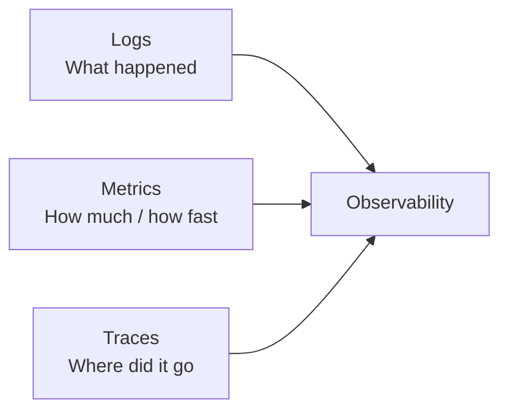

# Observability

You can't operate what you can't see. Observability is the practice of understanding a system's internal state from its external outputs.

The three pillars:

| Topic | One-liner |
|---|---|
| [Logging](logging.md) | Structured logs, levels, correlation IDs, retention |
| [Metrics](metrics.md) | Counters, gauges, histograms — and what to measure |
| [Distributed Tracing](tracing.md) | Following a request across services with spans |
| [Alerting](alerting.md) | What to page on, how to avoid alert fatigue |
| [SLI, SLO & SLA](slo-sla.md) | How to define and measure reliability targets |
| [On-Call & Incident Management](incident-management.md) | Runbooks, postmortems, escalation policies |
