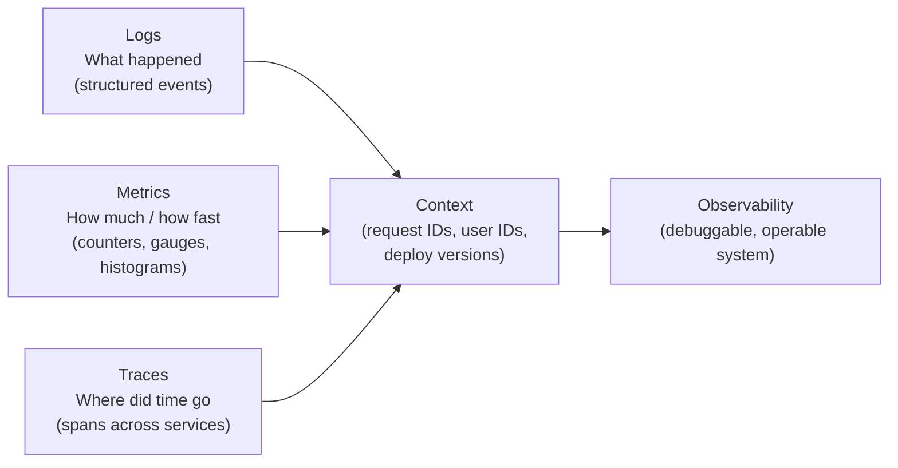

# Observability

You can't operate what you can't see. Observability is the practice of understanding a system's internal state purely from its external outputs — without modifying the system or guessing what's happening inside.

The difference between **monitoring** and **observability**: monitoring tells you *when* something is broken (alert fires). Observability tells you *why* (you can debug a novel failure you've never seen before from first principles).

---

## The three pillars



The glue between all three: **correlation IDs**. Every request gets a unique ID that flows through logs, appears on traces, and tags metrics. With it, you can jump from an alert → trace → logs for that exact request.

---

## Topics in this section

| Topic | What it covers | When it matters |
|---|---|---|
| [Logging](logging.md) | Structured logs, log levels, correlation IDs, sampling, retention | Every service — the baseline for debugging |
| [Metrics](metrics.md) | Counters, gauges, histograms, RED method, USE method | Dashboards, alerting, capacity planning |
| [Distributed Tracing](tracing.md) | Spans, trace context propagation, sampling strategies | Multi-service latency debugging |
| [Alerting](alerting.md) | What to page on, alert fatigue, SLO-based alerts | Production operations |
| [SLI, SLO & SLA](slo-sla.md) | How to define and measure reliability targets, error budgets | Defining "reliable enough" with precision |
| [On-Call & Incident Management](incident-management.md) | Runbooks, postmortems, escalation policies | When things go wrong |

---

## Observability maturity model

```
Level 1: Basic monitoring
  ├── Health check endpoints (/healthz)
  └── Process-level metrics (CPU, memory, disk)

Level 2: Service instrumentation
  ├── Request rate, error rate, latency (RED method)
  ├── Structured JSON logs with severity
  └── Alerts on error rate and latency SLOs

Level 3: Distributed observability
  ├── Distributed tracing (OpenTelemetry)
  ├── Correlation IDs linking logs → traces
  ├── Service dependency maps
  └── Custom business metrics (order rate, payment success rate)

Level 4: Proactive observability
  ├── SLO error budgets driving deployment decisions
  ├── Anomaly detection (baseline + deviation)
  ├── Synthetic monitoring (probing from outside)
  └── Chaos engineering feedback loop
```

---

## What to instrument (RED + USE)

**RED method** (for services):

| Metric | What it is | How to instrument |
|---|---|---|
| **R**ate | Requests per second | Counter: `http_requests_total` |
| **E**rror | Error rate (%) | Counter: `http_errors_total` / rate |
| **D**uration | Latency distribution | Histogram: `http_request_duration_seconds` |

**USE method** (for resources):

| Metric | What it is |
|---|---|
| **U**tilization | % of time resource is busy (CPU, disk I/O) |
| **S**aturation | Work queued waiting for the resource |
| **E**rrors | Error events on the resource |

---

## Interview shortlist

| Question | Key answer |
|---|---|
| *"What's the difference between monitoring and observability?"* | Monitoring: alerts on known failure modes. Observability: ability to debug novel failures from first principles using logs/metrics/traces. |
| *"How do you debug a latency spike across 5 microservices?"* | Distributed trace. Find the span with the longest duration. Correlate to logs with that trace ID. Check metrics for that service at that time. |
| *"What is an SLO and how does an error budget work?"* | SLO: target reliability (e.g., 99.9% success rate). Error budget: 1 - SLO = allowed downtime. Budget consumed → freeze risky deploys. |
| *"What metrics would you track for a payment service?"* | Payment success rate (RED: error), P99 latency (RED: duration), throughput (RED: rate), idempotency key collision rate (business metric). |
| *"How do you avoid alert fatigue?"* | Alert on symptoms (user impact), not causes. Use SLO-based alerts. Tune thresholds to eliminate flapping. Page only what's actionable at 2am. |

---

## Related topics

- [Fundamentals: Availability & Reliability](../fundamentals/availability.md) — what you're measuring against
- [Patterns: Circuit Breaker](../patterns/circuit-breaker.md) — observability drives the state machine
- [AWS: Observability](../aws/observability.md) — CloudWatch, X-Ray, OpenTelemetry on AWS
- [CI/CD](../cicd/index.md) — deploy metrics as a feedback loop
