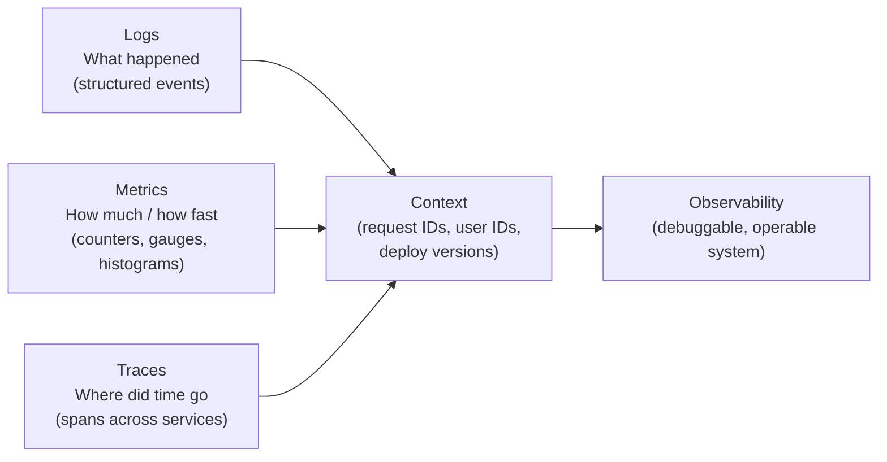

# Observability

<div class="sec-hero" markdown>
<span class="ey">Reliability & Operations · seeing in</span>
You can't operate what you can't see. Observability is understanding a system's internal state purely from its external outputs — logs, metrics, traces. Monitoring tells you *when* something is broken; observability tells you *why*, so you can debug a novel failure you've never seen before from first principles.
</div>

## Roadmap

<div class="roadmap">
  <div class="rm-head">
    <span class="h">🧭 Observability roadmap</span>
    <span class="legend">
      <i><span class="sw core"></span>core path</i>
      <i><span class="sw opt"></span>read as needed</i>
      <i><span class="sw adv"></span>advanced / later</i>
    </span>
  </div>
  <p class="rm-sub">Follow the spine top-to-bottom your first time. Branches hang off the topic they support — grab them when you need them.</p>
  <div class="rm-track">
    <div class="rm-stop">
      <a class="rm-node" href="logging/"><span class="n">1</span>Logging</a>
    </div>
    <div class="rm-stop">
      <div class="rm-branch left"><a class="rm-chip" href="load-testing/">Load Testing</a><a class="rm-chip" href="performance-engineering/">Performance Engineering</a></div>
      <a class="rm-node" href="metrics/"><span class="n">2</span>Metrics</a>
    </div>
    <div class="rm-stop">
      <a class="rm-node" href="tracing/"><span class="n">3</span>Distributed Tracing</a>
      <div class="rm-branch right"><a class="rm-chip" href="linux-debugging-toolbox/">Linux Debugging</a></div>
    </div>
    <div class="rm-stop">
      <a class="rm-node" href="alerting/"><span class="n">4</span>Alerting</a>
    </div>
    <div class="rm-stop">
      <a class="rm-node" href="slo-sla/"><span class="n">5</span>SLI, SLO and SLA</a>
    </div>
    <div class="rm-stop">
      <div class="rm-branch left"><a class="rm-chip" href="incident-response-craft/">Incident Response Craft</a></div>
      <a class="rm-node" href="incident-management/"><span class="n">6</span>Incident Management</a>
    </div>
  </div>
</div>

## The signals

The data you instrument and the practices that turn it into operable systems.

<div class="pcards">
<a class="pcard" href="logging/"><span class="t">Logging</span><span class="d">Structured logs, log levels, correlation IDs, sampling, retention</span></a>
<a class="pcard" href="metrics/"><span class="t">Metrics</span><span class="d">Counters, gauges, histograms, RED method, USE method</span></a>
<a class="pcard" href="tracing/"><span class="t">Distributed Tracing</span><span class="d">Spans, trace context propagation, sampling strategies</span></a>
<a class="pcard" href="alerting/"><span class="t">Alerting</span><span class="d">What to page on, alert fatigue, SLO-based alerts</span></a>
<a class="pcard" href="slo-sla/"><span class="t">SLI, SLO & SLA</span><span class="d">Define and measure reliability targets, error budgets</span></a>
<a class="pcard" href="incident-management/"><span class="t">On-Call & Incident Management</span><span class="d">Runbooks, postmortems, escalation policies</span></a>
</div>

## Going deeper

Reference and advanced craft once the signals are in place.

<div class="pcards">
<a class="pcard" href="load-testing/"><span class="t">Load Testing</span><span class="d">Find limits before production does</span></a>
<a class="pcard" href="linux-debugging-toolbox/"><span class="t">Linux Debugging Toolbox</span><span class="d">strace, perf, tcpdump and the rest of the kit</span></a>
<a class="pcard" href="incident-response-craft/"><span class="t">Incident Response Craft</span><span class="d">The skilled practice of running an incident well</span></a>
<a class="pcard" href="performance-engineering/"><span class="t">Performance Engineering</span><span class="d">Systematic latency and throughput tuning</span></a>
</div>

## Suggested reading order

New to this topic? Read these in order — each builds on the previous:

1. [Logging](logging.md) — the baseline signal every service emits; everything else assumes it
2. [Metrics](metrics.md) — aggregate health (RED/USE): the data behind dashboards and alerts
3. [Distributed Tracing](tracing.md) — follow one request across services when logs and metrics aren't enough
4. [Alerting](alerting.md) — turn the three signals into pages a human can act on
5. [SLI, SLO & SLA](slo-sla.md) — define "reliable enough" so alerts have objective targets
6. [On-Call & Incident Management](incident-management.md) — the human process when the alerts fire

**Then, as needed (reference):** [Load Testing](load-testing.md), [Linux Debugging Toolbox](linux-debugging-toolbox.md)

**Advanced — come back later:** [Incident Response Craft](incident-response-craft.md), [Performance Engineering](performance-engineering.md)

---

## The three pillars



The glue between all three: **correlation IDs**. Every request gets a unique ID that flows through logs, appears on traces, and tags metrics. With it, you can jump from an alert → trace → logs for that exact request.

---

## Topics in this section

| Topic | What it covers | When it matters |
|---|---|---|
| [Logging](logging.md) | Structured logs, log levels, correlation IDs, sampling, retention | Every service — the baseline for debugging |
| [Metrics](metrics.md) | Counters, gauges, histograms, RED method, USE method | Dashboards, alerting, capacity planning |
| [Distributed Tracing](tracing.md) | Spans, trace context propagation, sampling strategies | Multi-service latency debugging |
| [Alerting](alerting.md) | What to page on, alert fatigue, SLO-based alerts | Production operations |
| [SLI, SLO & SLA](slo-sla.md) | How to define and measure reliability targets, error budgets | Defining "reliable enough" with precision |
| [On-Call & Incident Management](incident-management.md) | Runbooks, postmortems, escalation policies | When things go wrong |

---

## Observability maturity model

```
Level 1: Basic monitoring
  ├── Health check endpoints (/healthz)
  └── Process-level metrics (CPU, memory, disk)

Level 2: Service instrumentation
  ├── Request rate, error rate, latency (RED method)
  ├── Structured JSON logs with severity
  └── Alerts on error rate and latency SLOs

Level 3: Distributed observability
  ├── Distributed tracing (OpenTelemetry)
  ├── Correlation IDs linking logs → traces
  ├── Service dependency maps
  └── Custom business metrics (order rate, payment success rate)

Level 4: Proactive observability
  ├── SLO error budgets driving deployment decisions
  ├── Anomaly detection (baseline + deviation)
  ├── Synthetic monitoring (probing from outside)
  └── Chaos engineering feedback loop
```

---

## What to instrument (RED + USE)

**RED method** (for services):

| Metric | What it is | How to instrument |
|---|---|---|
| **R**ate | Requests per second | Counter: `http_requests_total` |
| **E**rror | Error rate (%) | Counter: `http_errors_total` / rate |
| **D**uration | Latency distribution | Histogram: `http_request_duration_seconds` |

**USE method** (for resources):

| Metric | What it is |
|---|---|
| **U**tilization | % of time resource is busy (CPU, disk I/O) |
| **S**aturation | Work queued waiting for the resource |
| **E**rrors | Error events on the resource |

---

## Interview shortlist

| Question | Key answer |
|---|---|
| *"What's the difference between monitoring and observability?"* | Monitoring: alerts on known failure modes. Observability: ability to debug novel failures from first principles using logs/metrics/traces. |
| *"How do you debug a latency spike across 5 microservices?"* | Distributed trace. Find the span with the longest duration. Correlate to logs with that trace ID. Check metrics for that service at that time. |
| *"What is an SLO and how does an error budget work?"* | SLO: target reliability (e.g., 99.9% success rate). Error budget: 1 - SLO = allowed downtime. Budget consumed → freeze risky deploys. |
| *"What metrics would you track for a payment service?"* | Payment success rate (RED: error), P99 latency (RED: duration), throughput (RED: rate), idempotency key collision rate (business metric). |
| *"How do you avoid alert fatigue?"* | Alert on symptoms (user impact), not causes. Use SLO-based alerts. Tune thresholds to eliminate flapping. Page only what's actionable at 2am. |

---

## Related topics

- [Fundamentals: Availability & Reliability](../fundamentals/availability.md) — what you're measuring against
- [Patterns: Circuit Breaker](../patterns/circuit-breaker.md) — observability drives the state machine
- [AWS: Observability](../aws/observability.md) — CloudWatch, X-Ray, OpenTelemetry on AWS
- [CI/CD](../cicd/index.md) — deploy metrics as a feedback loop
