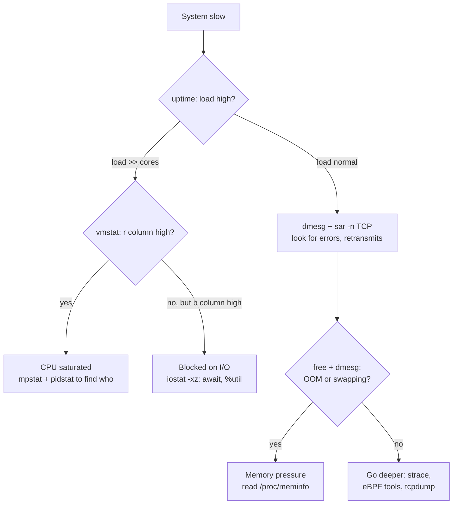

---
tags:
  - applied
---

# Linux Production Debugging Toolbox

[Performance Engineering](performance-engineering.md) covers the methodology — profiling, flame graphs, latency analysis. This page is the **box-level craft**: you've SSH'd (or `kubectl exec`'d) into a misbehaving machine and have five minutes to figure out what's wrong. Which commands, in what order, and what the output actually means.

---

## You'll see this when...

- A pager fires "high CPU on host X" and you need to know *which process* and *why* before deciding to restart or scale
- Latency spiked but the app metrics look fine — the problem is below the application: disk, network, kernel
- A service keeps getting OOM-killed and nobody can explain why RSS looked "fine"
- `df` says the disk is full but `du` can't find the files
- Connections to a service start failing intermittently under load with no errors in the app log
- You're debugging a distroless container that has no shell, no `ps`, no anything

---

## The 60-second triage

Adapted from Brendan Gregg's classic checklist. Run these in order; each takes seconds and rules a whole subsystem in or out.

```bash
uptime                    # 1. load averages: trend over 1/5/15 min
dmesg -T | tail           # 2. kernel complaints: OOM kills, NIC errors, disk failures
vmstat 1                  # 3. system-wide: run queue, free mem, swap, CPU split
mpstat -P ALL 1           # 4. per-CPU: one hot core = single-threaded bottleneck
pidstat 1                 # 5. per-process CPU: who is actually burning cycles
iostat -xz 1              # 6. per-disk: %util, await, queue depth
free -m                   # 7. memory: but read it correctly (see below)
sar -n DEV 1              # 8. network throughput: near NIC limit?
sar -n TCP,ETCP 1         # 9. TCP: retransmits, active/passive connection rate
top                       # 10. interactive recap of everything above
```



Key readings:

| Output | What it means |
|---|---|
| `vmstat` `r` > CPU count | CPU saturation — threads waiting for a core |
| `vmstat` `b` high | Threads in uninterruptible sleep — almost always disk I/O |
| `vmstat` `si`/`so` nonzero | Swapping. On a server this is usually an emergency |
| `mpstat` one core at 100%, rest idle | Single-threaded bottleneck (or bad IRQ affinity) |
| `iostat` `await` ≫ device norm (~0.1ms NVMe) | Disk queueing — saturated or failing device |
| `iostat` `%util` 100% | Device busy — but on SSDs with internal parallelism this *can* lie |
| `sar -n ETCP` `retrans/s` > 0 sustained | Network loss: overloaded peer, bad path, or full conntrack |

**Load average caveat:** on Linux, load includes uninterruptible (`D` state) tasks, not just runnable ones. Load 30 on a 16-core box can mean CPU saturation *or* 30 threads stuck on NFS. Disambiguate with `vmstat`'s `r` vs `b` columns.

---

## Process inspection

```bash
# Top CPU and memory consumers
ps aux --sort=-%cpu | head
ps aux --sort=-rss | head

# Thread count, context switches, memory detail of one process
cat /proc/<pid>/status
# Key lines:
#   VmRSS     — actual resident memory
#   VmSwap    — how much got swapped out
#   Threads   — thread explosion?
#   voluntary_ctxt_switches / nonvoluntary — high nonvoluntary = CPU contention

# File descriptor count vs limit
ls /proc/<pid>/fd | wc -l
cat /proc/<pid>/limits | grep files
# Creeping toward the limit → fd leak → soon: "too many open files"

# What is this process actually doing right now?
cat /proc/<pid>/stack          # kernel stack — where it's blocked
cat /proc/<pid>/wchan          # the kernel function it's sleeping in
```

`/proc/<pid>/limits` matters because the process may have been started with limits different from your shell's `ulimit -n` — systemd units and container runtimes set their own.

---

## Syscall tracing with strace

```bash
strace -f -p <pid>                          # attach, follow threads/forks
strace -f -e trace=network -p <pid>         # only network syscalls
strace -f -e trace=open,openat,stat <pid>   # "what config file is it reading?"
strace -c -p <pid>                          # summary: syscall counts + time (Ctrl-C to stop)
```

`-c` is the most useful mode in production: a histogram of which syscalls dominate, without drowning in output.

!!! warning "strace performance cost"
    strace uses ptrace: **every syscall stops the process twice** for the tracer to inspect it. A syscall-heavy process can slow down **10–100×** under strace. Never leave it attached to a hot production service; use it for seconds, or prefer eBPF tools (below) which observe in-kernel with ~1% overhead.

Classic strace wins: discovering an app re-reads its config on every request (`openat` storm), retries DNS on every call (`connect` to port 53), or writes logs synchronously (`fsync` per line).

---

## Network debugging

### ss — socket state analysis

```bash
ss -tnp                      # TCP sockets + owning process
ss -tn state established | wc -l
ss -tn state time-wait | wc -l
ss -tnlp                     # listening sockets
ss -tn sport = :8080         # filter by port

# The gold panel: send queue and receive queue
ss -tnp | awk '$2 > 0 || $3 > 0'
# Recv-Q > 0 sustained  → application not reading fast enough (app is the bottleneck)
# Send-Q > 0 sustained  → network or peer not draining (downstream is the bottleneck)
```

Listen socket overflow is a silent killer: `ss -tnl` shows `Recv-Q` vs `Send-Q` on listeners as *current accept backlog* vs *backlog limit*. Confirm drops with `netstat -s | grep -i listen` or `nstat | grep ListenDrops`.

### tcpdump — capture and read a handshake

```bash
# Capture filter: only what you need, capture kills boxes at high traffic
tcpdump -i eth0 -nn 'tcp port 5432 and host 10.0.3.7' -c 100 -w /tmp/db.pcap
tcpdump -nn -r /tmp/db.pcap | head

# A healthy handshake:
# 10.0.1.5.43210 > 10.0.3.7.5432: Flags [S],  seq 1000        ← SYN
# 10.0.3.7.5432 > 10.0.1.5.43210: Flags [S.], seq 2000, ack 1001  ← SYN-ACK
# 10.0.1.5.43210 > 10.0.3.7.5432: Flags [.],  ack 2001        ← ACK
```

Pathologies you can read straight off the wire:

| Pattern | Meaning |
|---|---|
| SYN repeated, no SYN-ACK | Peer down, firewall drop, or SYN backlog full on peer |
| SYN → RST | Port closed / rejected — wrong port, service not listening |
| Data sent, dup ACKs + retransmits | Packet loss on the path |
| `Flags [R]` mid-conversation | Something (LB, conntrack, peer crash) reset the session |

### Connection-table exhaustion — two distinct failures

**conntrack exhaustion** (any NAT/iptables/k8s node):

```bash
cat /proc/sys/net/netfilter/nf_conntrack_count
cat /proc/sys/net/netfilter/nf_conntrack_max
dmesg | grep conntrack       # "nf_conntrack: table full, dropping packet"
```

When the table fills, *new* connections are silently dropped — existing ones work fine, which makes it look like random intermittent failures. Fix: raise `nf_conntrack_max`, shorten timeouts, or stop tracking high-volume flows (`NOTRACK`).

**Ephemeral port exhaustion** (client making many outbound connections to one destination):

```bash
cat /proc/sys/net/ipv4/ip_local_port_range    # default 32768–60999 ≈ 28K ports
ss -tn state time-wait dst 10.0.3.7 | wc -l
```

Each outbound connection to the same (dst IP, dst port) needs a unique source port. Closed connections linger in TIME_WAIT for 60s. Symptoms: `connect: cannot assign requested address`, throughput plateau around 28K/60s ≈ 470 new connections/s per destination. Fixes: **connection pooling / keep-alive** (the real fix), widen the port range, `net.ipv4.tcp_tw_reuse=1` for outbound.

---

## File and disk

```bash
lsof -p <pid>                  # everything a process has open
lsof /var/log/app.log          # who has this file open
lsof -i :8080                  # who owns this port
```

### df vs du disagree: deleted-but-open files

`du` walks the directory tree; `df` asks the filesystem. A file that is **deleted while a process still holds it open** keeps consuming blocks (visible to `df`) but has no directory entry (invisible to `du`). Classic case: log rotation deletes the file but the app never reopens it.

```bash
lsof +L1                       # files with link count 0 — deleted but open
# Fix: restart/HUP the process, or truncate in place without freeing the fd:
: > /proc/<pid>/fd/<n>
```

### Inode exhaustion

```bash
df -i        # "disk full" with df -h showing space free → out of inodes
```

Millions of tiny files (sessions, cache shards, mail spools) exhaust inodes long before bytes. `find /path -xdev -type d -size +1M` finds the bloated directories.

---

## Memory

### Reading free and /proc/meminfo correctly

```bash
free -m
#               total   used   free   shared  buff/cache  available
# Mem:          32000  12000    800     200       19200       19000
```

**`free` being low is normal and good** — Linux uses idle RAM as page cache. The number that matters is **`available`**: an estimate of what can be claimed without swapping (reclaimable cache + free). Alert on `available`, never on `free`.

```bash
grep -E 'MemAvailable|Dirty|Writeback|Slab|AnonPages|Cached' /proc/meminfo
# Dirty/Writeback high  → write burst not yet flushed; fsync stalls likely
# Slab huge             → kernel objects (dentries, inodes, conntrack) — check slabtop
# AnonPages             → process heaps; this is what OOM pressure is made of
```

Page cache vs RSS in one line: **RSS is memory a process owns; page cache is memory the kernel borrows on everyone's behalf and gives back under pressure.** A "memory is 95% used" dashboard that counts cache as used is lying to you. (In containers, though, page cache from your I/O *does* count against the cgroup memory limit — a service doing heavy file I/O can be OOM-killed with modest RSS.)

### The OOM killer

```bash
dmesg -T | grep -i 'out of memory\|oom'
# "Out of memory: Killed process 4321 (java) total-vm:18.2GB, anon-rss:15.1GB ..."
journalctl -k | grep -i oom
```

The kernel picks the victim by `oom_score` — roughly proportional to memory use, adjusted by `oom_score_adj` (−1000 = never kill, +1000 = kill me first):

```bash
cat /proc/<pid>/oom_score
cat /proc/<pid>/oom_score_adj
```

The killed process is often the biggest, **not the leaking one** — a small leaky daemon can pressure the box until the kernel shoots your database. In Kubernetes, exceeding the container memory limit triggers a cgroup-scoped OOM kill (`OOMKilled`, exit code 137); the dmesg line will mention the cgroup path.

---

## CPU

**Run queue vs utilization.** 100% CPU utilization with run queue ≈ core count is a fully-but-healthily loaded box. 100% with run queue 4× core count means every task waits ~3 scheduling quanta — latency climbs even though "CPU%" looks the same. Check `vmstat`'s `r` or `/proc/pressure/cpu` (PSI: `some avg10=35` → tasks spent 35% of the last 10s waiting for CPU).

**Steal time** (`%st` in `top`/`mpstat`): time your vCPU wanted to run but the hypervisor gave the physical core to another tenant. Sustained steal > 5–10% on cloud VMs (or any steal on burstable instances out of credits — T-series on AWS) means the host, not your code, is the problem. You can't fix steal with profiling; move instances.

**C-states and frequency:** an idle core drops into deep sleep states; the first request after idle pays µs-scale wakeup and runs at low clock until the governor ramps up. Relevant for latency-critical, bursty services — shows up as "first request after a quiet period is slow". `turbostat` shows residency; `cpupower frequency-info` shows the governor.

---

## eBPF tools — the low-overhead successor to strace

BCC tools (`apt install bpfcc-tools`) and `bpftrace` observe events **in the kernel** and aggregate before handing data to userspace — ~1% overhead instead of strace's 10–100×. Safe to run on production boxes.

| Tool | One-liner purpose |
|---|---|
| `execsnoop` | Every new process executed — catches fork-storms, cron surprises, shellouts |
| `opensnoop` | Every file open, with errors — config hunts without strace |
| `biolatency` | Histogram of block I/O latency — *distribution*, not the average iostat shows |
| `tcplife` | Per-TCP-session lifespan, bytes, duration — who talks to whom, briefly or long |
| `tcpretrans` | Retransmits with stack — pinpoints lossy flows |
| `offcputime` | Where threads block (covered in [Performance Engineering](performance-engineering.md)) |

```bash
sudo execsnoop-bpfcc                 # watch a "mystery CPU spike" turn out to be
                                     # ImageMagick shelled out per request
sudo biolatency-bpfcc 10 1           # 10s histogram: bimodal? cache hits + spindle misses
sudo bpftrace -e 'tracepoint:syscalls:sys_enter_openat
    { @[comm] = count(); }'          # ad-hoc: openat calls by process name
```

Rule of thumb 2026: reach for eBPF first on anything hot; strace only on processes you can afford to slow down.

---

## When each tool lies to you

| Tool | The lie | The truth |
|---|---|---|
| `top` CPU% | Per-process % can exceed 100 and hides which *core* is hot | `mpstat -P ALL`; one pegged core ≠ "55% average" |
| Load average | Includes D-state (I/O-blocked) tasks | `vmstat` r vs b to separate CPU from I/O |
| `free` "used" | Counts reclaimable page cache | Read `available` |
| `iostat %util` | 100% ≠ saturated on SSDs (internal parallelism) | Watch `await` and `aqu-sz` instead |
| `df` | Misses deleted-but-open space | `lsof +L1` |
| `strace -c` time | Measurement inflates the thing measured | eBPF equivalents |
| `ss` counts | Sampled at an instant; bursts vanish between samples | `nstat` counters accumulate |
| Averages anywhere | A 10ms avg can hide a 2s mode | Histograms — `biolatency`, not `iostat await` |
| Any tool **inside a container** | Shows host-wide CPU/memory, but cgroup limits apply to you | Read `/sys/fs/cgroup/` (see below) |

---

## Containers: who's namespace is it anyway

Inside a container, `top` and `free` typically report **host** resources, while your limits are **cgroup** ones. A pod with a 2-CPU limit on a 64-core node sees 64 CPUs; a JVM that sizes its heap from "system memory" reads 256GB and gets OOM-killed at its 4GB limit (modern runtimes are container-aware, but check).

```bash
# The numbers that actually apply to you (cgroup v2):
cat /sys/fs/cgroup/memory.max
cat /sys/fs/cgroup/memory.current
cat /sys/fs/cgroup/cpu.max            # e.g. "200000 100000" = 2 CPUs
cat /sys/fs/cgroup/cpu.stat | grep throttl   # nr_throttled climbing = CPU limit hits
```

From the **host**, enter a container's namespaces with the host's full toolbox:

```bash
PID=$(crictl inspect <ctr> | jq .info.pid)    # or: docker inspect -f '{{.State.Pid}}'
nsenter -t $PID -n ss -tnp                    # its network namespace, your binaries
nsenter -t $PID -n -p -m ps aux               # net + pid + mount namespaces
```

**Distroless / shell-less containers:** there is nothing to exec into. Kubernetes ephemeral containers attach a tools image to the running pod:

```bash
kubectl debug -it mypod --image=nicolaka/netshoot --target=myapp
# --target shares the PID namespace: you see the app's processes,
# and /proc/1/root/ gives you a window into its filesystem
```

For node-level work: `kubectl debug node/<node> -it --image=busybox` gives a host-namespace pod with the node filesystem under `/host`.

---

## Anti-patterns

| Anti-pattern | Why it hurts | Better |
|---|---|---|
| Restarting the process before capturing anything | Destroys the evidence; the bug returns at 3am | 60 seconds of triage first: `dmesg`, `ss`, `/proc/<pid>/status`, then restart |
| Leaving strace attached to a hot service | ptrace can slow it 10–100× — you caused the outage | `strace -c` for seconds, or eBPF tools |
| Alerting on `free` memory | Page cache makes it permanently "low"; alert is noise | Alert on `MemAvailable` and PSI |
| `tcpdump` with no capture filter on a busy NIC | Capture overhead + disk fill on the very box you're saving | Tight filters (`host`, `port`), `-c` count cap, write to pcap |
| Reading container limits from `top`/`free` inside the pod | They show host resources; your cgroup limit is what kills you | `/sys/fs/cgroup/{memory.max,cpu.stat}` |
| Treating load average as CPU demand | D-state inflates it; you scale CPUs while disks are the problem | `vmstat` r vs b; PSI per resource |
| Killing the OOM victim's "leak" | The victim is the biggest, often not the leaker | Read the full dmesg OOM report; track RSS growth over time per process |
| Debugging a NAT'd path without checking conntrack | Table-full drops are silent and intermittent | `nf_conntrack_count` vs `max` in the first minutes |

---

## Quick reference

| Need | Reach for |
|---|---|
| First 60 seconds on any sick box | `uptime` → `dmesg -T \| tail` → `vmstat 1` → `pidstat 1` → `iostat -xz 1` |
| Who's burning CPU, which core | `pidstat 1`, `mpstat -P ALL 1` |
| What syscalls is this process making | `strace -c -p` (briefly), `opensnoop`/`execsnoop` (continuously) |
| Socket states, queues, who owns a port | `ss -tnp`, `lsof -i :PORT` |
| Read the actual packets | `tcpdump -nn 'host X and port Y' -c 100 -w out.pcap` |
| Mystery connection failures behind NAT | `conntrack -S`, `nf_conntrack_count` vs `max` |
| "Cannot assign requested address" | Ephemeral ports: `ss -tn state time-wait \| wc -l` → pool connections |
| df/du disagreement | `lsof +L1` (deleted-but-open files) |
| Disk full but space free | `df -i` (inodes) |
| Why was my process killed | `dmesg -T \| grep -i oom`, exit code 137 |
| True memory headroom | `MemAvailable` in `/proc/meminfo` |
| Disk latency distribution | `biolatency-bpfcc` |
| Short-lived process storms | `execsnoop-bpfcc` |
| Per-connection network forensics | `tcplife-bpfcc`, `tcpretrans-bpfcc` |
| CPU throttling in a container | `/sys/fs/cgroup/cpu.stat` (`nr_throttled`) |
| Debugging a distroless pod | `kubectl debug -it POD --image=nicolaka/netshoot --target=APP` |
| Container's network from the host | `nsenter -t <pid> -n ss -tnp` |

---

## Interview angle

!!! tip "What interviewers are testing"
    Whether you debug systematically from symptoms to subsystem to root cause — or just say "I'd check the logs and restart it." The strongest signal is knowing what each tool's output *means* and where it misleads.

**Strong answer pattern:**

1. Start with the 60-second triage: load trend, `dmesg`, `vmstat`, `iostat` — rule subsystems in/out before going deep
2. Distinguish saturation from utilization: run queue vs CPU%, `await` vs `%util`, Recv-Q vs Send-Q
3. Know the silent failure modes: conntrack table full, ephemeral port exhaustion, deleted-but-open files, cgroup OOM with low RSS
4. Name the observer cost: strace is 10–100× overhead, eBPF tools are ~1% — choose accordingly
5. In containers, state explicitly that `top`/`free` show host numbers and you'd read cgroup files instead
6. Preserve evidence before restarting; capture `dmesg`, socket state, `/proc` snapshots first

**Common follow-ups:**

- *"A service intermittently fails to connect to a downstream behind a NAT gateway. App logs show timeouts. Where do you look?"*
  > Intermittent + NAT screams connection tracking or port exhaustion. On the NAT box: `nf_conntrack_count` vs `nf_conntrack_max` and `dmesg` for "table full, dropping packet". On the client: TIME_WAIT count toward that destination and `ip_local_port_range` — ~28K ports / 60s TIME_WAIT caps you near 470 new connections/s per destination. The durable fix is connection pooling and keep-alive, not tuning the table bigger.

- *"df says 92% full, du says 40GB used on a 100GB disk. Explain."*
  > A process holds deleted files open — usually rotated logs the app never reopened. `lsof +L1` lists them. Free the space by HUP/restarting the holder, or truncate via `/proc/<pid>/fd/<n>`. Also worth checking `df -i` — inode exhaustion produces a different flavor of "disk full".

- *"Your pod keeps getting OOMKilled but the heap dashboard shows it well under the limit."*
  > The cgroup limit counts more than heap: page cache from the container's file I/O, off-heap/native memory, thread stacks, mmap'd files. Compare `memory.current` breakdown in `memory.stat` against the heap metric; heavy file I/O inside a tight memory limit is a classic cause. Also check whether the runtime sized itself from host memory rather than the cgroup.

- *"When would you still use strace given eBPF exists?"*
  > When I need full syscall arguments/payloads, when the kernel is too old or locked down for BPF, when it's a one-shot process I launch under `strace` myself, or in a dev environment where the 10–100× slowdown is irrelevant. For anything hot and production, eBPF first.

---

## Test yourself

??? question "Load average is 45 on a 16-core box, but `mpstat` shows CPUs only 30% busy. What's going on and what do you check next?"

    Linux load average includes tasks in uninterruptible sleep (D state), not just runnable ones. Thirty-plus threads are blocked on I/O — disk, NFS, or a stuck kernel path — inflating load while CPUs idle. Check `vmstat 1` (high `b` column, low `r`), `iostat -xz 1` for `await`/queue depth, and `ps -eo state,wchan,comm | grep '^D'` to see exactly which kernel function the threads are sleeping in.

??? question "Why does attaching strace to a busy production service risk an outage, and what's the safer alternative?"

    strace uses ptrace, which stops the traced process at the entry and exit of *every* syscall so the tracer can inspect it — two context switches per syscall. A syscall-heavy service can slow 10–100×, turning a healthy box into the incident. eBPF tools (execsnoop, opensnoop, biolatency, tcplife, or ad-hoc bpftrace) aggregate events inside the kernel with roughly 1% overhead, which is why they're the production default.

??? question "A client makes thousands of short-lived HTTP requests per second to one upstream and starts seeing 'cannot assign requested address'. Walk through the mechanism and the fix."

    Every outbound connection to the same (destination IP, port) pair needs a unique local ephemeral port. The default range is ~28K ports, and closed connections occupy their port in TIME_WAIT for 60 seconds — capping you around 470 new connections per second per destination. Confirm with `ss -tn state time-wait | wc -l`. The real fix is HTTP keep-alive / connection pooling so connections are reused; band-aids are widening `ip_local_port_range` and `tcp_tw_reuse=1` for outbound connections.

??? question "Inside a container, `free -m` shows 200GB available, yet the process was just OOM-killed. Explain both halves of that contradiction."

    `free` inside a container reads host-wide `/proc/meminfo` — the 200GB is the node's memory, not yours. The kill came from the cgroup: the container exceeded `memory.max` (its pod limit), which triggers a cgroup-scoped OOM kill (exit 137). And the cgroup counts more than RSS: page cache generated by the container's file I/O, native allocations, and thread stacks all count against the limit. Read `/sys/fs/cgroup/memory.max`, `memory.current`, and `memory.stat` for the truth.

??? question "How do you get a shell's worth of debugging into a distroless container that has no shell, no ps, and no package manager?"

    Two paths. In Kubernetes: `kubectl debug -it pod --image=nicolaka/netshoot --target=app` attaches an ephemeral container with a full toolbox; `--target` shares the PID namespace so you can see the app's processes and reach its filesystem via `/proc/1/root/`. From the node: find the container's host PID (`crictl inspect`), then `nsenter -t <pid> -n -p -m` to run the *host's* binaries inside the container's network/PID/mount namespaces. Either way, the tools live outside the image — the container never needed them baked in.

---

## Related

- [Performance Engineering Discipline](../observability/performance-engineering.md) — methodology, profiling, flame graphs
- [OS Concepts](../fundamentals/os-concepts.md) — processes, scheduling, the kernel underneath these tools
- [Memory Hierarchy](../fundamentals/memory-hierarchy.md) — why page cache exists at all
- [Disk & SSD Internals](../fundamentals/disk-ssd-internals.md) — interpreting iostat against real device behavior
- [Containers](../infrastructure/containers.md) — namespaces and cgroups in depth
