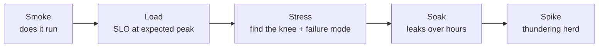

---
tags:
  - applied
---

# Load Testing in Practice

## You'll see this when...

- A launch, sale, or marketing moment is coming and someone asks "will we survive 10x?"
- Capacity decisions (instance sizes, autoscaling limits, DB class) are being made on vibes
- A latency regression shipped and nobody noticed until customers did
- The system "works fine in staging" but staging has 1% of production's data and zero cache pressure
- Postmortems keep ending with "we didn't know that was the bottleneck"

Load testing is the experimental side of [Performance Engineering](performance-engineering.md): instead of observing production, you apply controlled load and watch where the system bends.

## Test types — five shapes, five questions

| Type | Shape | Question it answers |
|---|---|---|
| **Smoke** | Minimal load, minutes | Does the test itself work? Is the system minimally sane? |
| **Load** | Expected peak, sustained | Do we meet SLOs at the traffic we actually expect? |
| **Stress** | Ramp past expected peak until failure | Where is the breaking point, and how does it fail? |
| **Soak** | Expected load, hours-days | Do we leak memory/connections/disk over time? |
| **Spike** | Instant jump (0 → peak in seconds) | Do autoscaling, pools, and caches survive a thundering herd? |

Run them in that order. A stress test before a smoke test wastes everyone's afternoon debugging the load generator.



## Workload modeling — where most load tests lie

A load test is only as honest as its workload model. Three decisions dominate:

### 1. Open vs closed model (the critical one)

```
Closed model: N virtual users in a loop
  request → wait for response → think → request again
  ⚠️ Arrival rate ADAPTS to system speed: when the system slows down,
     users wait, so load drops exactly when you wanted to measure stress.
     This is "coordinated omission at the workload level."

Open model: arrivals at a fixed rate (e.g., 500 req/s)
  requests fire on schedule whether or not earlier ones returned
  → queue builds up exactly like real traffic against a slow system
```

Real internet traffic is **open**: users arriving at your site don't know it's slow. A closed-model test against a degrading system *under-reports* latency catastrophically — the system slows, the loop slows, the queue never builds. Use arrival-rate executors (`constant-arrival-rate` in k6, "open workload" in Gatling) for anything measuring latency under load. Closed models are right only when the real system is closed — a fixed worker pool consuming a queue, a fixed fleet of kiosks.

This is the load-test variant of **coordinated omission** (see [Performance Engineering](performance-engineering.md)) — and tools differ in whether they correct for it. HDR-histogram-based reporting (wrk2, Gatling) does; naive timers don't.

### 2. Realistic mix and data

- Derive the **request mix** from production access logs (e.g., 70% read item, 20% search, 8% add-to-cart, 2% checkout) — a test that's 100% one endpoint exercises one code path and one cache pattern
- **Parameterize data**: a test that fetches the same item ID 100K times is testing your cache, not your system. Sample IDs from a production-shaped distribution — including the long tail that misses cache
- Include **think time** in user journeys (real users pause between pages), but never let think time turn an open test into a closed one

### 3. Environment fidelity

| Dimension | Why it changes results |
|---|---|
| **Data volume** | Query plans flip at scale — an index scan at 10K rows is a seq scan at 100M. Test against prod-sized data |
| **Cache warmth** | Cold Redis = every request hits the DB. Decide: are you testing warm steady-state or cold-start? Test both deliberately |
| **Downstreams** | Stubs hide the slowest dependency. Real (sandboxed) downstreams or stubs with injected realistic latency + error rates |
| **TLS, CDN, gateway** | Terminating TLS is real CPU; skipping the gateway skips its limits |
| **Generator capacity** | One overloaded load generator reports garbage. Watch the *generator's* CPU; distribute when in doubt |

Testing against production: spike and stress tests off-hours with feature-flagged test traffic and tagged requests is increasingly normal (and the only way to test the real CDN/cache/data). It requires kill switches, error budgets, and the ability to filter test traffic out of business metrics.

## k6 example — open model with SLO thresholds

```javascript
import http from 'k6/http';
import { check } from 'k6';

export const options = {
  scenarios: {
    steady: {
      executor: 'constant-arrival-rate',
      rate: 500,                 // 500 req/s regardless of response time (open model)
      timeUnit: '1s',
      duration: '10m',
      preAllocatedVUs: 200,
      maxVUs: 2000,              // headroom so VU starvation doesn't cap the rate
    },
  },
  thresholds: {
    http_req_duration: ['p(95)<300', 'p(99)<800'],   // SLOs as code
    http_req_failed: ['rate<0.005'],
    dropped_iterations: ['count<1'],                  // generator kept up — result is valid
  },
};

const ITEM_IDS = JSON.parse(open('./item-ids.json'));  // prod-shaped sample

export default function () {
  const id = ITEM_IDS[Math.floor(Math.random() * ITEM_IDS.length)];
  const res = http.get(`https://staging.example.com/items/${id}`);
  check(res, { 'status 200': (r) => r.status === 200 });
}
```

The `thresholds` block makes this CI-runnable: k6 exits non-zero when an SLO fails, so a nightly pipeline can fail the build on a latency regression. `dropped_iterations` is the honesty check — if the generator couldn't sustain the rate, the run is invalid, not "passing."

## Tools

| Tool | Model | Scripting | Shines at |
|---|---|---|---|
| **k6** | Open + closed executors | JavaScript | Modern default; thresholds; CI-friendly; k6-operator for distributed |
| **Gatling** | Open workloads, HDR histograms | Scala/Java/Kotlin DSL | Correct latency math, rich HTML reports |
| **Locust** | Closed by default (user loops) | Python | Python ecosystems, custom protocols; needs care for open-model tests |
| **JMeter** | Closed-ish, thread pools | GUI/XML | Legacy enterprise, protocol breadth |
| **wrk2** | Open, constant throughput | Lua (light) | Single-endpoint HTTP benchmarking done honestly |
| **Artillery** | Open arrival rates | YAML + JS | Quick API tests, serverless (artillery-on-Lambda) |
| **AWS Distributed Load Testing** | Wraps Taurus/JMeter | — | One-click distributed generators on Fargate |

Picking: **k6** unless you have a strong reason; **Gatling** when latency-measurement rigor is the point; **Locust** when the team lives in Python and knows to configure open workloads.

## Reading results without fooling yourself

### Percentiles, never averages

Mean latency is the least informative number in the report — it hides the tail your users actually feel ([latency basics](../fundamentals/latency-throughput.md)). Read p50/p95/p99 *over time*, not collapsed into one number: a p99 that degrades minute-over-minute during a soak is a leak; a single aggregated p99 hides it.

### The throughput–latency curve and the knee

```
latency
  │                                    ╱  ← retrograde: errors,
  │                              ╱╱       timeouts, collapse
  │                         ╱╱
  │                   ╱─╱  ← the knee (~70-80% of capacity):
  │   ──────────────╱        queueing delay takes off
  └────────────────────────────────── offered load
```

Ramp load in steps and plot latency against achieved throughput. The **knee** — where latency turns upward while throughput flattens — is your usable capacity; beyond it, queueing theory takes over and latency grows without bound ([Little's Law](../fundamentals/queuing-theory.md)). Two numbers go in the capacity plan: the knee (operate below this) and the cliff (where errors begin — your survival margin). Autoscaling thresholds belong well below the knee.

### Find the bottleneck, not just the number

A load test that outputs only "12K RPS" taught you almost nothing. Correlate with system metrics during the run (USE method — see [Performance Engineering](performance-engineering.md)): which resource saturated first? CPU on the app tier? DB connections? A downstream's rate limit? The deliverable of a stress test is a sentence like *"capacity is 12K RPS, limited by Postgres connection pool exhaustion at 11.5K, and it fails by queuing then 503ing — not by crashing."*

### Common lies load tests tell

| Lie | Cause |
|---|---|
| "p99 = 40ms under 3x load" | Closed model: load self-throttled when the system slowed |
| "We handle 50K RPS" | 100% cache-hit single-endpoint test |
| "No errors at peak" | Test ran 5 minutes; pools and queues hadn't filled yet (no soak) |
| "Scaled linearly to 8 instances" | Stubbed the shared DB that real instances contend on |
| "Generator showed 10K RPS" | Generator CPU-bound at 6K; dropped iterations unreported |

## Load testing in CI

- **Nightly, not per-commit**: a meaningful load test takes 10+ minutes and a quiet environment
- **Thresholds as gates**: SLOs encoded in the test (k6 `thresholds`, Gatling assertions) → red build on regression
- **Track trends**: store p95/p99/knee-RPS per run; a 5%/week creep never trips a single gate but compounds into an incident
- **Pin the environment**: same instance types, same data snapshot, warmed caches — otherwise diffs measure the environment, not the code
- Keep a 2-minute **smoke-load** variant for PRs that touch hot paths

## Anti-patterns

| Anti-pattern | Why it hurts | Better |
|---|---|---|
| Closed-loop VUs to measure latency under stress | Load self-throttles; tail latency under-reported | Open model: constant-arrival-rate executors |
| Same request data every iteration | Tests the cache, not the system | Prod-shaped parameterized data |
| Single endpoint at 100% | One code path, one verdict | Mix from production access logs |
| Staging with toy data | Query plans and cache ratios don't transfer | Prod-sized data snapshot |
| Reporting averages | Hides the tail users feel | p50/p95/p99 over time |
| 5-minute "stress test" | Pools/queues/leaks need time to fill | Soak for leak-hunting; stress with stepped ramps |
| Ignoring the generator's own saturation | Garbage numbers reported confidently | Monitor generator CPU; check dropped iterations; distribute |
| Load test as a launch-week ritual | Bottlenecks found with no time to fix | Nightly CI with thresholds + trends |

## Quick reference

| Need | Reach for |
|---|---|
| Default tool | k6, `constant-arrival-rate`, thresholds |
| Honest single-endpoint benchmark | wrk2 (open model, HDR histograms) |
| Python team | Locust (configure open workload explicitly) |
| Find usable capacity | Stepped ramp → knee of throughput-latency curve |
| Find leaks | Soak test, hours, watch RSS/conns/p99 trend |
| Survive launch spike | Spike test against real autoscaling + warmed vs cold caches |
| Latency regression gate | Nightly CI run, SLO thresholds, trend dashboard |
| Distributed generation on AWS | k6-operator or AWS Distributed Load Testing |

## Interview angle

!!! tip "What interviewers are testing"
    Whether your "we'd load test it" is a real methodology or a checkbox. The discriminating signals: open vs closed models, realistic data, and reading the knee — not tool trivia.

**Strong answer pattern:**

1. Name the question first (SLO at expected peak? breaking point? leaks?) — it picks the test type
2. Model the workload from production: request mix, data distribution, open arrival rates
3. Make the environment honest: prod-sized data, deliberate cache state, real or latency-injected downstreams
4. Read percentiles over time and find the knee; deliver the bottleneck, not just a number
5. Institutionalize: nightly CI with SLO thresholds so regressions surface in days, not in incidents

**Common follow-ups:**

- "Why did your load test say 40ms p99 but production melted?" — closed-loop workload self-throttled, cache-hot test data, toy data volume, or stubbed downstreams — usually several at once
- "Open vs closed workload?" — open fires requests at a fixed arrival rate like real users; closed waits for responses, so it reduces load exactly when the system degrades and hides the queueing
- "How would you load test against production safely?" — off-peak, tagged test traffic behind a kill switch, error-budget-aware abort, excluded from business metrics, real-time SLO watch
- "Where do autoscaling thresholds come from?" — below the knee of the measured throughput-latency curve, with headroom for scale-up lag measured in the spike test

## Test yourself

Answers are hidden — commit to an answer before expanding.

??? question "Why does a closed-model load test under-report latency exactly when the system is in trouble?"

    Closed-model virtual users wait for each response before sending the next request. When the system slows down, every VU's loop slows with it, so the offered load drops precisely when stress was supposed to be measured — the queue that would build in production never builds in the test. Open models fire at a fixed arrival rate, so the backlog forms just like real traffic.

??? question "Your test fetches item 42 a million times and reports spectacular numbers. What did you actually measure?"

    The cache. After the first request, item 42 is hot in every layer — CDN, Redis, DB buffer pool — so the test never exercises cache misses, disk reads, or realistic query plans. Parameterize with a production-shaped sample of IDs, including the long tail that misses cache.

??? question "What is the 'knee' of the throughput-latency curve and what do you do with it?"

    The point where latency turns sharply upward while throughput gains flatten — queueing delay starts dominating as utilization approaches saturation (typically ~70-80% of max capacity). It defines usable capacity: capacity plans and autoscaling thresholds sit below the knee, and the distance between the knee and the error cliff is your survival margin.

??? question "A 5-minute load test at expected peak shows zero errors. The launch still fell over after 4 hours. What kind of test was missing?"

    A soak test. Connection pools, queues, memory leaks, disk-filling logs, and TTL-expiry waves take time to accumulate — none of them show up in 5 minutes. Soak at expected load for hours and watch p99, RSS, and connection counts as trends over time.

??? question "An interviewer asks: 'Your k6 run shows dropped_iterations > 0. Does the run still count?'"

    No — dropped iterations mean the generator couldn't sustain the configured arrival rate (VU starvation or generator saturation), so the system was never actually subjected to the intended load. Raise maxVUs, add generators, or distribute the test, then rerun. Reporting it as a pass measures the load tool, not the system.

## Related

- [Performance Engineering](performance-engineering.md) — profiling, USE method, coordinated omission
- [Queuing Theory & Little's Law](../fundamentals/queuing-theory.md) — why the knee exists
- [Latency vs Throughput](../fundamentals/latency-throughput.md) — percentile thinking
- [Capacity Planning & Sizing](../architecture/capacity-planning.md) — turning test results into infrastructure
- [Throughput Limits (Amdahl's & USL)](../fundamentals/throughput-limits.md) — why scaling curves flatten
