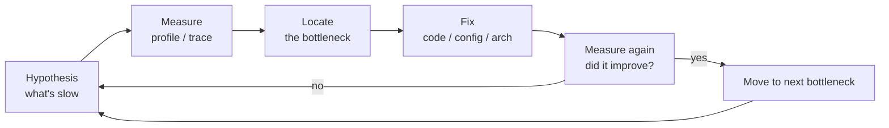

---
tags:
  - applied
---

# Performance Engineering Discipline

The encyclopedia covers throughput limits, queuing theory, and latency vs throughput. This page is the **applied craft**: how engineers actually find and fix performance problems in production. Profiling tools, flame graphs, latency analysis, the methodologies that turn "the system is slow" into "this specific function call accounts for 73% of time."

For *what performance means*, see [Latency vs Throughput](../fundamentals/latency-throughput.md) and [Throughput Limits](../fundamentals/throughput-limits.md). This is the **practice**.

---

## The performance engineering loop



The key word is **measure**. Optimising without measuring is theology. Most engineers' intuitions about what's slow are wrong.

---

## Choosing a methodology

Three named methodologies. Use the one that fits your scenario.

### 1. USE method (for resource saturation)

For each resource: check **Utilisation, Saturation, Errors**.

```
For every CPU, memory, disk, network interface:
  Utilisation: % busy
  Saturation: queue depth, wait time
  Errors: count of error events
```

Used by Brendan Gregg. Best for "our server is slow" — systematic check of every resource.

### 2. RED method (for request-driven services)

For each service endpoint: **Rate, Errors, Duration**.

```
Rate:      requests per second
Errors:    failures per second  
Duration:  latency distribution (p50, p95, p99)
```

Used at Weaveworks; spread by Tom Wilkie. Best for microservices. Map directly to dashboard panels.

### 3. Four Golden Signals (Google SRE)

For every user-facing service: **Latency, Traffic, Errors, Saturation**.

```
Latency:    request duration
Traffic:    demand on the system
Errors:     failure rate
Saturation: how "full" the service is (queue depth, near-capacity?)
```

Similar to RED, with Saturation added. The SRE Book standard.

**Pick one and stick with it for dashboards**. Mixing causes inconsistency.

---

## Latency analysis — why averages lie

```
Service handles 10K requests:
  9900 requests: 10ms each
  100 requests:  1000ms each

Average latency: (9900 × 10 + 100 × 1000) / 10000 = 19.9 ms

Sounds fine. But:
  1% of users see 1 second latency.
  At 1M requests/day: 10,000 angry users.
```

**Always use percentiles, not averages.** Specifically:

```
p50  (median):  half of users see ≤ this
p95:            5% of users see > this
p99:            1% of users see > this — this is what people complain about
p99.9:          0.1% — outliers; long tail
p99.99:         "every user sees this once a day"
```

### The right histogram

For percentiles to be correct, you need **histograms with appropriate buckets**.

```
Bad: just record average latency per minute
Good: bucket each request into latency bins; report percentiles

Latency buckets (typical):
  1ms, 2ms, 5ms, 10ms, 20ms, 50ms, 100ms, 200ms, 500ms, 1s, 2s, 5s, 10s, 30s
```

Tools: HDR Histograms, t-digests, DDSketch. Prometheus's `histogram_quantile()` computes percentiles from histogram metrics.

### Tail amplification

Fan-out makes the tail dominant:

```
Single service: p99 = 100ms
Service that calls 10 backends in parallel: 
  p99 of "any of 10 is slow" ≈ p99.9 of one
  
Actual tail amplification:
  1 dependency:     p99 = backend p99
  10 dependencies:  p99 = approximately backend p99.9
  100 dependencies: p99 = approximately backend p99.99
```

This is **why microservices have tail latency problems**. Every additional dependency in the request path makes the user-perceived tail worse.

Mitigations:
- **Hedged requests** (send to 2 backends, take first response)
- **Speculative execution** (start the second request after p95 elapsed)
- **Tail-tolerant design** (cache; fall back to partial response)

See [Latency vs Throughput](../fundamentals/latency-throughput.md).

---

## Profiling: finding where time is spent

### Sampling profilers (the right default)

A sampling profiler interrupts the process N times per second and records the stack trace. Aggregating stacks shows which code runs most often.

```
1000 samples taken
500 in function foo()      → 50% of CPU time
200 in function bar()      → 20% of CPU time
... etc
```

**Sampling profilers have negligible overhead** — 1-2% typical. Safe to run in production.

### Profilers by language

| Language | Tool | Notes |
|---|---|---|
| **Go** | `pprof` (built-in) | Best-in-class; production-ready |
| **Python** | `py-spy`, `pyspy`, `austin` | py-spy attaches to running process |
| **Java** | `async-profiler`, `JFR` | async-profiler is the production standard |
| **Node** | `0x`, Chrome DevTools, `perf` | Tooling improving rapidly |
| **Rust** | `perf`, `flamegraph` crate | Native binary tooling |
| **C++** | `perf`, `gperftools`, `vTune` | OS-level tools |
| **Ruby** | `stackprof`, `rbspy` | rbspy attaches to running process |
| **.NET** | `dotnet-trace`, `PerfView` | First-class on Windows; Linux too |

### Continuous profiling in production

```
Old way: profile when something is slow
New way: profile continuously, sample 1% of pods constantly

Stored profiles → query "what was hot 30 min ago when latency spiked"
```

Tools:

| Tool | Notes |
|---|---|
| **Datadog Continuous Profiler** | Managed; multi-language; great UX |
| **Grafana Pyroscope** | Open-source; self-hosted |
| **Polar Signals** | Continuous profiling SaaS |
| **AWS CodeGuru Profiler** | AWS-native |

The 2026 way of running services. You don't wait for an incident to start profiling.

### Reading a profile

```
% of time | function
─────────────────────────────────────────────
   42%    | json.encode (called 50K times)
   18%    | http.request.parse_headers
   10%    | regexp.match (in url_router)
    8%    | database.query (called 200 times)
    ...
```

Look for:
- Functions with high % that you didn't expect → easy win
- Functions called more times than expected → algorithmic issue
- I/O blocking time (often in "wait" or "syscall" frames) → consider async
- GC time (in JVM, V8, etc.) → memory allocation pattern issue

---

## Flame graphs

The standard visualisation for sampled profiles. **The single most valuable tool for performance work.**

### Reading a flame graph

```
Width  = % of total samples (wider = more time spent)
Height = call stack depth (root at bottom, leaves at top)
Colour = arbitrary or category-based

Wide plateaus near the top = the actual hot function
Wide stacks = expensive call paths
Spikes = deep call chains, less concerning
```

### Producing a flame graph

```bash
# Linux perf for any process
perf record -F 99 -p $PID -g -- sleep 30
perf script | stackcollapse-perf.pl | flamegraph.pl > flame.svg
```

```bash
# Go
go tool pprof -http=:8080 cpu.prof
# Opens browser; flame graph tab

# Python with py-spy
py-spy record -o flame.svg --pid $PID --duration 30 --format flamegraph
```

Brendan Gregg's flamegraph.pl is the canonical tool. Most languages have built-in equivalents.

### Differential flame graphs

Compare two profiles (before/after a fix):

```
Red = function got slower
Blue = function got faster
```

Tools: `difffolded.pl` from FlameGraph repo. Useful when refactoring to verify "yes, this actually got faster, and nothing else got worse."

---

## Benchmarking — and its pitfalls

Microbenchmarks are easy to write and easy to write wrong.

### Common benchmark mistakes

**1. JIT warm-up**

JVM/V8 starts in interpreted mode; JIT compiles hot code paths. First N calls are slower.

```python
# WRONG
start = time.now()
for i in range(1000):
    do_work()
elapsed = time.now() - start
# Might capture JIT compilation overhead

# RIGHT
# Warm up first
for i in range(1000):
    do_work()
# Then measure
start = time.now()
for i in range(10000):
    do_work()
elapsed = time.now() - start
```

Tools handle this: JMH (Java), Criterion (Rust), `go test -bench`.

**2. Dead code elimination**

The compiler/runtime sees you compute X but never use it → removes the computation entirely.

```go
// WRONG: result discarded; compiler may skip the work
for i := 0; i < N; i++ {
    fibonacci(i)
}

// RIGHT: consume the result somehow
var sink int
for i := 0; i < N; i++ {
    sink = fibonacci(i)
}
runtime.KeepAlive(sink)
```

Benchmark frameworks have explicit primitives (`b.ReportAllocs()`, `runtime.KeepAlive`, JMH's `Blackhole`).

**3. Noisy neighbours**

Running benchmarks on a shared cloud VM = noise.

```
Run 1: 100ms
Run 2: 95ms
Run 3: 130ms — another tenant pegged a CPU
```

Solutions:
- Use bare-metal or dedicated instances
- Run benchmarks many times; report distribution
- Pin process to specific CPUs (`taskset`)
- Disable CPU frequency scaling for benchmarks (`cpupower`)

**4. Comparing apples to oranges**

```
Benchmark A: cold cache
Benchmark B: warm cache
Conclusion: "B is 100× faster!" — not actually a fair comparison
```

Always describe the conditions clearly. Repeat under realistic conditions.

**5. Benchmark != production**

The biggest pitfall. Micro-benchmark says X is faster; production says no difference. Reasons:

- Memory allocations behave differently under GC pressure
- Cache behaviour different at scale
- Lock contention different with real concurrency
- Network latency dominates everything

**Always validate with production-like load tests.**

### Load testing tools

| Tool | Notes |
|---|---|
| **k6** | Modern JS-scripted; great UX |
| **Gatling** | Scala-based; powerful scenarios |
| **Locust** | Python; distributed |
| **JMeter** | Java; classic; capable but clunky |
| **wrk** / **wrk2** | C; low overhead; great for throughput tests |
| **vegeta** | Go; line-oriented; good for constant rate |

For tail latency testing specifically: **wrk2** (vs wrk) corrects for "coordinated omission" — the bias that makes ordinary load tests under-report tail latency.

---

## The Coordinated Omission problem

When a load tester hammers a server, it sends a request → waits for response → sends next. If a response takes 5 seconds (huge p99), the load tester is also idle 5 seconds — **missing the requests it should have sent**.

```
Intended: 100 req/s constantly
If a request takes 5s:
  At 1.00s: request 100 sent (response 5s)
  At 1.01-5.99: load tester waits → DOESN'T send the next 490 requests
  At 5.00s: request 101 sent

Result: load report says "p99 = 5.0s" but doesn't reflect that 490 requests
would also have been delayed. True p99 is much worse.
```

**Tools that fix this**: wrk2, gatling (with proper config), k6 (with `--rps`). Always use these for production load tests.

---

## Memory profiling

CPU isn't always the bottleneck. Memory allocation patterns matter:

```
Excessive allocations → GC pressure → STW pauses → tail latency spikes
Excessive memory use → OOM kills, swapping
Memory leaks → slow degradation, eventually OOM
```

### Tools

| Language | Memory tool |
|---|---|
| Go | `pprof` heap profile |
| Java | `jmap`, JFR, Eclipse MAT for heap dumps |
| Python | `tracemalloc`, `memory_profiler`, `objgraph` |
| Node | `--inspect` + Chrome DevTools heap snapshot |
| C++ | Valgrind, AddressSanitizer, Heaptrack |

### Heap profiling vs CPU profiling

```
CPU profile: where time is spent
Heap profile: where memory is allocated

A function that allocates 1GB per second might not appear on a CPU profile
but absolutely shows on a heap profile.
```

For GC'd languages, heap profiling often reveals more performance issues than CPU profiling.

### Detecting memory leaks

```bash
# Take heap snapshot now
go tool pprof -inuse_space http://service/debug/pprof/heap > heap1.pprof

# Wait an hour

go tool pprof -inuse_space http://service/debug/pprof/heap > heap2.pprof

# Compare
go tool pprof -base heap1.pprof heap2.pprof
# Shows what grew
```

Memory leaks in production show as steady growth in heap size. The pattern: **monitor RSS over time**; if it grows unbounded between deploys, there's a leak.

---

## Concurrency profiling

For multi-threaded code, simple CPU profiles miss key issues.

### Thread states

```
RUNNING:     using a CPU
RUNNABLE:    ready to run but no CPU available (CPU-bound saturation)
BLOCKED:     waiting on a lock
WAITING:     waiting on I/O or condition variable
TIMED_WAIT:  sleep, etc.
```

If your threads are mostly BLOCKED: lock contention is the bottleneck. CPU profile won't show this (CPU isn't busy).

### Tools

- **Async-profiler (Java)** with `--threads` flag
- **Go**: block profiles and mutex profiles via `pprof`
- **Linux**: `perf record -e sched:sched_switch` to track scheduling
- **eBPF tools**: `offcputime` shows where threads are blocked

### Off-CPU profiling

What threads are doing when they're NOT on a CPU. Reveals:

- Lock contention (waiting on mutex)
- I/O waits (DB, network)
- Page faults

```bash
# eBPF tool from BCC
sudo offcputime-bpfcc -K -p $PID 30
```

For latency analysis, off-CPU profiling is often more valuable than CPU profiling.

---

## Performance budgeting

A practice: each component gets a latency / resource budget. Exceeding it is a bug.

```
Page load budget: 200ms p95 total
  → Auth check: 5ms
  → Render template: 20ms
  → 3 DB queries: 30ms total
  → 2 API calls: 100ms total
  → Network: 20ms
  → Other: 25ms

If "render template" goes to 60ms: bug. Doesn't matter that overall is still 240ms.
```

Track each component against its budget. Regressions show up immediately.

### Implementation

```python
# Decorator: warn if function exceeds budget
@perf_budget(ms=20)
def render_template(...):
    ...

# In a request handler with sub-budgets
with budget('render_template', ms=20):
    render_template(...)
```

Tools like SpeedCurve, Sentry Performance, Datadog APM let you set thresholds and alert on regression.

---

## Common performance problems and fixes

| Symptom | Likely cause | Fix |
|---|---|---|
| High p99 but normal p50 | GC pauses, fan-out tail amplification | Tune GC; hedged requests; cache |
| CPU pegged, low throughput | Lock contention or wrong algorithm | Profile; off-CPU; refactor hot path |
| Memory growing unbounded | Leak or unbounded cache | Heap diff; bounded cache; weak refs |
| Slow first request, fast rest | JIT warm-up, cold cache | Pre-warm; immutable serving |
| Latency varies wildly | Noisy neighbours, throttling | Dedicated instances; rate limit |
| Throughput plateaus | Single threaded bottleneck (Amdahl) | Find the serialised step |
| Database slow | Missing index, planner stale | EXPLAIN ANALYZE; index; ANALYZE |
| Network high | Chatty protocol, no batching | Batch requests; gRPC streaming |

---

## Hardware-level performance (briefly)

Worth knowing for low-level work:

```
CPU cache:
  L1: 1-2 ns, ~32 KB per core
  L2: 5-10 ns, ~256 KB per core
  L3: 20-40 ns, MBs shared

Memory:
  RAM access: 100 ns
  NUMA cross-socket: 200-400 ns

Disk:
  NVMe SSD: 100 µs
  Network (same DC): 500 µs
```

Cache locality matters for hot inner loops. Tools like `perf stat -d` show L1/L2/L3 cache misses.

For 99% of business apps, you don't need this. For trading systems, game engines, databases — you do.

---

## Tracing for distributed systems

Profiling shows where a process spends time. Tracing shows where a **request** spends time across services.

### Tools

| Tool | Notes |
|---|---|
| **OpenTelemetry** | Standard; multi-vendor |
| **Jaeger** | Open-source; self-hosted |
| **Grafana Tempo** | Open-source; scales horizontally |
| **Datadog APM** | Managed; rich UX |
| **AWS X-Ray** | AWS-native |
| **Honeycomb** | Best for high-cardinality investigation |

### Adding spans to your code

```python
# OpenTelemetry Python
from opentelemetry import trace

tracer = trace.get_tracer(__name__)

def handle_order(order_id):
    with tracer.start_as_current_span("handle_order") as span:
        span.set_attribute("order.id", order_id)
        
        with tracer.start_as_current_span("validate_payment"):
            validate_payment(order_id)
        
        with tracer.start_as_current_span("reserve_inventory"):
            reserve_inventory(order_id)
        
        with tracer.start_as_current_span("send_confirmation"):
            send_confirmation(order_id)
```

Now you get a waterfall view of every request: where time is spent, which sub-call is slow.

### Sampling vs ingest cost

Tracing has cost. Sample:

```
Head-based sampling:    Decide at the start of trace (10% of traces)
Tail-based sampling:    Decide after the trace completes (keep all errors + slow ones)
```

Tail-based is better for debugging but harder to implement (need to buffer until trace completes).

---

## Putting it all together — debugging a real slow request

```
1. User reports "checkout is slow"
2. Distributed trace: find the slow trace (p99 outlier)
3. Trace shows: 800ms in "validate_payment" span
4. Open payment service profile: heap shows GC pauses in that timeframe
5. CPU profile of payment service: 40% in json.parse
6. EXPLAIN ANALYZE the payment query: missing index
7. Fix: add index. Reduce JSON parsing via pre-cached schemas. Tune GC.
8. Validate: re-run load test; p99 down from 800ms to 80ms.
9. Continuous profiling: ensure no regression in next deploy.
```

This is the **end-to-end performance engineering loop**. Most engineers stop at step 2. Going through all 9 is what separates senior from staff.

---

## Anti-patterns

| Anti-pattern | Fix |
|---|---|
| Optimising without profiling | Profile first; intuition is wrong 80% of the time |
| Optimising average latency | Use p99 / p99.9 |
| Micro-benchmarks without production validation | Always load test the realistic scenario |
| Premature optimisation in cold paths | 80/20: only the hot 20% matters |
| "Cache it" as default answer | Cache complexity has its own cost; profile first |
| Adding monitoring as a fix | Monitoring shows; doesn't fix |
| Ignoring tail latency | Tail = real user experience |
| One-shot profiling instead of continuous | Snapshots miss incidents that already passed |
| Comparing two different envs | A/B in same env; differential flame graphs |

---

## Tooling stack to invest in

For a production system:

```
Metrics:           Prometheus + Grafana, or Datadog/New Relic
Logs:              Loki / ELK / Datadog Logs
Traces:            OpenTelemetry → Tempo/Jaeger/Datadog APM
Profiling:         Pyroscope / Datadog Continuous Profiler
Load testing:      k6 or Gatling with wrk2 for tail latency
DB observability:  pg_stat_statements / Datadog DB monitoring
RUM (real user monitoring): for client-side performance
```

Invest in this **before** you have performance problems. Adding it during a fire is slow.

---

## Interview angle

!!! tip "What interviewers are testing"
    Whether you can diagnose a perf problem systematically — not guess.

**Strong answer pattern:**
1. Always measure first; intuition is wrong
2. Use percentiles (p99, p99.9), not averages
3. Tail amplification: 10 dependencies → tail dominates
4. Continuous profiling in production, not just on-demand
5. Coordinated omission ruins load tests; use wrk2 / k6 with rps mode
6. Off-CPU profiling for lock contention / I/O waits
7. Performance budgets per component; regressions caught immediately

**Common follow-up:** *"P99 is 500ms. Latency budget is 200ms. What do you do?"*
> First, capture a slow trace via distributed tracing. The trace's waterfall shows which sub-call dominates. If it's one service, profile that service: CPU, memory (GC pauses?), and off-CPU (lock contention? I/O waits?). If it's many services contributing, that's fan-out tail amplification — look at hedged requests, parallelism vs serial calls, caching the common path. Often the fix is in one specific function consuming 30% of time, or in unnecessary I/O hidden behind a library call. Validate the fix with a controlled load test; check that p99 actually drops without making p50 worse.

---

## Related

- [Latency vs Throughput](../fundamentals/latency-throughput.md) — the underlying concepts
- [Throughput Limits (Amdahl's & USL)](../fundamentals/throughput-limits.md) — scaling math
- [Numbers Every Engineer Should Know](../fundamentals/numbers-to-know.md) — calibration
- [Database Internals Deep-Dive](../fundamentals/database-internals-deep-dive.md) — query-level performance
- [Distributed Tracing](tracing.md) — end-to-end request visibility
- [Metrics](metrics.md) — what to track
- [Queuing Theory](../fundamentals/queuing-theory.md) — why P99 grows fast near capacity
