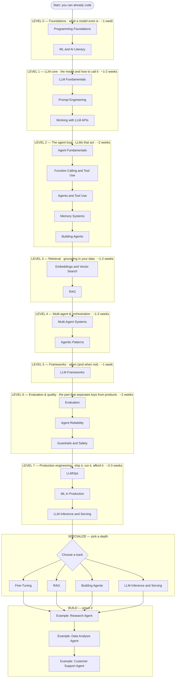

# The AI Engineer Path: Zero → Production

A single ordered route from "I can code" to "I ship reliable AI systems." This is the AI-engineering companion to the [system-design Curriculum](curriculum.md) — same idea, same format: one spine, each step building on the last, checkpoints per level.

**How to use it**: follow the roadmap top to bottom. Every node is clickable. Don't skip the foundations — most "my agent is flaky" problems trace back to skipping Level 0 or Level 1. The order maps to the 11-step path most AI engineers actually walk.

!!! tip "Interactive roadmap"
    Click any node to open that page. Click the diagram background to zoom fullscreen.

## The roadmap

---

## Level 0 — Foundations *(~1 week)*

**The question**: before any LLM, what is a model, and when do you even need ML?

1. [Programming Foundations](../software-design/index.md) — you should be comfortable writing code, calling APIs, using git, and writing tests. This site's [Software Design](../software-design/index.md) section covers the engineering quality side; raw language fluency (Python especially) is assumed.
2. [ML & AI Literacy](../ai/ml-literacy.md) — what a model *is* (a function with learned weights), training vs inference, supervised/unsupervised/RL, what "evaluation" means, and — crucially — when a rule beats a model.

??? question "Checkpoint — can you answer these without looking?"

    - What's the difference between training and inference, and why does it matter for cost and architecture?
    - When would you *not* reach for ML/an LLM at all?
    - What does "7B parameters" mean, roughly?

## Level 1 — LLM core *(~1-2 weeks)*

**The question**: how does the model behave, and how do I call it from real code?

1. [LLM Fundamentals](../ai/llm-fundamentals.md) — tokens, context windows, sampling, why models hallucinate; the mental model everything else needs
2. [Prompt Engineering](../ai/prompt-engineering.md) — the highest-leverage skill once you know how LLMs work
3. [Working with LLM APIs](../ai/working-with-llm-apis.md) — the SDK in practice: structured output, streaming, tool calls, cost levers, retries. The bridge from playground to production.

??? question "Checkpoint"

    - The same prompt works in the chat UI but truncates in your code. Two likely causes?
    - How do you get reliable JSON out of a model instead of parsing prose?
    - What's the cheapest lever for cutting cost on requests that share a big system prompt?

## Level 2 — The agent loop *(~2 weeks)*

**The question**: how does an LLM *do things* — call tools, take multiple steps, remember?

1. [Agent Fundamentals](../agents/agent-fundamentals.md) — what makes something an "agent" vs a single call
2. [Function Calling & Tool Use](../agents/function-calling.md) — the mechanic that lets a model act
3. [Agents & Tool Use](../ai/agents-and-tool-use.md) — the ReAct loop: reason → act → observe → repeat
4. [Memory Systems](../ai/memory-systems.md) — short-term context vs long-term memory across sessions
5. [Building Agents](../agents/building-agents.md) — putting the loop together into something that works

??? question "Checkpoint"

    - Walk the tool-use loop: what does the model return, and what do you send back?
    - Why is the API stateless, and what does that mean for "memory"?
    - When does a task justify an agent versus a single well-prompted call?

## Level 3 — Retrieval *(~1-2 weeks)*

**The question**: how do I ground the model in *my* data instead of just its training?

1. [Embeddings & Vector Search](../ai/embeddings-vector-search.md) — turning meaning into vectors; ANN search; the retrieval primitive
2. [RAG](../ai/rag.md) — retrieval-augmented generation: chunking, retrieval, reranking, and the failure modes (the most common production LLM pattern)

??? question "Checkpoint"

    - Why does chunking strategy make or break a RAG system?
    - What does reranking add on top of vector search, and when is it worth it?
    - "The model cited the wrong document." Where in the pipeline do you look?

## Level 4 — Multi-agent & orchestration *(~1-2 weeks)*

**The question**: when one agent isn't enough, how do several coordinate?

1. [Multi-Agent Systems](../agents/multi-agent-systems.md) — coordinator/worker, delegation, when multi-agent helps vs adds chaos
2. [Agentic Patterns](../ai/agentic-patterns.md) — planning, decomposition, reflection, and the reusable shapes

??? question "Checkpoint"

    - When does splitting work across agents help, and when does it just add coordination cost?
    - What's the difference between a planner that decomposes upfront and one that adapts as it goes?

## Level 5 — Frameworks *(~1 week)*

**The question**: should I use LangChain/LangGraph, or the raw SDK plus thin helpers?

1. [LLM Frameworks](../ai/llm-frameworks.md) — the landscape (LangChain, LangGraph, LlamaIndex, DSPy, and friends), what they give you, the abstraction-tax critique, and the "start raw, adopt selectively" stance

You reach Level 5 *after* the agent loop deliberately: a framework is much easier to judge once you know what it's abstracting. If you start here, you can't tell a helpful abstraction from a leaky one.

??? question "Checkpoint"

    - What does LangGraph's graph model give you that a linear chain doesn't?
    - Name two situations where you'd skip the framework and go raw-SDK.

## Level 6 — Evaluation & quality *(~2 weeks)*

**The question**: is it actually any good — and how would I know if it regressed?

1. [Evaluation](../ai/evaluation.md) — eval harnesses, measuring correctness, LLM-as-judge, offline vs online
2. [Agent Reliability](../agents/agent-reliability.md) — retries, validation, failure handling for non-deterministic systems
3. [Guardrails & Safety](../ai/guardrails-safety.md) — input/output filtering, jailbreak resistance, reducing hallucination

This level is what separates a demo from a product. A flashy agent with no evals is a liability; a boring one with a solid eval harness ships.

??? question "Checkpoint"

    - How do you evaluate a system whose output is different every run?
    - What's the trap with checking your eval metric every day and stopping at the first good number?
    - Name two concrete ways to reduce hallucination in a deployed system.

## Level 7 — Production engineering *(~2-3 weeks)*

**The question**: how do I run this reliably, observably, and affordably?

1. [LLMOps](../ai/llmops.md) — observability, cost control, prompt/version management, caching
2. [ML in Production](../ai/ml-in-production.md) — serving, monitoring, drift, the broader ML-systems view (incl. A/B testing models)
3. [LLM Inference & Serving](../ai/llm-inference.md) — latency, throughput, batching, self-hosting vs API

??? question "Checkpoint"

    - Your LLM bill doubled with no traffic change. First thing you check?
    - What would you monitor to catch a silently degrading RAG system?
    - When does self-hosting inference beat calling an API?

## Specialize — pick a depth

You can't be expert at everything. After Level 7, go deep on one:

- **Fine-tuning & model adaptation** → [Fine-Tuning](../ai/fine-tuning.md)
- **RAG systems** → [RAG](../ai/rag.md) + [Embeddings & Vector Search](../ai/embeddings-vector-search.md) at depth
- **Applied agents** → [Building Agents](../agents/building-agents.md) + [Multi-Agent Systems](../agents/multi-agent-systems.md)
- **Platform / inference infra** → [LLM Inference & Serving](../ai/llm-inference.md) + [ML in Production](../ai/ml-in-production.md)

## Build — prove it

Knowledge that hasn't built anything is trivia. Work the three end-to-end examples — attempt each yourself before reading the walkthrough:

- [Research Agent](../agents/example-research-agent.md) — multi-step tool use + synthesis
- [Data Analysis Agent](../agents/example-data-agent.md) — code execution + structured output
- [Customer Support Agent](../agents/example-customer-support-agent.md) — RAG + guardrails + escalation

## How this relates to the system-design curriculum

| Path | Relationship |
|---|---|
| [The Curriculum (Zero → Staff)](curriculum.md) | The system-design backbone — distributed systems, storage, scaling. An AI engineer shipping production systems needs both; the two paths are complementary, not alternatives. |
| [Building a SaaS](building-saas.md) | If your AI feature lives inside a product, this covers the product scaffolding around it. |

Honest estimate: **2-3 months at ~1 hour/day** for Levels 0-7, then specialization is ongoing. The fastest way to stall is to skip Level 1 (the API) and Level 6 (evals) — the two least glamorous levels and the two that matter most in production.
