# The Curriculum: Zero → Staff

Every other page in this encyclopedia is a *reference* — organized for looking things up. This page is the *course*: one ordered path from "how do computers talk" to staff-level system design, structured the way school structures math — addition before derivatives, each level building on the one below.

**How to use it**: follow the roadmap top to bottom. Every node is clickable — it takes you to that page. Finish a level's checkpoint before moving on; if a checkpoint question stumps you, the level isn't done. Skipping levels is how you end up memorizing "use Kafka" without knowing why.

!!! tip "Interactive roadmap"
    Click any node to open that page. Click the diagram background to zoom fullscreen — it's a big map.

## The roadmap

```mermaid
graph TD
    Start([Start here]) --> B1

    subgraph L0 ["LEVEL 0 — Bedrock · how machines and networks actually work · ~1 week"]
        B1[Numbers to Know] --> B2[Latency vs Throughput]
        B2 --> B3[Networking Basics]
        B3 --> B4[OS Concepts]
        B4 --> B5[Memory Hierarchy]
        B5 --> B6[Hashing]
    end

    B6 --> S1

    subgraph L1 ["LEVEL 1 — One server, done well · ~1-2 weeks"]
        S1[Relational Databases] --> S2[Database Indexes]
        S2 --> S3[Transactions and Isolation]
        S3 --> S4[REST]
        S4 --> S5[Estimation]
        S5 --> S6[SQL vs NoSQL]
    end

    S6 --> R1

    subgraph L2 ["LEVEL 2 — Scaling reads · ~1-2 weeks"]
        R1[Scalability] --> R2[DNS]
        R2 --> R3[Load Balancing]
        R3 --> R4[Caching Strategies]
        R4 --> R5[Redis Deep Dive]
        R5 --> R6[CDN]
        R6 --> R7[Read Replicas]
        R7 --> R8[Connection Pooling]
    end

    R8 --> D1

    subgraph L3 ["LEVEL 3 — Going distributed · ~3-4 weeks · the hard one"]
        D1[The 8 Fallacies] --> D2[CAP Theorem]
        D2 --> D3[Consistency Models]
        D3 --> D4[Partitioning Fundamentals]
        D4 --> D5[Sharding]
        D5 --> D6[Replication]
        D6 --> D7[Message Queues]
        D7 --> D8[Event Streaming]
        D8 --> D9[Kafka Deep Dive]
        D9 --> D10[Idempotency]
        D10 --> D11[Clocks and Ordering]
        D11 --> D12["Consensus: Raft and Paxos"]
    end

    D12 --> A1

    subgraph L4 ["LEVEL 4 — Architecture and operations · ~3-4 weeks"]
        A1[Monolith vs Microservices] --> A2[Event-Driven Architecture]
        A2 --> A3[Saga Pattern]
        A3 --> A4[Outbox Pattern]
        A4 --> A5[Rate Limiting]
        A5 --> A6[Circuit Breaker]
        A6 --> A7[Logging]
        A7 --> A8[Metrics]
        A8 --> A9[SLI SLO SLA]
        A9 --> A10[AuthN and AuthZ]
        A10 --> A11[OAuth and JWT]
        A11 --> A12[Containers]
        A12 --> A13[Kubernetes]
        A13 --> A14[Deployment Strategies]
    end

    A14 --> T1

    subgraph L5 ["LEVEL 5 — Staff level · ongoing"]
        T1[DB Internals Deep Dive] --> T2[DB Operations at Scale]
        T2 --> T3[Performance Engineering]
        T3 --> T4[Unhappy-Path Engineering]
        T4 --> T5[Incident Response Craft]
        T5 --> T6[Durable Workflows]
        T6 --> T7[Event Streaming Maturity]
        T7 --> T8[Sharding Tooling]
        T8 --> T9[Kubernetes in Production]
        T9 --> T10[Multi-Region Architecture]
        T10 --> T11[Cost Engineering]
        T11 --> T12[Architecture Politics]
    end

    T12 --> Apply

    subgraph APPLY ["APPLY — prove it to yourself"]
        Apply[Case Studies] --> Interview[Interview Guide]
    end
```

---

## Level 0 — Bedrock *(~1 week)*

**The question this level answers**: what do the machines actually do, and how long does each thing take?

Everything above this level is built from these primitives. You cannot reason about a cache if you don't know RAM is ~1000× faster than disk; you cannot reason about microservices if you don't know a network hop costs ~0.5ms in-datacenter.

1. [Numbers Every Engineer Should Know](../fundamentals/numbers-to-know.md) — the latency table you'll use forever
2. [Latency vs Throughput](../fundamentals/latency-throughput.md) — they are not the same thing
3. [Networking Basics](../fundamentals/networking-basics.md) — IP, TCP, what a request physically is
4. [OS Concepts](../fundamentals/os-concepts.md) — processes, threads, syscalls, file descriptors
5. [Memory Hierarchy](../fundamentals/memory-hierarchy.md) — why locality dominates performance
6. [Hashing](../fundamentals/hashing.md) — the primitive half of distributed systems is built on

??? question "Checkpoint — can you answer these without looking?"

    - Roughly how much slower is a disk seek than a RAM access? A cross-region round trip than same-datacenter?
    - Why can a system have great average latency and terrible throughput, or the reverse?
    - What happens, at the OS level, when a server "runs out of connections"?

## Level 1 — One server, done well *(~1-2 weeks)*

**The question**: how does a single, boring, correct application work?

Distributed systems are what you do when one machine isn't enough. Most people reach for them before understanding the machine. Don't.

1. [Relational Databases](../storage/relational-databases.md) — the default datastore, and why
2. [Database Indexes](../fundamentals/database-indexes.md) — the single biggest performance lever you own
3. [Transactions & Isolation](../fundamentals/isolation-levels.md) — what the DB actually guarantees
4. [REST](../api/rest.md) — the lingua franca of APIs
5. [Back-of-Envelope Estimation](../fundamentals/estimation.md) — turn "1M users" into QPS and GB
6. [SQL vs NoSQL](../storage/sql-vs-nosql.md) — now you can judge this debate

??? question "Checkpoint"

    - Given a slow query, what are the first three things you'd check?
    - What's the difference between Read Committed and Repeatable Read, and when does it bite?
    - 10M daily active users, 20 requests each — what's the average and peak QPS? (Do it in your head.)

## Level 2 — Scaling reads *(~1-2 weeks)*

**The question**: the single server is melting under read traffic — what's the cheapest fix, in order?

This level is one idea applied four ways: *put a copy of the data closer to the reader*.

1. [Scalability](../fundamentals/scalability.md) — vertical vs horizontal, and the order of cheap fixes
2. [DNS](../networking/dns.md) — where every request begins
3. [Load Balancing](../networking/load-balancing.md) — spreading traffic across copies of your app
4. [Caching Strategies](../caching/caching-strategies.md) — cache-aside and friends
5. [Redis Deep Dive](../caching/redis.md) — the tool you'll actually use
6. [CDN](../networking/cdn.md) — caching at the planet's edge
7. [Read Replicas](../patterns/read-replicas.md) — scaling the database's read side
8. [Connection Pooling](../patterns/connection-pooling.md) — the unglamorous thing that falls over first

??? question "Checkpoint"

    - Your product is read-heavy and slow. Name the escalation ladder of fixes, cheapest first, before anyone says "shard."
    - What is a cache stampede and two ways to prevent it?
    - A user writes a comment, refreshes, and doesn't see it. Which component in this level likely caused it and why?

## Level 3 — Going distributed *(~3-4 weeks — the hard one)*

**The question**: data no longer fits one machine, writes no longer fit one machine, and machines fail — now what?

This is the calculus of the course: everything before was preparation for this. Take it slowly; every page here breaks an assumption that held in Levels 0-2.

1. [The 8 Fallacies](../distributed/fallacies.md) — the assumptions that stop being true
2. [CAP Theorem](../fundamentals/cap-theorem.md) — the trade-off everything else orbits
3. [Consistency Models](../fundamentals/consistency-models.md) — the spectrum between strong and eventual
4. [Partitioning Fundamentals](../fundamentals/partitioning-fundamentals.md) — splitting data, the broad concept
5. [Sharding](../patterns/sharding.md) — splitting across machines
6. [Replication](../patterns/replication.md) — copies, failover, and the lag problem
7. [Message Queues](../messaging/message-queues.md) — decoupling in time
8. [Event Streaming](../messaging/event-streaming.md) — the log as the backbone
9. [Kafka Deep Dive](../messaging/kafka.md) — the canonical implementation
10. [Idempotency](../patterns/idempotency.md) — the pattern that makes retries safe
11. [Clocks & Ordering](../distributed/clocks.md) — why "what happened first" is hard
12. [Consensus (Raft & Paxos)](../distributed/consensus.md) — how machines agree at all

??? question "Checkpoint"

    - During a network partition, what does a CP system do that an AP system doesn't?
    - Why does "exactly-once delivery" not exist, and what do we build instead?
    - You shard by user_id; an admin needs "find user by email." What broke, and what are your options?
    - Why can't you use wall-clock timestamps to order events from two servers?

## Level 4 — Architecture & operations *(~3-4 weeks)*

**The question**: you can build the pieces — how do you compose, secure, observe, and ship a real system?

1. [Monolith vs Microservices](../architecture/monolith-vs-microservices.md) — the structural decision
2. [Event-Driven Architecture](../architecture/event-driven.md) — composing with events
3. [Saga Pattern](../patterns/saga-pattern.md) — transactions across services
4. [Outbox Pattern](../patterns/outbox.md) — reliable event publishing
5. [Rate Limiting](../patterns/rate-limiting.md) + 6. [Circuit Breaker](../patterns/circuit-breaker.md) — protecting yourself and others
7. [Logging](../observability/logging.md), 8. [Metrics](../observability/metrics.md), 9. [SLI/SLO/SLA](../observability/slo-sla.md) — knowing what's happening
10. [AuthN & AuthZ](../security/authn-authz.md) + 11. [OAuth 2.0 & JWT](../security/oauth-jwt.md) — who's calling
12. [Containers](../infrastructure/containers.md), 13. [Kubernetes](../infrastructure/kubernetes.md), 14. [Deployment Strategies](../cicd/deployment-strategies.md) — shipping it

??? question "Checkpoint"

    - Order placed → charge card → update inventory → send email, across four services. Sketch the saga, including what happens when the charge fails.
    - What's the difference between an SLI, SLO, and SLA — and why should error budgets change team behavior?
    - Why is "deploy" not the same as "release," and what mechanism separates them?

## Level 5 — Staff level *(ongoing)*

**The question**: how do systems behave under real load, real failure, real money, and real organizations?

These pages assume everything below. They're the difference between knowing the patterns and having operated them.

1. [Database Internals Deep Dive](../fundamentals/database-internals-deep-dive.md) — planner, MVCC, vacuum
2. [Database Operations at Scale](../fundamentals/database-operations-at-scale.md) — migrations, backups, failover
3. [Performance Engineering](../observability/performance-engineering.md) — profiling, percentiles, method
4. [Unhappy-Path Engineering](../patterns/unhappy-path-engineering.md) — designing for failure as the default
5. [Incident Response Craft](../observability/incident-response-craft.md) — when it breaks anyway
6. [Durable Workflows](../patterns/durable-workflows.md) — long-running processes that survive deploys
7. [Event Streaming Maturity](../messaging/event-streaming-maturity.md) — schemas, CDC, replays in anger
8. [Sharding Tooling](../patterns/sharding-tooling.md) — Vitess, Citus, and migration reality
9. [Kubernetes in Production](../infrastructure/kubernetes-in-production.md) — OOMKills, probes, drains
10. [Multi-Region Architecture](../architecture/multi-region.md) — when one region isn't enough
11. [Cost Engineering](../architecture/cost-engineering.md) — the bill as an architectural force
12. [Architecture Politics](../architecture/architecture-politics.md) — RFCs, influence, organizations

??? question "Checkpoint"

    - Postgres has been "getting slower for weeks." Walk your diagnostic path — specific views and queries, not vibes.
    - Your checkout needs a "remind seller after 48h, escalate after 7 days" flow. Compare cron + status columns vs a workflow engine, and defend a choice.
    - You're asked to cut infrastructure cost 30% without hurting p99. Where do you look first, and what do you refuse to cut?

## Apply — prove it to yourself

Knowledge that hasn't designed anything is trivia. Finish with:

- **[Case Studies](../case-studies/index.md)** — pick three, attempt each *yourself on paper first* (clarify → estimate → design → deep-dive → wrap), then compare against the written solution. Start with [URL Shortener](../case-studies/url-shortener.md), then [Chat System](../case-studies/chat-system.md), then [Payment System](../case-studies/payment-system.md)
- **[Interview Guide](../interview-guide.md)** — the framework for presenting designs under time pressure
- The **Test yourself** sections scattered across interview-critical pages — your spaced-repetition material

## How this relates to the other paths

| Path | Relationship |
|---|---|
| [Just the Essentials](essentials.md) | Levels 0-2 compressed into ~3 hours — the trailer for this course |
| [Interview Prep (1 week)](interview-prep.md) | A cram subset — use when the interview is *next week*; come back here after |
| [Building a SaaS](building-saas.md) / [Monolith → Microservices](monolith-to-microservices.md) / [Scaling Beyond One Region](scaling-beyond-region.md) | Goal-based routes — take them *after* Level 3, when you have the foundations they assume |

Total honest estimate: **2-3 months at ~1 hour/day** for Levels 0-4, with Level 5 being a career, not a syllabus.
