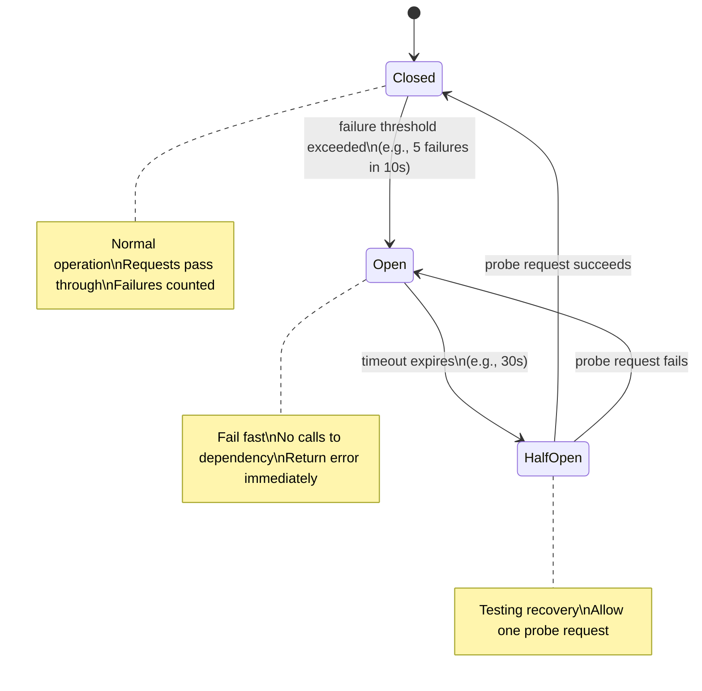

# Circuit Breaker

## What it is

The circuit breaker pattern prevents a service from repeatedly calling a failing dependency, giving it time to recover. Instead of letting slow/failing calls cascade through your system, the circuit breaks — failing fast and returning immediately.

Named after the electrical circuit breaker: when current is too high (overload), the breaker trips (opens) to protect the circuit.

## You'll see this when...

- One slow downstream service is taking down your whole stack
- A 30-second timeout has 200 threads stuck waiting; your service stops responding
- "Cascading failure" appears in a postmortem — Service A → B → C all fell over
- Hystrix, Resilience4j, Polly, or `gobreaker` shows up in the codebase
- An Istio `DestinationRule` has `outlierDetection` configured
- AWS App Mesh / Envoy logs show "circuit open" or "outlier detected"
- Engineers add ad-hoc try/except + counters around external calls (rolling their own)

## States



### Closed (normal)
Requests flow normally. Failures are tracked. If failures exceed threshold → trip to Open.

### Open (tripped)
Requests fail immediately without calling the dependency. Periodic timeout → move to Half-Open.

### Half-Open (testing)
Allow one probe request through. If it succeeds → Closed (recovered). If it fails → Open again.

## Why it matters

Without circuit breaker:
```
Service A → calls Payment Service (slow/timing out, 10s each)
100 concurrent requests → all blocked for 10s → thread pool exhausted
→ Service A is down, not just Payment Service

Cascade failure: one slow dependency brings down the caller
```

With circuit breaker:
```
Payment Service failing → circuit opens
Service A → circuit open → immediate error (1ms)
Service A stays responsive
Payment Service has time to recover without constant load
When Payment Service recovers → circuit closes → normal operation
```

## Implementation

### Failure detection strategies

**Count-based:**
```
If failures >= N within M requests → open circuit
Example: 5 failures in 10 requests
```

**Rate-based (better):**
```
If failure rate >= 50% AND at least 10 requests in last 10 seconds → open circuit
More accurate at high traffic volumes
```

**Timeout as failure:**
```
Any request taking > 2 seconds counts as a failure
Slow calls are as harmful as errors
```

### Python example (simplified)

```python
import time
from enum import Enum

class State(Enum):
    CLOSED = "closed"
    OPEN = "open"
    HALF_OPEN = "half_open"

class CircuitBreaker:
    def __init__(self, failure_threshold=5, timeout=30, half_open_max_calls=1):
        self.failure_threshold = failure_threshold
        self.timeout = timeout  # seconds before trying again
        self.state = State.CLOSED
        self.failure_count = 0
        self.last_failure_time = None
        
    def call(self, func, *args, **kwargs):
        if self.state == State.OPEN:
            if time.time() - self.last_failure_time > self.timeout:
                self.state = State.HALF_OPEN
            else:
                raise CircuitOpenError("Circuit is open, fast failing")
        
        try:
            result = func(*args, **kwargs)
            self._on_success()
            return result
        except Exception as e:
            self._on_failure()
            raise e
    
    def _on_success(self):
        self.failure_count = 0
        self.state = State.CLOSED
    
    def _on_failure(self):
        self.failure_count += 1
        self.last_failure_time = time.time()
        if self.failure_count >= self.failure_threshold:
            self.state = State.OPEN
```

### Popular implementations

**Resilience4j (Java):**
```java
CircuitBreakerConfig config = CircuitBreakerConfig.custom()
    .failureRateThreshold(50)           // 50% failure rate → open
    .slowCallRateThreshold(50)          // 50% slow calls → open
    .slowCallDurationThreshold(Duration.ofSeconds(2))
    .waitDurationInOpenState(Duration.ofSeconds(30))
    .permittedNumberOfCallsInHalfOpenState(3)
    .minimumNumberOfCalls(10)
    .build();

CircuitBreaker cb = CircuitBreaker.of("payment-service", config);
CheckedFunction0<Response> decorated = CircuitBreaker
    .decorateCheckedSupplier(cb, () -> paymentService.charge(amount));
```

**Hystrix (Netflix, legacy):** Same concept, now deprecated in favor of Resilience4j.

**Go (sony/gobreaker):**
```go
cb := gobreaker.NewCircuitBreaker(gobreaker.Settings{
    Name:        "payment-service",
    MaxRequests: 1,               // half-open probe count
    Interval:    10 * time.Second,
    Timeout:     30 * time.Second,
    ReadyToTrip: func(counts gobreaker.Counts) bool {
        return counts.ConsecutiveFailures > 5
    },
})

result, err := cb.Execute(func() (interface{}, error) {
    return paymentService.Charge(amount)
})
```

## Fallback behavior

When circuit is open, return a fallback:

```python
def get_recommendations(user_id):
    try:
        return recommendation_circuit.call(
            lambda: recommendation_service.get(user_id)
        )
    except CircuitOpenError:
        # Fallback: cached or generic recommendations
        return cache.get(f"recommendations:{user_id}") or DEFAULT_RECOMMENDATIONS

def get_user_balance(user_id):
    try:
        return payment_circuit.call(lambda: payment_service.get_balance(user_id))
    except CircuitOpenError:
        # Can't safely fallback — surface error to user
        raise ServiceUnavailableError("Balance temporarily unavailable")
```

## Bulkhead + Circuit Breaker

Often used together:

```
Bulkhead: limits max concurrent calls to a dependency (separate thread pool per service)
Circuit Breaker: stops calls when dependency is failing

Together:
  - Bulkhead prevents thread pool exhaustion from slow calls
  - Circuit Breaker stops calls when failure detected
  - Neither alone is sufficient
```

See [Bulkhead](bulkhead.md).

## Metrics to track

```
per_circuit:
  state: closed/open/half_open
  
  # Calls
  total_calls
  successful_calls
  failed_calls
  slow_calls (exceeded duration threshold)
  
  # Rates
  failure_rate (%)
  slow_call_rate (%)
  
  # Time in state
  open_duration_seconds
```

Alert on: circuit opens (immediate), circuit stays open > 5 minutes (escalate).

## Distributed circuit breaker

For microservices, circuit state should be shared — not per-instance:

```
Service A has 10 instances
Each instance has its own circuit breaker
Instance 1 opens circuit (saw 5 failures)
Instances 2-10 still sending requests to failing service

Solution: shared state via Redis
  Circuit state stored in Redis
  All instances read/write to same circuit state
  Or: use a service mesh (Envoy/Istio) — CB enforced at proxy level
```

**Service mesh circuit breaking:**
```yaml
# Istio DestinationRule
apiVersion: networking.istio.io/v1alpha3
kind: DestinationRule
spec:
  host: payment-service
  trafficPolicy:
    outlierDetection:
      consecutive5xxErrors: 5
      interval: 10s
      baseEjectionTime: 30s      # eject (open) for 30s
      maxEjectionPercent: 100    # can eject all instances if all failing
```

## Interview angle

!!! tip "What interviewers are testing"
    They want to see you prevent cascade failures — a common real-world incident pattern.

**Strong answer pattern:**
1. Identify external dependencies in your system (payment service, inventory, ML service)
2. Wrap each external call in a circuit breaker
3. Define the fallback — what do you return when the circuit is open?
4. Mention the combination: bulkhead (limit concurrency) + circuit breaker (detect failure)
5. For microservices at scale: service mesh enforces CB at proxy level

**Common follow-up:** *"What's the difference between retry and circuit breaker?"*
> Retry is for transient failures (retry 3 times with backoff). Circuit breaker is for sustained failures — stop retrying entirely and let the dependency recover. Use both: retry first, but if the circuit is open, don't even try.

## Related topics

- [Bulkhead](bulkhead.md) — complementary pattern for isolation
- [Retry & Timeout](retry-timeout.md) — what circuit breaker replaces for sustained failures
- [Availability & Reliability](../fundamentals/availability.md) — preventing cascade failure
- [Service Mesh](../infrastructure/service-mesh.md) — CB at the infrastructure layer
