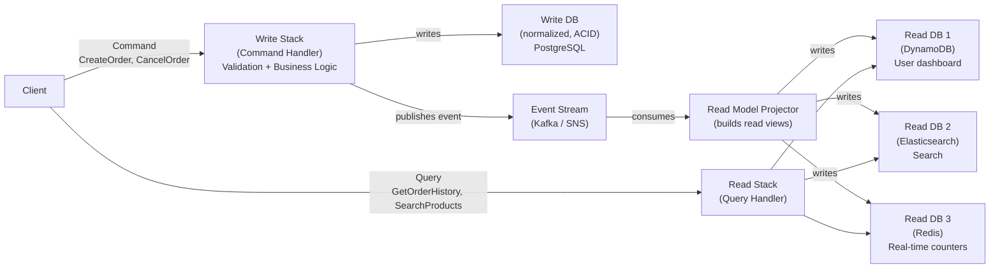

---
tags:
  - interview-critical
  - for-scale
---

# CQRS

## What it is

CQRS (Command Query Responsibility Segregation) separates read and write models into distinct systems. The write side accepts commands and enforces business rules. The read side provides optimized query models. They're eventually consistent with each other.

Named after Bertrand Meyer's Command-Query Separation principle: a method should either change state (command) or return data (query), never both.

## You'll see this when...

- Read load is 100× write load; one model serving both is straining
- The "search" query hits Postgres directly and slows everything; need ElasticSearch read model
- Reports / analytics fight transactional workload for the same DB
- Complex aggregations in queries duplicated across many endpoints
- Materialized views or denormalized read tables have appeared
- Read side uses Redis / ElasticSearch / read-replica; writes go to Postgres
- "We need different shapes of the same data for different consumers"
- Eventual consistency between write and read is acceptable

## The problem

In a traditional system, the same data model serves both reads and writes:

```
User table:
  Writes: complex validation, multi-table transactions
  Reads: JOIN 5 tables, aggregate, reshape for different UIs (web, mobile, analytics)

Conflict:
  Reads are 90% of traffic — optimize for read (add indexes, denormalize)
  Writes need normalized, consistent data structure
  You can't fully optimize for both simultaneously
```

## CQRS model



**Write side:** Normalized DB optimized for consistency. Commands go through domain validation. Publishes events.

**Read side:** Multiple denormalized read models, each optimized for a specific query. Updated asynchronously from events.

## Example: Order system

**Write side command:**
```python
class CreateOrderCommand:
    user_id: str
    items: List[OrderItem]
    shipping_address: Address

class CreateOrderHandler:
    def handle(self, cmd: CreateOrderCommand):
        # Business rules validation
        user = self.users.find(cmd.user_id)
        if not user.is_active:
            raise UserInactiveError()
        
        for item in cmd.items:
            inventory = self.inventory.get(item.product_id)
            if inventory.available < item.quantity:
                raise InsufficientInventoryError(item.product_id)
        
        # Write to normalized DB (write side)
        order = Order(user_id=cmd.user_id, items=cmd.items, status='pending')
        self.orders_db.save(order)
        
        # Publish event for read side projectors
        self.event_bus.publish(OrderCreatedEvent(
            order_id=order.id,
            user_id=order.user_id,
            items=order.items,
            total=order.total,
            created_at=order.created_at
        ))
```

**Read side projector (builds user dashboard view):**
```python
class UserOrderHistoryProjector:
    def on_order_created(self, event: OrderCreatedEvent):
        # Denormalized, query-optimized view
        self.read_db.upsert('user_orders', {
            'user_id': event.user_id,
            'order_id': event.order_id,
            'total': event.total,
            'item_count': len(event.items),
            'status': 'pending',
            'created_at': event.created_at
        })
    
    def on_order_shipped(self, event: OrderShippedEvent):
        self.read_db.update('user_orders',
            {'order_id': event.order_id},
            {'status': 'shipped', 'tracking': event.tracking_number}
        )
```

**Read side query:**
```python
class UserOrderHistoryQuery:
    def get_recent_orders(self, user_id: str, limit: int = 20):
        # Simple, fast key lookup — no joins
        return self.read_db.query(
            "SELECT * FROM user_orders WHERE user_id = ? ORDER BY created_at DESC LIMIT ?",
            [user_id, limit]
        )
```

## Consistency model

CQRS read models are **eventually consistent** with the write model:

```
Command: update order status → writes to PostgreSQL → publishes event
Projector: receives event → updates DynamoDB read model

Gap: 50-200ms before read model reflects the write

User hits "submit order" → order created in write DB → sees loading spinner
→ Event processed → read model updated
→ User's order history shows new order (100ms later)
```

**Handling "read your own writes":**
```python
# Option 1: Wait for projection to confirm (defeats async purpose)
# Option 2: Return the command result directly to UI without reading from read model
def create_order(cmd):
    order_id = handler.handle(cmd)
    # Return what we just created (from write side) — don't query read side
    return {"order_id": order_id, "status": "pending"}

# Option 3: Client-side optimistic update (common in React apps)
# Assume success, update UI immediately, verify against read model later
```

## When to use CQRS

**Good fit:**
- Complex domain with distinct read/write models (order management, banking)
- Very different read and write scale (100:1 read/write ratio)
- Multiple read models needed for different consumers (mobile, web, analytics)
- Event sourcing (CQRS is the natural companion)
- High write throughput requiring different optimization than reads

**Overkill:**
- Simple CRUD applications (user registration, settings)
- Consistent read-after-write required immediately (don't want eventual consistency)
- Small team unfamiliar with CQRS (significant operational complexity)
- Low traffic — the complexity cost exceeds the benefit

## CQRS + Event Sourcing

Commonly combined. Event sourcing provides the event log; CQRS projects read models from it:

```
Command → Aggregate validates → Emits Event → Event stored in Event Store
                                           ↓
                                  Read Model Projectors
                                  build query-optimized views
```

See [Event Sourcing](event-sourcing.md) for full coverage.

## Simplified CQRS (without full event streaming)

You don't need Kafka for CQRS. A simple version:

```python
# Write: normalized PostgreSQL
def update_order_status(order_id, status):
    db.execute("UPDATE orders SET status=%s WHERE id=%s", [status, order_id])
    # Sync to read cache immediately or via CDC
    redis.hset(f"order:{order_id}", "status", status)

# Read: Redis cache
def get_order_status(order_id):
    status = redis.hget(f"order:{order_id}", "status")
    if not status:
        # Cache miss: fall back to DB
        order = db.query("SELECT status FROM orders WHERE id=%s", [order_id])
        redis.hset(f"order:{order_id}", "status", order.status)
        return order.status
    return status
```

This is "CQRS-lite" — separate read and write models, but without the full async event pipeline.

## AWS implementation

```
Write side: RDS PostgreSQL (ACID, normalized)
Event stream: EventBridge or Kinesis
Read model projector: Lambda consumer
Read models:
  - DynamoDB (user-facing queries, fast KV)
  - OpenSearch (full-text search)
  - ElastiCache Redis (counters, real-time)
  - Redshift (analytics)
```

## Interview angle

!!! tip "What interviewers are testing"
    They want to see CQRS as a solution to the read/write scaling mismatch — not just a pattern name to drop.

**Strong answer pattern:**
1. Identify the read/write model conflict — e.g., writes need ACID joins, reads need flat denormalized views
2. Separate write side (normalized, consistent) from read side (denormalized, query-optimized)
3. Explain the eventual consistency gap — how the read side is populated
4. Build multiple read models for different consumers (search, analytics, user dashboard)
5. Acknowledge the complexity cost — only worthwhile at scale or in complex domains

## Related topics

- [Event Sourcing](event-sourcing.md) — natural companion to CQRS
- [Event Streaming](../messaging/event-streaming.md) — Kafka as the event bus between write and read sides
- [Replication](replication.md) — CQRS is application-level "replication" of data into optimized views
- [Saga Pattern](saga-pattern.md) — commands in CQRS often trigger sagas
